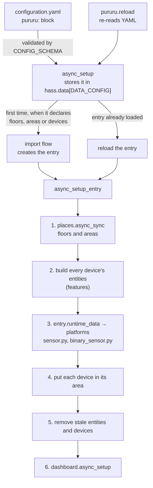

## One config entry owns everything

pururu is configured in YAML, but everything it creates belongs to **one config entry**, so the registries can track it and remove it. The entry is created by an import flow (`config_flow.py`) and it has nothing to configure. The manifest declares `single_config_entry`.

### `async_setup`

- It validates the block with `CONFIG_SCHEMA` and stores it in `hass.data[DATA_CONFIG]`.
- It registers the `pururu.reload` admin service. That service re-reads the YAML with `async_integration_yaml_config`, which returns `None` when the YAML is invalid. In that case nothing changes.
- The first time the block declares floors, areas or devices, it starts the import flow. When the entry already exists, it reloads the entry. On a reload the entry is always set up again, even after a set-up error, unless the user disabled it.

### `async_setup_entry`

It does all the work, in this order:

1. **Floors and areas** (`places.async_sync`). They come first because devices are placed in them. The IDs it now manages are saved in `entry.data`, as `{"floors": [...], "areas": [...]}`.
2. **Build every device's entities.** For each device, each feature's `build()` returns entities. `_creatable` drops the ones whose ID is taken, and then everything that follows them (see [Entity IDs are the identity](#entity-ids-are-the-identity)).
3. **Hand them to the platforms.** The entities go in `entry.runtime_data` (`dict[Platform, list[Entity]]`), and `sensor.py` and `binary_sensor.py` only call `async_add_entities` with their list.
4. **Place each device** in its configured `area`, if that area exists.
5. **Remove what's stale**: every entity and device of the entry that this configuration didn't build.
6. **Show the dashboard.** It comes last because it lists everything above.

Finally it listens for entity registry updates. When one of the entry's entities gets a new entity ID, it schedules a reload of the entry, so that everything that follows that entity picks up the new ID.

## Features

A device is a name plus one or more **features**. `FEATURES` in `features/__init__.py` maps each configuration key (`appliance`, `phases`) to a `Feature` (`feature.py`):

| Field | What it is |
|---|---|
| `schema` | Validates the feature's block, and refuses unknown keys |
| `metrics` | Everything it can create: metric → platform |
| `build` | `(hass, device, config, inputs) → list[PururuEntity]` |
| `example` | A minimal valid block, for the contract test |
| `provides` | capability → the metric whose entity carries it |
| `requires` | capabilities it takes through `<capability>_from` |

The device schema (`_device` in `__init__.py`) is built from `FEATURES`. It requires at least one feature, and it checks that every `<capability>_from` names a feature of the same device that provides that capability.

When a feature requires a capability, `_build` looks up the providing metric's **current** entity ID (`Device.current_entity_id`, which follows renames) and passes it to `build()` in `inputs`. The providing metric is also added to the entity's sources, so if the provider isn't created, neither is this entity.

[Writing a feature](/develop/writing-a-feature) walks through adding one.

## Entity IDs are the identity

- Every entity is `<platform>.pururu_<device key>_<metric>`. Its unique ID is the part after the platform: `Device.object_id(metric)`, which is `pururu_<key>_<metric>`.
- A device's identifier is `(pururu, <device key>)`.
- `PururuEntity._identify()` sets the entity ID, unique ID, device info and translation key from the device and the metric. The entity's name comes from `translations/*.json` → `entity.<platform>.<metric>.name`.

### Taken IDs

`_holder` answers who else has an entity's ID:

1. If the entity registry already has **our** unique ID on that platform, the entity is ours, wherever the user renamed it. That wins even if another integration has since taken its old ID.
2. Otherwise, if the ID is registered, it belongs to `the <platform> integration`.
3. Otherwise, if a live (not restored) state has that ID, it belongs to `an entity without a unique ID`.

A taken ID is logged as an error, and that entity isn't created. `_creatable` then repeatedly drops every entity whose `sources` include a missing one, logging each, until nothing more is dropped. IDs are **never** suffixed with `_2`.

### Renames

A user may rename an entity ID in the UI. Two things keep pururu consistent:

- `Device.current_entity_id` looks up the registry by unique ID. Every entity that reads another entity of the same device, such as `RuntimeTotal` reading `running` or a meter reading its total, is built with the current ID.
- The registry listener reloads the entry when one of its entities is renamed.

## Voluptuous: `ALLOW_EXTRA` leaks

`CONFIG_SCHEMA` is `vol.Schema({DOMAIN: …}, extra=vol.ALLOW_EXTRA)`, because the whole `configuration.yaml` passes through it. `ALLOW_EXTRA` propagates into **plain nested dicts**. So a nested mapping that must refuse unknown or non-slug keys needs its own `vol.Schema(...)`. That's why `pururu:` itself, `floors:` and `areas:` are each wrapped. Without the wrapper, a typo like `floor:` would pass as an extra key, the validated config would have no floors, and the entry would delete every floor it manages.

## Restoring state

Entities that must survive restarts are `RestoreEntity` or `RestoreSensor`:

- `running` keeps its state and, as extra data, the running cycle's start and energy reading (`RunningData`).
- The `last_cycle_*` sensors, `cycles_total` and `runtime_total` restore their values.
- `phase` restores its state and its `seen` attribute.
- The meters rely on `utility_meter`'s own restore.

A reload is an unload plus a set-up, so the same restore path covers it.
