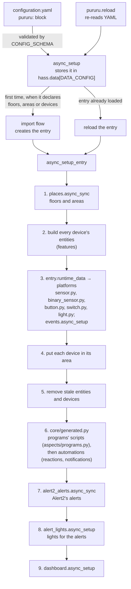

## One config entry owns everything

pururu is configured in YAML, but everything it creates belongs to **one config entry**, so the registries can track it and remove it. The entry is created by an import flow (`config_flow.py`) and it has nothing to configure. The manifest declares `single_config_entry`.

### `async_setup`

- It validates the block with `CONFIG_SCHEMA` and stores it in `hass.data[DATA_CONFIG]`.
- It registers the `pururu.reload` admin service. That service re-reads the YAML with `async_integration_yaml_config`, which returns `None` when the YAML is invalid. In that case nothing changes.
- The first time the block declares floors, areas or devices, it starts the import flow. When the entry already exists, it reloads the entry. On a reload the entry is always set up again, even after a set-up error, unless the user disabled it.

### `async_setup_entry`

`__init__.py` holds only Home Assistant's entry points; each calls `setup/lifecycle.py`. `async_setup_entry` does all the work, in this order. Steps 1 to 3 are the prelude: a failure there fails the setup. Once the platforms are forwarded, a failure unloads them before it is raised again, a cancellation too, during a step as well (`except BaseException` around the steps, which guard `Exception` only: a reload called by an automation that is stopped runs in the automation's task): Home Assistant unloads an entry that isn't loaded without calling `async_unload_entry`, so platforms left set up would refuse the entry at every reload, and the reload would report success with nothing added. An unload that raises or leaves platforms is logged with what to do (`Unloading the platforms of a failed setup raised`, or `… left some`: a platform Home Assistant loaded but never gave the entry is logged by it as `Config entry was never loaded!` and counts as not unloaded, though nothing of it is left), and the original error is still raised. From the events in step 3 on, each output is a **step** of `lifecycle.STEPS`, an `async_step(hass, entry, built, targets)` in its own module that reads a frozen `runtime.Built` (the house, the common texts, the created entities by platform and by device, their unique IDs) and adds to `targets` the entity IDs whose disabling rebuilds the entry, as soon as it knows them, so a step that fails partway keeps what it added. Each step runs in `try/except`: one that raises is logged as `Step <name> failed` and the others still run: the entry stays loaded with its entities.

1. **Floors and areas** (`places.async_sync`). They come first because devices are placed in them. The IDs it now manages are saved in `entry.data`, as `{"floors": [...], "areas": [...], "automations": [...], "scripts": [...]}`, where `automations` and `scripts` hold the IDs of the reactions' and ready-made notifications' automations and of the programs' scripts (step 6).
2. **Build every device's entities.** For each device, each builder's `build()` returns entities, and then each aspect it offers, in `ASPECTS`' order: the ready-made alerts (`aspects/alerts.py`: an `Alert` for a `Condition`, an `ElapsedAlert` for an `Elapsed`, their default texts read once per setup in HA's language), then the detected programs (`aspects/programs.py`), then the meters. `build.creatable` drops the ones whose ID is taken, and then everything that follows them (see [Entity IDs are the identity](#entity-ids-are-the-identity)).
3. **Hand them to the platforms.** The entities go in `entry.runtime_data` (`dict[Platform, list[Entity]]`), and `sensor.py`, `binary_sensor.py`, `button.py`, `switch.py` and `light.py` only call `async_add_entities` with their list. Right after, once each entity has its current ID, `events.async_setup` (`outputs/events.py`) tracks the created entities, by the device that built them, when `pururu: config: events:` enables a class: each real state change is fired on the bus as `pururu_state_changed` or `pururu_reading` (by the new state's `state_class`), with the device's states. See [Events](/concepts/events).
4. **Place each device** in its configured `area`, if that area exists.
5. **Remove what's stale**: every entity and device of the entry that this configuration didn't build.
6. **Generate the programs' scripts (`aspects/programs.py`: each of `programs: executable:`, `script.pururu_<device>_program_executable_<key>`), then the automations: the reactions', then the ready-made notifications'** (`core/generated.py`, with a `Kind` per domain, `generated.SCRIPTS` and `generated.AUTOMATIONS`, defined there because `device_keys/` and `aspects/` name their domains and can't import `setup/`): each is written to its file (`pururu/scripts/programs.yaml`, `pururu/automations/automations.yaml`) when it changed, and `configuration.yaml` includes the folder (`!include_dir_merge_list`, `!include_dir_merge_named`, so a missing one loads as nothing). Entity IDs are registered first so they get the pururu pattern, a script is put in its device's area, HA reloads the domain once HA has started when the file changed or HA doesn't run what it holds (so a reload that didn't take is retried), in a task the entry's unload waits for, and a Repairs issue says when the include is missing, checked again once the domain has been quiet for a second after a state change (a reload adds its items one by one), the state changes of pururu's own reload of the domain ignored. An ID the entry doesn't manage is the user's own and is never taken over; a dropped item keeps its registry entry until HA no longer runs it (a restored placeholder doesn't count). A program not generated only because an entity it acts on is disabled is *held*, not dropped (`async_sync`'s `held`, from `programs.plan`'s `Planned.held`): out of the file, its registry entry (disabled, entity ID, area) and its ID in `entry.data` stay, it isn't checked for the include, and it comes back as it was once the entity is enabled again. The programs' scripts are synced first: a reaction's `then` starts one, so `reactions.plan` takes the IDs `async_sync` generated for scripts (and the held ones). A reaction whose program's script isn't generated isn't either, and it's held when the program is. `reactions`, `programs` (its `executable:` group) and `alerts` are device keys, not features of a device; a feature's `programs: detected:` is an aspect (see *Detected programs*, under Features below). `reactions`' and `programs`' statistics are sensors built by a `Feature` each in `DEVICE_KEYS` (`device_keys/__init__.py`): `reactions.STATISTICS` (`device_keys/reactions.py`) and `PROGRAMS` (`aspects/programs.py`); `alerts` is `ALERTS` (`aspects/alerts.py`), the hand-written alerts. `catalogue.builders()` (`FEATURES`, then `DEVICE_KEYS`) is walked wherever it lists, resolves or builds entity keys, and `FEATURES` alone for what makes a device's features. An executable program's `executable_<key>_cycles_total` (`Runs`) watches its script and sends each run as a cycle; a reaction's `triggered_total` counts `automation_triggered`. Renaming any generated script or automation reloads the entry. The automations are one kind, synced once with `reactions.plan`'s items, then `notifications.plan`'s (`aspects/notifications.py`), the reactions' held ones held: one file, one reload, one data key (`entry.data["automations"]`, both sources' IDs) and one Repairs issue (`automations_not_included`). An older entry's `entry.data["notifications"]` is no longer read. A kind whose file changed reloads only when it holds items or drops some. A reaction's message and a notification are told through `core/messages.py`: the notify actions, the title (the device's name), and the text escape the Alert2 file shares.
7. **Write Alert2's alerts** (`outputs/alert2_alerts.py`): each created alert with texts (its `message` and `done_message`, or a ready-made alert's own), hand-written or ready-made, taken from the created entities, becomes an Alert2 condition alert (`domain: pururu`, named after its object ID, conditions on its current entity ID, text with `{` wrapped in ``) in `pururu/alert2/alerts.yaml`, which the user's `alert2:` block includes as its `alerts` (`!include_dir_merge_list pururu/alert2`). Once HA has started, in an entry task, Alert2 is reloaded when the file changed or Alert2 doesn't run an alert it holds (a restored placeholder doesn't count, a disabled one isn't missing), and a Repairs issue says when the include is missing. Nothing is tracked in `entry.data`: Alert2 drops what its config no longer has. The file writer (the header, a rewrite only on change, a logged failure) is shared with the automations and scripts (`core/files.py`).
8. **Lend lights to the alerts** (`outputs/alert_lights.py`): the created alerts with `lights` (a group's name, `default` included) and the created pururu lights of their groups (`config.alerts.lights.groups`, each a list of `<device>.light_<key>`, resolved to unique IDs by `light_ids`; `alert_lights.check` refuses a member that isn't a device's light at the member's path) go to a manager that starts once HA has started. It keeps, per light, only what the alerts can't tell: whether it is in `resolved` (its `lasts` timer) and its `repeat` timer; the level is computed from the alerts' states each time. It calls only `light.turn_on`/`turn_off` on the pururu light, each call with a new `Context` whose id the light remembers (the last few), so a state change carrying one is its own. A light is a `Borrowable` (`features/lights.py`): it shows `alert`/`alerts` and restores `alert` (extra restore data: HA saves no attributes of an unavailable entity), which is how a light borrowed before a restart or reload is handed back. A light without a reading is never called; a change during `resolved` hands it back only with a `user_id` or `parent_id`. Disabling a followed light or alert reloads the entry (`listener.rebuild_for`).
9. **Show the dashboard.** It comes last because it lists everything above.

Finally it listens for entity registry updates (`setup/listener.py`). When one of the entry's entities, or a generated item the entry tracks in `entry.data` (a script, a reaction's or a notification's automation), gets a new entity ID, it schedules a reload of the entry, so that everything that follows it picks up the new ID. It is guarded as a step is: one that raises is logged as `Listener failed`, and the entry still loads.

## Layers

The folders above are layers: `core/` (contracts and shared helpers), `features/`, `aspects/` and `device_keys/` (cross-cutting), `outputs/` (the steps after the platforms), `setup/` (the wiring), and the root (Home Assistant's own entry points, the config flow, the constants and the platforms). Each may import only what its layer allows, so nothing imports a later one: `tests/test_code.py` maps every module to its row and fails on any import the table doesn't allow, with five named allowances for one module each: `features/__init__` → every feature, `device_keys/__init__` → `aspects.alerts` and `aspects.programs`, `device_keys/reactions` → `aspects.programs`, `features/buttons` → `aspects.programs` (a button starts an executable program; it imports the module, and reads it only inside functions, as `aspects.programs` is still loading when the package import reaches `features/`), `__init__` → `core.runtime`. [Testing](/develop/testing#the-layer-table) has the full table; the gist:

- `core/` imports only `core/` and `const`.
- `features/` imports `core/`, `const`, the shared `features/cycle` and `features/standing`, and its own package; `features/__init__` alone may import every feature, since it lists `FEATURES`.
- `aspects/` and `device_keys/` import `core/`, `const`, `features/cycle`, and another module of their own package; `device_keys/__init__` may also import `aspects.alerts` and `aspects.programs`, the hand-written alerts' and the executable programs' device keys, and `device_keys/reactions` `aspects.programs` (a reaction's `then` names an executable program and starts its script).
- `outputs/` imports `core/`, `const`, `aspects.problem` (Alert2's file and the alert lights read `ProblemAlert`) and `features.lights` (the alert lights lend `Borrowable` lights).
- `setup/` may import every layer below it: `core`, `features`, `aspects`, `device_keys`, `outputs`, and itself. It's the only layer that reads a folder's `__init__` (`FEATURES`, `ASPECTS`, `DEVICE_KEYS`).
- `__init__.py` imports `setup/` and `const`, and, a named allowance, `core.runtime` directly: Home Assistant's entry points and the platforms take the typed entry, and hassfest's strict-typing check wants it named `*ConfigEntry` (`PururuConfigEntry`, in `core/runtime.py`). The platforms import only `core.runtime`.
- Only `aspects/statistics.py` imports Home Assistant's `utility_meter`.

A new folder needs a row in the table.

## Features

A device is a name plus one or more **features**. `FEATURES` in `features/__init__.py` maps each configuration key (`appliance`, `door`) to a `Feature` (`core/feature.py`):

| Field | What it is |
|---|---|
| `schema` | Validates the feature's block, and refuses unknown keys |
| `entity_keys` | Everything it can create itself: entity key → platform |
| `build` | `(hass, device, config, inputs) → list[PururuEntity]` |
| `example` | A minimal valid block, for the contract test |
| `namespace` | Where its entity keys live in an entity ID: `appliance`, `door`, `light`, `switch` |
| `roles` | What else it is, as small frozen dataclasses of `core/roles.py`, asked for by type: `feature.role(Configured)` |

A builder is its roles (the Extension Object pattern), so `Feature` never gains a field:

| Role | What it says |
|---|---|
| `Configured(platform)` | Its block's keys are entity keys on this platform, named by each block's `name`; items may add keys beside them, one item per key |
| `Derived(of)` | Entity keys its validated block adds beyond `entity_keys`: the appliance's running program's phases |
| `Programs(reading, energy)` | The settings a detected program in its block reads (`reading`, and `energy` for each cycle's kWh, `None` for none; the appliance's `power` and `energy`): the programs aspect mounts `programs: detected:` |
| `Actions(services)` | Services its entities take on their platform (`turn_on`, `turn_off`, `toggle` for `switches` and `lights`), which a program can call |
| `Items(keys, of)` | Its block is a map of items, each with the entity keys `<slug>_<suffix>` (`executable_clean_cycles_total`) |
| `Counters(places)` | Totals it builds at each place, a `Counted(needs, at, item, named)`: `at` the path to where `statistics:` sits (`EACH` for each item), `item(block, path)` what a container there is, given the builder's validated block and the container's path (`feature.ItemOf`), `named` a translation prefix of its own (other's) |
| `Refers(of)` | Given its block, the `Ref`s it names: entity keys of other features of the device |
| `Presets(offered)` | Ready-made alerts it offers |
| `Happenings(offered)` | Ready-made notifications it offers |
| `Generates(what, ids)` | The scripts or automations it writes (`programs`, `reactions`) |

The contract test holds the rules between roles: each at most once, a `Configured` builder's items one per block key and its aspects only inside them, no device key has `Actions` or `Derived`.

### Detected programs

`features/cycle/program/` is the detector of a **detected program**: a band of a reading with `on_delay`/`off_delay`, and phases that are bands too. The appliance has two kinds:

- **Its `running_program`**, required: the builder's own. It's built with `build(..., key="running")`, so its carrier is the appliance's `running` and the appliance's own cycle entities (`cycles_total`, `last_cycle_*`…) follow it; its phases' keys come through `Derived` (`program.keys_of`), its statistics through the statistics aspect at `running_program`, each phase and `other` (`program.counted(where)`).
- **Its `programs: detected:`**, more programs of the same reading, each keyed: the programs aspect's (`aspects/programs.py`'s `ASPECT`, offered to a builder with `Programs(reading, energy)`). Its one place is the block itself; its schema (`DETECTED_BLOCK`) refuses `executable:` there and a block without `detected:`, and each program needs a `name` (`DETECTED_SCHEMA`). Its map refuses a key as phases' keys begin (`program.unreserved`): `phase` or `phase_…`, the running program's, and `<program>_phase` or `<program>_phase_…` beside detected program `<program>`, whether those phases exist or not. Every other key a setting adds (energy, meters, ready-made alerts) is listed whatever the settings, but a phase's only once it's configured, so a key only a later phase would take would otherwise refuse the configuration only then. Its keys come through `Place.derived` (`program.detected_keys`): the carrier `<key>`, its cycle entities `<key>_<suffix>`, and with phases `<key>_phase_current`, `<key>_phase_last`, `<key>_phase_<phase>` and theirs. `program.build_detected` builds each: `build` with `of`, the program's item (`program_of(config, of)` gives it to each phase, `Phase.of`), then its own last cycle and totals, named `detected_<suffix>` with `{item}`, its name (`DETECTED_NAMED`; a configured phase's are named as the running program's). Its statistics sit at `program.counted_each(program.DETECTED_AT)`'s places (`programs, detected, EACH`, each phase, `other`), which the builder's `Counters` lists: unlike the running program's, its totals are its own item's (`<key>_runtime_total`, `<key>_cycles_total`, and `<key>_energy_total` with the builder's `energy`).

Either way: `schema.py` validates the block (`SCHEMA`) into a `Program` (`program_of`). Its phase map refuses `idle`, `other` and `other_…` (the built-in phase's: its meters are listed only once `other:` is written, so a phase keyed as one would otherwise refuse the configuration only then), and a phase whose keys another phase or the detector creates. `detector.py`'s `Detector` is pure: `read(value, now, kwh)` and `advance(now, kwh)` take a reading and the time and return `Started`/`Ended`, each delay passing at its own deadline however late `advance` comes, so a whole day of readings replays in milliseconds. `entities.py`'s `build()` puts it in Home Assistant: the **carrier**, a `CycleSource` binary sensor under its `key` (`running`, or the detected program's), owns and restores the detector and follows the reading (once its entry's setup is over); per phase, a `PhaseRunning` binary sensor (a `CycleSource`, the source of the phase's cycles), and `PhaseCurrent` and `PhaseLast` sensors.

Two edge cases matter: a **dip** (the reading leaves a running phase's band straight into another's) makes the other phase wait, once its own `on_delay` has passed, for the first to end or for a reading back in both bands; an **idle gap** (a reading outside every band once a phase left its own) blocks nothing — a phase whose `on_delay` passes starts at once, and the gap's phase still ends at the moment it left. `other` is the built-in phase for the program's band outside every configured one: it exists only with at least one configured phase, waits for nothing, and ends at once when a phase starts. `phase_current` is an enum sensor: the phase that started last among those running, or `idle` when none does (and while its carrier is disabled; until the carrier has restored the detector, its own restored state), with `name` (a configured phase's `name`, None for `idle` and `other`, whose state is translated; computed from the state, never restored), `running` and `seen` (the phases seen in the program's current or last cycle) as attributes. Only `idle` and `other` are translated states: a configured phase's key is shown as written. `NAMED` lists every translation key the detector itself owns, outside every namespace, as the statistics aspect's own, and `DETECTED_NAMED` a detected program's, all with `{item}`; the contract test (`test_the_detectors_keys_are_named`, `test_a_detected_programs_keys_are_named`) counts and names each.

## Aspects

Some concerns cut across builders: `statistics` (a meter per period) applies to `appliance` (at seven places: its block, `running_program`, each phase and `other`, and each detected program, its phases and its `other`), `door`, `window`, `programs` and `reactions` alike, ready-made alerts and ready-made notifications apply to any builder offering at least one, and detected programs to any builder with `Programs`, so each is written once as an **aspect** (`core/feature.Aspect`, `aspects/`) instead of copied into each. `ASPECTS` (`aspects/__init__.py`) lists the four in build order: `alerts.ASPECT` (`aspects/alerts.py`), then `programs.ASPECT` (`aspects/programs.py`, the detected programs), then `statistics.ASPECT` (`aspects/statistics.py`, after every total it meters, which seeds its meters), then `notifications.ASPECT` (`aspects/notifications.py`), which adds no entity key and builds no entity: each enabled notification is an automation its `plan` generates.

An `Aspect` has a `key` (the block key it mounts, `"statistics"`, `"alerts"`, `"notifications"`, `"programs"`), `offered(builder)` (whether this builder has it: what it needs, `Counters` for statistics, at least one ready-made alert in `Presets` for the ready-made alerts, the same rule `presets_of` gives `alert_lights`, at least one `Happening` in `Happenings` for the ready-made notifications, the `Programs` role for the detected programs), `places(builder, name)` (the `Place`s where its key sits, given the builder and its key in the device — `name`, for an aspect whose messages name the builder: the notifications aspect uses it; the alerts and statistics aspects don't need it), `build` (an `AspectBuild`: hass, the device in the builder's namespace, the builder, its whole validated block — the aspect's value put back at each of its places — the common texts, returning its entities), and `mount_absent` (`True`: its key absent is validated as `{}` and mounted, as statistics'; `False`: left out instead, as nothing asked — the ready-made alerts', notifications' and detected programs', since none is the ordinary case and an explicit empty `alerts`, `notifications` or `programs` is still refused).

`Aspect.places` and `Place` replace the old `schema`/`keys`/`named`/`example`/`placed`/`check`: a `Place` (`core/feature.py`) is `path` (the containers of the aspect's key in the builder's block, `feature.Path`, `()` the block itself), `schema` (validates the aspect's value in a container there), `keys` (the local entity keys it adds there), `named(key)` (the translation key one of those is named under), `example` (a valid value, for the contract test), `item` (the item a container there is, `item(block, path)` from the builder's validated block and the container's concrete path, `feature.ItemOf` — a phase, a detected program — or `None` for the builder's own; `feature.at(block, path)` gives the container), an optional `derived(value)` (the local keys a container's validated value of the aspect adds beyond `keys`, varying with the value as `Derived`'s with a block: a detected program's; pairs, not a map, so a key two of them add comes twice and `checks.keys_distinct` refuses it) and an optional `check(block, container)` (refuses what schema alone can't, given the builder's whole block and that container, its value put back). `feature.walk(value, path)` finds every container `path` names (`EACH`, `core/feature.py`, for each key of a map), yielding it with its own path.

`setup/catalogue.mount(builder, name, value)` wires a builder's block to its aspects: it takes each offered aspect's key out of every container each of its places names (`walk`), each (aspect, place) the deepest first (at one depth, in `ASPECTS`' order), so an aspect's key can sit inside another aspect's value (`statistics:` in a detected program, inside `programs:`) and leaves it before that value is taken whole; it validates what's left with the builder's own schema (`builder.schema`), and each taken value with its place's own schema. It's two stages: the builder's own schema refusal and each place's schema refusal are raised together first; only once they pass does it put every value back along its path, the shallowest first (`programs:` is back before its programs' `statistics:`), and run each place's `check` over its container, whose refusals are raised together too, separately from the first stage's. `catalogue.aspects_of(builder)` is the aspects a builder offers; `catalogue.keys()` lists an aspect's entity keys per container of each of its places, the same way for every aspect: the place's fixed `keys` (an item's where the container is one), then what its value there derives (`Place.derived`), with `by` the aspect's key (`"alerts"` for a ready-made alert's, `"programs"` for a detected program's) and `item` the item a container is (a phase, a detected program).

A ready-made alert takes what a hand-written one does, from one schema: `aspects/problem.shared(priority)` gives `priority`, `message` and `done_message` (both or neither: `texts_together`), and `lights` (a group's name), spread into the hand-written `ALERT` (default priority `low`) and each ready-made alert's settings (the preset's own priority), after its `for`.

`build.build` builds a device's entities as the builder's own, then each aspect it offers, in `ASPECTS`' order: the ready-made alerts, the detected programs, then the meters (the notifications aspect builds none).

**The index.** `setup/catalogue.index(devices)` maps each device key to everything it can create: qualified entity key → `Target` (`core/resolve.py`). `catalogue.keys(device)` lists them per builder in the device: its fixed `entity_keys`, its block's keys (`Configured`), the keys its validated block adds (`Derived`: the running program's phases, `appliance_phase_<phase>` and its cycle entities, and the detector's own `phase_current` and `phase_last`), its items' (`Items`) and each aspect's at each of its places (a detected program's through `Place.derived`). A `Target` knows its device in its builder's namespace, its platform, its builder, `by` (the key of the aspect that adds it, `"alerts"`, `"statistics"` or `"programs"`; `None` for the builder's own), its `item` (the program, reaction or phase that owns it; `None` for a detected program's own keys, which the aspect derives) and its builder's `actions`, and gives its unique ID and its **current** entity ID (following renames). A reference is a `Ref(device, key)`, `device` None for this device, and `find(index, here, ref)` gives its `Target`, or None when that device can't create it. The prelude builds the index once; `Built.index` carries it to the steps.

**The checks.** The device schema (`_device` in `setup/schema.py`) mounts each builder's block (`catalogue.mount`, with its aspects) and requires at least one feature. Everything that looks across blocks or devices is a check of `schema.CHECKS`, `check(house, index, builders)`, run once over the validated house and its index. Each yields its refusals, each a `vol.Invalid` with a path (`pururu->devices->washer->reactions->it`), and `_checked` raises them together, so every error in the house is told at once. Each lives in the module that owns the rule: `checks.py` for the generic ones (references, one real entity per device, two entities of one device with one unique ID (`keys_distinct`: a detected program's key that the appliance or another detected program creates, as its meters' too; a key only a phase added later would take, `phase[_…]` or `<program>_phase[_…]`, is refused before, by the programs aspect's schema, `program.unreserved`, and a phase keyed `other_…`, as `other`'s meters, by the phase map's), distinct entity and generated IDs, areas exist, messages go somewhere), `reactions.check`, `programs.check` (`aspects/programs.py`), `buttons.check` (`features/buttons.py`: a button's program is its device's, and one value presses one button of a device), `alerts.check` (an alert watching a ready-made alert, right after `checks.references`, which refuses what isn't another feature's entity key: one refusal per reference), `alert_lights.check` and `places.floors_exist`.

It doesn't compare entity keys between features. Each feature has its own `namespace`, and the entity keys it creates are in it (`appliance_power`, `switch_power`), so they can't meet. The contract test checks that namespaces are distinct slugs and that none is another's followed by `_`. Between devices, `checks.entity_ids_distinct` still refuses two that would give an entity one ID: `greenhouse` with the switch `switch_sprinkler` and `greenhouse_switch` with the switch `sprinkler`.

A feature can watch one particular entity of another feature, named in its block, as an alert's `when: appliance.power`. `Refers` returns those references, each a `Ref` with the path of the field that names it; `checks.references` refuses, at that field, one that `resolve` doesn't give a `Target` of another feature (whatever its settings), or one outside its reach (another device's, unless `Refers.others`; Home Assistant's, always). `build.build` passes each one's current entity ID (its `Target`'s, following renames) in `inputs`, under the reference as written (`Ref.text`). An entity lists what it watches in `follows`, so it isn't created when that entity isn't, including when the settings never build it (`build.creatable`).

**References.** A field that names an entity of a device writes its path in the YAML, from the block key: `appliance.running_program` in this device (an alert's `when`, a program's step, a reaction's `when`), `device.<device>.<path>` in another (a reaction's `when`; a light group's member, which always names its device). `core/resolve.py`'s `path` validates the form in the schema (slug segments, at least two; `device.` with a device and a path; `homeassistant.` with a domain and an object ID), and `Ref.parse` reads the validated text back into a `Ref` (its owner: here, another device, Home Assistant), refusing text `path` didn't pass, a programming error. Whose it may be and what it names are the checks': `resolve` gives the `Target` at that path, or why there is none (a device naming itself with `device.`, a device not in `devices`, a first word that is no block of the device, a path that is no entity), and each check adds its field's reach. A field that takes one kind of thing (a reaction's `then`, a button's `program`, a device's `area`, an area's `floor`, an alert's `lights`) takes its key alone, `key_alone`, which refuses a path naming the key to write.

A program's step acts on a feature's entity: `programs.check` checks that the target's builder has the action in its `Actions` (`programs: appliance.power does not take turn_on` otherwise). `aspects/programs.py` translates the steps to Home Assistant's script syntax on the keys' current entity IDs, and HA runs the script.

**The plans.** Each generated kind plans itself: `programs.plan` (`aspects/programs.py`), `reactions.plan` (`device_keys/reactions.py`) and `notifications.plan` (`aspects/notifications.py`) return a `Planned` (`core/generated.py`): the items for the file, the IDs held while a target is disabled, and the entity IDs the items act on. The generate step (`setup/generate.py`) only calls them in order and syncs each kind.

[Writing a feature](/develop/writing-a-feature) walks through adding one.

## Entity IDs are the identity

- Every entity is `<platform>.pururu_<device key>_<namespace>_<entity key>`, with no exception (a switch keyed `switch` is `…_switch_switch`). Its unique ID is the part after the platform: `Device.object_id(entity_key)`. `build.build` gives each feature's `build()` a `Device` in that feature's namespace, so a feature only writes its own entity keys (`"running"`).
- A device's identifier is `(pururu, <device key>)`.
- `PururuEntity._identify()` sets the entity ID, unique ID and device info from the device and the entity key, and its name. Without a `name`, the translation key is the entity key in its namespace (`Device.qualified`, as `appliance_running`) and the name comes from `translations/*.json` → `entity.<platform>.<namespace>_<entity key>.name`. With one, as for a configured feature, the entity has that name and no translation key, even when its base class brings one (`LightGroup`'s `"light"`).

### Taken IDs

`_holder` answers who else has an entity's ID:

1. If the entity registry already has **our** unique ID on that platform, the entity is ours, wherever the user renamed it. That wins even if another integration has since taken its old ID.
2. Otherwise, if the ID is registered, it belongs to `the <platform> integration`.
3. Otherwise, if a live (not restored) state has that ID, it belongs to `an entity without a unique ID`.

A taken ID is logged as an error, and that entity isn't created. `build.creatable` then repeatedly drops every entity whose `sources` include a missing one, logging each, until nothing more is dropped. IDs are **never** suffixed with `_2`.

### Renames

A user may rename an entity ID in the UI. Two things keep pururu consistent:

- `Device.current_entity_id` looks up the registry by unique ID. Every entity that reads another entity of the same device, such as `RuntimeTotal` reading `running` or a meter reading its total, is built with the current ID.
- The registry listener reloads the entry when one of its entities is renamed, or any generated item it tracks: one rule for scripts, reactions' and notifications' automations.

The same listener reloads the entry, once for a burst, when an entity a generated script acts on is disabled, so the program is held out of the file; no other disable or enable reloads it (Home Assistant itself reloads the entry when one of its entities is enabled again).

## Voluptuous: `ALLOW_EXTRA` leaks

`CONFIG_SCHEMA` is `vol.Schema({DOMAIN: …}, extra=vol.ALLOW_EXTRA)`, because the whole `configuration.yaml` passes through it. `ALLOW_EXTRA` propagates into **plain nested dicts**. So a nested mapping that must refuse unknown or non-slug keys needs its own `vol.Schema(...)`. That's why `pururu:` itself, `floors:` and `areas:` are each wrapped. Without the wrapper, a typo like `floor:` would pass as an extra key, the validated config would have no floors, and the entry would delete every floor it manages.

## Restoring state

Entities that must survive restarts are `RestoreEntity` or `RestoreSensor`. The ones that send cycles are also a `CycleSource` (`features/cycle/`): it writes its state, then sends the finished cycle on its own signal, then on the end signal.

- `running` is a detected program's **carrier** (`features/cycle/program/entities.py`, D1's rulings): it keeps the detector's whole snapshot as extra restore data (the running cycles, the order they started in, and `seen`). `phase_current`, on another platform, shows its own restored state and attributes until the carrier has restored the detector. A door's (window's) `open` keeps its state and the opening's start with whether an event described it (`OpeningStart`, a `CycleStart`, `features/opening/open.py`).
- The `last_cycle_*` sensors, `cycles_total` and `runtime_total` restore their values.
- The meters rely on `utility_meter`'s own restore.

A reload is an unload plus a set-up, so the same restore path covers it.
