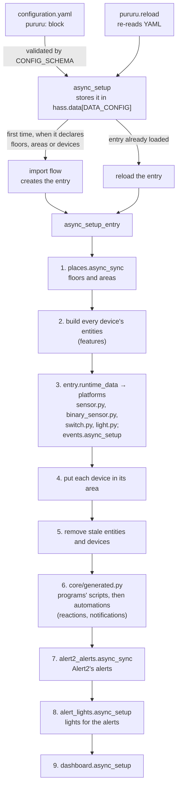

## One config entry owns everything

pururu is configured in YAML, but everything it creates belongs to **one config entry**, so the registries can track it and remove it. The entry is created by an import flow (`config_flow.py`) and it has nothing to configure. The manifest declares `single_config_entry`.

### `async_setup`

- It validates the block with `CONFIG_SCHEMA` and stores it in `hass.data[DATA_CONFIG]`.
- It registers the `pururu.reload` admin service. That service re-reads the YAML with `async_integration_yaml_config`, which returns `None` when the YAML is invalid. In that case nothing changes.
- The first time the block declares floors, areas or devices, it starts the import flow. When the entry already exists, it reloads the entry. On a reload the entry is always set up again, even after a set-up error, unless the user disabled it.

### `async_setup_entry`

`__init__.py` holds only Home Assistant's entry points; each calls `setup/lifecycle.py`. `async_setup_entry` does all the work, in this order. Steps 1 to 3 are the prelude: a failure there fails the setup. From the events in step 3 on, each output is a **step** of `lifecycle.STEPS`, an `async_step(hass, entry, built, targets)` in its own module that reads a frozen `runtime.Built` (the house, the common texts, the created entities by platform and by device, their unique IDs) and adds to `targets` the entity IDs whose disabling rebuilds the entry, as soon as it knows them, so a step that fails partway keeps what it added. Each step runs in `try/except`: one that raises is logged as `Step <name> failed` and the others still run, since a failure after the platforms would leave the entry stuck until a restart.

1. **Floors and areas** (`places.async_sync`). They come first because devices are placed in them. The IDs it now manages are saved in `entry.data`, as `{"floors": [...], "areas": [...], "automations": [...], "scripts": [...]}`, where `automations` and `scripts` hold the IDs of the reactions' and ready-made notifications' automations and of the programs' scripts (step 6).
2. **Build every device's entities.** For each device, each builder's `build()` returns entities, and then each aspect it offers, in order: the ready-made alerts (`aspects/alerts.py`: an `Alert` for a `Condition`, an `ElapsedAlert` for an `Elapsed`, their default texts read once per setup in HA's language), then the meters. `build.creatable` drops the ones whose ID is taken, and then everything that follows them (see [Entity IDs are the identity](#entity-ids-are-the-identity)).
3. **Hand them to the platforms.** The entities go in `entry.runtime_data` (`dict[Platform, list[Entity]]`), and `sensor.py`, `binary_sensor.py`, `switch.py` and `light.py` only call `async_add_entities` with their list. Right after, once each entity has its current ID, `events.async_setup` (`outputs/events.py`) tracks the created entities, by the device that built them, when `pururu: events:` enables a class: each real state change is fired on the bus as `pururu_state_changed` or `pururu_reading` (by the new state's `state_class`), with the device's states. See [Events](/concepts/events).
4. **Place each device** in its configured `area`, if that area exists.
5. **Remove what's stale**: every entity and device of the entry that this configuration didn't build.
6. **Generate the programs' scripts, then the automations: the reactions', then the ready-made notifications'** (`core/generated.py`, with a `Kind` per domain, `generated.SCRIPTS` and `generated.AUTOMATIONS`, defined there because `device_keys/` and `aspects/` name their domains and can't import `setup/`): each is written to its file (`pururu/scripts/programs.yaml`, `pururu/automations/automations.yaml`) when it changed, and `configuration.yaml` includes the folder (`!include_dir_merge_list`, `!include_dir_merge_named`, so a missing one loads as nothing). Entity IDs are registered first so they get the pururu pattern, a script is put in its device's area, HA reloads the domain once HA has started when the file changed or HA doesn't run what it holds (so a reload that didn't take is retried), in a task the entry's unload waits for, and a Repairs issue says when the include is missing, checked again once the domain has been quiet for a second after a state change (a reload adds its items one by one), the state changes of pururu's own reload of the domain ignored. An ID the entry doesn't manage is the user's own and is never taken over; a dropped item keeps its registry entry until HA no longer runs it (a restored placeholder doesn't count). A program not generated only because an entity it acts on is disabled is *held*, not dropped (`async_sync`'s `held`, from `programs.plan`'s `Planned.held`): out of the file, its registry entry (disabled, entity ID, area) and its ID in `entry.data` stay, it isn't checked for the include, and it comes back as it was once the entity is enabled again. The programs' scripts are synced first: a reaction's `then` starts one, so `reactions.plan` takes the IDs `async_sync` generated for scripts (and the held ones). A reaction whose program's script isn't generated isn't either, and it's held when the program is. `reactions`, `programs` and `alerts` are device keys, not features of a device. `reactions`' and `programs`' statistics are sensors built by a `Feature` each in `DEVICE_KEYS` (`device_keys/__init__.py`); `alerts` is `ALERTS` (`aspects/alerts.py`), the hand-written alerts. `catalogue.builders()` (`FEATURES`, then `DEVICE_KEYS`) is walked wherever it lists, resolves or builds entity keys, and `FEATURES` alone for what makes a device's features. A program's `cycles_total` (`Runs`) watches its script and sends each run as a cycle; a reaction's `triggered_total` counts `automation_triggered`. Renaming any generated script or automation reloads the entry. The automations are one kind, synced once with `reactions.plan`'s items, then `notifications.plan`'s (`aspects/notifications.py`), the reactions' held ones held: one file, one reload, one data key (`entry.data["automations"]`, both sources' IDs) and one Repairs issue (`automations_not_included`). An older entry's `entry.data["notifications"]` is no longer read. A kind whose file changed reloads only when it holds items or drops some. A reaction's message and a notification are told through `core/messages.py`: the notify actions, the title (the device's name), and the text escape the Alert2 file shares.
7. **Write Alert2's alerts** (`outputs/alert2_alerts.py`): each created alert with `notify`, hand-written or ready-made, taken from the created entities, becomes an Alert2 condition alert (`domain: pururu`, named after its object ID, conditions on its current entity ID, text with `{` wrapped in ``) in `pururu/alert2/alerts.yaml`, which the user's `alert2:` block includes as its `alerts` (`!include_dir_merge_list pururu/alert2`). Once HA has started, in an entry task, Alert2 is reloaded when the file changed or Alert2 doesn't run an alert it holds (a restored placeholder doesn't count, a disabled one isn't missing), and a Repairs issue says when the include is missing. Nothing is tracked in `entry.data`: Alert2 drops what its config no longer has. The file writer (the header, a rewrite only on change, a logged failure) is shared with the automations and scripts (`core/files.py`).
8. **Lend lights to the alerts** (`outputs/alert_lights.py`): the created alerts with `lights` and the created pururu lights of their groups (`config.alerts.lights.groups`, resolved to unique IDs) go to a manager that starts once HA has started. It keeps, per light, only what the alerts can't tell: whether it is in `resolved` (its `for` timer) and its `repeat` timer; the level is computed from the alerts' states each time. It calls only `light.turn_on`/`turn_off` on the pururu light, each call with a new `Context` whose id the light remembers (the last few), so a state change carrying one is its own. A light is a `Borrowable` (`features/lights.py`): it shows `alert`/`alerts` and restores `alert` (extra restore data: HA saves no attributes of an unavailable entity), which is how a light borrowed before a restart or reload is handed back. A light without a reading is never called; a change during `resolved` hands it back only with a `user_id` or `parent_id`. Disabling a followed light or alert reloads the entry (`listener.rebuild_for`).
9. **Show the dashboard.** It comes last because it lists everything above.

Finally it listens for entity registry updates (`setup/listener.py`). When one of the entry's entities, or a generated item the entry tracks in `entry.data` (a script, a reaction's or a notification's automation), gets a new entity ID, it schedules a reload of the entry, so that everything that follows it picks up the new ID. It is guarded as a step is: one that raises is logged as `Listener failed`, and the entry still loads.

## Layers

The folders above are layers: `core/` (contracts and shared helpers), `features/`, `aspects/` and `device_keys/` (cross-cutting), `outputs/` (the steps after the platforms), `setup/` (the wiring), and the root (Home Assistant's own entry points, the config flow, the constants and the platforms). Each may import only what its layer allows, so nothing imports a later one: `tests/test_code.py` maps every module to its row and fails on any import the table doesn't allow, with three named allowances for one module each: `features/__init__` → every feature, `device_keys/__init__` → `aspects.alerts`, `__init__` → `core.runtime`. [Testing](/develop/testing#the-layer-table) has the full table; the gist:

- `core/` imports only `core/` and `const`.
- `features/` imports `core/`, `const`, the shared `features/cycle` and `features/standing`, and its own package; `features/__init__` alone may import every feature, since it lists `FEATURES`.
- `aspects/` and `device_keys/` import `core/`, `const`, `features/cycle`, and another module of their own package; `device_keys/__init__` may also import `aspects.alerts`, the hand-written alerts' device key.
- `outputs/` imports `core/`, `const`, `aspects.problem` (Alert2's file and the alert lights read `ProblemAlert`) and `features.lights` (the alert lights lend `Borrowable` lights).
- `setup/` may import every layer below it: `core`, `features`, `aspects`, `device_keys`, `outputs`, and itself. It's the only layer that reads a folder's `__init__` (`FEATURES`, `ASPECTS`, `DEVICE_KEYS`).
- `__init__.py` imports `setup/` and `const`, and, a named allowance, `core.runtime` directly: Home Assistant's entry points and the platforms take the typed entry, and hassfest's strict-typing check wants it named `*ConfigEntry` (`PururuConfigEntry`, in `core/runtime.py`). The platforms import only `core.runtime`.
- Only `aspects/statistics.py` imports Home Assistant's `utility_meter`.

A new folder needs a row in the table.

## Features

A device is a name plus one or more **features**. `FEATURES` in `features/__init__.py` maps each configuration key (`appliance`, `phases`) to a `Feature` (`core/feature.py`):

| Field | What it is |
|---|---|
| `schema` | Validates the feature's block, and refuses unknown keys |
| `entity_keys` | Everything it can create itself: entity key → platform |
| `build` | `(hass, device, config, inputs) → list[PururuEntity]` |
| `example` | A minimal valid block, for the contract test |
| `namespace` | Where its entity keys live in an entity ID: `appliance`, `light`, `phase`, `switch` |
| `roles` | What else it is, as small frozen dataclasses of `core/roles.py`, asked for by type: `feature.role(Configured)` |

A builder is its roles (the Extension Object pattern), so `Feature` never gains a field:

| Role | What it says |
|---|---|
| `Provides(capability, key)` | Others take this capability through `<capability>_from`; its entity key `key` carries it |
| `Requires(capability)` | It takes a capability through `<capability>_from` |
| `Configured(platform)` | Its entity keys are its block's keys, on this platform, named by each block's `name` |
| `Actions(services)` | Services its entities take on their platform (`turn_on`, `turn_off`, `toggle` for `switches` and `lights`), which a program can call |
| `Items(keys, of)` | Its block is a map of items, each with the entity keys `<slug>_<suffix>` |
| `Counters(needs, mount)` | Totals it builds as `<counter>_total`; the statistics aspect meters them per period. `needs`: counter → the setting it needs (`None`: none). `mount`: `"block"` or `"item"`, where `statistics:` sits |
| `Refers(of)` | Given its block, the `Ref`s it names: entity keys of other features of the device |
| `Presets(offered)` | Ready-made alerts it offers |
| `Happenings(offered)` | Ready-made notifications it offers |
| `Generates(what, ids)` | The scripts or automations it writes (`programs`, `reactions`) |

The contract test holds the rules between roles: each at most once, `Configured` and `Items` never together, no device key `Provides`, `Requires` or has `Actions`.

## Aspects

Some concerns cut across builders: `statistics` (a meter per period) applies to `appliance`, `door`, `window`, `modes`, `programs` and `reactions` alike, and ready-made alerts and ready-made notifications apply to any builder offering at least one, so each is written once as an **aspect** (`core/feature.Aspect`, `aspects/`) instead of copied into each. `ASPECTS` (`aspects/__init__.py`) lists them, in build order: `alerts.ASPECT` (`aspects/alerts.py`), then `statistics.ASPECT` (`aspects/statistics.py`), then `notifications.ASPECT` (`aspects/notifications.py`), which adds no entity key and builds no entity: each enabled notification is an automation its `plan` generates.

An `Aspect` has a `key` (the block key it mounts, `"statistics"`, `"alerts"`, `"notifications"`), `offered(builder)` (whether this builder has it: what it needs, `Counters` for statistics, at least one ready-made alert in `Presets` for the ready-made alerts, the same rule `presets_of` gives `alert_lights`, at least one `Happening` in `Happenings` for the ready-made notifications), `schema(builder, name)` and `example(builder)` (its settings, and a valid one, given the builder and its key in the device — `name`, for an aspect whose messages name the builder: the notifications aspect uses it; the alerts and statistics aspects don't need it), `keys(builder)` (the local entity keys it adds, suffixes for an `Items` builder), `named(builder, key)` (the translation key one of those local keys is named under: statistics' own, outside every namespace; the ready-made alerts' under the builder's own namespace), `placed(builder)` (`"block"`: the key sits in the builder's own block; `"item"`: in each item), `build` (an `AspectBuild`: hass, the device in the builder's namespace, the builder, its whole validated block — the aspect's value in it, or in each item — the common texts, returning its entities), an optional `check(builder, name, container)` (refuses what schema alone can't, given each container — the block, or an item — with the value put back), and `mount_absent` (`True`: its key absent is validated as `{}` and mounted, as statistics'; `False`: left out instead, as nothing asked — the ready-made alerts' and notifications', since none enabled is the ordinary case and an explicit empty `alerts` or `notifications` is still refused).

`setup/catalogue.mount(builder, name, value)` wires a builder's block to its aspects: it takes each offered aspect's key out of the block (or out of each item, wherever `placed` says it sits), validates what's left with the builder's own schema (`builder.schema`), validates each aspect's own value with its schema. It's two stages: the builder's own schema refusal and each aspect's schema refusal are raised together first; only once they pass does it put every value back where it sat and run each aspect's `check` over its container, whose refusals are raised together too, separately from the first stage's. `catalogue.aspects_of(builder)` is the aspects a builder offers; `catalogue.keys()` lists an aspect's entity keys the same way for every aspect, with `by` the aspect's key (`"alerts"` for a ready-made alert's).

A ready-made alert takes what a hand-written one does, from one schema: `aspects/problem.shared(priority)` gives `priority`, `notify` and `lights`, spread into the hand-written `ALERT` (default priority `low`) and each ready-made alert's settings (the preset's own priority), after its `for`.

`build.build` builds a device's entities as the builder's own, then each aspect it offers, in that order: the ready-made alerts, then the meters (the notifications aspect builds none).

**The index.** `setup/catalogue.index(devices)` maps each device key to everything it can create: qualified entity key → `Target` (`core/resolve.py`). A `Target` knows its device in its builder's namespace, its platform, its builder, `by` (the key of the aspect that adds it, `"alerts"` or `"statistics"`; `None` for the builder's own), its `item` (the mode, program or reaction that owns it) and its builder's `actions`, and gives its unique ID and its **current** entity ID (following renames). A reference is a `Ref(device, key)`, `device` None for this device, and `find(index, here, ref)` gives its `Target`, or None when that device can't create it. The prelude builds the index once; `Built.index` carries it to the steps.

**The checks.** The device schema (`_device` in `setup/schema.py`) is built from `FEATURES`: it requires at least one feature and checks that every `<capability>_from` names a feature of the same device that provides it. Everything that looks across blocks or devices is a check of `schema.CHECKS`, `check(house, index, builders)`, run once over the validated house and its index. Each yields its refusals, each a `vol.Invalid` with a path (`pururu->devices->washer->reactions->it`), and `_checked` raises them together, so every error in the house is told at once. Each lives in the module that owns the rule: `checks.py` for the generic ones (references, one real entity per device, distinct entity and generated IDs, areas exist, messages go somewhere), `reactions.check`, `programs.check`, `alerts.check` (an alert watching a ready-made alert, right after `checks.references`, which refuses what isn't another feature's entity key: one refusal per reference), `alert_lights.check` and `places.floors_exist`.

It doesn't compare entity keys between features. Each feature has its own `namespace`, and the entity keys it creates are in it (`appliance_power`, `switch_power`), so they can't meet. The contract test checks that namespaces are distinct slugs and that none is another's followed by `_`. Between devices, `checks.entity_ids_distinct` still refuses two that would give an entity one ID: `pool` with the switch `switch_pump` and `pool_switch` with the switch `pump`.

When a feature requires a capability, `build.build` looks up the providing entity key's **current** entity ID with a `Device` in the providing feature's namespace (`Device.current_entity_id`, which follows renames), and passes it to `build()` in `inputs`. The provider's unique ID is also added to the entity's sources, so if the provider isn't created, neither is this entity.

A feature can also watch one particular entity of another feature, named in its block, as an alert's `when: appliance_power`. `Refers` returns those references; `checks.references` refuses one that isn't another feature's entity key, whatever its settings. `build.build` passes each one's current entity ID in `inputs`, under the reference as written (`Ref.text`). An entity lists what it watches in `follows`, so it isn't created when that entity isn't, including when the settings never build it (`build.creatable`).

A program's step acts on a feature's entity: `programs.check` checks that the target's builder has the action in its `Actions` (`programs: appliance_power does not take turn_on` otherwise). `device_keys/programs.py` translates the steps to Home Assistant's script syntax on the keys' current entity IDs, and HA runs the script.

**The plans.** Each generated kind plans itself: `programs.plan`, `reactions.plan` and `notifications.plan` return a `Planned` (`core/generated.py`): the items for the file, the IDs held while a target is disabled, and the entity IDs the items act on. The generate step (`setup/generate.py`) only calls them in order and syncs each kind.

[Writing a feature](/develop/writing-a-feature) walks through adding one.

## Entity IDs are the identity

- Every entity is `<platform>.pururu_<device key>_<namespace>_<entity key>`, with no exception (a switch keyed `switch` is `…_switch_switch`). Its unique ID is the part after the platform: `Device.object_id(entity_key)`. `build.build` gives each feature's `build()` a `Device` in that feature's namespace, so a feature only writes its own entity keys (`"running"`).
- A device's identifier is `(pururu, <device key>)`.
- `PururuEntity._identify()` sets the entity ID, unique ID and device info from the device and the entity key, and its name. Without a `name`, the translation key is the entity key in its namespace (`Device.qualified`, as `appliance_running`) and the name comes from `translations/*.json` → `entity.<platform>.<namespace>_<entity key>.name`. With one, as for a configured feature, the entity has that name and no translation key, even when its base class brings one (`LightGroup`'s `"light"`).

### Taken IDs

`_holder` answers who else has an entity's ID:

1. If the entity registry already has **our** unique ID on that platform, the entity is ours, wherever the user renamed it. That wins even if another integration has since taken its old ID.
2. Otherwise, if the ID is registered, it belongs to `the <platform> integration`.
3. Otherwise, if a live (not restored) state has that ID, it belongs to `an entity without a unique ID`.

A taken ID is logged as an error, and that entity isn't created. `build.creatable` then repeatedly drops every entity whose `sources` include a missing one, logging each, until nothing more is dropped. IDs are **never** suffixed with `_2`.

### Renames

A user may rename an entity ID in the UI. Two things keep pururu consistent:

- `Device.current_entity_id` looks up the registry by unique ID. Every entity that reads another entity of the same device, such as `RuntimeTotal` reading `running` or a meter reading its total, is built with the current ID.
- The registry listener reloads the entry when one of its entities is renamed, or any generated item it tracks: one rule for scripts, reactions' and notifications' automations.

The same listener reloads the entry, once for a burst, when an entity a generated script acts on is disabled, so the program is held out of the file; no other disable or enable reloads it (Home Assistant itself reloads the entry when one of its entities is enabled again).

## Voluptuous: `ALLOW_EXTRA` leaks

`CONFIG_SCHEMA` is `vol.Schema({DOMAIN: …}, extra=vol.ALLOW_EXTRA)`, because the whole `configuration.yaml` passes through it. `ALLOW_EXTRA` propagates into **plain nested dicts**. So a nested mapping that must refuse unknown or non-slug keys needs its own `vol.Schema(...)`. That's why `pururu:` itself, `floors:` and `areas:` are each wrapped. Without the wrapper, a typo like `floor:` would pass as an extra key, the validated config would have no floors, and the entry would delete every floor it manages.

## Restoring state

Entities that must survive restarts are `RestoreEntity` or `RestoreSensor`. The ones that send cycles are also a `CycleSource` (`features/cycle/`): it writes its state, then sends the finished cycle on its own signal, then on the end signal.

- `running` keeps its state and, as extra data, the running cycle's start and energy reading (`CycleStart`, `features/cycle/`); `modes`' `current` keeps the running mode and the same `CycleStart`; a door's (window's) `open` keeps its state and the opening's start with whether an event described it (`OpeningStart`, a `CycleStart`, `features/opening/open.py`).
- The `last_cycle_*` sensors, `cycles_total` and `runtime_total` restore their values.
- `phase` restores its state and its `seen` attribute.
- The meters rely on `utility_meter`'s own restore.

A reload is an unload plus a set-up, so the same restore path covers it.
