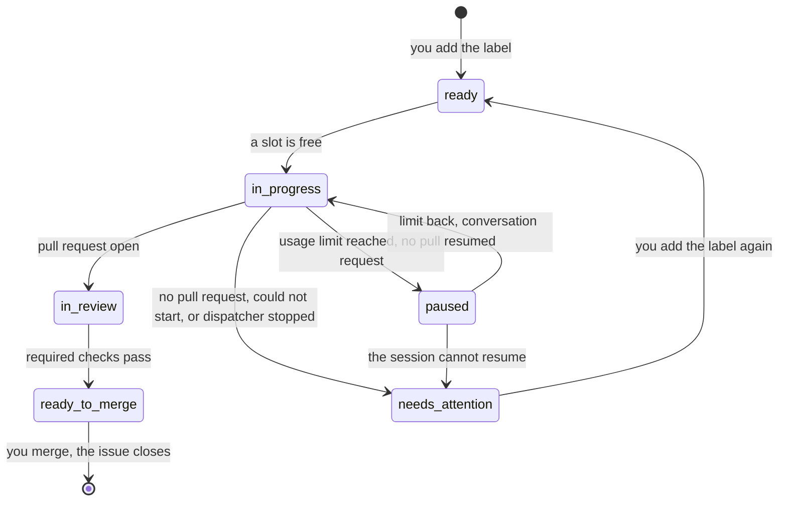

`tools/dispatcher/dispatcher.py` polls this repository's GitHub issues and starts a headless Claude session running `lfg` for each issue you mark `ready`. Each session works in its own new worktree and ends at an open pull request. You review and merge.

## Running it

From the main checkout, logged in to `gh` as the issues' author, with `claude` and the compound-engineering plugin installed:

```sh
python3 tools/dispatcher/dispatcher.py run       # 2 sessions at most, a poll every 5 minutes
python3 tools/dispatcher/dispatcher.py run --sessions 3 --every 120
```

It runs until you stop it with Ctrl-C. Only one dispatcher runs at a time: a second one refuses to start while the first is alive.

## Which issues it takes

An issue is taken when it's open, you opened it, and it carries the `ready` label. The oldest goes first. An issue blocked by an open issue (GitHub's **Blocked by** relation) is skipped, and the next one is considered. Once the blocker closes, the issue is taken at a later poll.

Broad or umbrella issues stay out of the queue until you add `ready`.

## Labels

The labels show where each issue stands. The dispatcher creates the missing ones on its first run.

| Label | Meaning |
|---|---|
| `ready` | You queued it. |
| `in progress` | A session is working on it. |
| `in review` | The session ended with an open pull request; its required checks don't all pass yet. |
| `ready to merge` | That pull request's required checks all pass. |
| `needs attention` | The session ended without a pull request. A comment says why, with the worktree and the log. |
| `paused` | The Claude usage limit stopped the session. It resumes once the limit is back (see [Usage limit](#usage-limit)). |



A failed issue is never retried on its own: add `ready` again to queue it.

Every poll checks the issues `in review` again, so one whose checks turn green later moves to `ready to merge`. `ready to merge` reads only the required checks. Code scanning and the pull request rules of `main` can still block the merge. Nor does it mean anyone read the review threads: `lfg` watches the pull request with `ce-babysit-pr`, which answers and resolves threads under your `gh` login.

## The pull request closes the issue

The session is asked to put `Closes #N` in the pull request's body. When the body still lacks it, the dispatcher adds it. Merging then closes the issue, which is what frees the issues it blocks.

Only this repository's pull requests count. A fork's pull request from a branch named `issue-N`, or one saying `Closes #N`, moves no label.

When a session ends, a label move or `Closes #N` that GitHub refuses is tried again at the next poll.

## Where things are

- **Worktrees:** `.claude/worktrees/issue-N` on a branch `issue-N` from the latest `origin/main`, with `-2`, `-3`… when the name is taken. The dispatcher never removes them.
- **Logs:** `tools/dispatcher/.state/logs/issue-N.log`, the session's JSON lines. The last `result` event holds its final message and its cost.
- **Lock:** `tools/dispatcher/.state/lock`, the running dispatcher's PID. `.state/` is git-ignored.

## Stopping and restarting

Ctrl-C first judges the sessions that already ended, as a poll would: one with an open pull request goes `in review`, and one the usage limit stopped goes `paused`. It then ends the sessions still running and moves their issues to `needs attention`. An unexpected error stops the sessions the same way before the dispatcher exits. If the dispatcher dies without that, for example when the Mac sleeps, the next start finds the issues left `in progress` and moves them to `needs attention`, naming their worktrees.

`paused` issues survive both: they have no session running, so stopping loses nothing. The next start reads their pause comments and resumes them once the limit allows.

## Sessions

A session is `claude -p` in the worktree, running `/compound-engineering:lfg #N` with `--permission-mode auto`. It ends where `lfg` ends: an open pull request, never a merge. A session has no time or cost limit of its own; the Claude usage limit can stop it, which pauses its issue (see [Usage limit](#usage-limit)). One that stops for another reason, for example at a permission `auto` doesn't grant, ends without a pull request, and its issue needs attention.

## Usage limit

When the Claude usage limit stops a session before it opens a pull request, the issue goes `paused`, not `needs attention`, and no session starts until the limit is back.

The dispatcher reads this from the session's own log, from its JSON events only: a `rate_limit_event` whose status is `rejected`, or a final `result` that is an error naming the limit. Text a session quotes, for example a plan that mentions the limit, never pauses an issue. A session that ends with a clean result is never paused.

The pause comment says when the limit resets, and gives the session's ID, the worktree and the log. Its last line is a hidden marker the dispatcher reads back:

```text
<!-- dispatcher-pause {"session": "<session ID>", "branch": "issue-70", "reset": 1759361400} -->
```

Only markers in comments by the `gh` user count, so a stranger's comment can't name a session to resume. A `paused` issue with no valid marker moves to `needs attention`.

While the limit is spent:

- No session starts, neither a new one nor a resume, until a minute after the reset. Sessions already running keep running. The dispatcher prints until when.
- When the limit gives no reset time, the next poll tries one session. If the limit is still spent, that session pauses again.
- A weekly limit can hold every start for days.

Once the limit is back, paused issues take the free slots before `ready` issues, oldest first. Each resumes its own conversation with `claude -p --resume`, in its own worktree, told the limit is back and to continue `lfg`. Its issue goes `in progress`, and its end is judged like any session's: `in review`, `needs attention`, or `paused` again. A session that pauses again with nothing new to say swaps the labels without another comment.

Some cases to know:

- Removing `paused` takes the issue out of the dispatcher's hands: it is never resumed. Closing it does the same, and its worktree stays.
- Adding `ready` to a paused issue doesn't start a fresh session: the issue resumes when its turn comes.
- A resume whose worktree is gone moves the issue to `needs attention`.
- A limit hit after the pull request is open ends `in review`, as any session with a pull request does.
