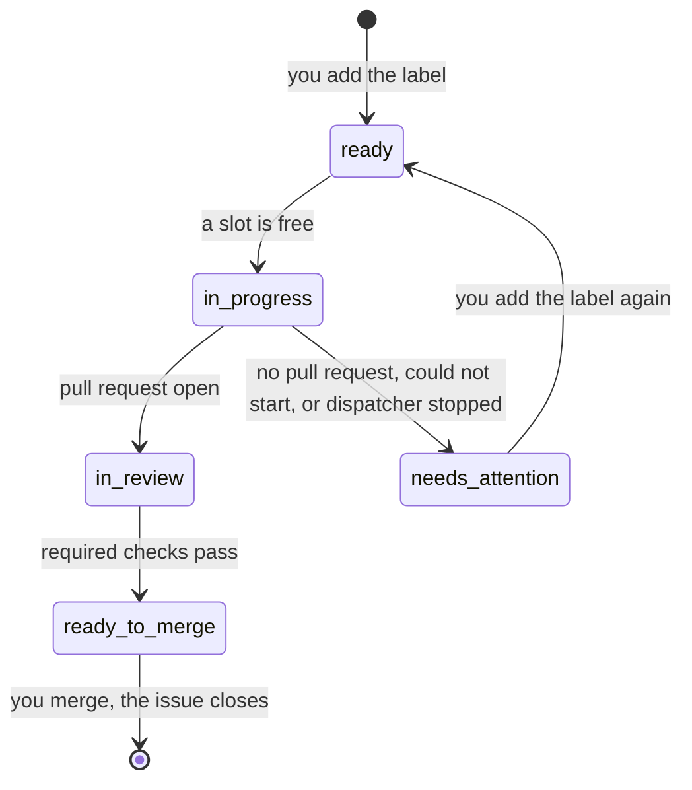

`tools/dispatcher/dispatcher.py` polls this repository's GitHub issues and starts a headless Claude session running `lfg` for each issue you mark `ready`. Each session works in its own new worktree and ends at an open pull request. You review and merge.

## Running it

From the main checkout, logged in to `gh` as the issues' author, with `claude` and the compound-engineering plugin installed:

```sh
python3 tools/dispatcher/dispatcher.py run       # 2 sessions at most, a poll every 5 minutes
python3 tools/dispatcher/dispatcher.py run --sessions 3 --every 120
```

It runs until you stop it with Ctrl-C. Only one dispatcher runs at a time: a second one refuses to start while the first is alive.

Every line it prints starts with the time. It says what it checked at start, then narrates each poll, even one with nothing to do: what it read, what each `ready` issue gets, which sessions still run or ended, how the reviews stand, and when the next poll comes.

```text
17:56:28 dispatcher: watching the open issues mguilarducci opened and labelled `ready`, up to 2 sessions at once
17:56:29 dispatcher: labels: all 5 in place
17:56:29 dispatcher: no issue left in progress by an earlier run
17:56:29 dispatcher: a poll every 300s; Ctrl-C stops
17:56:29 dispatcher: poll: reading GitHub...
17:56:31 dispatcher: poll: 3 ready (1 blocked), 0 running, 1 in review
17:56:31 dispatcher: #69 in review: its required checks don't all pass yet
17:56:31 dispatcher: #70 "Add the gate": dispatching
17:56:31 dispatcher: #72 "Gate alerts": blocked by 1 open issue, skipped
17:56:31 dispatcher: #73 "Pool goal": waiting for a free session (1 of 1 in use)
17:56:32 dispatcher: #70 -> in progress
17:56:32 dispatcher: #70: fetching origin/main and creating its worktree...
17:56:35 dispatcher: #70: claude started (PID 4242) in .../.claude/worktrees/issue-70, log .../tools/dispatcher/.state/logs/issue-70.log
17:56:35 dispatcher: next poll at 18:01:35
```

Later polls add `#70 still running (5 min)`, then `#70 session ended (exit code 0)` and the label it moves to. A refused `gh` call gets its own line too. A session's own output goes to its log, not to the terminal.

## Which issues it takes

An issue is taken when it's open, you opened it, and it carries the `ready` label. The oldest goes first. An issue blocked by an open issue (GitHub's **Blocked by** relation) is skipped, and the next one is considered. Once the blocker closes, the issue is taken at a later poll.

Broad or umbrella issues stay out of the queue until you add `ready`.

## Labels

The labels show where each issue stands. The dispatcher creates the missing ones on its first run.

| Label | Meaning |
|---|---|
| `ready` | You queued it. |
| `in progress` | A session is working on it. |
| `in review` | The session ended with an open pull request; its required checks don't all pass yet. |
| `ready to merge` | That pull request's required checks all pass. |
| `needs attention` | The session ended without a pull request. A comment says why, with the worktree and the log. |



A failed issue is never retried on its own: add `ready` again to queue it.

Every poll checks the issues `in review` again, so one whose checks turn green later moves to `ready to merge`. `ready to merge` reads only the required checks. Code scanning and the pull request rules of `main` can still block the merge. Nor does it mean anyone read the review threads: `lfg` watches the pull request with `ce-babysit-pr`, which answers and resolves threads under your `gh` login.

## The pull request closes the issue

The session is asked to put `Closes #N` in the pull request's body. When the body still lacks it, the dispatcher adds it. Merging then closes the issue, which is what frees the issues it blocks.

Only this repository's pull requests count. A fork's pull request from a branch named `issue-N`, or one saying `Closes #N`, moves no label.

When a session ends, a label move or `Closes #N` that GitHub refuses is tried again at the next poll.

## Where things are

- **Worktrees:** `.claude/worktrees/issue-N` on a branch `issue-N` from the latest `origin/main`, with `-2`, `-3`… when the name is taken. The dispatcher never removes them.
- **Logs:** `tools/dispatcher/.state/logs/issue-N.log`, the session's JSON lines. The last `result` event holds its final message and its cost.
- **Lock:** `tools/dispatcher/.state/lock`, the running dispatcher's PID. `.state/` is git-ignored.

## Stopping and restarting

Ctrl-C first judges the sessions that already ended, as a poll would: one with an open pull request goes `in review`. It then ends the sessions still running and moves their issues to `needs attention`. An unexpected error stops the sessions the same way before the dispatcher exits. If the dispatcher dies without that, for example when the Mac sleeps, the next start finds the issues left `in progress` and moves them to `needs attention`, naming their worktrees.

## Sessions

A session is `claude -p` in the worktree, running `/compound-engineering:lfg #N` with `--permission-mode auto`. It ends where `lfg` ends: an open pull request, never a merge. A session has no time or cost limit. One that stops, for example at a permission `auto` doesn't grant, ends without a pull request, and its issue needs attention.
