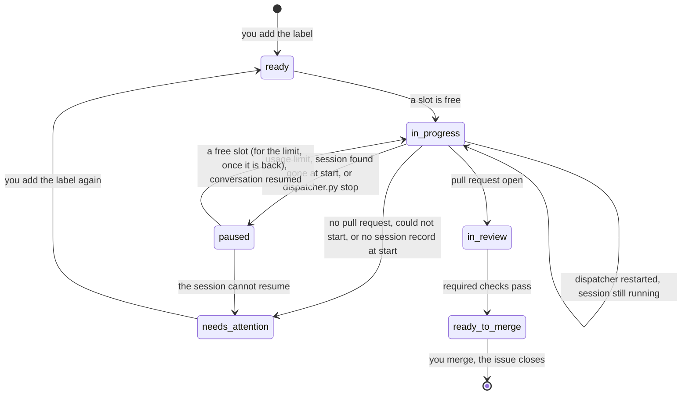

`tools/dispatcher/dispatcher.py` polls this repository's GitHub issues and starts a headless Claude session running `lfg` for each issue you mark `ready`. Each session works in its own new worktree and ends at an open pull request. You review and merge.

## Running it

From the main checkout, logged in to `gh` as the issues' author, with `claude` and the compound-engineering plugin installed:

```sh
python3 tools/dispatcher/dispatcher.py run       # 2 sessions at most, a poll every 5 minutes
python3 tools/dispatcher/dispatcher.py run --sessions 3 --every 120
python3 tools/dispatcher/dispatcher.py stop      # ends a running dispatcher and every session
```

It runs until you stop it with Ctrl-C, which leaves its sessions running (see [Stopping and restarting](#stopping-and-restarting)). Only one dispatcher runs at a time: a second one refuses to start while the first runs, or while `stop` runs, and prints the holder's PID.

Every line it prints starts with the time. It says what it checked at start, then narrates each poll, even one with nothing to do: what it read, what each `ready` issue gets, which sessions still run or ended, how the reviews stand, and when the next poll comes.

```text
17:56:28 dispatcher: watching the open issues mguilarducci opened and labelled `ready`, up to 2 sessions at once
17:56:29 dispatcher: labels: all 6 in place
17:56:29 dispatcher: no issue left in progress by an earlier run
17:56:29 dispatcher: a poll every 300s; Ctrl-C stops
17:56:29 dispatcher: poll: reading GitHub...
17:56:31 dispatcher: poll: 3 ready (1 blocked), 0 paused, 0 running, 1 in review
17:56:31 dispatcher: #69 in review: its required checks don't all pass yet
17:56:31 dispatcher: #70 "Add the gate": dispatching
17:56:31 dispatcher: #72 "Gate alerts": blocked by 1 open issue, skipped
17:56:31 dispatcher: #73 "Pool goal": waiting for a free session (1 of 1 in use)
17:56:32 dispatcher: #70 -> in progress
17:56:32 dispatcher: #70: fetching origin/main and creating its worktree...
17:56:35 dispatcher: #70: claude started (PID 4242) in .../.claude/worktrees/issue-70, log .../tools/dispatcher/.state/logs/issue-70.log
17:56:35 dispatcher: next poll at 18:01:35
```

Later polls add `#70 still running (5 min)`, then `#70 session ended (exit code 0)` and the label it moves to. A refused `gh` call gets its own line too. A session's own output goes to its log, not to the terminal.

## Which issues it takes

An issue is taken when it's open, you opened it, and it carries the `ready` label. The oldest goes first. An issue blocked by an open issue (GitHub's **Blocked by** relation) is skipped, and the next one is considered. Once the blocker closes, the issue is taken at a later poll.

Broad or umbrella issues stay out of the queue until you add `ready`.

## Labels

The labels show where each issue stands. The dispatcher creates the missing ones on its first run. Each issue's [status comment](#status-comment) shows the same state, with more detail.

| Label | Meaning |
|---|---|
| `ready` | You queued it. |
| `in progress` | A session is working on it. |
| `in review` | The session ended with an open pull request; its required checks don't all pass yet. |
| `ready to merge` | That pull request's required checks all pass. |
| `needs attention` | The session ended without a pull request. A comment says why, with the worktree and the log. |
| `paused` | No session runs; its conversation resumes later. The Claude usage limit stopped it (see [Usage limit](#usage-limit)), it was found gone at start (see [Stopping and restarting](#stopping-and-restarting)), or you ran `stop` (see [Stopping everything](#stopping-everything)). |



A failed issue is never retried on its own: add `ready` again to queue it.

Every poll checks the issues `in review` again, so one whose checks turn green later moves to `ready to merge`. `ready to merge` reads only the required checks. Code scanning and the pull request rules of `main` can still block the merge. Nor does it mean anyone read the review threads: `lfg` watches the pull request with `ce-babysit-pr`, which answers and resolves threads under your `gh` login.

## Status comment

Each issue the dispatcher queues or starts gets one status comment. It is always the same comment, edited in place, so the issue keeps one place to look. Editing a comment notifies no one, so the comments that do notify are still posted as new ones: the pull request's link, needs attention, and the pause.

The comment follows the issue:

- **Queued:** why it waits. It may be waiting for a free session, blocked by N open issues, or waiting for the usage limit to reset at a given time. The comment is edited only when that text changes.
- **Running:** a checklist of `lfg`'s stages, the last sentence the session wrote, how long the session has run, and when the comment was updated. It is edited at every poll.
- **In review** and **ready to merge:** the checklist, with the pull request done and CI current, then CI done.
- **Needs attention:** the checklist frozen, with the stage it stopped at marked failed. This covers every reason the dispatcher moves an issue there.
- **Paused:** the checklist frozen, with the stage it stopped at marked paused, and why: the usage limit, with when it resets; the session interrupted, found gone when the dispatcher started; or stopped with `dispatcher.py stop`. When the session resumes, the checklist continues from there.

````text
**Dispatcher status: implementation** (running 42 min)

✅ Plan
✅ Plan review
⏳ Implementation
⬜ Code review
⬜ Pull request
⬜ CI

Latest:
```text
U1 committed (9073eb3): 1684 tests pass. Dispatching U2, the grammar change.
```

Updated 2026-10-01 10:47 -03
<!-- dispatcher-status {"stages": ["done", "done", "current", "pending", "pending", "pending"]} -->
````

Marks: ✅ done, ⏳ current, ⬜ pending, ➖ skipped (the route `lfg` took doesn't run that stage, for example plan on a bug fix), ❌ failed, ⏸️ paused. The last sentence is cut to 200 characters on one line, inside a code block, so nothing in it renders as Markdown or mentions anyone. The repository is public: the sentence is posted as the session wrote it, and may name local paths.

The session reports nothing itself. The dispatcher reads the stages from the session's log, so the comment still says where a session stopped when it hangs or dies. Each `Skill` call `lfg` makes on its main thread moves the checklist; a sub-agent's calls move nothing. The furthest stage entered is current, and the checklist never moves back.

| Stage | Skills that enter it |
|---|---|
| Plan | `ce-plan`, `ce-brainstorm` |
| Plan review | `ce-doc-review` |
| Implementation | `ce-work`, `ce-debug` |
| Code review | `ce-simplify-code`, `ce-code-review` |
| Pull request | `ce-commit-push-pr` |
| CI | `ce-babysit-pr` |

Other skills, such as `ce-compound` or `ce-test-browser`, move nothing. The mapping follows `lfg`'s skill names in compound-engineering 3.30.1: a renamed skill stops moving the checklist until the dispatcher's `SKILLS` follows it.

The comment's last line is a hidden marker holding the checklist. The dispatcher keeps the checklist nowhere else: a resume, a restart, and a later `in review` or `ready to merge` read it back from there. It finds the comment again by that marker, among the `gh` user's comments only, so a stranger's marker counts for nothing. Some cases to know:

- Only queuing or starting an issue creates its comment. An issue that was already `in review` or `needs attention` before the dispatcher had status comments never gets one.
- Removing `ready` from a queued issue leaves its comment as it was.
- A failed write that would leave the comment stale is retried at the next poll: in review, ready to merge, needs attention, paused. Running and queued comments are rewritten at every poll anyway.
- Stopping the dispatcher writes nothing. A session left running keeps its running comment as the last poll left it, until the first poll of the next start edits it again.

## The pull request closes the issue

The session is asked to put `Closes #N` in the pull request's body. When the body still lacks it, the dispatcher adds it. Merging then closes the issue, which is what frees the issues it blocks.

Only this repository's pull requests count. A fork's pull request from a branch named `issue-N`, or one saying `Closes #N`, moves no label.

When a session ends, a label move or `Closes #N` that GitHub refuses is tried again at the next poll.

## Where things are

- **Worktrees:** `.claude/worktrees/issue-N` on a branch `issue-N` from the latest `origin/main`, with `-2`, `-3`… when the name is taken. The dispatcher never removes them.
- **Logs:** `tools/dispatcher/.state/logs/issue-N.log`, the session's JSON lines. The last `result` event holds its final message and its cost.
- **Session records:** `tools/dispatcher/.state/sessions/issue-N.json`, one per session started or resumed: its PID, its process's start time, its branch, worktree and log. A later dispatcher, or `stop`, finds the session by it. It goes once the session's verdict is applied in full.
- **Lock:** `tools/dispatcher/.state/lock`, an flock held by the running dispatcher or by `stop`, with the holder's PID inside. The file stays on disk after it exits. The kernel drops the flock when its holder ends, a crash or a restart included, so a file left behind never blocks a start. `.state/` is git-ignored.

Comments on GitHub name a worktree or a log by its path inside the checkout, such as `.claude/worktrees/issue-70` or `tools/dispatcher/.state/logs/issue-70.log`, never by the machine's absolute path. The terminal prints full paths.

## Stopping and restarting

Ctrl-C, SIGTERM or an unexpected error stops the dispatcher, not its sessions. Before it exits, it judges the sessions that already ended, as a poll would, and prints each one it leaves running:

```text
18:02:10 dispatcher: stopping
18:02:11 dispatcher: #70 left running (PID 4242), the next start follows it
```

A session left running keeps its issue `in progress`, with no comment. To update the dispatcher, press Ctrl-C, run `git pull`, then `run` again: the sessions don't notice.

The next start prints one line for each issue `in progress`, after reading its session record (see [Where things are](#where-things-are)):

```text
18:03:02 dispatcher: #70 still running (PID 4242): followed again
18:03:03 dispatcher: #73 session ended while no dispatcher ran: in review
18:03:04 dispatcher: #74 session ended while no dispatcher ran: paused as interrupted
18:03:05 dispatcher: #75 was in progress with no session record: it needs attention
```

- **Followed again:** its session still runs. The dispatcher checks the PID and the process's start time, so a process that merely reuses the PID doesn't count. The session is listed at every poll and judged when it ends, like any session. Its exit code is unknown then.
- **Ended while no dispatcher ran:** judged from its log, as a poll would: `in review`, `paused at the usage limit`, or `needs attention` when it left a final result without a pull request.
- **Paused as interrupted:** the session is gone without a final result, for example after the machine restarted. The issue goes `paused` and resumes its own conversation, in its own worktree, at the first free slot, with no usage-limit wait. The session is told it was interrupted. When its log names no conversation, the issue needs attention instead. When its worktree is gone, it needs attention when it resumes.
- **Needs attention:** no session record names it, or the record can't be read. The comment names its worktrees.

Some cases to know:

- Labels lag while no dispatcher runs: a session that ends then keeps `in progress` until the next start judges it.
- Sessions left running take slots first. They count against `--sessions`, and no new session or resume starts while they fill the slots. None is ended to make room.
- A record whose issue is no longer `in progress`, because you removed the label or closed the issue, isn't followed: its session is left alone and never signalled. The record goes once that process is gone. `stop` still ends it.
- To end one session, `kill <PID>` with the PID the dispatcher printed. With a dispatcher running, its next poll judges it like any session that ended: with no pull request, `needs attention`. With none running, the next start finds it gone and pauses it as interrupted, so it resumes.
- `paused` issues have no session running, so stopping loses nothing. The next start reads their pause comments and resumes them, the usage-limit ones once the limit allows.

<Warning>
  **The update that brings this behavior:** the dispatcher you stop to install it runs the old code, which ends its sessions on Ctrl-C, and they have no records. Do that one update with no session running. Start the new dispatcher only once the old one has exited: its lock holds no flock, so the new `run` or `stop` wouldn't see it.
</Warning>

## Stopping everything

```sh
python3 tools/dispatcher/dispatcher.py stop
```

`stop` ends everything, in order:

1. If a dispatcher runs, it sends SIGTERM to the PID in the lock and waits up to 60 seconds for the lock. That dispatcher leaves as on Ctrl-C, so no issue goes `needs attention` because its session was ended.
2. It holds the lock until it is done, so no `run` starts in the middle.
3. It ends every live session any run started: SIGTERM to its process group, then SIGKILL after 10 seconds.
4. It judges each issue `in progress` that has a record, as a start would. A stopped session goes `paused` as stopped, even when it wrote a final result. One with an open pull request goes `in review`. One already gone without a final result goes `paused` as interrupted. One whose log names no conversation needs attention.

A session whose issue isn't `in progress` is ended too, and no label moves.

```text
18:10:02 dispatcher: stopping the dispatcher (PID 4100)...
18:10:04 dispatcher: the dispatcher (PID 4100) stopped
18:10:04 dispatcher: ending the sessions of #70 (PID 4242), #73 (PID 4250)...
18:10:06 dispatcher: #70 session stopped: paused as stopped
18:10:07 dispatcher: #70 -> paused
18:10:07 dispatcher: #73 session stopped: paused as stopped
18:10:08 dispatcher: #73 -> paused
```

With no dispatcher running, the first line is `no dispatcher runs`. With no session record at all, `stop` prints `no session runs`.

The next `run` resumes stopped issues like any paused one: at the first free slots, before `ready` issues, oldest first, with no usage-limit wait. Each session is told it was stopped.

`stop` exits with:

- `0` when everything is done, nothing to stop included.
- `1` when the dispatcher didn't stop within 60 seconds, or the lock names no PID: nothing was changed.
- `1` when GitHub couldn't be read or a write failed. The sessions are ended and their records stay, so the next start judges them.

## Sessions

A session is `claude -p` in the worktree, running `/compound-engineering:lfg #N` with `--permission-mode auto`. It ends where `lfg` ends: an open pull request, never a merge. A session has no time or cost limit of its own; the Claude usage limit can stop it, which pauses its issue (see [Usage limit](#usage-limit)). One that stops for another reason, for example at a permission `auto` doesn't grant, ends without a pull request, and its issue needs attention.

## Usage limit

When the Claude usage limit stops a session before it opens a pull request, the issue goes `paused`, not `needs attention`, and no session starts until the limit is back.

The dispatcher reads this from the session's own log, from its JSON events only: a `rate_limit_event` whose status is `rejected`, or a final `result` that is an error naming the limit. Text a session quotes, for example a plan that mentions the limit, never pauses an issue. A session that ends with a clean result is never paused.

The pause comment says when the limit resets, and gives the session's ID, the worktree and the log. Its last line is a hidden marker the dispatcher reads back:

```text
<!-- dispatcher-pause {"session": "<session ID>", "branch": "issue-70", "reset": 1759361400, "cause": "limit"} -->
```

`cause` says what paused the session: `limit`, `interrupted` or `stopped`. A marker without one, posted before causes existed, reads as `limit`. Only `limit` holds starts: an interrupted or stopped issue has no reset (`null`) and resumes at the first free slot.

Only markers in comments by the `gh` user count, so a stranger's comment can't name a session to resume. A `paused` issue with no valid marker moves to `needs attention`.

While the limit is spent:

- No session starts, neither a new one nor a resume, until a minute after the reset. Sessions already running keep running. The dispatcher prints until when, and each `ready` issue's line says it waits for the limit to reset.
- When the limit gives no reset time, the next poll tries one session. If the limit is still spent, that session pauses again.
- A weekly limit can hold every start for days.

Once the limit is back, paused issues take the free slots before `ready` issues, oldest first. Each resumes its own conversation with `claude -p --resume`, in its own worktree, told the limit is back and to continue `lfg`. Its issue goes `in progress`, and its end is judged like any session's: `in review`, `needs attention`, or `paused` again. A session that pauses again with nothing new to say swaps the labels without another comment.

Some cases to know:

- Removing `paused` takes the issue out of the dispatcher's hands: it is never resumed. Closing it does the same, and its worktree stays.
- Adding `ready` to a paused issue doesn't start a fresh session: the issue resumes when its turn comes.
- A resume whose worktree is gone moves the issue to `needs attention`.
- A limit hit after the pull request is open ends `in review`, as any session with a pull request does.
