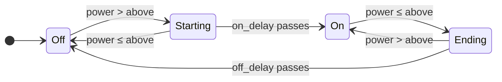

`appliance` turns a smart plug that measures power into an appliance that knows when it's running. Each run is a **cycle**. Its required `running_program` tells when it runs, and its phases what it's doing. pururu records each cycle's start, end, duration and energy, and it counts runtime and cycles over time. With an energy counter, it also measures what the appliance uses **between** cycles, on standby.

```yaml
pururu:
  devices:
    clothes_washer:
      name: Tanquinho
      appliance:
        power: homeassistant.sensor.washer_plug_power
        energy: homeassistant.sensor.washer_plug_energy
        running_program:
          above: 4
          on_delay: {minutes: 1}
          off_delay: {minutes: 2}
          statistics:
            runtime: [today, week, month, year]
            cycles: [today, week, month, year]
          phases:
            warming: {name: Aquecendo, above: 1000}
            wringing: {name: Centrifugando, above: 50, below: 1000, on_delay: {minutes: 3}}
        programs:
          detected:
            cotton: {name: Algodão, above: 1500, on_delay: {minutes: 5}}
        statistics:
          idle_energy: [today, month]
```

## Settings

<Property name="power" type="homeassistant.<domain>.<object_id>" required>
  The plug's power sensor, written with `homeassistant.` before its entity ID, as everything Home Assistant owns: `homeassistant.sensor.washer_plug_power`. Its value is compared with `running_program`'s band, in the sensor's own unit (usually W).
</Property>

---

<Property name="energy" type="homeassistant.<domain>.<object_id>" optional>
  The plug's **lifetime** energy counter (`homeassistant.sensor.washer_plug_energy`), the one that only goes up. Any energy unit works (Wh, kWh, MWh…); a counter with no unit is read as kWh. Without it, the device has no `energy_total`, no `last_cycle_energy`, no `idle_energy_total`, and no phase's or detected program's `energy_total` or `last_cycle_energy`.
</Property>

---

<Property name="running_program" type="map" required>
  A [detected program](/concepts/programs#the-running-program): `above` and/or `below`, `on_delay` and `off_delay` (0 when absent), `statistics` (for `runtime` and `cycles`), `phases` and `other`. It takes no `name`: it's the appliance running.
</Property>

---

<Property name="programs.detected" type="map" optional>
  More [detected programs](/concepts/programs#more-detected-programs) of the plug's power, each with its `name`, a band, `statistics`, `phases` and `other`. Each is `binary_sensor.pururu_<key>_appliance_<program>`, whose path is `appliance.programs.detected.<program>`.
</Property>

---

<Property name="statistics.idle_energy" type="list of periods" optional>
  For each period, a sensor with the kWh used while idle in the current period. It needs `energy`.
</Property>

A **time period** can be written as `{minutes: 1}` (with any of `days`, `hours`, `minutes`, `seconds`), as `"00:01:30"`, or as a number of seconds (`90`). Picking `above` and the delays for your appliance is covered in [Your first device](/getting-started/first-device#picking-the-numbers).

## When a cycle starts and ends



A `below` band reads the same way, the other way round. That affects what the cycle records:

- A cycle **starts** the moment `on_delay` passed, so `last_cycle_start` is `on_delay` after the power first went up.
- A cycle **ends** when the power went down for good: `off_delay` only confirms the end. `running` turns off `off_delay` later, and that's when the cycle is recorded, but `last_cycle_end` is the moment the power went down, and `last_cycle_duration` and `runtime` leave `off_delay` out. A pause shorter than `off_delay` stays part of the cycle.
- While the plug has **no value** (`unknown`, `unavailable`, or not a number), `running` keeps its state, and a pending start or end is cancelled. It resumes from the next reading. A plug dropping off Wi-Fi for a minute doesn't split a cycle. An end keeps the moment the power went down: `off_delay` counts again from the next reading, and only the power back in the band cancels the end.
- A **restart or reload** in the middle of a cycle doesn't lose it. `running` restores the detector's snapshot: the cycle, its phases and when each started.

## Entities

`<key>` is the device's key. Entities marked *with `energy`* exist only when `energy` is set. The path is how an alert or a reaction names the entity, from the `appliance` block: `power` and `energy` name the entity they make, and the cycle's entities sit under `running_program`, the program running.

| Entity | Path | Unit | What it is |
|---|---|---|---|
| `sensor.pururu_<key>_appliance_power` | `appliance.power` | the plug's | The plug's power, with its unit and classes, inside this device |
| `sensor.pururu_<key>_appliance_energy_total` | `appliance.energy` | the plug's | The plug's energy counter, inside this device. *With `energy`.* |
| `binary_sensor.pururu_<key>_appliance_running` | `appliance.running_program` | | On while a cycle runs. Device class `running`. Its attribute `cycle_start` is the running cycle's start, present while it runs; `cycle_end`, while `off_delay` runs, is when the power went down. |
| `binary_sensor.pururu_<key>_appliance_alert_<alert>` | `appliance.alerts.<alert>` | | A [ready-made alert](#ready-made-alerts), for each one enabled. Device class `problem`. |
| `sensor.pururu_<key>_appliance_last_cycle_start` | `appliance.running_program.last_cycle_start` | timestamp | When the last cycle started |
| `sensor.pururu_<key>_appliance_last_cycle_end` | `appliance.running_program.last_cycle_end` | timestamp | When the last cycle ended. **Written last**: trigger on it. |
| `sensor.pururu_<key>_appliance_last_cycle_duration` | `appliance.running_program.last_cycle_duration` | min | How long the last cycle took |
| `sensor.pururu_<key>_appliance_last_cycle_energy` | `appliance.running_program.last_cycle_energy` | kWh | Energy the last cycle used. *With `energy`.* |
| `sensor.pururu_<key>_appliance_cycles_total` | `appliance.running_program.cycles_total` | cycles | Cycles finished, all time |
| `sensor.pururu_<key>_appliance_runtime_total` | `appliance.running_program.runtime_total` | h | Hours run, all time |
| `sensor.pururu_<key>_appliance_idle_energy_total` | `appliance.idle_energy_total` | kWh | Energy used while not running, all time. *With `energy`.* |
| `sensor.pururu_<key>_appliance_runtime_<period>` | `appliance.running_program.statistics.runtime.<period>` | h | Hours run this period, one per `running_program.statistics.runtime` entry |
| `sensor.pururu_<key>_appliance_cycles_<period>` | `appliance.running_program.statistics.cycles.<period>` | cycles | Cycles finished this period, one per `running_program.statistics.cycles` entry |
| `sensor.pururu_<key>_appliance_idle_energy_<period>` | `appliance.statistics.idle_energy.<period>` | kWh | Energy used while idle this period, one per `statistics.idle_energy` entry |
| `binary_sensor.pururu_<key>_appliance_<program>`, `sensor.pururu_<key>_appliance_<program>_…` | `appliance.programs.detected.<program>`, `appliance.programs.detected.<program>.…` | | Each of `programs.detected`: on while it runs, its last cycle, totals, meters and phases. See [Programs](/concepts/programs#entities). |

With `running_program.phases`, the running phase (its `name` as an attribute), the last one, and each phase's own entities: see [Programs](/concepts/programs#entities).

### Last cycle

- The four `last_cycle_*` sensors are `unknown` until the first cycle ends. After that they change **only** when a cycle ends, and they keep their values across restarts.
- `last_cycle_end` is written **after** the other three `last_cycle_*` sensors and `cycles_total`. An automation that triggers on it reads a complete cycle. [Your first device](/getting-started/first-device#step-5-the-laundry-is-done) has an example.
- `last_cycle_energy` is always in **kWh**, whatever the counter's unit. It's the counter's reading at the end minus its reading at the start, and it's never negative. It's `unknown` for a cycle when the counter had no value at the start or at the end, or when the counter's unit isn't an energy unit.

### Totals

- `cycles_total` and `runtime_total` count from when the device was created and survive restarts. They're `total_increasing`, so Home Assistant keeps long-term statistics for them.
- `runtime_total` is brought up to date **every minute** while running. It stops when the power goes down and resumes if it comes back during `off_delay`, so the pause counts and `off_delay` doesn't: `runtime` is the cycles' durations added up. A restart or reload during a cycle can lose up to a minute of it, and time while Home Assistant is down isn't counted.

### Idle energy

- `idle_energy_total` adds up how much the energy counter grows while `running` is **off**: the appliance's standby. It's `total_increasing`, in **kWh** whatever the counter's unit, and it survives restarts.
- It splits the counter with the cycles at the same instants `running` turns on and off, so the energy of every cycle plus `idle_energy_total` is what the counter grew. The `on_delay` before a cycle counts as idle; the `off_delay` at its end belongs to the cycle's energy, though not to its duration.
- A counter without a value doesn't stop it: the next reading adds what it grew since the last one. If a cycle starts while the counter has no value, what it grew since the last reading is lost.
- A counter going down (the plug re-paired) adds nothing, and it counts on from the lower reading.
- After a restart or reload it counts from the counter's **next** reading. The reading already there may be from before Home Assistant was down, and a cycle that ran meanwhile would count as idle. So what the counter grew while Home Assistant was down isn't counted, and neither is its first step after a reload.

### Per period

`runtime_<period>`, `cycles_<period>` and `idle_energy_<period>` measure how much their total grew in the current period. See [Statistics](/concepts/statistics) for the periods, how they reset, and the entity IDs.

## Ready-made alerts

An appliance offers alerts for what usually goes wrong. They're **off** until you enable them in its `alerts`, one key each. With [Alert2](/concepts/alerts#getting-notified) set up, each one is delivered with its own texts, in Home Assistant's language.

```yaml
appliance:
  power: homeassistant.sensor.washer_plug_power
  running_program: {above: 4, on_delay: {minutes: 1}, off_delay: {minutes: 2}}
  alerts:
    offline:                          # every default
    long_cycle: {for: {hours: 3}}
```

| Alert | On when | Off when | Defaults |
|---|---|---|---|
| `offline` | the power sensor has no reading | a reading returns | `for` 10 min, `medium` |
| `no_power` | the power is 0 | the power is above 0 | `for` 10 min, `medium` |
| `long_cycle` | a cycle has run for longer than `for` | the cycle ends | `for` required, `medium` |
| `no_cycle` | no cycle has run for longer than `for` | a cycle starts | `for` required, `medium` |

- Each one takes `for`, `priority`, [`message` and `done_message`](/concepts/alerts#settings), which replace its texts, and [`lights`](/concepts/alert-lights). Anything else is a configuration error.
- Without Alert2, they still work as binary sensors, for a [reaction](/concepts/reactions) or your own automations, and their own texts log nothing.
- `offline:` alone, with nothing after it, enables it with every default.
- `no_power` is for an appliance that always draws something, such as a fridge. A washer between cycles reads 0 W, so it would be on almost always.
- `long_cycle` counts from the cycle's start, and `no_cycle` from the last cycle's end, so a restart in between starts nothing over. Until a first cycle ends, `no_cycle` counts from when you enabled it.
- Each one is `binary_sensor.pururu_<key>_appliance_alert_<alert>`, device class `problem`, shown as **Tanquinho Sem conexão** and so on, with the attributes of any [alert](/concepts/alerts#entity). A [reaction](/concepts/reactions) can react to one (`when: appliance.alerts.offline`); another alert can't watch it.
- For anything else, such as a band of your own or another entity, write an [alert](/concepts/alerts) yourself.

| Alert | Default message | Default done message |
|---|---|---|
| `offline` | The plug is offline. | The plug is back. |
| `no_power` | There's no power. | Power is back. |
| `long_cycle` | The cycle is taking too long. | The cycle ended. |
| `no_cycle` | It hasn't run in a while. | It's running again. |

In Portuguese they read "A tomada está sem conexão.", "O ciclo terminou." and so on. They don't repeat the device's name: Alert2 puts the alert's name in every notification.

## Ready-made notifications

An appliance offers one notification, off until you enable it in its `notifications`: `finished` tells your phone when a cycle ends, once.

```yaml
appliance:
  power: homeassistant.sensor.washer_plug_power
  running_program: {above: 4, on_delay: {minutes: 1}, off_delay: {minutes: 2}}
  notifications:
    finished:
```

See [Notifications](/concepts/notifications#ready-made-notifications).

## Phases

`running_program`'s `phases` split each cycle into what the appliance is doing: see [Phases](/concepts/programs#phases). A kind of run the power alone tells apart, such as a cotton wash, can be a detected program of its own, under `programs: detected:`: see [More detected programs](/concepts/programs#more-detected-programs).
