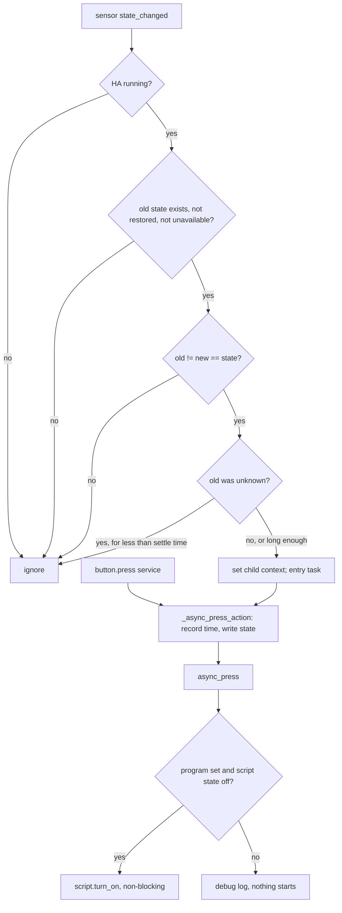

# Buttons - Plan

## Goal Capsule

- **Objective:** The author presses a real button, such as a remote's key, and the device it belongs to runs one of its executable programs. The same button can be pressed from Home Assistant, and nothing presses it that a person didn't press. The button is declared in the `pururu:` YAML, whatever integration it comes from.
- **Means:** a standing feature `buttons` whose items are pururu `button` entities, each fed by a real sensor's value (KTD1, KTD2).
- **Product authority:** the author's decisions in the 2026-09-30 brainstorm and planning session, recorded as Key Decisions; the R-IDs govern behaviour, the KTDs govern mechanism.
- **Stop conditions:** stop and ask if PR #60 (refactor D3) merges with a different shape for `programs: executable:`, `programs.executable` or `programs.script_id` than this plan assumes. Also stop and ask if a guard in R8 would have to drop a press a person made.
- **Execution profile:** starts from `main` after PR #60 merges, on branch `feat/buttons`; one draft PR titled `pururu: buttons, …`, updated with a task checklist at the end of each unit, merged by the repo's rules (Claude 5/5, green checks, Sonar 0, resolved threads).
- **Open blockers:** PR #60 not yet merged.

---

## Product Contract

Product Contract preservation: changed R2, R6, R8, R9, R15 and AE2 in planning, each by the author's decision, as recorded in Key Decisions. R2 and R9 now name executable programs (D3), R6 counts only a change into the value, R8 lets `unknown` count once HA runs behind the settle guard, and R15 also refuses `unknown` as a button's value. Added R14–R17 and AE9–AE11. Both Outstanding Questions are resolved (R17, R6).

### Summary

A new feature, `buttons`, turns a value of a real sensor into buttons of a device. Each button is a pururu `button` entity named by the YAML: a press, physical or in Home Assistant, records its time and starts the button's executable program when it has one. Every path that could press a button without a person is closed.

### Problem Frame

Remotes and wall buttons reach Home Assistant as a sensor whose state becomes a short string for a moment on each press (Zigbee2MQTT's `sensor.<remote>_action` shows `1_single`, then empty). Today the nearest pururu can do is a reaction on a real entity (`entity: sensor.controle_action, to: 1_single, then: ler`). The press leaves nothing in Home Assistant: no entity to see when the button was last pressed, and no way to press the same button from the UI. And a state trigger fires on writes nobody made with a finger: a value arriving as HA starts, or as the sensor's integration reconnects. For a button that starts a program, a press nobody made is the failure that matters most.

### Key Decisions

- **A button is a value of a sensor, with no vendor vocabulary.** The YAML names an entity and the state that counts as a press; pururu knows nothing of "actions", integrations or vendors. (session-settled: user-directed — chosen over mapping vendor strings to a fixed pururu vocabulary such as press/double/hold: pururu is agnostic.) Governs R1, R6.
- **Only `sensor.*` sources for now.** (session-settled: user-directed — chosen over accepting any entity: start narrow, widen later.) Governs R1.
- **The buttons live in the device they control.** A program's steps act only on its own device, so the button that starts it sits in that device. (session-settled: user-approved — chosen over the remote as its own device, with buttons naming another device's program or other devices reacting to it: that would open the one-device rule of programs and reactions.) Governs R2.
- **Each button is a Home Assistant `button` entity.** A press on the remote and a press in the UI are the same press. (session-settled: user-directed — chosen over a press-count sensor, an `event` entity, or no entity: it is a real button now, unlike the program buttons removed in 0.1.15.) Governs R4, R5, R7.
- **One button per key, with its own `entity`, as `switches` and `lights` are.** Several remotes fit one device, at the cost of repeating the sensor on each button. (session-settled: user-approved — chosen over one `entity` per block, or named remotes with nested buttons: it is the repo's existing standing-feature shape.) Governs R1.
- **Only a change into the value is a press.** (session-settled: user-directed — chosen over counting a re-delivered identical value or every write: a sensor that holds its value and is rewritten would press on its own.) Governs R6.
- **`unknown` to the value is a press once HA runs.** The first press after a restart counts. (session-settled: user-approved — chosen over excluding `unknown` as well: a sensor starts `unknown` after every restart.) Governs R8.
- **No press without a person is critical.** Every source of a press nobody made gets its own guard and its own test. (session-settled: user-directed — the author's requirement.) Governs R8, R14, R15, R16.
- **A press while the program runs doesn't restart it.** (session-settled: user-directed — restarting or stopping the program is a later improvement.) Governs R10.
- **The feature follows the repo's patterns with no exception of its own.** (session-settled: user-directed — an obligation, not a preference.) Governs R12, R13.

### Requirements

**Configuration**

- R1. A device takes `buttons:`, a map of button keys. Each button has a required `entity` (a real `sensor.*` entity), a required `state` (the value that counts as a press), a required `name`, and an optional `program`.
- R2. A button's `program` must be one of its own device's executable programs (`programs: executable:`); otherwise the configuration is refused, with the house's other refusals.
- R3. Two buttons of one device with the same `entity` and `state` are refused.
- R15. A button whose `state` is `unavailable` or `unknown` is refused: neither is a value a person presses.

**The button entity**

- R4. Each button creates `button.pururu_<device key>_button_<button key>` in its device, named by its `name`.
- R5. The button's state is the time of its last press, and it survives a restart and a reload.
- R17. The button stays available while its sensor is unavailable, missing or disabled; it keeps its last press and can still be pressed from Home Assistant.

**Presses**

- R6. A press happens when the sensor's state changes to the button's `state` from another value. The same value written again, with or without new attributes, is not a press.
- R7. Pressing the button entity in Home Assistant is a press too.
- R8. A change to the value is not a press when it comes before HA has finished starting, from `unavailable`, from no state (the sensor appearing), or from a restored state. A change from `unknown` is a press only once the sensor has been `unknown` for a few seconds, so a sensor just set up receiving its first value doesn't press.
- R9. On a press, a button with a `program` starts that executable program's script. A button without one only records the press.
- R10. When the program is already running, a press records the press and doesn't restart the program.
- R11. When the program isn't generated (held, dropped, or not yet written during startup), the button still records presses and nothing starts.
- R14. Restoring a button's last press, at startup or reload, never starts its program.
- R16. Each press carries the context of what caused it, the sensor's write or the UI call, so the logbook shows where an unexpected press came from.

**Repo pattern**

- R12. `buttons` joins `FEATURES` like any feature: the contract test covers it, its checks are raised with the house's other refusals, its entity IDs follow the one rule, and a rename in the UI is followed.
- R13. `docs/features/buttons.mdx` documents it with a sidebar entry, says these buttons are not the program buttons removed in 0.1.15, and states which sensor writes are presses. The release bumps the manifest version.

### Key Flows

- F1. Press on the remote
  - **Trigger:** the remote's sensor changes from `""` to `1_single`.
  - **Steps:** the guards of R6 and R8 pass; the button records the press time with the sensor write's context; its executable program's script starts if it is generated and idle.
  - **Covered by:** R6, R8, R9, R10, R11, R16
- F2. Press in Home Assistant
  - **Trigger:** the author presses `button.pururu_biblioteca_button_ler` in the UI or calls `button.press`.
  - **Steps:** same as F1 from the recorded press on, with the call's context.
  - **Covered by:** R7, R9, R16

### Acceptance Examples

With `biblioteca: buttons: {ler: {entity: sensor.controle_action, state: 1_single, name: Ler, program: ler}}` and `ler` an executable program of `biblioteca`:

- AE1. **Covers R6.** Given HA is running and the sensor is `""`, when it becomes `1_single`, then `ler` records a press and the program `ler` starts.
- AE2. **Covers R6.** Given the sensor shows `1_single`, when it writes `1_single` again, with or without new attributes, then no press is recorded.
- AE3. **Covers R6.** Given the sensor becomes `1_hold`, then `ler` records nothing.
- AE4. **Covers R8.** Given the sensor was `unavailable`, when it returns as `1_single`, then no press is recorded.
- AE5. **Covers R8, R5, R14.** Given HA restarts while the sensor shows `1_single`, then no press is recorded, the program doesn't start, and `ler` shows its last press from before the restart.
- AE6. **Covers R10.** Given the program `ler` is running, when the sensor becomes `1_single`, then `ler` records the press and the program keeps its current run.
- AE7. **Covers R9.** Given `extra: {entity: sensor.controle_action, state: 2_single, name: Extra}` with no `program`, when the sensor becomes `2_single`, then `extra` records the press and nothing starts.
- AE8. **Covers R2.** Given `program: regar` where `regar` isn't an executable program of `biblioteca`, then the configuration is refused.
- AE9. **Covers R8.** Given HA is still starting, when the sensor changes from `unknown` to `1_single`, then no press is recorded.
- AE10. **Covers R8.** Given HA is running and the sensor has been `unknown` since the restart, when it becomes `1_single`, then `ler` records a press.
- AE11. **Covers R8.** Given HA is running and the sensor appears, becomes `unknown`, and gets `1_single` within the same second, then no press is recorded.

### Scope Boundaries

**Deferred for later**

- Statistics of the buttons: press counts and period meters (the next step).
- A press that restarts or stops a running program.
- Sources other than `sensor.*`, among them `event.*` entities.
- Double-press or hold detected by pururu from single presses.
- Ready-made notifications and alerts on presses, or a "not pressed for a while" alert.

**Outside this feature's identity**

- A table of vendor strings or remote models shipped with pururu: the author writes the value their entity shows.

**Considered and not built**

- Counting a repeated identical write (`state_reported`, or `force_update` re-delivery) as a press: excluded by R6. Evidence that would change it: a real remote whose integration never leaves the value between presses.
- The sensor's `entity` and `state` as attributes of the button: nobody asked, and the configuration already says them. Would change if troubleshooting a silent button proves hard.
- A pururu log line per press: the logbook already shows each press with its context (R16).

### Sources / Research

- `features/opening/events.py`: the door's `event.*` sources, the closest pattern for reading a real entity's value; its `fired()` shape guides R6.
- `features/standing.py` and `features/switches.py`: the `{key: {entity, name}}` shape, `real_entity(...)` and the build loop `buttons` mirrors.
- PR #60 (refactor D3): `programs: executable:`, `aspects/programs.py` (`executable`, `script_id`), and the named layer allowance `device_keys/reactions` → `aspects.programs`.
- `device_keys/reactions.py`, `actions()`: a reaction starts its program's script only when the script is `off`.
- `docs/ideation/2026-09-30-button-action-sensor-ideation.html`: the ideation this plan came from.

---

## Planning Contract

### Key Technical Decisions

- KTD1. **One press path for both entry points.** The button is a `PururuEntity` and a `ButtonEntity` (the MRO the removed program button used). A sensor press sets its context, then awaits `_async_press_action()`; the UI's `button.press` calls the same method. `async_press` starts the program. `_async_press_action` is `@final` and underscore-private, but core's `button.press` registration depends on its name; a test pins it. Governs R5, R7, R9, R14.
- KTD2. **Presses come from `state_changed` only.** The button listens with `async_track_state_change_event` and never with `async_track_state_report_event`. It counts an event only when every guard of R6 and R8 holds: HA's state is `running` (`hass.state is CoreState.running`, not `hass.is_running`, which is already true while starting); an old state exists, isn't restored (`ATTR_RESTORED`) and isn't `unavailable`; `old.state != new.state == state`. From `unknown`, `new.last_changed - old.last_changed` must be at least the settle time, a module constant of 3 seconds. (session-settled: user-directed — chosen over counting `state_reported` or `force_update` re-deliveries: a held, rewritten value must never press.) Governs R6, R8.
- KTD3. **The program's script is found at press time.** `async_press` computes the script's unique ID with `aspects.programs.script_id`, looks up its entity ID in the entity registry (following renames), and calls `script.turn_on` non-blocking only when the script's state is `off`. `off` alone means "generated and idle"; running, held, dropped, restored and not-yet-generated are all something else, and each is logged at debug. It is the reaction pattern, and it never awaits a start that single mode would park. Governs R9, R10, R11.
- KTD4. **A named layer allowance, as D3 made for reactions.** `tests/test_code.py` `ALSO` gains `features/buttons` → `aspects.programs`. `features/buttons.py` imports the module (`from ..aspects import programs`), as `device_keys/reactions.py` does, and reads `programs.script_id` and `programs.executable` only inside functions (`async_press`, `check`), never at module level: the package import reaches `features/__init__` while `aspects.programs` is still loading, and a `from ..aspects.programs import …` fails there with a partially initialized module. The script's ID keeps one owner. Governs R2, R9.
- KTD5. **The press runs as an entry task, with a child context.** The tracker callback is sync: it sets `Context(parent_id=event.context.id)` on the entity, then runs the press as `config_entry.async_create_task`, so a reload cancels it with the entry. Governs R16.
- KTD6. **The button is always available and follows nothing.** No `follows`, no `sources`: its sensor is not pururu's, and its program is not an index entity key. An unavailable button would be dumped as `unavailable` at shutdown, and `ButtonEntity` drops that on restore, losing R5. Governs R5, R17.
- KTD7. **`buttons.check` owns the house-wide refusals.** It lives in `features/buttons.py`, is listed in `setup/schema.py` `CHECKS`, and yields R2 and R3 refusals with a `path`, in the repo's `buttons: <key>: …` wording. R15 is a schema refusal on the item. Governs R2, R3, R15.

### High-Level Technical Design

The shape of a press, from either entry point, through the guards (directional, not code):

Restore (R14) never enters this graph: `ButtonEntity` restores the time in `async_internal_added_to_hass` without calling `async_press`.

### Implementation Constraints

- Build on `main` after PR #60 merges; its `programs: executable:`, `programs.executable`, `programs.script_id` and `ALSO` table are prerequisites.
- `features/` imports only what the layer table allows, plus the one named allowance of KTD4.
- Configured items take no translations or icons (`test_every_translated_entity_key_is_created` refuses them).
- This worktree has no `.venv`: run `uv sync` before the first test.

### Assumptions

- Zigbee2MQTT's action sensor returns to an empty value between presses, so R6 sees each press. Not verified on the author's remote; if it holds the value, a second identical press is lost, by decision.
- Three seconds of settle time separates a sensor just set up from a person pressing after a restart. A retained value arrives within milliseconds of the sensor's setup.
- Zigbee2MQTT 2.x no longer creates `sensor.*_action` by default; it exists with `homeassistant: legacy_action_sensor: true`, itself deprecated. The author's remote is assumed to have it today; `event.*` sources (deferred) are the path once that option goes, and `buttons.mdx` says so.

### System-Wide Impact

- **Events output:** with `events: [state_changed]`, each press fires `pururu_state_changed` for the button, since its state is a new time; `docs/concepts/events.mdx` lists buttons among the entities.
- **Registry and cleanup:** the new namespace `button` can't match the removed `…_program_<key>` buttons, which `outputs/devices.py` `remove_stale` still drops; its test stays valid.
- **Listener and dashboard:** platform-agnostic; a renamed button reloads the entry like any other.

### Sequencing

U1 wires the platform; U2 builds the feature and its UI press; U3 adds the program start; U4 adds the sensor press and its guards; U5 adds the checks; U6 writes the docs and the release. U2–U5 each land with their tests; the fixture snapshot moves in U2 only.

---

## Implementation Units

### U1. Wire the `button` platform

- **Goal:** pururu can forward and unload a `button` platform, with no entity yet.
- **Requirements:** R12
- **Dependencies:** PR #60 merged
- **Files:** `custom_components/pururu/const.py`, `custom_components/pururu/button.py` (new), `tests/test_code.py`, `sonar-project.properties`
- **Approach:**
  1. Add `Platform.BUTTON` to `PLATFORMS`, between `BINARY_SENSOR` and `LIGHT` as in 0.1.8.
  2. `button.py` is `switch.py` with `Platform.BUTTON` (`PARALLEL_UPDATES = 0`).
  3. `tests/test_code.py` `PLATFORMS` gains `"button"`.
  4. Sonar gets `unused_hass_button` and `async_setup_button`, and its comment names `button.py`.
- **Patterns to follow:** `switch.py`; the 0.1.8 `button.py` (`git show 6a1f458:custom_components/pururu/button.py`).
- **Test expectation:** none new — `tests/test_code.py` (layers, root modules, hassfest) and the existing suite prove the wiring.
- **Verification:** the whole suite passes with `button` in `PLATFORMS`.

### U2. The `buttons` feature and its entity

- **Goal:** `buttons:` validates, builds one `button` entity per key, and a UI press records its time.
- **Requirements:** R1, R4, R5, R7, R12, R14, R15, R17; F2; AE5 (restore part)
- **Dependencies:** U1
- **Files:** `custom_components/pururu/features/buttons.py` (new), `custom_components/pururu/features/__init__.py`, `tests/test_buttons.py` (new), `tests/fixtures/house.yaml`, `tests/fixtures/house_ids.json`, `tests/test_alerts.py`
- **Approach:**
  1. Schema: `standing.schema`'s item plus `state` (`state_text`, refusing `unavailable` and `unknown`) and optional `program` (`cv.slug`), kept a `vol.Schema` of its own.
  2. Entity: `Button(PururuEntity, ButtonEntity)`, identified on `Platform.BUTTON`, always available (KTD6); `async_press` is a no-op until U3.
  3. `build` mirrors `switches.build`: `current_entity_id`, and the `standing.is_pururu` refusal for a pururu sensor.
  4. `BUTTONS = Feature(namespace="button", entity_keys={}, roles=(Configured(Platform.BUTTON),), example=…)`, added last to `FEATURES`.
  5. Fixture: one device with two buttons on one sensor; regenerate `house_ids.json` and check it only adds IDs. Update the feature list in `tests/test_alerts.py`.
- **Patterns to follow:** `features/switches.py`, `features/standing.py`, `tests/test_switches.py`.
- **Test scenarios:**
  - A device with two buttons creates `button.pururu_<dev>_button_<key>` for each, named by `name`, in the device.
  - A button keyed `button` is `button.pururu_<dev>_button_button`.
  - Missing `entity`, `state` or `name`, a non-`sensor` entity, a `pururu_` sensor, `state: unavailable`, `state: unknown`, and an unknown key are each refused.
  - `button.press` records the time as the button's state.
  - Covers AE5. `restart` with a saved press time shows that time and records no press.
  - A reload keeps the last press time.
  - The button stays available while its sensor is `unavailable` or missing.
  - A UI rename of the button is followed; an ID held by another integration is logged and not created.
- **Verification:** the contract test covers `buttons` unchanged; the snapshot diff only adds the fixture's buttons.

### U3. Start the program

- **Goal:** a press starts the button's executable program when it is generated and idle.
- **Requirements:** R9, R10, R11, R16; F1, F2; AE1, AE6, AE7
- **Dependencies:** U2
- **Files:** `custom_components/pururu/features/buttons.py`, `tests/test_code.py`, `tests/test_buttons.py`
- **Approach:** implement KTD3 in `async_press`, with the `ALSO` entry of KTD4; pass the entity's current context to `script.turn_on`.
- **Patterns to follow:** `device_keys/reactions.py` `actions()`; `core/generated.py` registry lookups; the `scripts` fixture and `reached` helper of `tests/test_programs.py`.
- **Test scenarios:**
  - Covers AE1. A UI press on a button with a program starts the program's script, which reaches its first step.
  - Covers AE7. A press on a button without a program records the time and calls no service.
  - Covers AE6. A press while the program runs records the time, starts nothing, and logs no "Already running".
  - A press whose program is held (a target disabled) records the time and starts nothing.
  - A press during startup, before the scripts are written, records the time and starts nothing.
  - A renamed program script is still found and started.
  - The script's run carries the press's context.
- **Verification:** no test logs `Step … failed` or a warning from the press path.

### U4. Sensor presses and their guards

- **Goal:** a real press on the sensor presses the button, and nothing else does.
- **Requirements:** R6, R8, R14, R16; F1; AE1–AE5, AE9–AE11
- **Dependencies:** U3
- **Files:** `custom_components/pururu/features/buttons.py`, `tests/test_buttons.py`
- **Approach:** subscribe in `async_added_to_hass` with `self.async_on_remove`; implement KTD2's guards in the callback and KTD5's task and context.
- **Execution note:** write one failing test per guard before its code; each guard is the only thing standing between a write and a phantom press.
- **Patterns to follow:** `features/opening/events.py` (subscription and `fired()` shape); `outputs/events.py` (restored and missing old state).
- **Test scenarios:**
  - Covers AE1. `""` to `1_single` while running records a press with a context whose parent is the sensor write's.
  - Covers AE2. `1_single` written again with the same attributes records nothing.
  - Covers AE2. `1_single` written again with new attributes records nothing.
  - Covers AE2. `1_single` re-delivered with `force_update` records nothing.
  - Covers AE3. `1_hold` records nothing on the `1_single` button.
  - Two buttons on one sensor: `1_single` presses only its own button.
  - `1_single` → `""` → `1_single`, with a tick between, records two presses.
  - Covers AE4. `unavailable` to `1_single` records nothing.
  - The sensor appearing with `1_single` (no old state) records nothing.
  - A restored placeholder to `1_single` records nothing.
  - Covers AE9. `unknown` to `1_single` while HA is starting records nothing.
  - Covers AE10. `unknown` held past the settle time, then `1_single`, records a press.
  - Covers AE11. `unknown` to `1_single` within the settle time records nothing.
  - Covers AE5. A restart with the sensor at `1_single` records nothing and starts nothing.
  - An entry reload with the sensor at `1_single` records nothing.
- **Verification:** every guard has a test that fails when the guard is removed.

### U5. House-wide checks

- **Goal:** a button naming a program that isn't its device's executable program, or duplicating another button's `entity` and `state`, is refused with the house's other refusals.
- **Requirements:** R2, R3; AE8
- **Dependencies:** U2
- **Files:** `custom_components/pururu/features/buttons.py`, `custom_components/pururu/setup/schema.py`, `tests/test_checks.py`, `tests/test_buttons.py`
- **Approach:** implement KTD7 with `programs.executable`; add `buttons.check` to `CHECKS`.
- **Patterns to follow:** `device_keys/reactions.py` `_refused` for `then:`; the parametrized cases of `tests/test_checks.py`.
- **Test scenarios:**
  - Covers AE8. `program: regar`, not an executable program of the device, is refused with a path to the button.
  - `program` naming another device's executable program is refused.
  - Two buttons of one device with the same `entity` and `state` are refused.
  - The same `entity` and `state` in two devices are accepted.
  - A refusal from `buttons` is raised together with another check's refusal.
- **Verification:** each refusal message names the device, the button and the reason.

### U6. Docs and release

- **Goal:** the Guide and Develop docs describe buttons, and the release is versioned.
- **Requirements:** R12, R13
- **Dependencies:** U2–U5
- **Files:** `docs/features/buttons.mdx` (new), `docs.json`, `docs/concepts/devices-and-features.mdx`, `docs/concepts/entity-ids.mdx`, `docs/concepts/events.mdx`, `docs/reference/configuration.mdx`, `docs/reference/troubleshooting.mdx`, `docs/index.mdx`, `docs/develop/index.mdx`, `docs/develop/testing.mdx`, `docs/develop/architecture.mdx`, `docs/develop/writing-a-feature.mdx`, `CLAUDE.md`, `custom_components/pururu/manifest.json`
- **Approach:**
  1. `buttons.mdx` follows `switches.mdx`: example, settings, the entity, and "Good to know". Say which writes are presses (R6, R8), what a held value does, that these are not the 0.1.15 program buttons, and that one sensor may feed buttons in several devices.
  2. Update the feature, namespace and event tables, the troubleshooting messages, the platform and `CHECKS` lists in the Develop pages and `CLAUDE.md`.
  3. Bump the manifest past the refactor's release (0.2.1 is planned for it), and pass `python3 release.py check`.
- **Test expectation:** none — docs and version; `pnpm docs:check` and `release.py check` are the proof.
- **Verification:** `pnpm docs:check` passes and every refusal and log message the feature adds is quoted in troubleshooting.

---

## Verification Contract

| Gate | Command | Proves |
|---|---|---|
| Environment | `uv sync` | this worktree can run the suite |
| Feature tests | `uv run pytest tests/test_buttons.py -n 0 -q` | U2–U4 behaviour |
| Whole suite | `uv run pytest` | contract test, checks, IDs snapshot, ruff, format, mypy, hassfest, quality scale |
| Lint | `uv run ruff check custom_components/pururu` and `uv run ruff format --check custom_components/pururu` | style |
| Types | `uv run mypy custom_components/pururu` | strict typing |
| Release | `python3 release.py check` | the version is semver and above the latest release |
| Docs | `pnpm install` then `pnpm docs:check` | no broken links |

## Definition of Done

- Every R-ID is covered by a unit, and every AE by a named test.
- Every guard in R6 and R8 has a test that fails without it.
- The whole suite, lint, types, release check and docs check pass, with no unexpected `Step … failed` or `Listener failed` log.
- The snapshot diff only adds the fixture's buttons.
- The draft PR's checklist is complete, Claude's review is 5/5, Sonar reports 0, and threads are resolved.
- No dead-end or experimental code from abandoned attempts remains in the diff.
