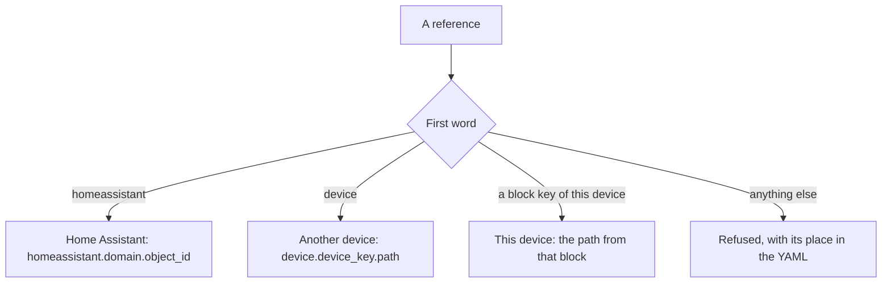
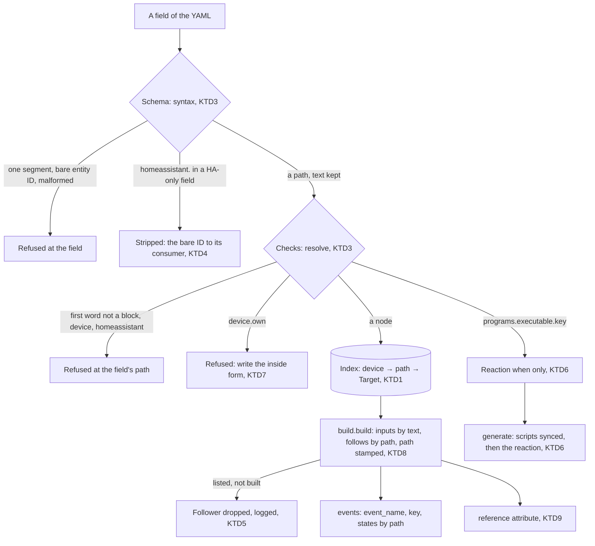

# YAML Path References - Plan

## Goal Capsule

- **Objective:** The author writes any reference in the `pururu:` YAML by reading only that YAML: what lives in another device or in Home Assistant says so, and any entity seen in Home Assistant shows how to write it.
- **Means:** paths born in the index beside today's qualified keys (KTD1, KTD2), one syntax validator and path-resolving checks (KTD3), `homeassistant.` stripped at the field for Home Assistant-only fields (KTD4), a stamped path per entity that events and a state attribute read (KTD8, KTD9), and a new tested Updating page in place of 0.2.1's (KTD10).
- **Product authority:** the author's decisions of 2026-10-01, from idea 1 of `docs/ideation/2026-10-01-references-ideation.html` and this brainstorm, recorded as Key Decisions; the R-IDs govern behaviour, the KTDs govern mechanism. The ideation's other ideas are not active scope, except the attribute taken from its idea 5.
- **Stop conditions:** stop and ask if a settled decision needs an entity ID, unique ID or generated ID to change (R16), if a path for a created entity can't be derived from where its key is born (KTD1) and would need a hand-written table, or if the recorder exclusion of the attribute can't be made without recording a base class's attributes (KTD9).
- **Execution profile:** one branch and one PR titled `pururu: references, the path in the YAML (0.2.2)`; the manifest is set to 0.2.2 in the last unit (KTD12). Each unit lands as one commit with `uv run pytest` green.
- **Open blockers:** none.

---

## Product Contract

Product Contract preservation: unchanged in meaning, R-IDs, AE-IDs and the Key Decisions' `session-settled:` annotations. One change, the author's: the Dependencies / Assumptions version line now says 0.2.2 (KTD12). Outstanding Questions resolved in place and removed: its three items deferred to planning are answered by KTD2 (the full table), KTD9 (the attribute) and KTD6 (`programs.executable.<key>` not generated or held).

### Summary

Every reference in the `pururu:` YAML becomes the dotted path through what the YAML declares, with `device.<device>.` in front for another device and `homeassistant.` in front for anything Home Assistant owns. A field that only takes one kind of thing keeps a bare key. Each entity pururu creates shows its own reference, and the author moves from 0.2.1 by hand, with a tested Updating page.

### Problem Frame

In 0.2.1 a reference is the end of the entity ID pururu creates: `appliance_running`, `clothes_washer.appliance_running`. To write one, the author has to know how pururu names the entity, including its namespace. The troubleshooting page has an entry just for that, at `docs/reference/troubleshooting.mdx:33`: "with its namespace (`appliance_power`, not `power`)". Entity keys also hold words the author never wrote: the `other:` phase, written directly under a program, makes keys that begin with `phase_other` (`docs/concepts/programs.mdx:185`). The same `_` joins words inside a name and the levels between names, so `appliance_cotton_phase_other_energy_month` only splits into appliance, program `cotton`, phase `other` and meter `energy_month` in the reader's head.

Nothing marks what is external, either. A Home Assistant entity is a bare entity ID in its own key (`entity:`, `power:`), and a reaction needs that separate key to listen to one.

There was no incident behind this: the author is improving the experience. The goal is that the `when` is ridiculously easy to write, and the strategy's "a short file a person or an agent can write, diff and review".

### Key Decisions

- **Anything Home Assistant owns carries `homeassistant.`, in every field.** Everything external is explicit, including fields that can only hold a Home Assistant entity. (session-settled: user-directed — chosen over a bare entity ID in Home Assistant-only fields: "tudo externo é explícito".) Governs R9, R10.
- **Another device is always `device.<device>.`.** The first word says whose it is, and a device key can never be read as a block key. (session-settled: user-directed — chosen over the device key with no prefix, `clothes_washer.appliance.running`: it ties dots to the device boundary and lets a device share a block's name.) Governs R7.
- **A device naming itself with `device.` is refused.** A device copied under another key keeps pointing at itself, never silently at the original. (session-settled: user-directed — chosen over accepting both forms, which 0.2.1 does: one way to write each thing from each place.) Governs R8.
- **A field that takes one kind of internal thing takes its bare key.** The field's name already says what it is. (session-settled: user-directed — chosen over the full path, `areas.despensa`, `programs.executable.blink`: no gain where nothing can be confused.) Governs R11.
- **A field that takes different internal things takes the full literal path from the block key.** The path says what the thing is and can't be ambiguous; it stays complete for now. (session-settled: user-directed — chosen over a bare local key such as `running`, the entity ID's namespace such as `switch.sprinkler`, a short form that skips structure words, and a path relative to where it is written: the first two are ambiguous or need the entity ID, the last two are deferred.) Governs R1, R2, R3.
- **What pururu creates without it being written sits under the node it is born under, and a declared thing's node is the thing.** The running program and a detected program take the same shape. (session-settled: user-directed — chosen over placing it at the feature block, `appliance.running`.) Governs R4, R5.
- **An executable program can be referenced, a reaction cannot.** Programs are chained by reactions on events, so a reaction must be able to hear "this program finished"; a reaction's own state only says whether it is enabled. (session-settled: user-approved — chosen over both and over neither: a program running is worth listening to, a reaction being enabled isn't.) Governs R6.
- **An event's name is its entity's reference from outside.** One name everywhere: what a bus event shows can be written in another device's YAML. (session-settled: user-directed — chosen over the same without `device.` and over keeping 0.2.1's `<device>.<key>`.) Governs R14. Call-out: because the name follows the YAML, a later schema move renames the events and `states` keys an outside consumer has already stored, with no error; the author accepted this.
- **Alert light groups stay under `config:`, members written in full.** The whole group reads in one place. (session-settled: user-directed — chosen over each light declaring its groups, kept as a later per-device override.) Governs R12.
- **Each entity shows its reference, shipped with the grammar.** Home Assistant keeps showing entity IDs in dashboards, history and the author's automations, and they stop saying what to write. (session-settled: user-directed — chosen over leaving the convention docs as the only way back from an entity to its reference.) Governs R15.
- **Moving from 0.2.1 works as moving to 0.2.1 did.** A tested Updating page and refusals with their place; no aliases, no migration code. (session-settled: user-approved — chosen over also teaching the new form in the error for an old one: less scope, and an existing precedent.) Governs R17, R18.
- **Entity IDs and unique IDs don't change.** Only what the author writes changes, so Home Assistant's history, statistics and dashboards are kept. Governs R16.
- **Each place keeps the reach it has in 0.2.1.** A device listens anywhere and acts only on itself (the coherence spec's D5). Governs R13.

### Requirements

**Paths in this device**

- R1. A reference to something of the same device is the dotted path through the device's YAML, starting at the block key the author wrote under the device, always written in full: `switches.sprinkler`, `appliance.running_program`.
- R2. Every level the author wrote is a segment of the path, structure words included: `appliance.programs.detected.cotton.other`.
- R3. A period listed under `statistics:` is the last segment of its meter's path: `statistics: energy: [month]` under `cotton: other:` is `appliance.programs.detected.cotton.other.statistics.energy.month`.
- R4. Something pururu creates without it being written is reached under the node it is born under, by the name the docs give it today: `appliance.running_program.last_cycle_end`, `appliance.running_program.phase_current`, `door.open`, `programs.executable.clean.cycles_total`, `reactions.washer_done.triggered_total`, `buttons.ler.triggered_total`.
- R5. The path of a switch, a light, a button, an alert, a program or a phase the author declared is that thing's own entity: `alerts.long_cycle`, `appliance.alerts.offline`, `appliance.running_program.phases.warming`, and `appliance.running_program` and `appliance.programs.detected.cotton`, each on while its program runs.
- R6. `programs.executable.<key>` is that program running, on or off, so a reaction can follow it; `reactions.<key>` is refused with an error that points to `reactions.<key>.triggered_total`.

**Other devices and Home Assistant**

- R7. A reference to another device is `device.<device>.<path>`, with the path as R1–R5 write it in that device.
- R8. Inside a device, `device.<its own key>.…` is refused with an error that names the form to write.
- R9. Anything Home Assistant owns is `homeassistant.<domain>.<object_id>` in every field that names it: `power`, `energy`, `contact`, the `entity` of switches, lights and buttons, door and window event entities, a reaction's source, and `notify` (`homeassistant.notify.mobile_app_phone`).
- R10. A reaction names a Home Assistant source in its `when` (`when: homeassistant.binary_sensor.porta_despensa`); a reaction has no separate `entity:` key.

**Fields that take one kind of thing, reach, groups**

- R11. A field that only accepts one kind of internal thing takes its bare key, and refuses a path: a device's `area`, an area's `floor`, a reaction's `then`, a button's `program`, an alert's `lights`.
- R12. Alert light groups stay under `config: alerts: lights: groups`, each member a light written as from another device (`default: [device.biblioteca.lights.teto]`).
- R13. Each field keeps its 0.2.1 reach: a hand-written alert's `when` and a program's steps name only their own device, while a reaction's `when` may name its own device, another device or Home Assistant.

**What Home Assistant shows**

- R14. A bus event's `event_name` is its entity's reference from another device, and its `key` and the keys of its `states` are the paths inside the device: `device.clothes_washer.appliance.running_program.last_cycle_end` and `appliance.running_program.last_cycle_end`.
- R15. Every entity pururu creates has an attribute with its reference in both forms, from inside its device and from another, and the attribute is not recorded in Home Assistant's history.
- R16. No entity ID, unique ID, or generated script or automation ID changes.

**Moving from 0.2.1**

- R17. A 0.2.1 reference is refused with its place in the YAML; there is no alias, no old form read as a new one, and no migration code.
- R18. A Guide page shows each change from 0.2.1 before and after, with a table from each 0.2.1 form to its path, and a test keeps every step valid and every old form refused, as `tests/test_updating.py` does for `docs/getting-started/updating-to-0.2.1.mdx`.
- R19. Every page that teaches or shows a reference teaches the path form, and each entity table gives the entity's path next to its entity ID.

How a reference is read, by its first word:

The cases, in 0.2.1 and after:

| Case | 0.2.1 | After |
|---|---|---|
| The washer's alert while it runs | `when: appliance_running` | `when: appliance.running_program` |
| The library's reaction to the washer running | `when: clothes_washer.appliance_running` | `when: device.clothes_washer.appliance.running_program` |
| The library's reaction to the pantry door | `entity: binary_sensor.porta_despensa` | `when: homeassistant.binary_sensor.porta_despensa` |
| A program step on the greenhouse sprinkler | `turn_on: switch_sprinkler` | `turn_on: switches.sprinkler` |
| Cotton's `other` phase energy this month | `when: appliance_cotton_phase_other_energy_month` | `when: appliance.programs.detected.cotton.other.statistics.energy.month` |
| The program a reaction starts | `then: blink` | `then: blink` |
| The washer's plug | `power: sensor.washer_plug_power` | `power: homeassistant.sensor.washer_plug_power` |
| Where messages go | `notify: notify.mobile_app_phone` | `notify: homeassistant.notify.mobile_app_phone` |
| A light group member | `default: [biblioteca.light_teto]` | `default: [device.biblioteca.lights.teto]` |
| An event's name | `clothes_washer.appliance_last_cycle_end` | `device.clothes_washer.appliance.running_program.last_cycle_end` |

### Acceptance Examples

- AE1. **Covers R1, R5.** **Given** device `clothes_washer` with an appliance, **when** its hand-written alert has `when: appliance.running_program`, **then** it watches `binary_sensor.pururu_clothes_washer_appliance_running`.
- AE2. **Covers R7, R8.** **Given** the same washer, **when** device `biblioteca` reacts with `when: device.clothes_washer.appliance.running_program`, **then** it listens to that same entity; **when** the washer's own alert writes `when: device.clothes_washer.appliance.running_program`, **then** setup refuses it, saying to write `appliance.running_program`.
- AE3. **Covers R9, R10, R17.** **When** a reaction has `when: homeassistant.binary_sensor.porta_despensa`, **then** it listens to that Home Assistant entity; **when** the YAML still has `entity: binary_sensor.porta_despensa` or `power: sensor.washer_plug_power`, **then** setup refuses each with its place.
- AE4. **Covers R6.** **When** a reaction has `when: programs.executable.clean`, `from: "on"`, `to: "off"`, **then** it fires when `clean` finishes; **when** it has `when: reactions.morning`, **then** setup refuses it, pointing to `reactions.morning.triggered_total`.
- AE5. **Covers R11, R13.** **When** a reaction has `then: programs.executable.blink`, **then** setup refuses it, naming `blink`; **when** an alert or a program step names `device.<another device>.…`, **then** setup refuses it, as in 0.2.1.
- AE6. **Covers R3, R4.** **Given** `cotton: other: statistics: energy: [month]`, **when** an alert has `when: appliance.programs.detected.cotton.other.statistics.energy.month`, **then** it watches `sensor.pururu_clothes_washer_appliance_cotton_phase_other_energy_month`.
- AE7. **Covers R14, R15.** **When** the washer's last cycle ends, **then** the bus event has `event_name` `device.clothes_washer.appliance.running_program.last_cycle_end` and `key` `appliance.running_program.last_cycle_end`, and that sensor's attribute shows both forms.
- AE8. **Covers R17.** **When** a 0.2.1 YAML with `when: appliance_running` is loaded, **then** setup refuses it with its place, and the Updating page's table gives `appliance.running_program`.

### Success Criteria

- The author moves their own house's YAML from 0.2.1 in one sitting with only the Updating page, and afterwards writes new references from the YAML and the docs, without looking up an entity ID.

### Scope Boundaries

**Deferred for later**

- A short form that skips structure words (`appliance.cotton.other.energy.month`).
- A path relative to where it is written (`running_program` inside `appliance:`).
- A light declaring or overriding its alert light groups from inside its device.
- The ideation's other ideas: watching and following Home Assistant entities (idea 2), reacting to a named happening (idea 3), errors that suggest the fix (idea 4), and idea 5's descriptions, logs, Repairs and round-trip test.

**Not changing**

- Entity IDs, unique IDs and generated IDs (R16), and the behavior of any feature: only how the YAML names things changes.

### Dependencies / Assumptions

- Builds on 0.2.1 (PR C, #63), which replaced 0.1's five reference forms with one; this replaces that form in turn.
- This is a breaking change shipped as 0.2.2 (KTD12).

### Sources / Research

- `docs/ideation/2026-10-01-references-ideation.html`: idea 1 and idea 5's attribute, with the review of 2026-10-01.
- `docs/superpowers/specs/2026-09-29-yaml-contract-coherence-design.md`: D7 (the form this replaces), C6 (the rejection of dots between namespace and key, overturned here), D5 (reach, kept).
- `docs/getting-started/updating-to-0.2.1.mdx` and `tests/test_updating.py`: the migration precedent R18 follows.
- `custom_components/pururu/core/resolve.py`: 0.2.1's reference validators (`reference`, `local_key`, `device_reference`) and `Ref.parse`.
- `custom_components/pururu/outputs/events.py`: `event_name`, `key` and `states` today.
- `custom_components/pururu/core/entity.py:97` (an entity's `reference`, `<device>.<key>`, read only by tests) and `custom_components/pururu/aspects/problem.py:137` (the alerts' `watches` attribute).
- `custom_components/pururu/aspects/programs.py:291` and `custom_components/pururu/device_keys/reactions.py:408`: executable programs and reactions add no entity key, so their scripts and automations are not reference targets today.
- Prior art: Bazel labels (`:t`, `//pkg:t`, `@repo//pkg:t`), Terraform references (managed resources bare, `data.` for what is read from outside), dbt `ref()` and `source()`: a bare local name, a qualified neighbour, a marked external owner.

---

## Planning Contract

### Key Technical Decisions

- KTD1. **Paths are born where keys are born: every row `setup/catalogue.keys()` yields carries the YAML path of its node, and the index is device → path → `Target` beside today's qualified key.** Six row sources exist (`entity_keys`, `Configured`, `Derived`, `Items`, aspect `Place.keys`, `Place.derived`; `custom_components/pururu/setup/catalogue.py:181-250`) and none records a path today, so each states it: fixed `entity_keys` declare a per-key node (the appliance's sit at two nodes, the block and `running_program`; the door's all at the block), the program schema helpers in `custom_components/pururu/features/cycle/program/schema.py` (`keys_of`, `phase_keys`, `detected_keys`) emit the path beside each key, `Items` gain an item path next to the slug (a program's `executable.<key>` beside `executable_<key>`), and an aspect `Place` emits its leaf sub-path (`alerts.<name>`, `statistics.<counter>.<period>`), never split on `_`. `Target` gains `path`; `Target.key` stays the qualified key, and IDs are built as today (R16). No hand-written table: a new device key gets paths by declaring its keys like the others. One mechanism survived research, so this is not a bake-off.
- KTD2. **The key → path table is computed from KTD1 and pinned, with the energy mirror at `appliance.energy`.** A written leaf setting's path is the entity derived from it, as `appliance.power` already is; `appliance.idle_energy_total` stays, it is born unwritten. (session-settled: user-approved — chosen over `appliance.energy_total`, the docs' name: the declared node is the thing.) This answers the first deferred question; the rows, with `<k>` a phase, `
` a detected program, `<s>` a cycle suffix (`last_cycle_*`, `cycles_total`, `runtime_total`, `energy_total`) and `<c>` a counter:

| Builder | Entity key | Path |
|---|---|---|
| appliance | `power`; `energy_total` | `appliance.power`; `appliance.energy` |
| | `idle_energy_total`; `idle_energy_<period>` | `appliance.idle_energy_total`; `appliance.statistics.idle_energy.<period>` |
| | `running` | `appliance.running_program` |
| | `last_cycle_*`, `cycles_total`, `runtime_total`, `phase_current`, `phase_last` | `appliance.running_program.<key>` |
| | `runtime_<period>`, `cycles_<period>` | `appliance.running_program.statistics.<c>.<period>` |
| | `phase_<k>[_<s>]`; `phase_other[_<s>]` | `appliance.running_program.phases.<k>[.<s>]`; `appliance.running_program.other[.<s>]` |
| | `phase_<k>_<c>_<period>`; `phase_other_<c>_<period>` | `….phases.<k>.statistics.<c>.<period>`; `….other.statistics.<c>.<period>` |
| | `alert_<name>` | `appliance.alerts.<name>` |
| | `
`, `
_<s>`, `
_phase_current`, `
_phase_last`, `
_phase_<k>[_<s>]`, `
_phase_other[_<s>]`, their meters | `appliance.programs.detected.
…`, the same shape as `running_program`'s |
| door, window | `open`, `last_opened`, `last_closed`, `last_open_duration`, `openings_total`, `open_time_total`, `last_opened_by`, `last_opened_via`, `last_direction`, `last_denied`, `last_ring` | `door.<key>` (`window.<key>`) |
| | `openings_<period>`, `open_time_<period>`; `alert_<name>` | `door.statistics.<c>.<period>`; `door.alerts.<name>` |
| switches, lights | `<key>` | `switches.<key>`; `lights.<key>` |
| buttons | `<key>`; `<key>_triggered_total`; `<key>_triggered_<period>` | `buttons.<key>`; `buttons.<key>.triggered_total`; `buttons.<key>.statistics.triggered.<period>` |
| programs | `executable_<key>_<s>`, `…_cycles_total`, `…_runtime_total`; meters | `programs.executable.<key>.<s>`; `programs.executable.<key>.statistics.<c>.<period>` (the script itself, `programs.executable.<key>`, is KTD6's) |
| reactions | `<key>_triggered_total`; meters | `reactions.<key>.triggered_total`; `reactions.<key>.statistics.triggered.<period>` |
| alerts | `<key>` | `alerts.<key>` |

- KTD3. **Syntax at the schema, resolution in checks that report the field's path; the validated block keeps the text as written and readers parse it.** One validator in `custom_components/pururu/core/resolve.py` replaces `reference`, `local_key` and `device_reference` for the multi-kind fields (alert `when`, steps, reaction `when`, group members): dot-separated slug segments, at least two, `homeassistant.` with exactly a domain and an object ID, `device.` with at least four segments; so every one-segment 0.2.1 key, a bare entity ID and a malformed path are refused at the field. `core/` may not import the builders (the layer table, `tests/test_code.py:120-146`), so the first word's membership (a block this device has, `device`, `homeassistant`) and the node's existence are decided by the checks, which now carry the field's path (`[devices, washer, alerts, stuck, when]`), not 0.2.1's block or item granularity. `Ref` becomes `(owner, device, path)` with the owner kind here / another device / Home Assistant, `Ref.parse` reads validated text, `Ref.text` keys `inputs`. Device-level non-builder words (`name.x`, `area.x`) and a block the device lacks are refused by the checks. `entity_id_hint` and `_DOMAINS` go: they tell 0.1 forms apart in 0.2.1 messages.
- KTD4. **Home Assistant-only fields require `homeassistant.` and hand consumers the bare entity ID or action; a reaction's `when` keeps its root.** `power`, `energy`, `contact`, the `entity` of switches, lights and buttons, door and window event entities, `notify` and `config: notify` strip the prefix at the field, so `Mirror`, `standing.members`, `events.Source`, `messages.actions` and the generated automations, scripts and Alert2 file are unchanged; refusal messages quote what the author wrote, prefix included. A reaction's `when` can't be stripped, as `binary_sensor.x` would read as a path from a block named `binary_sensor`: its validated value keeps `homeassistant.`, and `triggers()` receives the bare ID. The `entity:` key, its `SOURCES` entry and its place in `_consistent`'s message go (R10). In a reaction's `when`, a `homeassistant.` reference to what pururu creates or generates, matched against the IDs as pururu creates them (the index's entity IDs, the generated scripts' and automations' IDs), is refused with the form to write: a created entity points to its path, an executable program's script to its `programs.executable.<key>` path (KTD6), a reaction's automation to its `triggered_total` path (R6), and a ready-made notification's automation is refused as not referable. Any other `homeassistant.<domain>.pururu_…`, such as a user's own helper, is Home Assistant's and accepted, as 0.2.1's `entity:` accepts it. `power` and `energy` keep 0.2.1's acceptance of any entity. (session-settled: user-approved — chosen over accepting a pururu entity written as a Home Assistant one everywhere: it would be a second way to write one thing, skipping rename-following and R6's refusal.)
- KTD5. **A path to an entity the index lists but the settings don't build still resolves; what follows it isn't created, and the build logs it.** The index lists every counter × period and every ready-made alert whatever the settings (`statistics.ASPECT` mounts absent as `{}`; `Place.keys` at `custom_components/pururu/aspects/statistics.py:172-176`), so a meter whose period wasn't asked or an alert not enabled is `build.creatable`'s "watches …, which this device's settings don't create" case, as in 0.2.1. (session-settled: user-approved — chosen over refusing it at setup: not a configuration error, and turning the setting on later never breaks the alert.)
- KTD6. **`programs.executable.<key>` is accepted only in a reaction's `when`, own device or another's, and resolves through the generated scripts, not the index.** A script isn't a `Target` (`PROGRAMS.entity_keys={}`, and HA's `Platform` has no `script`), so `reactions._watched` takes the branch `_started` already has for `then` (`custom_components/pururu/device_keys/reactions.py:568-590`, `:521-524`): not in `generated_scripts` → the reaction isn't generated, logged; in `held_scripts` → held with it; otherwise the automation triggers on the script's current entity ID. The scripts sync before the reactions plan (`custom_components/pururu/setup/generate.py:64-79`), so both sets are known. An alert's `when` or a program step naming it is refused by its check: an alert follows created entities, a step needs `Actions`. (session-settled: user-approved — chosen over a `Target` for scripts: no platform to hold one, and "a program running is followed by a reaction's when".)
- KTD7. **A device naming itself with `device.` is refused in a check with the inside form in the message; single-kind fields refuse a dotted value with a message naming the bare key.** R8's check runs where the reference is resolved and says `write appliance.running_program`. R11's five fields (`area`, `floor`, `then`, `program`, alert `lights`) share one validator in `core/resolve.py` worded as AE5 (`then is its program's key alone: blink`), replacing `cv.slug`'s `try areas_despensa`, a wrong hint. In light groups R8 can't apply: `device.` is required (R12), a bare path is refused with "names its device". `then: device.<own>.…` gets R11's message, since `then` never takes a path.
- KTD8. **Entities carry their path, stamped in `build.build` from the index; events read it.** All 288 created entities of `tests/fixtures/house.yaml` have their key in `index[device]`, so `build.build` sets `PururuEntity.path` from `found` after building, and none of the ~30 constructors or `_identify` changes. `outputs/events.py`'s `watched()` maps entity ID → path instead of key: `event_name` is `device.<device>.<path>`, `key` and the `states` keys are the path (R14). The key still comes from the device that built the entity, never from parsing its ID.
- KTD9. **One state attribute, `reference`, on every pururu entity, `{"inside": <path>, "outside": "device.<device>.<path>"}`, through `capability_attributes` merged at `PururuEntity`, excluded from the recorder by a union over the MRO.** HA writes capability attributes whatever the entity's availability, while it leaves `extra_state_attributes` out of an unavailable entity (`.venv/lib/python3.14/site-packages/homeassistant/helpers/entity.py:1109-1124`), and the reference is most needed then, to write an alert on an offline plug. (session-settled: user-approved — chosen over `extra_state_attributes`, shown only while the entity is available: the reference is most needed when it isn't.) HA also writes capability attributes to the entity's registry entry; the value is static, and a change to it reloads nothing, since `setup/listener.py`'s `rebuild_for` reacts only to a rename or `disabled_by`. `PururuEntity.capability_attributes` merges the attribute over `super()`'s, so `SensorEntity`'s `state_class` or `options` and `LightEntity`'s color modes stay (`.venv/lib/python3.14/site-packages/homeassistant/components/sensor/__init__.py:376-386` overrides the base the same way). Recorder: HA's `Entity.__init_subclass__` sets the recorder's set to `_entity_component_unrecorded_attributes | _unrecorded_attributes` of the class (`entity.py:596-602`), and `PururuEntity` sits before `GroupEntity` (`entity_id`, `group_entities`) and `UtilityMeterSensor` (`next_reset`) in `Mirror`, `Switch`, `Light`, `SwitchLight` and `Meter`'s MRO, so a plain set on `PururuEntity` would shadow theirs and start recording them. `PururuEntity.__init_subclass__` builds the union over `cls.__mro__` before calling `super().__init_subclass__()`, with its own recorder test. The Python attribute `PururuEntity.reference` (`<device>.<qualified key>`, read only by `tests/test_entity.py:52-58`) is replaced by `PururuEntity.path`.
- KTD10. **The new Updating page replaces 0.2.1's, grows with the units, and its test retargets.** Once U2 refuses 0.2.1 forms, `tests/test_updating.py`'s `test_the_whole_example_sets_up` fails for `docs/getting-started/updating-to-0.2.1.mdx` by construction, so U2 deletes that page, creates `docs/getting-started/updating-to-0.2.2.mdx` with the steps for what U2 refuses, and rewrites the test's harness for it (`BEFORE = "0.2.1"`, `AFTER = "0.2.2"`, the whole before asserted refused, `OLDS` ids ending `as before 0.2.2`); U3, U4 and U5 add their steps and `OLDS`, U6 finishes the page. Only the sidebar entry (`docs.json:19`) moves to it. The troubleshooting entry for 0.1's `modes:` and `phases:` (`docs/reference/troubleshooting.mdx:22`) points at the `v0.2.1` tag's copy of the 0.2.1 page, and `README.md:11` and `docs/getting-started/install.mdx:37` send a 0.2.1 user to the new page and a 0.1.23 or 0.2.0 user first to that tag's page, then to the new one. (session-settled: user-approved — chosen over keeping both pages, which has no precedent and leaves a test that can't pass.)
- KTD11. **`tests/fixtures/house.yaml` is rewritten to the new grammar while `tests/fixtures/house_ids.json` stays byte-identical, the R16 proof; the contract test gains a paths rule and a pinned key → path fixture.** `PURURU_UPDATE_IDS=1` is never run. In `tests/test_features.py`, over `FEATURES | DEVICE_KEYS` with `full()`: every key `catalogue.keys` lists has exactly one path, the paths of one device are distinct, no generated child equals a written key at its node, and every built entity's stamped path resolves back to its key. `tests/fixtures/house_paths.json` pins unique ID → inside path for the house, with `house_ids.json`'s rule: only additions may update it. Tests that reuse one constant as both the YAML value and the faked entity ID (`POWER`, `DOOR` in `tests/test_reactions.py:24-25`) get two constants.
- KTD12. **The manifest is set to 0.2.2, in the last unit.** (session-settled: user-directed — chosen over 0.3.0, the next minor: the author's choice for this release.) `python3 release.py check` passes at every commit: 0.2.1 until U6, 0.2.2 from it; before merging, check `main` and the releases so no other PR sets the same number.

### High-Level Technical Design

A reference crosses five stages; today three of them index by qualified key (`build.build`'s `found[reference]`, `programs._acted_on`'s `found[key]`, `alert_lights.light_ids`), and with paths they index by path.

Where each row of the index is born, and what it must say (KTD1):

| Row source | Code | Knows the path today | What it states |
|---|---|---|---|
| `feature.entity_keys` | `setup/catalogue.py:194-197` | No | A per-key node: the appliance's at the block or `running_program` |
| `Configured` | `setup/catalogue.py:198-202` | Yes, `(key,)` | Nothing new |
| `Derived` | `setup/catalogue.py:203-207`, `program.keys_of` | No | `running_program.phases.<k>…`, `.other…`, `.phase_current`, from the schema helpers |
| `Items` | `setup/catalogue.py:208-213`, `core/feature.py:90-99` | No | An item path beside the slug: `executable.<key>`, `<key>` |
| `Place.keys` | `setup/catalogue.py:217-245`, `walk` | The container, not the leaf | The leaf sub-path: `alerts.<name>`, `statistics.<c>.<period>` |
| `Place.derived` | `setup/catalogue.py:246-250`, `program.detected_keys` | No | `programs.detected.
…` from the schema helpers |

### Implementation Constraints

- `core/` imports only `core/` and `const`; the builders' keys stay out of `core/resolve.py` (KTD3).
- `Device.object_id`, `qualified` and every ID construction are untouched; `tests/fixtures/house_ids.json` is the proof (KTD11).
- The press guards of `features/buttons.py` (`pressed`, `SETTLE`) and the dispatcher signal keyed by `device.object_id(item.key("pressed"))` are untouched: a button's `entity` changes form, its press doesn't.
- Every refusal text that names a form that stops existing (`entity key`, `<device>.<key>`, `entity:`, `<device>.light_<key>`) is rewritten, and every quote of it in `docs/reference/troubleshooting.mdx`, the Updating page and the tests changes in the same unit.
- A step's `Actions` check and the alerts' "can't watch another" rule keep their filters over `Target.by`, `builder`, `item` and `actions`.
- Docs: `{` and `<` outside code are JSX, so `device.<device>.<path>` in prose stays in backticks.

### Assumptions

- A device may be keyed `device` or `homeassistant` (`cv.slug`); harmless, since inside a device the first word is a block, and `device.device.…` reads as that device. Not reserved.
- An old form that lands on a valid new path needs a device keyed like a plural block (`switches`) and a key carrying its namespace (`switch_sprinkler`); accepted and pinned by one test, not prevented.
- A reaction whose `when` and `then` are the same program loops through its own end; already possible through `last_cycle_end`, documented, not refused.
- The six tests that execute a page's YAML (`tests/test_alert_lights.py`, `test_alert2.py`, `test_notifications.py`, `test_presets.py`, `test_opening.py`, `test_events.py`) break first when a page lags the grammar; the unit that changes a field's form rewrites the pages those tests read.

### Risks & Dependencies

- **Recording the bases' attributes silently** (KTD9): history grows with `entity_id`, `group_entities`, `next_reset`, no error. Mitigation: the recorder test asserts the new attribute is dropped and those still are.
- **A registry change reloading the entry** (KTD9): the attribute lives in the registry entry's capabilities. Mitigation: a listener test that a capabilities change alone doesn't reload.
- **The 0.2.1 page's test turning red mid-PR** (KTD10): handled by replacing page and test in U2.
- **Dotted `states` keys in templates and receivers** (R14): `trigger.event.data.states.appliance_running` silently yields undefined, and a receiver that expands dots into nested objects fails, since one entity's path can be the prefix of another's (`appliance.running_program` holds `on`, `appliance.running_program.last_cycle_end` needs it as an object). Mitigation: the events page and the Updating page show bracket access and say the keys are flat strings a receiver must never expand.
- **Two PRs bumping to one version** (KTD12): check `main` and the releases before merging.

### System-Wide Impact

- Every YAML field that names something changes form; generated files don't, except that a reaction's trigger and a notify action receive the bare value (KTD4).
- The bus events' `event_name`, `key` and `states` keys change for every event (R14); a consumer of them updates once, with the Updating page's step.
- Every entity gains a state attribute, also kept in its registry entry and dropped by the recorder (R15). The bus events leave it out of their copied `attributes` (`outputs/events.py:132`), since `event_name` and `key` carry both forms; `tests/test_events.py:116-120` pins that dict unchanged.
- Refusal texts the troubleshooting page quotes change throughout.

### Alternatives Considered

- A second, hand-written key → path table per feature: rejected, it drifts from `catalogue.keys` (D3 ruling 11's lesson); paths come from the same enumeration (KTD1).
- `extra_state_attributes` for the attribute: rejected by the author, HA leaves it out while the entity is unavailable, exactly when the reference is wanted (KTD9).
- A `Target` for scripts: rejected, `Platform` has no `script` and `Target.current_entity_id` looks pururu's platforms up (KTD6).
- Refusing an unasked meter's path at setup: rejected, it changes a tested 0.2.1 behaviour and needs the index to know the settings (KTD5).

### Scope Boundaries

**Deferred to follow-up work**

- The ideation's ideas 2–4 and idea 5's other parts; the short form; relative paths; a light-group override in a device (the Product Contract's list).
- The reference in a generated script's or automation's `description`: scripts are reference targets (R6) but carry no attribute; left as is.
- `checks.keys_distinct`'s message, which speaks unique IDs (`would be two entities`); giving both colliding paths is a later nicety.

**Considered and not built**

- Errors that translate each 0.2.1 form into its path: the author chose 0.2.1-style refusals with their place; the Updating page's table is the translation.

### Sequencing

U1 (paths, additive) → U2 (the grammar, the page and its test replaced) → U3 (Home Assistant fields) → U4 (executable programs as a source) → U5 (the attribute and events) → U6 (docs, the page finished, CLAUDE.md, CONCEPTS.md, 0.2.2). Each keeps `uv run pytest` green.

---

## Implementation Units

### U1. Paths in the index

**Goal:** every row `catalogue.keys` yields carries its YAML path, the index is device → path → `Target` beside the qualified key, and nothing the user writes changes yet.

**Requirements:** R1–R5 (the paths), R16; KTD1, KTD2, KTD11 (the contract rule and the pinned fixture).

**Dependencies:** none.

**Files:**
- `custom_components/pururu/core/feature.py` (`Item` gains `path`; `Place` gains the leaf sub-path per key)
- `custom_components/pururu/core/roles.py` (`Items`, `Derived`, and the per-key node of `entity_keys`)
- `custom_components/pururu/core/resolve.py` (`Target.path`, `Index` by path, `find` by path)
- `custom_components/pururu/setup/catalogue.py`
- `custom_components/pururu/features/cycle/program/schema.py`
- `custom_components/pururu/features/appliance/__init__.py`
- `custom_components/pururu/features/opening/__init__.py`, `custom_components/pururu/features/opening/events.py`
- `custom_components/pururu/features/buttons.py`, `custom_components/pururu/aspects/programs.py`, `custom_components/pururu/device_keys/reactions.py` (item paths)
- `custom_components/pururu/aspects/alerts.py`, `custom_components/pururu/aspects/statistics.py` (place sub-paths)
- `custom_components/pururu/setup/build.py`, `custom_components/pururu/outputs/alert_lights.py` (lookups by path, keyed from today's text through a temporary key → path bridge removed in U2)
- `tests/test_resolve.py`, `tests/test_catalogue.py`, `tests/test_features.py`, `tests/fixtures/house_paths.json` (new)

**Approach:**
1. Add the path beside the key at each of the six row sources (KTD1), emitting it from the program schema helpers for phases and detected programs so the flat-key rules and the path rules stay in one module; `keys()` yields the path as a sixth field.
2. `targets()` keys `found` by path and sets `Target.path`; `find` reads by path; the readers that index by qualified key get a bridge from `Target.key` until U2 switches them.
3. Add the contract rule and the pinned `house_paths.json` (KTD11).

**Patterns to follow:** `Place.derived` as pairs, not a map (`custom_components/pururu/aspects/programs.py:454-461`); `test_a_derived_key_is_in_the_index` (`tests/test_features.py:253-269`); `tests/test_ids.py` for the pin.

**Test scenarios:**
- For every builder's `full()` example, each listed key has exactly one path and the paths are distinct; a key listed twice (a detected program keyed as a sibling creates) comes twice, as today.
- The house fixture's unique ID → path map equals `tests/fixtures/house_paths.json`, with `appliance.energy` for `energy_total` and `appliance.idle_energy_total` for the idle total.
- `find(index, "clothes_washer", Ref(…, "appliance.running_program"))` gives the target whose `unique_id` is `pururu_clothes_washer_appliance_running`.
- `appliance.running_program.phase_current` is absent from the index of an appliance without phases, as `appliance_phase_current` is today.
- Every meter path exists whatever the periods asked (KTD5), as `appliance_runtime_today` does today.
- `tests/fixtures/house_ids.json` is unchanged.

**Verification:** `tests/test_resolve.py`, `tests/test_catalogue.py`, `tests/test_features.py`, `tests/test_ids.py` pass; `house_ids.json` has no diff.

### U2. The grammar: paths, `device.`, the checks, the Updating page replaced

**Goal:** every multi-kind field takes a path, `device.<device>.` names another device, the five single-kind fields refuse a path, every 0.2.1 internal form is refused at its field, and the Updating page and its test are the new version's.

**Requirements:** R1–R5, R7, R8, R11, R12, R13, R17, R18 (the harness); AE1, AE2, AE5 (the `then` and reach cases), AE6, AE8; KTD3, KTD5, KTD7, KTD10, KTD11.

**Dependencies:** U1.

**Files:**
- `custom_components/pururu/core/resolve.py` (the path validator, the bare-key validator, `Ref` with owner kind; `entity_id_hint` and `_DOMAINS` removed)
- `custom_components/pururu/setup/checks.py`, `custom_components/pururu/aspects/alerts.py`, `custom_components/pururu/aspects/problem.py`, `custom_components/pururu/aspects/programs.py`, `custom_components/pururu/device_keys/reactions.py`, `custom_components/pururu/features/buttons.py`, `custom_components/pururu/outputs/alert_lights.py`, `custom_components/pururu/outputs/places.py`, `custom_components/pururu/setup/schema.py`
- `custom_components/pururu/setup/build.py` (`follows` by path; the U1 bridge removed)
- `custom_components/pururu/features/switches.py`, `features/lights.py`, `features/appliance/__init__.py`, `features/opening/__init__.py` (examples with paths where they refer)
- `tests/fixtures/house.yaml` (internal references only), `tests/test_resolve.py`, `tests/test_checks.py`, `tests/test_reactions.py`, `tests/test_alerts.py`, `tests/test_programs.py`, `tests/test_alert_lights.py`, `tests/test_buttons.py`, `tests/test_presets.py`, `tests/test_detected_programs.py`, `tests/test_program_entities.py`, `tests/test_statistics.py`, `tests/test_init.py`, `tests/test_updating.py`
- `docs/getting-started/updating-to-0.2.2.mdx` (new, the steps this unit refuses), `docs/getting-started/updating-to-0.2.1.mdx` (deleted), and the page YAML the six page tests execute (`docs/concepts/alert-lights.mdx`, `docs/concepts/alerts.mdx`, `docs/features/appliance.mdx`, `docs/features/door.mdx`, `docs/concepts/notifications.mdx`, `docs/concepts/events.mdx`)

**Approach:**
1. Write the path validator and the bare-key validator in `core/resolve.py` (KTD3, KTD7); wire the path one into alert `when`, steps, reaction `when` and group members, the bare one into `area`, `floor`, `then`, `program`, alert `lights`.
2. Rewrite each check to parse the text, resolve by path through `find`, refuse an unknown first word, a block the device lacks, a non-entity node, `device.<own>` (R8), `reactions.<key>` (R6's refusal, with the `triggered_total` path), and the reach rules, each with the field's path.
3. Switch `build.build`, `programs._acted_on`, `alert_lights.light_ids` and `reactions._watched` to path lookups; `follows` holds paths.
4. Rewrite every internal reference in the tests, fixtures and examples; split the constants that double as faked IDs (KTD11).
5. Replace the Updating page and retarget `tests/test_updating.py` (KTD10), with one `OLDS` case per form this unit refuses: a local key, `<device>.<key>`, a 0.2.1 group member, `device.<own>`, a dotted `then`.

**Patterns to follow:** `tests/test_resolve.py:135-166` (accepted and refused lists with ids); `tests/test_checks.py:22` (`test_a_check_says_where`, message and path); `tests/test_reactions.py:78-80` (the `as before` id convention); PR C's `OLDS` harness (`tests/test_updating.py:139-229`).

**Test scenarios:**
- Covers AE1. `alerts: stuck: when: appliance.running_program` on `clothes_washer` watches `binary_sensor.pururu_clothes_washer_appliance_running`.
- Covers AE2. `biblioteca`'s reaction `when: device.clothes_washer.appliance.running_program` listens to that entity; the washer's own alert with `when: device.clothes_washer.appliance.running_program` is refused at `…->alerts->stuck->when` saying to write `appliance.running_program`.
- Covers AE6. With `cotton: other: statistics: energy: [month]`, `when: appliance.programs.detected.cotton.other.statistics.energy.month` watches `sensor.pururu_clothes_washer_appliance_cotton_phase_other_energy_month`.
- Covers AE8. `when: appliance_running` is refused at `…->alerts->stuck->when`, and the page's table maps it to `appliance.running_program`.
- Covers AE5. `then: programs.executable.blink` is refused naming `blink`; an alert's `when: device.biblioteca.lights.teto` and a step `turn_on: device.greenhouse.switches.sprinkler` are refused as outside their reach.
- `when: clothes_washer.appliance_running` (0.2.1, another device) is refused at the field as an unknown first word; `when: name.x` and `when: door.open` on a device without `door` likewise.
- A path to a setting or container (`appliance.running_program.above`, `appliance.programs.detected`, `switches.sprinkler.entity`) is refused as not an entity.
- `when: appliance.running_program.statistics.runtime.month` with no `month` asked sets up; the alert is dropped with the "settings don't create" log (KTD5).
- `area: areas.despensa`, `floor: floors.terreo`, `program: programs.executable.clean`, `lights: groups.default` are each refused naming the bare key.
- Group `default: [device.biblioteca.lights.teto]` lends the light; `[lights.teto]`, `[biblioteca.light_teto]` and `[homeassistant.light.x]` are refused at the member's index; `[device.greenhouse.switches.sprinkler]` is "not a light".
- A step `turn_on: switches.sprinkler` acts on the switch; `turn_on: appliance.power` is refused as not taking the action.
- The new page's steps pair as 0.2.1 then 0.2.2, each within its whole example; the whole after sets up; the whole before is refused; each `OLDS` form is refused at its place with the quote the page carries.
- `house_ids.json` unchanged after `house.yaml`'s internal references are rewritten.

**Verification:** the files above pass with `-n 0`; `uv run pytest` green; `house_ids.json` has no diff; no test id still reads `as before 0.2.1`.

### U3. Home Assistant fields with `homeassistant.`

**Goal:** everything Home Assistant owns is written `homeassistant.<domain>.<object_id>` and reaches its consumer bare; a reaction's source is its `when`.

**Requirements:** R9, R10, R17; AE3; KTD4.

**Dependencies:** U2.

**Files:**
- `custom_components/pururu/core/resolve.py` (the `homeassistant.` validator, by domains), `custom_components/pururu/features/standing.py`, `custom_components/pururu/core/messages.py`
- `custom_components/pururu/features/appliance/__init__.py`, `features/opening/__init__.py`, `features/opening/events.py`, `features/buttons.py`, `features/switches.py`, `features/lights.py` (schemas and examples)
- `custom_components/pururu/device_keys/reactions.py` (`entity:` removed, `SOURCES`, `_consistent`, `_watched`, `triggers`), `custom_components/pururu/aspects/notifications.py`, `custom_components/pururu/setup/schema.py` (`config: notify`), `custom_components/pururu/setup/checks.py` (`real_entities_distinct`'s quote), `docs/reference/troubleshooting.mdx` (the two quotes)
- `tests/fixtures/house.yaml`, every test with a bare `entity`, `power`, `energy`, `contact`, `notify` or reaction `entity:` (`tests/test_reactions.py`, `test_appliance.py`, `test_opening.py`, `test_buttons.py`, `test_switches.py`, `test_lights.py`, `test_notifications.py`, `test_messages.py`, `test_alert2.py`, `test_presets.py`, `test_events.py`, `test_checks.py`, `test_features.py`, `test_init.py`, `test_ids.py`), `tests/test_updating.py`
- `docs/getting-started/updating-to-0.2.2.mdx`, and the page YAML the six page tests execute

**Approach:**
1. One validator `homeassistant_entity(*domains)` in `core/resolve.py` that requires the prefix, checks the domain, keeps `standing.real_entity`'s refusal of `pururu_` object IDs, and returns the bare ID; `messages.ACTION` likewise for `notify`.
2. A reaction's `when` keeps the root; `_watched` returns the bare ID for a Home Assistant owner; a `homeassistant.` reference to what pururu creates or generates refused in the check with the form to write (KTD4); `entity:` and its hint go.
3. The whole-house checks see the stripped value, so `checks.real_entities_distinct` and `buttons.check` add `homeassistant.` back when they quote it (KTD4); their quotes in `docs/reference/troubleshooting.mdx` change with them.
4. Rewrite fixtures, tests, examples and the page; add the `OLDS` cases: a bare `power`, `contact`, `entity`, `notify`, a reaction's `entity:`.

**Patterns to follow:** `standing.real_entity` (`custom_components/pururu/features/standing.py:20-36`); `test_a_reference_is_refused` ids.

**Test scenarios:**
- Covers AE3. `when: homeassistant.binary_sensor.porta_despensa` writes a trigger on `binary_sensor.porta_despensa`; `entity: binary_sensor.porta_despensa` is refused as an invalid option at `…->reactions->it->entity`; `power: sensor.washer_plug_power` is refused at `…->appliance->power` with a message quoting it.
- `power: homeassistant.sensor.washer_plug_power` mirrors `sensor.washer_plug_power`; `contact: homeassistant.binary_sensor.porta_frente` follows it; a button's `entity: homeassistant.sensor.greenhouse_remote_action` presses on its value.
- `contact: homeassistant.sensor.x` is refused as not a binary_sensor; `entity: homeassistant.switch.pururu_greenhouse_switch_sprinkler` on a switch is refused as a pururu switch, quoting the prefixed text.
- `notify: homeassistant.notify.mobile_app_phone` tells `notify.mobile_app_phone`; `notify: notify.mobile_app_phone` is refused.
- A reaction `when: homeassistant.binary_sensor.pururu_clothes_washer_appliance_running` is refused, pointing to `device.clothes_washer.appliance.running_program`; `power: homeassistant.sensor.pururu_…` still sets up.
- In `biblioteca`, `when: homeassistant.script.pururu_greenhouse_program_executable_clean` is refused pointing to `device.greenhouse.programs.executable.clean`, and `when: homeassistant.automation.pururu_greenhouse_reaction_morning` pointing to `device.greenhouse.reactions.morning.triggered_total`.
- A reaction `when: homeassistant.input_boolean.pururu_guest`, a helper the user made, sets up and triggers on `input_boolean.pururu_guest`.
- A reaction with no source is refused with a message that no longer names `entity`.
- `switches: homeassistant.switch.sonoff_abajur is already in lights` refuses, quoting what the author wrote, and a second button on one sensor and value is refused as `homeassistant.sensor.controle_biblioteca_action at 1_single is already button ler`.
- `house_ids.json` unchanged.

**Verification:** the files above pass; `uv run pytest` green; the generated automations, scripts and Alert2 file in the tests carry no `homeassistant.`.

### U4. An executable program as a reaction's source

**Goal:** a reaction follows `programs.executable.<key>`, own or another device's, as it follows its `then`'s script; alerts and steps refuse it.

**Requirements:** R6, R13; AE4; KTD6.

**Dependencies:** U2, U3 (both rewrite `reactions._watched`).

**Files:**
- `custom_components/pururu/device_keys/reactions.py` (`check`, `_watched`, `plan`)
- `custom_components/pururu/aspects/alerts.py`, `custom_components/pururu/aspects/programs.py` (the refusals)
- `tests/test_reactions.py`, `tests/test_alerts.py`, `tests/test_programs.py`, `tests/test_checks.py`, `tests/test_updating.py`, `docs/getting-started/updating-to-0.2.2.mdx`

**Approach:**
1. In `reactions.check`, accept a path whose node is `programs.executable.<key>` of the named device when that program exists; refuse `reactions.<key>` with the `triggered_total` path (R6).
2. In `plan`, resolve it through `generated_scripts` and `held_scripts` as `_started` does; the automation triggers on the script's current entity ID.
3. Refuse it in `alerts.check` and `programs.check` with a message saying a running program is followed by a reaction's `when`.

**Patterns to follow:** `_started` (`custom_components/pururu/device_keys/reactions.py:568-590`); held reactions (`:521-524`); `tests/test_reactions.py`'s held and dropped program tests.

**Test scenarios:**
- Covers AE4. `when: programs.executable.clean`, `from: "on"`, `to: "off"` fires when `clean`'s script turns off; `when: reactions.morning` is refused pointing to `reactions.morning.triggered_total`.
- `when: device.greenhouse.programs.executable.clean` from `biblioteca` fires the same way; `device.greenhouse.reactions.morning` is refused the same way.
- The script not generated (its switch's ID taken): the reaction isn't generated, logged `follows script.…, which is not generated`.
- The script held (the switch disabled): the reaction is held, its registry entry kept, and comes back when the switch is enabled.
- The script renamed in the UI: the entry reloads and the automation triggers on the new ID.
- An alert `when: programs.executable.clean` and a step `turn_on: programs.executable.clean` are each refused with the reaction-only message.
- `when: programs.executable.clean` with `then: clean` sets up.

**Verification:** `tests/test_reactions.py`, `tests/test_alerts.py`, `tests/test_programs.py`, `tests/test_checks.py` pass; `uv run pytest` green.

### U5. The reference attribute and the events

**Goal:** every created entity carries `reference` with both forms, unrecorded, and the bus events name entities by path.

**Requirements:** R14, R15; AE7; KTD8, KTD9.

**Dependencies:** U1, U2 (the Updating page and its harness).

**Files:**
- `custom_components/pururu/core/entity.py` (`path`, `__init_subclass__`, `capability_attributes`)
- `custom_components/pururu/setup/build.py` (stamping)
- `custom_components/pururu/outputs/events.py`
- `tests/test_entity.py`, `tests/test_events.py`, `tests/test_features.py` (every built entity carries it), `tests/test_recorder.py` (new), `tests/test_updating.py`, `docs/getting-started/updating-to-0.2.2.mdx` (the outside-consumer step)

**Approach:**
1. `build.build` sets `entity.path` from `found[...]` after building (KTD8); `PururuEntity.reference` goes and `tests/test_entity.py` reads `path`.
2. `PururuEntity.capability_attributes` merges `{"reference": {"inside", "outside"}}` over `super()`'s (KTD9).
3. `PururuEntity.__init_subclass__` unions `_unrecorded_attributes` over the MRO with `reference`, before `super().__init_subclass__()`.
4. `events.watched()` maps entity ID → path; `_data` builds `event_name`, `key` and `states` from it, and leaves `reference` out of the copied `attributes`.

**Patterns to follow:** `SensorEntity.capability_attributes` overriding the base's (`.venv/lib/python3.14/site-packages/homeassistant/components/sensor/__init__.py:376-386`); `tests/test_events.py:95-123` and `:278-303`.

**Test scenarios:**
- Covers AE7. At the washer's cycle end, the event has `event_name` `device.clothes_washer.appliance.running_program.last_cycle_end`, `key` `appliance.running_program.last_cycle_end`, and `states["appliance.running_program.last_cycle_end"]` equals `new`; the sensor's `reference` attribute is `{"inside": "appliance.running_program.last_cycle_end", "outside": "device.clothes_washer.appliance.running_program.last_cycle_end"}`.
- Every entity built from every builder's full example has the attribute with its stamped path, on every platform (sensor, binary sensor, switch, light, button), and the path resolves back to its key (KTD11's rule).
- The recorder drops `reference` on a `Mirror`, a `Switch`, a `Light`, a `SwitchLight` and a `Meter`, and still drops `entity_id`, `group_entities` and `next_reset` on them.
- A `Mirror` whose plug is unavailable still shows `reference`; a light keeps its color-mode capability attributes beside it, and a sensor its `state_class`.
- A change of the attribute's value in the registry entry alone doesn't reload the entry.
- Devices sharing a prefix (`greenhouse`, `greenhouse_sprinkler`) each name their own path.
- The event's `attributes` leaves `reference` out, and the pinned dict in `test_a_change` is unchanged.
- `house_ids.json` unchanged.

**Verification:** `tests/test_entity.py`, `tests/test_events.py`, `tests/test_features.py`, `tests/test_recorder.py` pass; `uv run pytest` green.

### U6. Docs, the Updating page finished, CLAUDE.md, CONCEPTS.md, 0.2.2

**Goal:** every page teaches the path form with a path beside each entity ID, the Updating page is complete and linked, the checked-in instructions are true, and the manifest says 0.2.2.

**Requirements:** R18, R19; KTD10, KTD12.

**Dependencies:** U2–U5.

**Files:**
- `docs/getting-started/updating-to-0.2.2.mdx` (the whole examples, the table of every 0.2.1 form, the outside-consumer step with bracket access and flat keys, nothing starts over), `docs.json`, `README.md`, `docs/getting-started/install.mdx`, `docs/reference/troubleshooting.mdx`
- `docs/reference/configuration.mdx`, `docs/concepts/reactions.mdx`, `docs/concepts/alerts.mdx`, `docs/concepts/alert-lights.mdx`, `docs/concepts/programs.mdx`, `docs/concepts/events.mdx`, `docs/concepts/entity-ids.mdx` (the path convention and the attribute), `docs/concepts/statistics.mdx`, `docs/concepts/notifications.mdx`, `docs/concepts/floors-and-areas.mdx`, `docs/concepts/devices-and-features.mdx`, `docs/getting-started/first-device.mdx`, `docs/index.mdx`
- `docs/features/appliance.mdx`, `door.mdx`, `window.mdx`, `lights.mdx`, `switches.mdx`, `buttons.mdx` (a path column in each entity table; `homeassistant.` in examples)
- `docs/develop/architecture.mdx`, `docs/develop/writing-a-feature.mdx`, `docs/develop/testing.mdx`
- `CLAUDE.md` (the `Refers`/`inputs`, Events and `PururuEntity` statements), `CONCEPTS.md` (Reference, path, inside and outside form, told apart from entity key)
- `custom_components/pururu/manifest.json`, `tests/test_updating.py`

**Approach:**
1. Finish the page: both whole examples, the form table, the steps' order from PR C's page (download, don't restart, rewrite, restart, check configuration, then what refers outside pururu).
2. Sweep every page in the Files list for grammar statements, entity tables and Home Assistant examples; rewrite every quoted refusal in `troubleshooting.mdx`.
3. Update the develop pages, `CLAUDE.md` and `CONCEPTS.md`; set the manifest to 0.2.2.

**Patterns to follow:** `docs/getting-started/updating-to-0.2.1.mdx`'s structure (from the `v0.2.1` tag); the 0.1.5 doc-update list (`docs/superpowers/specs/2026-09-27-entity-namespaces-design.md`).

**Test scenarios:**
- Covers AE8. The page's table row for `when: appliance_running` gives `appliance.running_program`, and the test's `OLDS` case quotes the page.
- `test_the_whole_example_sets_up` sets the 0.2.2 whole example up; the 0.2.1 whole example is refused.
- No published page still contains a bare 0.2.1 form: `appliance_running`, `<device>.<key>`, `entity:` on a reaction, a bare entity ID in `power`, `contact`, `entity`, `notify`, or `.light_` in a group.

**Verification:** `uv run pytest tests/test_updating.py -n 0 -q` passes; `python3 release.py check` passes with 0.2.2; `pnpm install` then `pnpm docs:check` passes; the sidebar points at the new page, and the troubleshooting entry, the README and the install guide give both upgrade paths.

---

## Verification Contract

| Gate | Command | Proves |
|---|---|---|
| One file | `uv run pytest tests/<file>.py -n 0 -q` | the unit's own tests |
| IDs | `uv run pytest tests/test_ids.py -n 0` | R16: `house_ids.json` unchanged (never with `PURURU_UPDATE_IDS=1`) |
| Contract | `uv run pytest tests/test_features.py -n 0 -q` | every key has one path, every entity carries it |
| Updating | `uv run pytest tests/test_updating.py -n 0 -q` | R17, R18 |
| Whole suite | `uv run pytest` | everything, plus ruff, ruff format, mypy strict, hassfest, the quality scale and the layer table |
| Release | `python3 release.py check` | the manifest valid: 0.2.1 until U6, 0.2.2 from it |
| Docs | `pnpm install` then `pnpm docs:check` | no broken links, MDX valid |

---

## Definition of Done

**Global**

- Every R-ID is covered by a unit, every AE by a named test, and every KTD by the unit that implements it.
- The whole suite, release check and docs check pass, with no unexpected `Step … failed` or `Listener failed` log.
- `tests/fixtures/house_ids.json` is byte-identical to `main`'s; `tests/fixtures/house_paths.json` is pinned.
- No refusal text, docs quote or test still names a form that stopped existing; no test id ends `as before 0.2.1`.
- The manifest says 0.2.2 and no other open PR sets it.
- No dead-end or experimental code from abandoned attempts remains in the diff: in particular U1's key → path bridge, `entity_id_hint`, `_DOMAINS`, the three 0.2.1 validators and `PururuEntity.reference` are gone.

**Per unit**

- U1: paths pinned, `house_ids.json` unchanged, the suite green with the grammar untouched.
- U2: every multi-kind field takes a path, every 0.2.1 internal form is refused at its field, the new page and test replace the old.
- U3: every Home Assistant field carries `homeassistant.`, generated files carry none.
- U4: a reaction follows a program's script as it starts one; alerts and steps refuse it.
- U5: every built entity carries `reference`, unrecorded; events name by path.
- U6: every page true to the grammar, the page complete and linked, `CLAUDE.md` and `CONCEPTS.md` true, 0.2.2 set.
