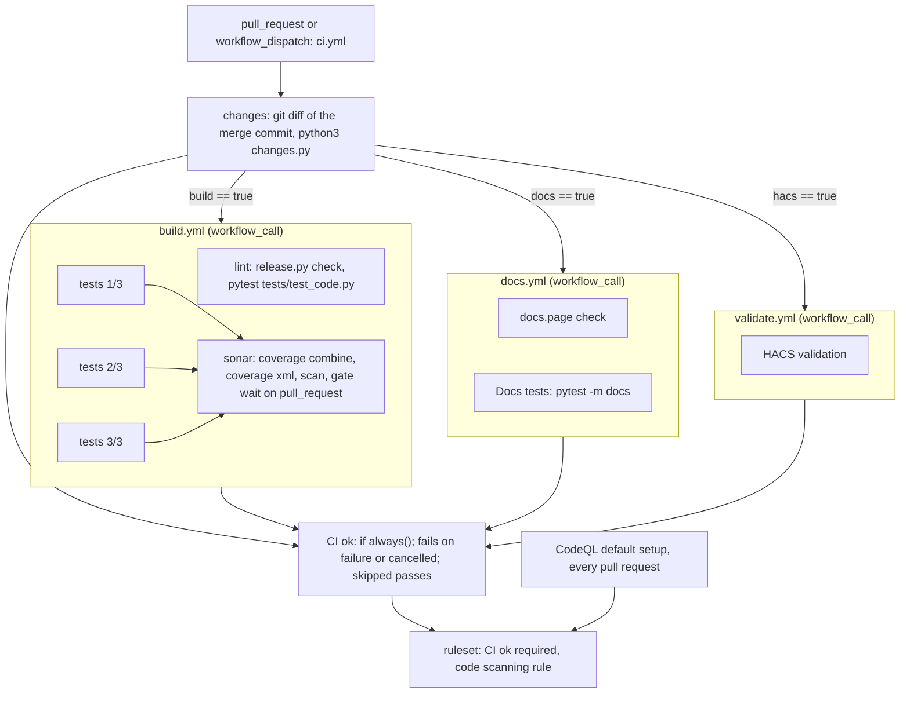

# CI runs what a pull request changed - Plan

## Goal Capsule

- **Objective:** a pull request in pururu-ha is ready to merge as soon as the checks its changes need have passed: about 1 to 1.5 minutes for a docs-only change or a change to agent files only (CodeQL, which analyses every pull request, sets that floor), about 2 minutes for a code change, against about 2.5 minutes for every pull request today.
- **Means:** one pull-request workflow classifies the changed files with an in-repo script, calls the existing check workflows as reusable workflows under job-level conditions, and ends in one aggregate check, "CI ok", the only Actions check the ruleset requires (KTD1, KTD3).
- **Product authority:** the repository owner. The decisions below were made in the brainstorm and the planning dialogue on 2026-10-01.
- **Execution profile:** one pull request, standard depth, seven units. The implementing agent lands the units and opens the pull request. The owner edits the ruleset at merge time (KTD12) and merges.
- **Stop conditions:** stop and ask if the Sonar job cannot read a merged coverage report that matches today's coverage, if the docs tests cannot be kept out of the default run by any of Open Question 1's routes, or if the ruleset cannot be made to require "CI ok" alone.
- **Open blockers:** none. The ruleset edit is an owner step at merge time, not a blocker to the work.

---

## Product Contract

Product Contract changed: R5, R9, R12, AE1, AE2, AE4, AE6, the Goal Capsule, Success Criteria, Sources and the CodeQL Key Decision. Research showed that a pull request whose CodeQL analysis is skipped stays blocked by the ruleset's code scanning rule, so the owner re-decided CodeQL and accepted adjusted timing targets; R5's agent and planning group gained `CONCEPTS.md`, `STRATEGY.md` and `docs/ideation/`.

### Summary

Every pull request starts one CI workflow, and its first job reads which files changed. Each check then runs or is skipped by rule, and one aggregate check, the only Actions check the ruleset requires, passes when everything that ran passed. The tests that read `docs/` move to the Docs check, the tests run in parallel jobs, and Sonar's quality gate is enforced by our own job. CodeQL stays on GitHub's default setup and analyses every pull request.

### Problem Frame

The owner waits on CI before merging, and that wait is the cost. Every pull request runs the full Build, about 2.5 minutes (pytest 85 s, then the Sonar scan 44 s, in one job), whatever it changed. A pull request that edits only a docs page or `CLAUDE.md` waits as long as one that changes the integration. Its minutes cost nothing (the repository is public), so the problem is time, not money.

The obvious fix, path filters on the workflows, does not work here. GitHub keeps a required check from a workflow skipped by a path filter "Pending" and blocks the merge. Only a job skipped by its own condition reports "Success". Two required checks are not even ours to skip: "SonarCloud Code Analysis" is posted by the Sonar app only when a scan runs, and the ruleset's code scanning rule needs a CodeQL analysis of every pull request.

The docs are not free of tests either: tests in seven modules read `docs/` pages, so a docs-only change can break pytest (`tests/test_code.py:219`, `tests/test_alert2.py:346`, `tests/test_alert_lights.py:951`, `tests/test_notifications.py:315`, `tests/test_opening.py:891`, `tests/test_presets.py:366`, `tests/test_updating.py:16`).

### Key Decisions

- **Everything runs by default; a rule skips a check only when every changed file is on that rule's list.** An unknown or forgotten file runs everything: a missed path costs time, never a check that should have run. Governs R1, R2. (session-settled: user-directed — chosen over listing what is code and skipping the rest: a new file that affects the tests would pass untested until someone updated the list.)
- **Skips happen inside the run, never by workflow path filters, and one aggregate check is the required one.** A skipped job reports success; a skipped workflow blocks the merge. One required check means splitting or adding a check never needs a ruleset change. Governs R3, R4. (session-settled: user-approved — proposed with the GitHub behavior shown and accepted.)
- **The tests that read `docs/` move to the Docs check.** Governs R7, R8. (session-settled: user-directed — chosen over keeping them in pytest under a marker and over running the full pytest on docs changes.)
- **Sonar's quality gate is enforced by our own job; the Sonar app's check leaves the required list.** A pull request without code skips Sonar entirely. Governs R10. (session-settled: user-approved — chosen over a scan with nothing to analyze, run only so the required check appears, about 44 s spent for nothing.)
- **CodeQL stays on GitHub's default setup and analyses every pull request; the code scanning rule stays.** Governs R12. (session-settled: user-directed — chosen over gating CodeQL in our own job with the code scanning rule removed from the ruleset, and over a repository workflow that skips CodeQL by path: a skipped analysis leaves the pull request blocked, and the default setup keeps the rule with nothing new to maintain.)
- **The tests run in parallel jobs, and ruff, mypy and hassfest in a job of their own.** Governs R9. (session-settled: user-directed — chosen over cheap tweaks in one job and over measuring first.)

### Requirements

**What runs when**

- R1. Every pull request starts the CI workflow, and its first job classifies the changed files into the groups of R5.
- R2. A check is skipped only when every changed file falls in groups that check does not need, per R5's table; a file in no group runs every check.
- R3. A check is skipped by its job's own condition, never by a workflow-level path, branch or message filter, so no required check is ever left "Pending".
- R4. One aggregate check, "CI ok", passes when every check that ran passed and fails when any failed or was cancelled; the ruleset requires it in place of "Tests and SonarQube", "HACS validation" and "SonarCloud Code Analysis".
- R5. The groups and the checks they run:

| Changed files | Checks that run |
|---|---|
| code: `custom_components/`, `tests/`, `pyproject.toml`, `uv.lock`, `ruff.toml`, `mypy.ini`, `fetch_hassfest.py`, `release.py`, `sonar-project.properties` | code checks, tests, Sonar, Docs |
| workflows: `.github/workflows/` | everything |
| docs: `docs/**/*.mdx`, `docs.json`, `package.json`, `pnpm-lock.yaml` | Docs |
| HACS: `hacs.json`, `custom_components/pururu/manifest.json`, `README.md` | HACS validation (the manifest also counts as code) |
| agent and planning files: `.claude/`, `.compound-engineering/`, `CLAUDE.md`, `CONCEPTS.md`, `STRATEGY.md`, `docs/plans/`, `docs/solutions/`, `docs/superpowers/`, `docs/ideation/` | nothing but the aggregate check |

- R6. Runs that are not a pull request run their checks in full, as today: the Release workflow's Build and HACS validation on every push to `main`, the weekly schedules, and manual starts.

**Docs**

- R7. The Docs check runs the docs.page check and every test that reads `docs/`, and runs on code changes too, since those tests compare the pages with the code's features.
- R8. The tests that read `docs/` leave the default `uv run pytest` and get a command of their own; a test that reads `docs/` cannot be added without joining that set.

**Build speed**

- R9. On a code change the tests run split across parallel jobs and ruff, mypy and hassfest run in a separate job, with coverage merged before Sonar reads it; the target is about 2 minutes to a green aggregate check.

**Sonar**

- R10. The job that runs the Sonar scan waits for the quality gate and fails when it fails; "SonarCloud Code Analysis" leaves the ruleset's required checks.

**HACS**

- R11. HACS validation runs on the HACS group of R5 and on its weekly schedule.

**CodeQL**

- R12. CodeQL stays on GitHub's default setup, on `python` and `actions`, analysing every pull request, every push to `main` and weekly, and the ruleset's code scanning rule stays; nothing in the repository changes for it.

**What stays**

- R13. The Release workflow on `main` and `claude.yml` (`@claude`) are unchanged; `CLAUDE.md`'s "Commands", "Docs" and "Releases and CI", `README.md` and `docs/develop/` describe the new CI.

### Acceptance Examples

- AE1. **Covers R2, R5, R7.** Given a pull request that changes only `docs/features/door.mdx`, the Docs check runs (docs.page check and the docs tests); tests, code checks, Sonar and HACS are skipped; "CI ok" is green in about 1 minute, and the pull request is mergeable once CodeQL finishes, about 1 to 1.5 minutes after it opened.
- AE2. **Covers R5.** Given a pull request that changes only `CLAUDE.md` and a file under `docs/plans/`, every check is skipped, "CI ok" is green in about 15 seconds, and the pull request is mergeable once CodeQL finishes, about 1 to 1.5 minutes after it opened.
- AE3. **Covers R2.** Given a pull request that changes `docs/index.mdx` and a new root file `noxfile.py` that is in no group, every check runs.
- AE4. **Covers R5, R9, R10.** Given a pull request that changes `custom_components/pururu/features/buttons.py`, code checks, the parallel tests, Sonar (waiting for the gate) and Docs run; HACS is skipped.
- AE5. **Covers R4.** Given a code pull request where one test job fails, "CI ok" fails even though the other checks passed or were skipped.
- AE6. **Covers R12.** Given any pull request, a docs-only one included, CodeQL's default setup analyses it and the merge waits for that analysis, as today.

### Success Criteria

- Measured on real pull requests after the change: docs-only and agent-files-only about 1 to 1.5 minutes to mergeable, code about 2 minutes to a green "CI ok". These are estimates from today's step timings, not yet tested; the code estimate's breakdown is in the High-Level Technical Design.
- No check that a change needs is ever skipped: AE3 and AE5 hold.

### Scope Boundaries

- The Release workflow keeps running the full Build on every push to `main`: nobody waits on it, and it keeps Sonar's analysis of `main` current.
- Local `uv run pytest` is unchanged except for the docs tests (R8).
- No change to what Sonar, CodeQL or HACS check, only to when they run.

**Considered and not built**

- Skipping Sonar when `SONAR_TOKEN` is missing (Dependabot and fork pull requests). On such a pull request the Sonar job fails and "CI ok" goes red. That is today's situation too: the required Sonar check never appears for them. No Dependabot pull request exists yet. Add `SONAR_TOKEN` as a Dependabot secret if they start arriving.
- Pinning the `ghcr.io/hacs/action:main` image that `hacs/action` pulls (32 of its 44 s). HACS now runs only on HACS-group changes, so its time no longer matters on most pull requests.
- Caching `~/.sonar/cache` to shorten the 44 s scan. The benefit is unverified; measure it on the new Sonar job before adding a cache step.
- The organization ruleset 22795652 "main rule" carries a `code_quality` rule while `docs/develop/releases.mdx` says GitHub Code Quality is off. It is outside this repository and unaffected; it matters only if merges block unexpectedly.

### Dependencies / Assumptions

- The ruleset "pururu checks" (24076959) changes outside the repository (R4, R10): the owner edits it at merge time, after "CI ok" has run once on the pull request so GitHub knows the name (KTD12).
- Assumption: the Sonar scan with a quality gate wait adds about 5 to 10 seconds to a code pull request, not more.

### Sources / Research

- GitHub, required checks: a workflow skipped by a path filter stays "Pending"; a job skipped by a condition reports "Success" (https://docs.github.com/en/pull-requests/collaborating-with-pull-requests/collaborating-on-repositories-with-code-quality-features/troubleshooting-required-status-checks).
- GitHub, ruleset code scanning rule: the merge is blocked while the analysis is in progress or the tool is not configured (https://docs.github.com/en/repositories/configuring-branches-and-merges-in-your-repository/managing-rulesets/available-rules-for-rulesets). Three 2026 reports confirm that a pull request whose CodeQL analysis never ran stays blocked: gerwaric/acquisition#207 (a deliberate experiment: "the if:-skip satisfies both required status checks (rollup=SUCCESS) but the PR stays BLOCKED because the code_scanning ruleset rule never receives a CodeQL analysis"), nics-dp/meta#313 and davetashner/supply-checkout#158 (the rule wants results for every language `main` has).
- Sonar staff: with CI-based analysis and its check required, the scan must run on every pull request (https://community.sonarsource.com/t/github-pull-request-scan-sonarcloud-code-analysis-expected-waiting-for-status-to-be-reported/106497).
- Ruleset 24076959 "pururu checks" requires "Tests and SonarQube", "HACS validation" (GitHub Actions) and "SonarCloud Code Analysis" (Sonar app), plus a CodeQL code scanning rule (alerts `errors`, security `high_or_higher`); CodeQL's default setup covers `actions` and `python`, weekly.
- Build run of PR #73: setup-uv 6 s, hassfest cache 2 s, pytest 93 s (1617 tests in 85 s on 4 workers), Sonar scan 44 s, job 152 s. Docs 17 to 25 s. HACS 44 to 50 s. CodeQL about 50 to 55 s per language, the run 74 to 91 s.
- `.github/workflows/release.yml` already calls `build.yml` and `validate.yml` through `workflow_call` with `secrets: inherit`: the pattern KTD1 reuses.
- Commit `dca4585` (PR #3): Sonar's gate failed on 0% coverage when the tests and the scan ran in separate jobs and no report reached the scan. KTD4's merge step exists because of it.

---

## Planning Contract

### Key Technical Decisions

- KTD1. **One pull-request workflow, `.github/workflows/ci.yml`, owns classification, the calls and the aggregate.** It triggers on `pull_request` and `workflow_dispatch`. A first job runs the classifier (KTD3). One job per check calls `build.yml`, `docs.yml` or `validate.yml` with `uses:`, each with its own `if:` on the classifier's outputs. A last job, "CI ok", `needs` every job including the classifier, runs `if: always()`, and fails when any need's result is `failure` or `cancelled`; a skipped need passes. A job's `needs:` reaches only jobs of the same workflow, so the checks must be jobs of one workflow for one aggregate to see them. The condition is hand-rolled rather than `re-actors/alls-green`, which treats a skipped job as a failure unless listed in `allowed-skips`. Governs R1, R3, R4.
- KTD2. **The called workflows lose their own `pull_request` triggers and their workflow-level `concurrency`; concurrency lives on the caller only.** With their triggers kept, every check would run twice per pull request. Inside a called workflow `github.workflow` is the caller's name, so `build.yml`'s and `docs.yml`'s `group: ${{ github.workflow }}-${{ github.ref }}` would collide with the caller's, and GitHub cancels the run at startup ("deadlock was detected for concurrency group"). `docs.yml` gains `workflow_call`. `validate.yml` keeps its weekly cron, `workflow_dispatch` and `workflow_call`. `release.yml` keeps calling `build.yml` and `validate.yml` unchanged, so a push to `main` runs everything (R6). Governs R3, R6.
- KTD3. **The classifier is an in-repo stdlib script, `changes.py`, holding R5's table as code and tested by `tests/test_changes.py`.** It follows `release.py` and `fetch_hassfest.py`: a PEP 723 header, a docstring with `Usage:`, pure functions plus `main(argv)`, run with plain `python3`, no uv. It reads the changed paths from standard input and the event name from its argument, prints one `<check>=true|false` line per check (`build`, `docs`, `hacs`) for `$GITHUB_OUTPUT`, and prints every check `true` without reading for any event that isn't `pull_request`. The CI job checks out the pull request's merge commit with `fetch-depth: 2` and pipes `git diff --name-only --no-renames HEAD^1 HEAD`, the whole pull request against the current base. `changes.py` sits in no group on purpose: changing it runs everything. `dorny/paths-filter` would need `**` plus negations and `predicate-quantifier: every` per check; `tj-actions/changed-files` is excluded outright (CVE-2025-30066). (session-settled: user-approved — proposed as a root script with its own tests and no third-party action, and accepted: the table as code is unit-testable, and AE2 and AE3 become test cases.) Governs R1, R2, R5, R6.
- KTD4. **`build.yml` becomes three stages: a lint job, three test shards, and a Sonar job that merges coverage and waits for the gate on pull requests only.** The lint job checks out with `fetch-depth: 0`, runs `python3 release.py check`, restores the hassfest cache and runs `uv run --locked pytest tests/test_code.py` (ruff, format, mypy, hassfest, quality scale, the AST layer tests and the docs guard of KTD8). Each shard runs `uv run --locked pytest` with `--cov`, no XML, `--ignore=tests/test_code.py` and `PURURU_SHARD=<i>/3` (KTD5), keeping `addopts`' `-n 4 --dist loadfile`, and uploads its `.coverage` data file (KTD6). The Sonar job needs the shards, checks out with `fetch-depth: 0`, downloads the data files, runs `coverage combine` then `coverage xml` to `coverage.xml` at the repository root (`relative_files = true` stays in `pyproject.toml`), and runs the scan. `-Dsonar.qualitygate.wait=true` is passed through the scan action's `args` only when `github.event_name == 'pull_request'`, never in `sonar-project.properties`, so a red gate on `main` never blocks a release (R6). Coverage from the docs tests leaves the report; the loss is expected to be negligible. Governs R9, R10.
- KTD5. **Shards are a deterministic in-repo split by file, in `tests/conftest.py`, keyed on `PURURU_SHARD=i/N`.** A `pytest_collection_modifyitems` hook groups the collected items by file, assigns whole files to N bins greedily by item count (largest first) and keeps bin i, deselecting the rest. Every xdist worker computes the same subset, which xdist requires, and every collected file lands in exactly one shard, so a new test file can't be silently skipped. The split function lives in a small module beside `tests/helpers.py` so `tests/test_sharding.py` can test it. `tests/conftest.py` has no session fixtures and no cross-file state, so a split by file is safe. Balance by item count is rough (`tests/test_program.py` has 106 fast pure tests); refining weights by measured duration is deferred. `pytest-split` would need a committed `.test_durations` and splits by item; hard-coded file lists in the matrix silently skip new files. (session-settled: user-approved — proposed as test jobs that split the files among themselves, with every file assigned automatically so a new test can't be left out, and accepted.) Governs R9.
- KTD6. **Coverage data files travel as artifacts with hidden files included, on pinned actions.** `.coverage` is a hidden file and `actions/upload-artifact` since v4.4 drops hidden files unless `include-hidden-files: true`. Every shard writes the same name, `.coverage`, so each renames its file to `.coverage.<i>` before the upload: `merge-multiple: true` extracts every artifact into one directory, where same-named files overwrite each other, and `coverage combine` without arguments collects only `.coverage.*` files. Each shard uploads `.coverage.<i>` as `coverage-<i>` with `include-hidden-files: true` and `retention-days: 1`; the Sonar job downloads with `pattern: coverage-*` and `merge-multiple: true` into the repository root, then runs `uv run --locked coverage combine` with no arguments and `uv run --locked coverage xml`. Pins: `actions/upload-artifact` v7.0.1 `043fb46d1a93c77aae656e7c1c64a875d1fc6a0a`, `actions/download-artifact` v8.0.1 `3e5f45b2cfb9172054b4087a40e8e0b5a5461e7c`. Every new `uses:` is a full SHA with a `# vX.Y.Z` comment. Governs R9.
- KTD7. **Every job that runs pytest restores the hassfest cache, and every job that runs uv keeps today's setup-uv settings.** `tests/conftest.py`'s `pytest_sessionstart` fetches hassfest (about 29 MB) in every pytest run unless `.hassfest/` is present, and it cannot be lazy: sockets are blocked once the tests start, and the xdist controller never collects. The shards, the lint job and the Docs tests job restore `actions/cache` with the existing key `hassfest-${{ hashFiles('fetch_hassfest.py') }}` (about 2 s). setup-uv keeps `enable-cache`, `cache-dependency-glob: uv.lock` and `cache-python`; the cache is warmed by `main`, and `save-cache` may be limited to one shard to avoid 409 warnings on a cache miss. Governs R7, R9.
- KTD8. **The docs tests move to `tests/docs/`, carry a registered `docs` marker, and `-m "not docs"` in `addopts` keeps them out of `uv run pytest`; `uv run pytest -m docs` runs them; an AST guard in `tests/test_code.py` enforces R8.** `tests/test_updating.py` moves whole (it reads its page at import time). The six others move into `tests/docs/test_pages.py`: `test_code.py`'s `test_the_develop_docs_examples_import_what_exists`, `test_alert2.py`'s, `test_alert_lights.py`'s `yaml_blocks` plus its two tests, `test_notifications.py`'s, `test_opening.py`'s and `test_presets.py`'s. `tests/conftest.py` marks every item under `tests/docs/` with `docs`; `pyproject.toml` registers the marker. The guard scans every test module outside `tests/docs/`, except its own module and an explicit allowlist of exactly `tests/conftest.py` (it marks the `tests/docs/` folder) and `tests/test_changes.py` (it holds paths as data to classify and reads no file), and fails on a string constant equal to `docs` or starting with `docs/` outside docstrings, so `tests/test_events.py`'s docstring naming `docs/concepts/events.mdx` is not flagged while both `"docs/x.mdx"` and `PROJECT / "docs" / "develop"` are. pytest's `-m` is a store option, so the last one wins; Open Question 1 asks the implementer to confirm it. (session-settled: user-approved — proposed as their own folder, their own command and a guard against reading `docs/` outside it, and accepted.) Governs R7, R8.
- KTD9. **`docs.yml` gets two parallel jobs: "docs.page check" (pnpm, unchanged) and "Docs tests" (setup-uv, hassfest cache, `uv run --locked pytest -m docs`).** The Docs check runs on docs or code changes (R7). Governs R7.
- KTD10. **`sonar-project.properties` widens the `uv_build` suppression's `resourceKey` to `.github/workflows/*.yml`.** The rule `githubactions:S8541` (`uv run` without `--no-build`) would otherwise return on every new `uv run` in `docs.yml` and `ci.yml`. The reason comment stays: mock-open ships only as an sdist. The comment on `sonar.python.coverage.reportPaths` is updated to say the file is written by `coverage xml` in Build's Sonar job. Governs R9, R10.
- KTD11. **Each workflow file opens with a header comment paragraph describing it and who calls it.** New and changed files keep the convention `build.yml`, `docs.yml`, `validate.yml` and `release.yml` follow today. Governs R13.
- KTD12. **The ruleset is edited by hand at merge time, after "CI ok" has run on the pull request.** The pull request that introduces "CI ok" no longer produces "Tests and SonarQube", so it stays blocked until the owner replaces the three required status checks ("Tests and SonarQube", "HACS validation", "SonarCloud Code Analysis") with "CI ok" (source: GitHub Actions) in ruleset 24076959. The code scanning rule stays. (session-settled: user-approved — the blocked window and the manual swap were shown and accepted.) Governs R4, R10, R12.

### High-Level Technical Design

The pull-request path, with CodeQL beside it:



Directional sketch of the classifier's table (KTD3), not implementation:

```text
groups:   code -> prefixes and files of R5's code row
          workflows -> .github/workflows/
          docs -> docs/**/*.mdx, docs.json, package.json, pnpm-lock.yaml
          hacs -> hacs.json, custom_components/pururu/manifest.json, README.md
          agent -> .claude/, .compound-engineering/, CLAUDE.md, CONCEPTS.md, STRATEGY.md,
                   docs/plans/, docs/solutions/, docs/superpowers/, docs/ideation/
checks:   build needs {code, workflows}; docs needs {code, docs, workflows}; hacs needs {hacs, workflows}
rule:     a path's groups = every group matching it (manifest.json: code and hacs)
          a path in no group needs every check
          a check runs when any path needs it; event != pull_request -> every check
```

Critical path of a code pull request, from today's step timings:

| Stage | Estimate |
|---|---|
| classify job (checkout depth 2, `python3 changes.py`) | about 10 s |
| longest shard: checkout, uv, HA import, xdist start, a third of 93 s | about 45 to 50 s |
| coverage merge plus Sonar scan | about 45 s |
| quality gate wait | about 5 to 10 s |
| "CI ok" | about 5 s |
| total | about 110 to 120 s |

The lint job (about 35 s with mypy) and the Docs jobs (about 20 to 30 s) run beside the shards and finish before the Sonar job. CodeQL (74 to 91 s) runs in its own default-setup run and gates the merge through the code scanning rule, not through "CI ok".

### Assumptions

- Public `ubuntu-latest` runners have 4 vCPUs, so each shard keeps `-n 4`.
- `--dist loadfile` is the only xdist assumption the tests make (tests of one file stay on one worker), so a split by whole file preserves it.
- A job that calls a reusable workflow reports `needs.<job>.result` as the rollup of its inner jobs, which is what "CI ok" reads.
- `pytest-cov` combines the xdist workers' data into one `.coverage` per shard before the upload, as it does in today's single job.
- Sonar's quality gate on a pull request is computed within its default 300 s timeout; the Sonar job's `timeout-minutes` covers it.

### Risks

- `-m docs` on the command line may not override `-m "not docs"` from `addopts` as expected. Open Question 1 names the check and the fallback.
- Shards balanced by item count may be uneven: one heavy HA file per shard is the expectation, not a guarantee. The first run's per-shard times tell; weights are a follow-up.
- Coverage leaving the report (the docs tests) could trip Sonar's new-code coverage gate on a pull request that adds code only those tests cover. Expected negligible; the first code pull request shows it.
- A superseded run's "CI ok" still runs (`always()`) and fails on the old SHA when the caller cancels it. Harmless: the new SHA gets its own check.
- A hassfest cache miss (a changed `fetch_hassfest.py`) costs a 29 MB download per pytest job instead of one. Correct, only slower on that pull request.
- Between opening the pull request and the ruleset edit (KTD12), the pull request is blocked. Expected and short.

### Sequencing and rollout

1. U1, U2 and U3 first: each is testable locally without CI.
2. U4 and U5, then U6, which wires them.
3. U7 with the text updates, in the same pull request (R13).
4. Open the pull request. "CI ok" runs; the old required checks never report. The owner edits ruleset 24076959 as KTD12 says, then merges.
5. After the merge, Release runs the full Build and Validate on `main` (R6), warming the uv and hassfest caches for later pull requests.
6. Verify on two real pull requests: a docs-only one (AE1) and a `CLAUDE.md`-only one (AE2): skipped jobs, timings, mergeable.

### Open Questions

1. **Deferred to implementation.** Confirm locally that `uv run pytest -m docs` selects the docs tests while `addopts` holds `-m "not docs"`. pytest keeps the last `-m`, so it should. If it does not, keep the folder and the marker, replace `-m "not docs"` in `addopts` with `--ignore=tests/docs`, and use `uv run pytest tests/docs` as the docs command after confirming that an explicit path still runs under `--ignore`. If that fails too, use `norecursedirs` with pytest's defaults re-added.

---

## Implementation Units

### U1. The classifier script and its tests

- **Goal:** `changes.py` turns a list of changed paths into one `true`/`false` per check, as R5 and R2 say, and non-pull-request runs get every check.
- **Requirements:** R1, R2, R5, R6, AE1, AE2, AE3, AE4.
- **Dependencies:** none.
- **Files:** `changes.py` (new), `tests/test_changes.py` (new).
- **Approach:**
  1. Write the groups and the checks' needs as module-level data (KTD3's sketch), one entry per R5 row, with `custom_components/pururu/manifest.json` matching both code and HACS.
  2. Pure functions: the groups of one path, the checks a set of paths needs, and the output lines. `main(argv)` takes the event name, reads paths from standard input for `pull_request`, prints every check `true` for any other event, and returns an exit code.
  3. Match prefixes and exact files with plain string operations. `docs/**/*.mdx` means under `docs/` and ending with `.mdx`, checked after the agent and planning folders under `docs/`, so `docs/plans/x.md` and `docs/ideation/x.html` are agent-only.
  4. An empty list of paths (a merge commit with no diff) runs everything.
- **Patterns to follow:** `release.py` and `fetch_hassfest.py` (PEP 723 header, `Usage:` docstring, `main(argv)`, `sys.exit(main(sys.argv))`); `tests/test_release.py` (parametrized pure tests, importing the root script through `pythonpath`).
- **Test scenarios:**
  - Covers AE1. `docs/features/door.mdx` alone: `docs=true`, `build=false`, `hacs=false`.
  - Covers AE2. `CLAUDE.md` and `docs/plans/2026-10-01-x.md`: every check `false`.
  - Covers AE3. `docs/index.mdx` plus `noxfile.py`: every check `true`.
  - Covers AE4. `custom_components/pururu/features/buttons.py`: `build=true`, `docs=true`, `hacs=false`.
  - `custom_components/pururu/manifest.json` alone: `build=true`, `docs=true`, `hacs=true`.
  - `.github/workflows/build.yml` alone: every check `true`.
  - `README.md` alone: only `hacs=true`.
  - `CONCEPTS.md`, `STRATEGY.md`, `docs/ideation/x.html`, `.compound-engineering/x.md`: every check `false`.
  - `changes.py`, `.github/dependabot.yml`, `SECURITY.md`: every check `true` (no group).
  - `tests/test_changes.py` alone: `build=true`, `docs=true`.
  - An empty list: every check `true`.
  - `main` with event `push` and no input: every check `true`.
  - `main` with `pull_request` prints exactly one `<check>=<value>` line per check, in a stable order, with no other output.
  - Input with a trailing newline or blank lines is read without an empty path.
- **Verification:** `uv run pytest tests/test_changes.py -n 0` passes, and `printf 'docs/index.mdx\n' | python3 changes.py pull_request` prints `build=false`, `docs=true`, `hacs=false` with the system `python3`, no venv.

### U2. The docs tests in `tests/docs/`, the marker, and the guard

- **Goal:** `uv run pytest` no longer reads `docs/`, `uv run pytest -m docs` runs the docs tests of the seven modules, and a docs-reading test outside `tests/docs/` fails the lint tests.
- **Requirements:** R7, R8.
- **Dependencies:** none.
- **Files:** `tests/docs/test_updating.py` (moved from `tests/test_updating.py`), `tests/docs/test_pages.py` (new), `tests/test_code.py`, `tests/test_alert2.py`, `tests/test_alert_lights.py`, `tests/test_notifications.py`, `tests/test_opening.py`, `tests/test_presets.py`, `tests/conftest.py`, `pyproject.toml`.
- **Approach:**
  1. Move `tests/test_updating.py` whole to `tests/docs/`, its `PAGE` now `parents[2]`.
  2. Create `tests/docs/test_pages.py` with the six tests KTD8 lists, grouped by page, keeping their names and their `# --- the docs ---` shape. Remove them from their old modules, with `yaml_blocks`, `PAGE`, `ALERTS_PAGE`, `DOOR_PAGE`, `APPLIANCE_PAGE`, `BLOCK`, `RELATIVE` and any import that becomes unused.
  3. Register the `docs` marker in `pyproject.toml` and add `-m "not docs"` to `addopts`. In `tests/conftest.py`, mark every item whose path is under `tests/docs/` in `pytest_collection_modifyitems`.
  4. Add the guard to `tests/test_code.py`, in the style of `imports_of`: walk the AST of every `tests/**/*.py` outside `tests/docs/`, `tests/test_code.py` itself and the two allowlisted modules of KTD8, collect string constants that are not docstrings (the first statement of a module, class or function body), and fail on `"docs"` or a `docs/` prefix.
  5. No `__init__.py` under `tests/docs/`: `--import-mode=importlib` needs none, and `tests/conftest.py` applies to the subfolder.
- **Patterns to follow:** `tests/test_code.py`'s AST scans (`imports_of`, `absolute_imports_of`); `tests/conftest.py`'s hooks.
- **Test scenarios:**
  - `uv run pytest --collect-only -q` lists no item under `tests/docs/`.
  - `uv run pytest -m docs --collect-only -q` lists about 43 items, all under `tests/docs/`, and `uv run pytest -m docs` passes.
  - The guard passes on the repository as moved.
  - The guard fails, naming the file, on a test module outside `tests/docs/` holding `"docs/features/door.mdx"`. Factor the scan over a folder argument so the test can point it at a `tmp_path`.
  - The guard fails on `PROJECT / "docs" / "develop"` built from segments.
  - The guard ignores `tests/test_events.py`'s docstring naming `docs/concepts/events.mdx`.
  - The guard ignores files under `tests/docs/`.
  - The guard passes on `tests/conftest.py` and `tests/test_changes.py` as written, and its allowlist is exactly those two modules.
- **Verification:** `uv run pytest` passes with no docs test collected, `uv run pytest -m docs` passes, and `uv run pytest tests/test_code.py -n 0` passes including the guard.

### U3. Deterministic shards in `tests/conftest.py`

- **Goal:** `PURURU_SHARD=i/N` selects a stable subset of whole test files, with every file in exactly one shard.
- **Requirements:** R9.
- **Dependencies:** U2 (the docs marker and the shard selection share `pytest_collection_modifyitems`).
- **Files:** `tests/sharding.py` (new, the pure split), `tests/conftest.py`, `tests/test_sharding.py` (new).
- **Approach:**
  1. In `tests/sharding.py`, a pure function that takes a list of (file, item count) and (i, N) and returns the files of shard i: sort by count descending then by name, assign each file to the lightest bin, return bin i.
  2. In `tests/conftest.py`, read `PURURU_SHARD` once. When set, group the collected items by `item.path`, call the split, keep the items of the selected files and deselect the rest through `config.hook.pytest_deselected`. Unset means no sharding.
  3. Refuse a malformed value or `i` outside `1..N` with a clear `pytest.UsageError`.
- **Patterns to follow:** `tests/helpers.py` as a module beside the tests imported through `pythonpath`; the hook order in `tests/conftest.py`.
- **Test scenarios:**
  - For a sample of ten files with varied counts and N=3, the union of the three shards is every file and the shards are disjoint.
  - N=1 returns every file.
  - The largest file goes to a bin alone when it outweighs the rest.
  - The same input in a different order gives the same shards.
  - `PURURU_SHARD=0/3`, `4/3`, `a/b` and `1` raise a usage error naming the expected form.
  - Collecting with `PURURU_SHARD` set to `1/3`, `2/3` and `3/3` in turn gives three disjoint sets whose sizes sum to the unsharded count (a Verification Contract check, run by hand).
- **Verification:** `uv run pytest tests/test_sharding.py -n 0` passes, and the three sharded collections partition the suite.

### U4. `build.yml` in three stages, and `sonar-project.properties`

- **Goal:** Build runs lint, three shards and a Sonar job with merged coverage, waits for the gate on pull requests, and reports as one reusable workflow.
- **Requirements:** R6, R9, R10, AE4, AE5.
- **Dependencies:** U2, U3.
- **Files:** `.github/workflows/build.yml`, `sonar-project.properties`.
- **Approach:**
  1. Triggers: `workflow_call` and `workflow_dispatch`; drop `pull_request` and the `concurrency` block (KTD2). Keep `permissions: contents: read`.
  2. Jobs as KTD4 says: `lint`, `tests` (a matrix of three shards, `fail-fast: false`), `sonar` (`needs: tests`). Each job that runs pytest restores the hassfest cache (KTD7). Artifacts per KTD6.
  3. The Sonar step's `args` carry `-Dsonar.qualitygate.wait=true` only on `pull_request`, through an expression on `github.event_name`.
  4. Keep `uv run --locked` everywhere; never `--no-build`.
  5. In `sonar-project.properties`, widen the `uv_build` suppression and update the coverage comment (KTD10).
  6. Rewrite the header comment (KTD11): what each stage does and that CI and Release call it.
- **Patterns to follow:** today's `build.yml` steps and pins; `release.yml`'s `secrets: inherit` on the call side.
- **Test scenarios:** Test expectation: none in pytest — workflow configuration. The pull request's run is the test:
  - The lint job passes and its log shows `release.py check` and `tests/test_code.py` only.
  - Each shard's summary shows about a third of the items and no `tests/test_code.py` or `tests/docs/` item.
  - The Sonar job's log names three combined data files (`.coverage.1` to `.coverage.3`), `coverage.xml` is written, and the gate is waited on; Sonar's coverage on the pull request is close to today's.
  - A deliberately failing test in one shard (temporary, reverted before merge) fails that shard and the Sonar job is skipped.
- **Verification:** on the pull request, Build's inner jobs report as `build / lint`, `build / tests (1)` and so on, and `build / sonar` ends green with the gate passed. The Sonar finding `githubactions:S8541` does not appear on any workflow.

### U5. `docs.yml` and `validate.yml` as called workflows

- **Goal:** Docs runs the docs.page check and the docs tests in parallel when called, and Validate runs when called or weekly, neither on its own `pull_request`.
- **Requirements:** R6, R7, R11.
- **Dependencies:** U2.
- **Files:** `.github/workflows/docs.yml`, `.github/workflows/validate.yml`.
- **Approach:**
  1. `docs.yml`: triggers `workflow_call` and `workflow_dispatch`; no `concurrency`; two jobs, "docs.page check" unchanged and "Docs tests" (checkout, setup-uv as Build's, hassfest cache, `uv run --locked pytest -m docs`) (KTD9).
  2. `validate.yml`: drop `pull_request`; keep `workflow_call`, the weekly cron and `workflow_dispatch`; the job unchanged.
  3. Header comments updated (KTD11).
- **Patterns to follow:** today's `docs.yml` pnpm steps; `build.yml`'s setup-uv and cache steps.
- **Test scenarios:** Test expectation: none in pytest — workflow configuration. On the pull request, `docs / docs.page check` and `docs / Docs tests` run in parallel, the latter collecting only `tests/docs/` items; `validate / HACS validation` runs because the pull request changes workflows.
- **Verification:** both workflows show no run of their own on the pull request, only as called jobs of CI.

### U6. `ci.yml`: classify, call, aggregate

- **Goal:** one workflow per pull request runs the classifier, calls Build, Docs and Validate under conditions, and ends in "CI ok".
- **Requirements:** R1, R2, R3, R4, R6, AE1, AE2, AE3, AE5.
- **Dependencies:** U1, U4, U5.
- **Files:** `.github/workflows/ci.yml` (new).
- **Approach:**
  1. Triggers `pull_request` (`opened`, `synchronize`, `reopened`) and `workflow_dispatch`; `permissions: contents: read`; `concurrency` with a literal prefix and `github.ref`, `cancel-in-progress: true` (the only concurrency in the pull-request path, KTD2).
  2. Job `changes`: checkout with `fetch-depth: 2`, pipe `git diff --name-only --no-renames HEAD^1 HEAD` into `python3 changes.py "$GITHUB_EVENT_NAME"` and append the lines to `$GITHUB_OUTPUT`; declare the three outputs.
  3. Jobs `build` (`uses: ./.github/workflows/build.yml`, `secrets: inherit`), `docs` and `validate`, each `needs: changes` with `if: needs.changes.outputs.<check> == 'true'`.
  4. Job "CI ok": `needs: [changes, build, docs, validate]`, `if: always()`, a short `timeout-minutes`, one step that fails when `contains(needs.*.result, 'failure') || contains(needs.*.result, 'cancelled')`.
  5. Header comment (KTD11): R5's table in a sentence each, and that the ruleset requires "CI ok" alone.
- **Patterns to follow:** `release.yml`'s `uses:` jobs and `secrets: inherit`; `build.yml`'s pins for checkout.
- **Test scenarios:** Test expectation: none in pytest — workflow configuration. On real runs:
  - Covers AE3 / AE5. The pull request itself (workflows changed) runs everything; a temporary failing test turns "CI ok" red with the other checks green or skipped; reverted, "CI ok" is green.
  - Covers AE1. After merge, a docs-only pull request shows `build` and `validate` skipped, `docs` run, "CI ok" green in about 1 minute.
  - Covers AE2. After merge, a `CLAUDE.md`-only pull request shows every called job skipped and "CI ok" green in about 15 seconds.
  - A `workflow_dispatch` of CI runs every check.
- **Verification:** "CI ok" appears on the pull request as a GitHub Actions check with that exact name, and the old names "Tests and SonarQube" and "HACS validation" no longer appear.

### U7. The texts: `CLAUDE.md`, `README.md`, `docs/develop/`

- **Goal:** every page and instruction that describes the commands or CI is true for the new layout.
- **Requirements:** R8, R13.
- **Dependencies:** U1 to U6 (describe what landed).
- **Files:** `CLAUDE.md`, `README.md`, `docs/develop/index.mdx`, `docs/develop/testing.mdx`, `docs/develop/releases.mdx`.
- **Approach:**
  1. `CLAUDE.md` "Commands": the `uv run pytest` line no longer runs the docs tests; add `uv run pytest -m docs` and `python3 changes.py` lines. "Docs → Check": the Docs workflow runs `pnpm docs:check` on pull requests that change docs or code. "Releases and CI → CI": one CI workflow classifies the changed files, calls Build, Docs and Validate, and "CI ok" is the required check; Sonar waits for the gate on code changes; CodeQL default setup on every pull request. "Tests": mention `tests/docs/`, the `docs` marker and `PURURU_SHARD`.
  2. `README.md` "Develop": the `uv run pytest` comment and the docs tests' command.
  3. `docs/develop/index.mdx`: the commands block; replace "the one command that must pass" with the two commands and keep "CI runs nothing you can't run locally" true by naming `python3 changes.py`; the repository layout gains `changes.py` and `tests/docs/`.
  4. `docs/develop/testing.mdx`: "Test files" rows for `tests/docs/test_pages.py` and `tests/docs/test_updating.py`; the `test_code.py` row (the guard added, the Develop-pages test moved); the `test_presets.py`, `test_alert_lights.py`, `test_notifications.py`, `test_opening.py` and `test_alert2.py` rows without their docs clauses, which also removes the `test_notifications.py` row's wrong "appliance page"; a short "Docs tests" subsection (the marker, `-m docs`, the guard); "Running tests" with the docs command and `PURURU_SHARD`.
  5. `docs/develop/releases.mdx`: the "Workflows" table gains `ci.yml` and its rows say who calls each; a "What runs on a pull request" table from R5 in user terms; line 24 stays true (`release.py check` runs in Build's lint job); "SonarQube" says the scan runs on code changes and the job waits for the gate; "Security" stays as is (R12); "Documentation" says when the Docs workflow runs.
  6. Keep `{` and `<` in backticks (MDX).
- **Patterns to follow:** the existing pages' voice and tables.
- **Test scenarios:** Test expectation: none beyond the docs tests — `uv run pytest -m docs` (the Develop examples test reads these pages) and `pnpm docs:check` (links) are the checks.
- **Verification:** `pnpm docs:check` passes, `uv run pytest -m docs` passes, and every command the pages list runs as written from the repository root.

---

## Verification Contract

| Check | Command or action | Units | Passes when |
|---|---|---|---|
| Default suite, lint, types, hassfest, the guard, the shards' and classifier's tests | `uv run pytest` | U1, U2, U3 | Green, no item from `tests/docs/` collected |
| Docs tests | `uv run pytest -m docs` | U2, U7 | Green, about 43 items, all under `tests/docs/` |
| Lint job's command | `uv run pytest tests/test_code.py -n 0` | U2 | Green, the guard included |
| Classifier | `uv run pytest tests/test_changes.py -n 0`, then `printf 'CLAUDE.md\n' \| python3 changes.py pull_request` | U1 | Tests green; the script prints every check `false` with the system `python3` |
| Shards partition the suite | `PURURU_SHARD=i/3 uv run pytest --collect-only -q --ignore=tests/test_code.py` for i in 1, 2, 3 | U3 | Disjoint sets whose sizes sum to the unsharded `--collect-only` count |
| Docs site | `pnpm docs:check` | U7 | No broken link or missing page |
| Release rule | `python3 release.py check` | — | Passes; the manifest version is unchanged (not a release) |
| Pull request's CI | open the pull request | U4, U5, U6 | "CI ok" green; `build / lint`, three `build / tests`, `build / sonar` with the gate waited; `docs / docs.page check`, `docs / Docs tests`; `validate / HACS validation`; no standalone Build, Docs or Validate run |
| Failure propagates (AE5) | a temporary failing test in one shard, pushed then reverted | U6 | "CI ok" red while the failure is there, green after |
| Sonar | the pull request's Sonar analysis | U4 | Coverage close to today's; no `githubactions:S8541` finding on any workflow |
| Ruleset (owner) | edit ruleset 24076959: required checks "CI ok" only, source GitHub Actions; code scanning rule kept | — | The pull request becomes mergeable |
| Release on `main` (R6) | the Release run after merge | U4 | Build's three stages and Validate run in full; no gate wait in the Sonar step's args |
| Docs-only pull request (AE1) | after merge, a pull request changing one `docs/**/*.mdx` | U6 | `build` and `validate` skipped, `docs` run, "CI ok" green in about 1 minute, mergeable when CodeQL finishes |
| Agent-files-only pull request (AE2) | after merge, a pull request changing `CLAUDE.md` only | U6 | Every called job skipped, "CI ok" green in about 15 seconds, mergeable when CodeQL finishes |
| Code pull request timing (R9) | the next code pull request | U4 | About 2 minutes to a green "CI ok" |

---

## Definition of Done

- Every row of the Verification Contract up to "Pull request's CI" passes locally before the pull request opens; the rest pass on the pull request and after the merge.
- Every unit's Verification holds, and U7's pages describe what landed, not what was planned.
- "CI ok" is the ruleset's only required status check and the code scanning rule is kept (KTD12); "SonarCloud Code Analysis", "Tests and SonarQube" and "HACS validation" are no longer required.
- `custom_components/pururu/manifest.json`'s version is unchanged.
- Every `uses:` in the changed workflows is a full SHA with a `# vX.Y.Z` comment; every `uv run` is `--locked`; `pnpm install` is `--frozen-lockfile`.
- Cleanup: no temporary failing test, debug step, `continue-on-error`, hard-coded file list, leftover `pull_request` trigger or `concurrency` block in a called workflow, and no coverage or artifact file committed; the old docs tests exist only under `tests/docs/`.
- The two post-merge pull requests (AE1, AE2) show the skips and timings the Success Criteria name, or the measured numbers replace the estimates in this plan's Success Criteria.
