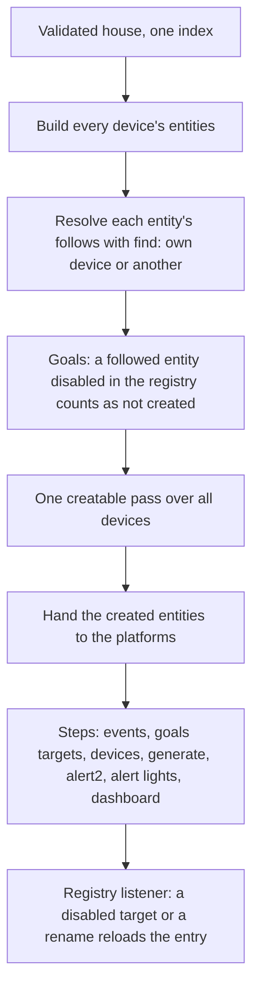
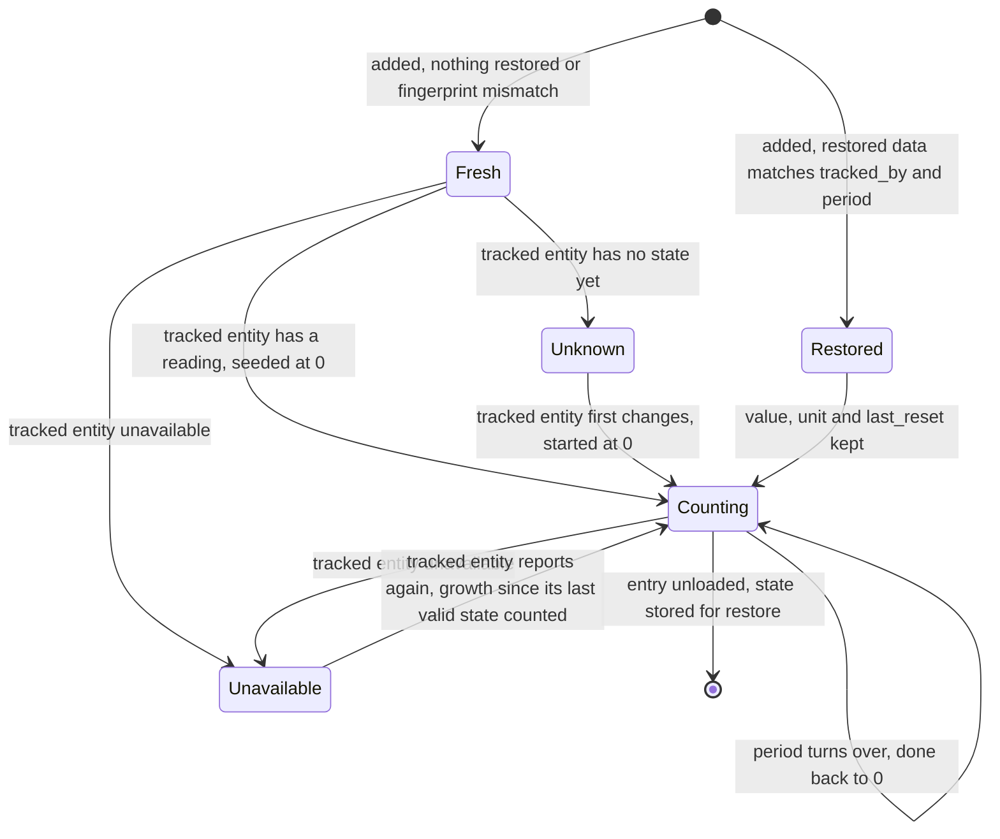

# Goals - Plan

## Goal Capsule

- **Objective:** The author declares what a thing must achieve in each calendar period (the pool filters 6 hours a day) and sees, in Home Assistant, the period's target next to how much was done, whoever caused it.
- **Means:** a `goals:` device key whose `done` is a goal-owned utility meter over the tracked entity, and whose `target` mirrors the tracked entity's unit (KTD5, KTD7, KTD8).
- **Product authority:** the author's decisions of 2026-10-01 in this brainstorm, recorded as Key Decisions. The generic "debt ledger" idea (idea 1 of `docs/ideation/2026-09-30-open-ideation.html`) is the direction; only its first piece, the goal and what was done, is active scope.
- **Open blockers:** the YAML path references (`docs/plans/2026-10-01-1457-feat-yaml-path-references-plan.md`, its plan on `main` since #78, its implementation not started). `tracked_by` and R9 are written in its grammar, and U1 and U2 parse references through what it ships. Implementation starts after that implementation merges to `main`; until then only U6's prose and this plan can move.
- **Stop conditions:** a settled decision found infeasible in the pinned Home Assistant (2026.9.3), or the references plan merging with a grammar that cannot carry a per-item node (`goals.<goal>.done`).
- **Execution profile:** one PR on a branch from `main` after the references merge, no manifest version change (R12), full `uv run pytest` and `pnpm docs:check` green before review.

---

## Product Contract

The Product Contract below is the brainstorm's, kept whole: every R and AE keeps its ID and meaning; only the answered Deferred-to-Planning questions and the verified assumption were updated in place.

### Summary

A new device key, `goals:`, declares per-period goals. Each goal has a target, a calendar period and the entity that tracks it, and creates two sensors: the period's target and how much the tracked entity grew since the period began. Paying a goal down, carrying it over and deriving lateness come later, all computed from these two.

### Problem Frame

STRATEGY's first track asks to "declare what a thing should achieve (a runtime goal with modifiers, as the pool's filtering)" instead of writing the automation. Today the pool's filtering is a hand-written Home Assistant automation the author wants to move into pururu. A schedule miscounts as soon as someone steps in: a manual run or the pump's own timer is invisible to it. Measuring what was done from a counter that already exists, whoever ran the pump, avoids that. The appliance already builds the counter (its runtime total, in hours, kept across restarts), and the opening builds `open_time_total`.

The ideation framed this as a "debt ledger": a quantity owed per period, paid by any measured run. The author wants that piece generic, not a pool feature, with the pool as its first instance, and wants to build it in small steps: first the goal and what was done, then deciding when to act on it.

### Key Decisions

- **The name is `goals`.** "Debt" describes the mechanism; nobody says the pool owes anything. STRATEGY already says "a runtime goal". (session-settled: user-directed — chosen over `debts`, `targets` and `quotas`: "debits é nome horroroso"; the house owes nothing.) Governs R1.
- **A goal belongs to a device, as a device key beside its features**, like `alerts`, `reactions` and `programs`. (session-settled: user-approved — chosen over an aspect inside a feature's block, and over devices made only of goals: same shape as the other device keys, and the goal doesn't depend on what tracks it.) Governs R1, R2.
- **The target is a fixed number for now.** (session-settled: user-directed — chosen over a target proportional to a sensor, the pool's "temperature / 2 = hours", and over bands of a sensor's value.) Governs R3.
- **The target has no unit of its own: it is in the tracked entity's unit.** The author writes 6; if the tracked entity counts hours, that's 6 hours, if it counts cycles, 6 cycles. Any quantity works, since a goal only compares numbers. (session-settled: user-directed — chosen over time only, and over time or count: "uma vez que é sempre contagem", the tracked entity already counts in its own unit.) Governs R3, R6.
- **The tracked entity is declared now**, though nothing pays the goal down yet: it gives the unit and what was done, and the YAML has its final shape from the start. (session-settled: user-approved — chosen over a bare number with the entity added together with paying.) Governs R5.
- **Calendar periods only:** `today`, `week`, `month`, `year`, the statistics aspect's periods. (session-settled: user-approved — chosen over also accepting a free duration (`every: 3d`) and over free durations only: matches the meters that already exist.) Governs R4.
- **Nothing happens when a period turns over.** What was missing is not carried into the next period, and what was over is not credit. (session-settled: user-directed — chosen over carrying the debt, resetting with a cap, and credit for overdoing: "por hora é nada acontece"; carrying both ways, configurable, is recorded as a later improvement.) Governs R8.
- **A goal shows two things: the target and what was done.** Everything else derives from them: what's left is target − done, met is what's left ≤ 0, at risk is what's left ≥ the time left in the period. (session-settled: user-directed — chosen over a third sensor for the share of the target due so far (a linear pace), and over shipping what's left now: "tudo deriva de cota e realizado"; start with the two.) Governs R6, R7.
- **The two sensors are `target` and `done`.** `target` carries the written field into Home Assistant, as the appliance's `power` mirrors its written `power`. (session-settled: user-directed — chosen over `due`/`expected`/`target_so_far` and over `quota`/`accrued`.) Governs R6, R7, R9.
- **The tracking field reaches this device, another device and Home Assistant, in the YAML path form.** It takes different kinds of things, so it is one field with the full path, as a reaction's `when` in that form. (session-settled: user-directed — chosen over shipping first with 0.2.1's form (`appliance_runtime_total`, a separate `entity:`) and migrating it with the references work: the references ship first.) Governs R5.
- **No version bump with this work.** Goals land in the code, but the next release waits for the condition on reactions (see Separate work), so a reaction can act on a goal. (session-settled: user-directed — chosen over releasing goals alone.) Governs R12.
- **Only something that accumulates can track a goal.** "Done" is how much the tracked entity grew in the period, which means nothing for a value that goes up and down, such as a power reading in W. Governs R5.

### Requirements

**Declaring a goal**

- R1. A device may have a `goals:` block, keyed by goal (`goals: filtering:`), beside its features; a device still needs at least one feature.
- R2. Each goal has a `name`, shown in Home Assistant after the device's name (**Piscina Filtragem**), as an alert's or a reaction's.
- R3. Each goal has a `target`: a positive number, without a unit, read in the tracked entity's unit.
- R4. Each goal has a `period`: one of `today`, `week`, `month`, `year`, turning over as the statistics aspect's meters do.
- R5. Each goal has `tracked_by`: the full YAML path of something that accumulates, of this device (`appliance.running_program.runtime_total`), of another device (`device.living_room.window.open_time_total`), or of Home Assistant (`homeassistant.sensor.pool_pump_runtime`). A pururu path that isn't a total is refused in the configuration, with its place. A Home Assistant entity is checked when the entry sets up, since it may not be loaded at validation: one that doesn't accumulate gets an error logged naming the goal's `tracked_by`, and the goal is not created.

**What a goal shows**

- R6. Each goal creates a `target` sensor: the goal's target, in the tracked entity's unit.
- R7. Each goal creates a `done` sensor: how much the tracked entity grew since the current period began, in its unit, back to 0 when the period turns over.
- R8. When a period turns over, `done` starts again from 0, and nothing of the past period (missing or over) carries into the new one.
- R9. The two sensors are referenced as `goals.<goal>.target` and `goals.<goal>.done`; `goals.<goal>` alone is refused, pointing to them, as a reaction's node is.
- R10. `done` keeps its value across restarts and reloads within the period, as the statistics aspect's meters do.

**Following what tracks it**

- R11. A goal whose tracked pururu entity, of this device or of another, is not created (not built, its ID held by another integration) or is disabled, is not created either, with the log line anything that follows a missing entity gets today; disabling or enabling that entity reloads the entry, as a program's disabled target does. This is new behaviour: today's following only sees the entity's own device and never reads whether an entity is disabled.

**Shipping**

- R12. The work doesn't change the manifest version; docs get a goals page (concept) and the configuration reference, in the same PR.

### Acceptance Examples

- AE1. **Covers R6, R7, R8.**
  - **Given:** the pool has `goals: filtering: {name: Filtragem, target: 6, period: today, tracked_by: appliance.running_program.runtime_total}`.
  - **When:** the pump ran 2 hours since midnight, one of them started by hand.
  - **Then:** `goals.filtering.target` shows 6 h and `goals.filtering.done` shows 2 h. At midnight `done` is 0 h again, whatever was missing.
- AE2. **Covers R3, R6.**
  - **Given:** a goal of `target: 2`, `period: week`, tracked by a cycles total.
  - **Then:** `target` shows 2 cycles, the unit of the cycles total.
- AE3. **Covers R5.**
  - **Given:** `tracked_by: homeassistant.sensor.pool_pump_power`, a power reading in W.
  - **Then:** when the entry sets up, an error is logged naming that goal's `tracked_by` (it doesn't accumulate), and neither `target` nor `done` of that goal is created; the rest of the house sets up.
- AE4. **Covers R11.**
  - **Given:** the tracked runtime total is disabled in Home Assistant.
  - **Then:** neither `target` nor `done` of that goal is created, and the log says the goal follows an entity that isn't created.
- AE5. **Covers R10.**
  - **Given:** at 15:00 `done` shows 3 h.
  - **When:** Home Assistant restarts and the pump doesn't run meanwhile.
  - **Then:** `done` still shows 3 h.

### Scope Boundaries

**Deferred for later**

- Paying a goal down: the balance, "paid", and events when it is paid or runs late.
- Carrying what was missing, and credit for what was over, each configurable.
- A target that depends on a sensor (the pool's "temperature / 2 = hours"), the "modifiers" of STRATEGY's track 1.
- Derived sensors, each a formula over `target` and `done`: what's left (target − done), met (what's left ≤ 0), and at risk (what's left ≥ the time left in the period; only for a goal measured in time).
- Free-duration periods (`every: 3d`), counted from a date.
- Inferring `tracked_by` when the device has a single total.
- Several tracked entities summed into one goal (airing paid by any window of the house).
- A device made only of goals, without a feature.

**Considered and not built**

- Backfilling `done` from the recorder's history when a goal is added mid-period: an extra mechanism for the first day only (KTD1).
- Holding a goal whose tracked pururu entity is disabled, as an executable program is held: goals drop like every other follower today (KTD3).
- Refusing a Home Assistant `tracked_by` whose state class is not known at setup: it would drop a valid goal on every slow start (KTD4).
- Converting `done` when the tracked entity's display unit changes mid-period: core's utility meter relabels the accumulated value without converting, and `target` relabels with it (KTD8); pururu corrects neither.
- Attributing to the past period what a Home Assistant total grew while Home Assistant was down: core counts it at the total's next change, in the period running then; for a pururu total nothing grows while down.
- Reloading the entry when a Home Assistant tracked entity is disabled, enabled or renamed: the registry listener watches the entry's own entities; a `pururu.reload` picks the change up, documented.

**Separate work**

- A condition on reactions (`only if`), so a reaction can say "solar surplus rose and the goal isn't met: start filtering". Its own brainstorm, after this; until then, deciding when to act uses the reactions that exist (a time of day, a sensor's change).

### Deferred to Follow-Up Work

- A warning, once Home Assistant has started, naming a goal whose Home Assistant `tracked_by` still has no state (a typo stays silent today: the goal exists and `done` is `unknown`).
- Reading "disabled" for every follower, not only goals (an alert watching a disabled entity is created today and never fires): a behaviour change for existing features, decided on its own.
- Checking a Home Assistant tracked entity's state class again when it first reports after setup, and dropping the goal then.

### Dependencies / Assumptions

- Depends on the YAML path references (`docs/plans/2026-10-01-1457-feat-yaml-path-references-plan.md`): `tracked_by` and R9's paths use its grammar, and the entities' paths come from where they are born in the block, so `goals` needs no special registration there. Its plan is on `main` (#78), its implementation not yet; until it lands, `custom_components/pururu/core/resolve.py` holds 0.2.1's grammar.
- The appliance's runtime total is in hours and only grows (`custom_components/pururu/features/cycle/totals.py`, `RuntimeTotal`), so the pool's first goal works with the appliance it already has.
- Verified in core's source (HA 2026.9.3, `utility_meter/sensor.py`): the utility meter restores its value, unit, device class, `last_reset` and status, and restarts its scheduler from the restored `last_reset`, so a boundary missed while Home Assistant was down fires at once. R10 and R8 rest on it; pururu has no test of a meter across a restart or a turnover yet, so U3 writes the first.

### Outstanding Questions

**Answered in planning**

- How "accumulates" is read for a Home Assistant entity at setup: KTD4.
- Whether `done` is the statistics aspect's meter of the tracked total or a meter of its own, and what it does when the tracked entity is unavailable: KTD7.
- The entity IDs of the two sensors: KTD6.
- The `target` sensor's unit and device class when the tracked entity has none: KTD8.

### Sources / Research

- `STRATEGY.md`, track "Complex automations, ridiculously easy".
- `docs/ideation/2026-09-30-open-ideation.html`, idea 1 (the generic debt ledger).
- `custom_components/pururu/aspects/statistics.py` (`PERIODS`, `Meter`: HA's utility meter inside the device, seeded from the source's current reading).
- `custom_components/pururu/device_keys/__init__.py` (`DEVICE_KEYS`), `custom_components/pururu/aspects/alerts.py` (a device key keyed by item, with `Refers` and `follows`).
- `custom_components/pururu/device_keys/reactions.py` (`STATISTICS`: `entity_keys={}`, `Items`, namespace `reaction`; `check` and `_refused`: refusals naming the device, with a path).
- `custom_components/pururu/setup/build.py` (`build` resolves `follows` against the own device only; `creatable`: what follows an entity that isn't created, per device).
- `custom_components/pururu/setup/lifecycle.py` (the prelude loop building and filtering each device alone; `STEPS`; `targets`).
- `custom_components/pururu/setup/listener.py` (`rebuild_for`: a disabled entity in `targets` reloads the entry).
- `custom_components/pururu/aspects/programs.py` (`_disabled`: the registry read at step time; the held program).
- `custom_components/pururu/outputs/devices.py` (`remove_stale`: registry entries of what isn't in `runtime_data` are deleted).
- `custom_components/pururu/features/appliance/mirrors.py` (`Mirror`: a real sensor's value, unit and classes inside the device).
- `tests/test_code.py` (the layer table `ALLOWED`, the named allowances `ALSO`, `test_only_the_statistics_aspect_imports_utility_meter`).
- `docs/solutions/design-patterns/count-button-presses-from-async-press-not-state.md`: a source's state-change stream is lossy; derive growth from a total's value, never from counting changes.
- `CONCEPTS.md`, "Goals" (the working-tree change this PR ships).

---

## Planning Contract

### Key Technical Decisions

- KTD1. **A goal added mid-period counts from when it was set up, and again from each re-creation; no backfill.** A meter over a total starts at 0 when it first sees the total, so the first period is partial. AE1 holds with the goal in place since before midnight. (session-settled: user-approved — chosen over reading the tracked total's value at period start from the recorder's history: an extra mechanism, for the first day only.) Governs R7.
- KTD2. **Changing a goal's `tracked_by` or `period` restarts `done` at 0.** The `done` meter stores a fingerprint, the `tracked_by` as written plus the period, in its restored extra data, and discards the restored value when it doesn't match. The fingerprint is the written path, not the entity ID, so a pururu entity renamed in the UI keeps `done`. (session-settled: user-approved — chosen over keeping the restored value under a new definition: it would add the difference between two unrelated totals, hundreds of hours on a pump swap.) Governs R7, R10.
- KTD3. **A disabled tracked pururu entity drops the goal's sensors, as every follower is dropped today.** `remove_stale` deletes their registry entries, so UI renames on them are lost; `done` comes back with its last value within the period when the goal is created again under its default entity ID, as Home Assistant keeps restore data by entity ID for 7 days (0 once the period has turned over). (session-settled: user-approved — chosen over holding them like an executable program with its registry entries kept: one rule for everything that follows, no second mechanism.) Governs R11.
- KTD4. **A Home Assistant tracked entity not yet loaded at startup gives a goal anyway, with `done` unknown until the entity first changes.** The goal is refused at setup (error logged, not created) only when its state class is known, read from the entity registry's capabilities first, then from its state, and is neither `total` nor `total_increasing`. (session-settled: user-approved — chosen over refusing an entity whose state class is unknown: it would drop a valid goal on every slow start.) Governs R5.
- KTD5. **Goals live in `custom_components/pururu/device_keys/goals.py`, registered in `DEVICE_KEYS`.** It is a device key, not an aspect; `ALERTS` sits in `aspects/` only because it shares `problem.py` with the ready-made alerts. Reusing the statistics aspect's `Meter` needs one new named allowance in `tests/test_code.py`'s `ALSO`, `device_keys/goals` → `aspects.statistics`, so the utility meter import stays pinned to `aspects/statistics.py`. The alternative, `aspects/goals.py` with a `device_keys/__init__` allowance, was passed over: nothing in it is mounted in another builder's block. Governs R1.
- KTD6. **The feature mirrors reactions' statistics:** `entity_keys={}`, `Items({"target", "done"} → sensor)`, namespace `goal`, `Refers` for a pururu `tracked_by`, a `check` of its own. The entities are `sensor.pururu_<device>_goal_<key>_target` and `sensor.pururu_<device>_goal_<key>_done`, named by the translations `goal_target` and `goal_done` with the `{goal}` placeholder, one `mdi:` icon each. `catalogue.keys` lists the two keys through `Items`, so `checks.keys_distinct`, `entity_ids_distinct` and the index see them with no extra work, and the references grammar gives R9's paths: the index lists each item's path beside its slug (references plan, KTD1), and every goal entity carries the `reference` attribute with no goal-specific code (references plan, KTD9). Governs R2, R6, R7, R9.
- KTD7. **`done` is a goal-owned meter: the statistics `Meter` generalised, over the tracked entity's current entity ID.** `Meter` hard-wires a local `sources` key and the `{item}` naming; both become optional (no `total` → no `sources`; no `translation` → the `Items` naming), the goal's meter sets `follows` to a pururu `tracked_by` and nothing for a Home Assistant one, and registers itself under its own `pururu:<object_id>` key in `hass.data[DATA_UTILITY]`. It keeps `Meter`'s seed from the source's current reading, `sensor_always_available=False` (unavailable while the tracked entity is), `net_consumption=False` (a drop in the total is dropped, not counted) and core's restore. The alternative, counting state changes, was rejected by the learning in `docs/solutions/design-patterns/count-button-presses-from-async-press-not-state.md`. Governs R7, R8, R10.
- KTD8. **`target` is a restoring sensor showing the written number, with the unit and device class `done` gets.** It reads them from the tracked entity's state attributes (`unit_of_measurement`, `device_class`), the same place core's utility meter copies them from into `done`, so the two always share a unit; before the entity reports it falls back to the registry entry's `unit_of_measurement` and `original_device_class`, and it keeps them through restore. The registry holds no native unit, only the unit at registration. A translated count carries its English unit, "cycles", since Home Assistant translates units only in its default language; a tracked entity with no unit at all gives a `target` without one. A display-unit change on the tracked entity relabels both sensors (Scope Boundaries). `target` is never `unavailable` for the tracked entity's sake: a number is always known. Governs R3, R6.
- KTD9. **Following crosses devices through one house-wide `creatable` pass.** The prelude builds every device, then runs `build.creatable` once over all of them, so a goal on device A knows whether device B's total is created. `follows` entries are resolved with `core/resolve.find` (the references plan's parsed form), own-device entries as today. The pass changes the path every entity goes through, so the existing build tests (`tests/test_appliance.py`, `tests/test_buttons.py`, `tests/test_programs.py`, `tests/test_notifications.py`, `tests/test_generated.py`) are the regression net. Governs R11.
- KTD10. **Disabled is read at build time, for goals only, through the entity registry.** The goals builder collects the unique IDs of the tracked pururu entities whose registry entry is disabled, and `creatable` takes that set as an extra argument that seeds `missing` for its follow loop only, so it logs the standard `follows …, which is not created; not creating it` line (AE4). The disabled totals themselves stay in the created list and in `runtime_data`, so `remove_stale` keeps their registry entries and the user's disable survives the next reload. No other follower reads it (Deferred to Follow-Up Work). A `goals` step in `lifecycle.STEPS`, `goals.async_step` in the goals module, adds the tracked pururu entity IDs to `targets`, so the registry listener reloads the entry when one is disabled; HA reloads it itself when one is enabled. Governs R11.
- KTD11. **`goals.check` in `schema.CHECKS` refuses a pururu `tracked_by` that isn't a total.** A total is an index target whose qualified key (`Target.key`) ends `_total`, never tested on the written path: the references plan writes the energy mirror as `appliance.energy` (its KTD2) while its key stays `appliance_energy_total`; a meter (`runtime_today`), a goal's own sensors, a phase, a carrier are refused with "not a total" and the path `devices → <device> → goals → <goal>`. Unknown device or key refusals come from the shared resolver the references plan ships, not duplicated here. The appliance's `energy_total` is a `Mirror` of the plug, so its state class is the plug's: it passes the config check and is checked at setup as a Home Assistant entity is (KTD4). Governs R5.

### High-Level Technical Design

The prelude today builds and filters each device alone; a goal needs the whole house before it knows whether what it follows exists.

A goal's `done` across its life:

### Assumptions

- The references implementation ships what its plan states: per-item nodes (`reactions.<key>.triggered_total`), the path validator for fields that take different kinds of things, and `find`; U1 adapts to its final names.
- The utility meter's restore seam (`async_get_last_sensor_data` on `RestoreSensor`) can be vetoed by a subclass, so KTD2's fingerprint check can refuse a restore before core applies it. U3 verifies this against the pinned core before relying on it.

### Sequencing

U1 and U2 can start together once the references plan has merged; U3 and U4 need U1 (and U2 for the cross-device cases); U5 needs U2 and U3; U6 closes, with the CLAUDE.md update.

---

## Implementation Units

### U1. The goals device key: schema, feature, check, registration

- **Goal:** `goals:` is accepted on a device, each goal validated, listed in the index as `goal_<key>_target` and `goal_<key>_done`, and refused when its pururu `tracked_by` isn't a total.
- **Requirements:** R1, R2, R3, R4, R5 (config part), R9.
- **Dependencies:** the references implementation merged.
- **Files:** `custom_components/pururu/device_keys/goals.py` (new), `custom_components/pururu/device_keys/__init__.py`, `custom_components/pururu/setup/schema.py` (`CHECKS`), `custom_components/pururu/const.py` (`CONF_GOALS` and the field names), `custom_components/pururu/translations/en.json`, `custom_components/pururu/translations/pt-BR.json`, `custom_components/pururu/icons.json`, `tests/test_code.py` (`ALSO`), `tests/test_goals.py` (new).
- **Approach:** a `vol.Schema` of its own over `{cv.slug: GOAL}` (ALLOW_EXTRA leaks into plain dicts), `GOAL` requiring `name`, a positive `target`, `period` in `statistics.PERIODS`, and `tracked_by` validated by the references plan's path validator for fields that take different kinds of things (its KTD3, `core/resolve.py`), with a reaction's `when` reach (this device, another device, Home Assistant; its R13), resolved with `find` in the check. The `Feature` per KTD6, with `Items` giving `_items` from the block and `Refers` yielding the pururu references only (a `homeassistant.` path is no index reference). `goals.check` per KTD11, added to `CHECKS` after `checks.references`. R9's bare-node refusal follows the shape the references plan gives `reactions.<key>`. Register in `DEVICE_KEYS`, add the `device_keys/goals` → `aspects.statistics` allowance (the import itself lands in U3; the allowance can wait for it), and the example `{"filtering": {"name": "Filtering", "target": 6, "period": "today", "tracked_by": "appliance.running_program.runtime_total"}}` on an appliance. If `tests/fixtures/house.yaml` gains a goal, `tests/fixtures/house_ids.json` and `tests/fixtures/house_paths.json` take additions only.
- **Patterns to follow:** `device_keys/reactions.py` (`SCHEMA`, `_item`, `STATISTICS`, `check`, `_refused` with its path), `aspects/alerts.py` (`_refers`, `check`), `setup/checks.py` (`references`).
- **Test scenarios:**
  - A device with an appliance and `goals: filtering: {name: Filtragem, target: 6, period: today, tracked_by: appliance.running_program.runtime_total}` sets up and creates `sensor.pururu_pool_goal_filtering_target` and `sensor.pururu_pool_goal_filtering_done`, named **Piscina Filtragem target** and **Piscina Filtragem done** in English (the pt-BR names in their file). Covers R1, R2.
  - A device with only `name` and `goals:` is refused: "a device needs at least one feature". Covers R1.
  - `target: 0`, `target: -1` and `target: six` are each refused with the goal's path; `period: fortnight` is refused naming the four periods. Covers R3, R4.
  - `tracked_by: appliance.running_program` (the carrier), `appliance.running_program.statistics.runtime.today` (a meter) and `goals.other.done` (a goal's sensor) are each refused as "not a total", at `devices → pool → goals → filtering`. Covers R5.
  - `tracked_by: device.living_room.window.open_time_total` on another device passes the check; `device.pool.appliance.running_program.runtime_total` written inside `pool` is refused by the references plan's own-device rule. Covers R5.
  - `tracked_by: appliance.energy` (the energy mirror, key `appliance_energy_total`) passes the config check, then is checked at setup by its state class (KTD4, KTD11). Covers R5.
  - `sensor.pururu_pool_goal_filtering_done` carries the `reference` attribute `goals.filtering.done`, and `_target` carries `goals.filtering.target`. Covers R9.
  - A reaction's `when: goals.filtering` is refused pointing to `goals.filtering.target` and `goals.filtering.done`; `when: goals.filtering.done` passes. Covers R9.
  - `tests/test_features.py` passes over the new entry unchanged: translations in both files, placeholders, icons, example valid, unknown key refused.
- **Verification:** `uv run pytest tests/test_goals.py tests/test_features.py tests/test_code.py tests/test_checks.py -n 0 -q`.

### U2. Following across devices, one creatable pass

- **Goal:** an entity can follow an entity of another device, and the house decides what is created in one pass.
- **Requirements:** R11 (the cross-device and "not created" parts).
- **Dependencies:** the references implementation merged (the parsed reference `follows` carries).
- **Files:** `custom_components/pururu/setup/build.py`, `custom_components/pururu/setup/lifecycle.py`, `custom_components/pururu/core/entity.py` (the `follows` docstring), `tests/test_lifecycle.py`, `tests/test_goals.py`.
- **Approach:** per KTD9. `build.build` resolves each `follows` entry through `find(index, key, ref)`, the own-device case unchanged; it returns what it does today. The prelude in `async_setup_entry` collects every device's `built` and `watched`, then calls `creatable` once; `created_by` is filled from the result by the device that built each entity (the key never parsed from the ID). Keep `creatable`'s messages verbatim: the troubleshooting page quotes them.
- **Patterns to follow:** `setup/build.py` (`_inputs` already crosses devices through `find`), `device_keys/reactions.py` (`_watched` against `Built.created`, the house-wide precedent at step time).
- **Test scenarios:**
  - A goal on `living_room` tracking `device.pool.appliance.running_program.runtime_total` creates both sensors, with `done` metering `sensor.pururu_pool_appliance_runtime_total`. Covers R11.
  - The same goal when `sensor.pururu_pool_appliance_runtime_total` is already held by another integration (registry entry under another platform) is not created, and the log has `sensor.pururu_living_room_goal_airing_done follows sensor.pururu_pool_appliance_runtime_total, which is not created; not creating it`; the pool's other entities are created. Covers R11.
  - A goal on the pool tracking the pool's own total behaves as before the pass (own-device following unchanged).
  - The existing build tests in `tests/test_appliance.py`, `tests/test_buttons.py`, `tests/test_programs.py`, `tests/test_notifications.py` and `tests/test_generated.py` pass unchanged.
  - `test_the_steps_run_in_order` and `test_the_steps_read_the_builders_and_one_index` in `tests/test_lifecycle.py` pass with the new prelude.
- **Verification:** `uv run pytest tests/test_goals.py tests/test_lifecycle.py tests/test_appliance.py tests/test_buttons.py tests/test_programs.py tests/test_notifications.py tests/test_generated.py -n 0 -q`.

### U3. The done meter

- **Goal:** `done` grows with the tracked entity in the period, resets at turnover, survives restarts and reloads, starts fresh on a changed definition, and refuses a Home Assistant entity that doesn't accumulate.
- **Requirements:** R5 (setup part), R7, R8, R10.
- **Dependencies:** U1; U2 for the cross-device scenario.
- **Files:** `custom_components/pururu/aspects/statistics.py` (`Meter` generalised), `custom_components/pururu/device_keys/goals.py`, `tests/test_goals.py`, `tests/test_statistics.py` (the generalised `Meter` keeps its tests).
- **Approach:** per KTD7, KTD2, KTD4. `Meter` takes `total` and `translation` as optional; the statistics aspect passes both as today. The fingerprint support lives in `aspects/statistics.py` as an optional `fingerprint` on the generalised `Meter` (the extra restored data and the restore veto, Assumptions), so `device_keys/goals.py` only passes it and imports nothing from `utility_meter`; on a mismatch the meter seeds as a fresh one. For a Home Assistant `tracked_by`, the goals `build()` reads the state class from the registry's capabilities, then the state; known and not `total`/`total_increasing` → an error naming the goal's `tracked_by` and no entities for that goal; unknown → built, `done` unknown until the entity first changes. The source entity ID is the tracked target's `current_entity_id` for a pururu path (from `inputs`), the written entity ID for a Home Assistant path.
- **Patterns to follow:** `aspects/statistics.py` (`Meter.__init__`, the seed in `async_added_to_hass`, the `DATA_UTILITY` registration and pop), `.claude/skills/alert-restart-scenario-test/SKILL.md` (restart where the watched entity moved while down), `tests/helpers.py` (`restart`, `tick`, `fake`, `reload`).
- **Test scenarios:**
  - AE1 with the goal in place: `runtime_total` at 100 h when the goal is set up, then 102 h → `done` is 2 h with unit h; `tick` to midnight → `done` is 0 h and `target` still 6 h. Covers AE1.
  - A goal set up at 15:00 when the total already grew 2 h today shows `done` 0 h (KTD1), and 1 h after the next hour of running.
  - AE5: `done` at 3 h, `restart` with the meter's saved state and the total unchanged → `done` 3 h, unit h, same `last_reset`. Covers AE5.
  - Restart with the saved state and the tracked Home Assistant total moved from 50 to 53 while down → `done` unchanged until the entity's next change, then grows by the difference since its last valid state.
  - Restart with the saved state from yesterday (period boundary crossed while down) → `done` is 0 at start.
  - `reload` keeps `done` at its value: it passes through `unavailable` and comes back, neither 0 nor doubled.
  - Saved state with fingerprint `appliance.running_program.runtime_total`/`today`, YAML now `period: week` → `done` starts at 0; same with `tracked_by` changed; the tracked pururu entity renamed in the UI (same written path) keeps the value. Covers KTD2.
  - AE3: `tracked_by: homeassistant.sensor.pool_pump_power`, state class `measurement` → error naming `homeassistant.sensor.pool_pump_power`, neither sensor created, the appliance's entities created. Covers AE3.
  - `tracked_by: homeassistant.sensor.pool_pump_runtime` with no registry entry and no state at setup → both sensors created, `done` `unknown`; `fake` the entity to 10 h with `total_increasing` → `done` 0 h, then 11 h → 1 h. Covers KTD4.
  - The tracked entity set `unavailable` → `done` `unavailable`; back at a higher value → the growth is counted.
  - A tracked Home Assistant entity that never changes after setup leaves `done` at 0 (seeded), not `unknown`.
  - The statistics tests in `tests/test_statistics.py` pass unchanged.
- **Verification:** `uv run pytest tests/test_goals.py tests/test_statistics.py -n 0 -q`.

### U4. The target sensor

- **Goal:** `target` shows the written number in the tracked entity's unit and device class, kept through restarts.
- **Requirements:** R3, R6.
- **Dependencies:** U1.
- **Files:** `custom_components/pururu/device_keys/goals.py`, `tests/test_goals.py`.
- **Approach:** per KTD8. A `RestoreSensor` subclass of `PururuEntity` with `state_class` none (a target is not a measurement to graph as one), native value the written number, unit and device class from the tracked entity's state attributes (tracked through a state-change listener set up in `async_added_to_hass`), the registry entry's `unit_of_measurement` and `original_device_class` before it reports, the last known restored.
- **Patterns to follow:** `features/appliance/mirrors.py` (`Mirror`: the tracked entity's unit and classes inside the device), `core/entity.py` (`_identify` with `item`).
- **Test scenarios:**
  - AE2: `target: 2`, `period: week`, tracked by `appliance.running_program.cycles_total` → `target` shows 2 with unit "cycles" (Home Assistant translates units only in English), the same unit as `done`, no device class. Covers AE2.
  - Tracked by the runtime total → `target` 6, unit h, device class duration.
  - Tracked by a Home Assistant energy total (kWh, registered) → `target` with kWh and device class energy.
  - A Home Assistant tracked entity absent at setup → `target` shows its number with no unit; once the entity reports with kWh, `target` carries kWh; after a restart with the saved state, kWh is there before the entity reports.
  - `restart` keeps the value and unit.
- **Verification:** `uv run pytest tests/test_goals.py -n 0 -q`.

### U5. Disabled tracked entities: drop and rebuild

- **Goal:** a goal whose tracked pururu entity is disabled is not created, and disabling or enabling it reloads the entry.
- **Requirements:** R11.
- **Dependencies:** U2, U3.
- **Files:** `custom_components/pururu/device_keys/goals.py` (`async_step`, the disabled read at build), `custom_components/pururu/setup/lifecycle.py` (`STEPS`), `custom_components/pururu/setup/build.py` (`creatable`'s extra set of disabled tracked unique IDs), `tests/test_goals.py`, `tests/test_lifecycle.py`.
- **Approach:** per KTD10 and KTD3. The goals `build()` reads each tracked pururu entity's registry entry; disabled → its unique ID goes into the set `creatable` takes (KTD10), so the goal's entities are dropped with the standard line while the total itself stays created. `goals.async_step` adds the tracked pururu entity IDs of every goal (created or dropped) to `targets`, placed right after `events` in `STEPS`; it reads only `built` and never fails for a missing entity. `remove_stale` then deletes the dropped goal's registry entries as it does for every follower today.
- **Patterns to follow:** `aspects/programs.py` (`_disabled`), `setup/generate.py` (`targets.update`), `setup/listener.py` (`rebuild_for`), `outputs/alert_lights.py` (`async_step` adding followed IDs).
- **Test scenarios:**
  - AE4: `sensor.pururu_pool_appliance_runtime_total` disabled in the registry before setup → neither goal sensor is created, and the log has `sensor.pururu_pool_goal_filtering_done follows sensor.pururu_pool_appliance_runtime_total, which is not created; not creating it` (and `_target`'s line); the appliance's other entities are created. Covers AE4.
  - With the goal created, disabling the tracked total in the registry reloads the entry once, after which the goal's sensors are gone and their registry entries removed.
  - Enabling it again (HA's own reload, driven in the test) brings both sensors back, `done` with the value it had when dropped (0 if the period turned over meanwhile) (KTD3).
  - A goal tracking another device's total: disabling that total reloads the entry and drops the goal.
  - Disabling an unrelated entity of the entry reloads nothing (`rebuild_for` returns None).
  - The `goals` step appears in `test_the_steps_run_in_order`'s order.
- **Verification:** `uv run pytest tests/test_goals.py tests/test_lifecycle.py -n 0 -q`.

### U6. Docs, CLAUDE.md and concepts

- **Goal:** every page that teaches devices, entity IDs, configuration or the new log lines knows goals, and the contributor docs and CLAUDE.md match the code.
- **Requirements:** R12.
- **Dependencies:** U1 to U5 (the exact messages and IDs).
- **Files:** `docs/concepts/goals.mdx` (new), `docs.json` (Concepts group), `docs/reference/configuration.mdx` (`## devices`: a `goals` property beside `reactions`, `programs`, `alerts`), `docs/concepts/devices-and-features.mdx` (the keys that don't count as features, twice), `docs/concepts/entity-ids.mdx` (the namespace table row `goal`), `docs/reference/troubleshooting.mdx` (the `doesn't accumulate` error; the `follows …` entry mentions a disabled tracked total; the list of what disabling rebuilds), `docs/develop/architecture.mdx` (device keys, the allowance list, the prelude's house-wide pass, the `goals` step), `docs/develop/writing-a-feature.mdx` (`DEVICE_KEYS` list), `CLAUDE.md`, `CONCEPTS.md` (the "Goals" entry already in the working tree ships here).
- **Approach:** `docs/concepts/goals.mdx` in the shape of `docs/concepts/reactions.mdx` and `docs/concepts/alerts.mdx`: frontmatter, "a device key, like reactions and programs: it isn't a feature", a full `pururu: devices:` example (the pool), "This creates `sensor.pururu_pool_goal_filtering_target` and `…_done`, shown as **Piscina Filtragem target**", `## Settings`, `## Entities` (each with its path and ID), a bullet list of edges: the first period is partial (KTD1), a changed `tracked_by` or `period` restarts `done` (KTD2), both sensors pass through `unavailable` on a reload so automations over them filter `unavailable`/`unknown`, growth while Home Assistant was down lands in the period running at the next change, a Home Assistant entity disabled or renamed needs `pururu.reload`, a display-unit change relabels `done`; `## Removing it`. The week starts on Monday, as the statistics meters'. Keep `{` and `<` in backticks. CLAUDE.md: the layer table sentence counts six named allowances and names `device_keys/goals` → `aspects.statistics`; the device keys list gains `goals` (`device_keys/goals.py`); the prelude's step 2 says every device is built, then one `creatable` pass over the house; `STEPS` gains `goals` after `events`; a "Goals" architecture line: a device key with `Items` (`target`, `done`), `done` the statistics `Meter` over the tracked entity with a fingerprint of `tracked_by` and `period`, disabled read at build for goals only.
- **Patterns to follow:** `docs/concepts/reactions.mdx`, `docs/concepts/statistics.mdx`, the `<Property>` blocks of `docs/reference/configuration.mdx`, the `### \`…\`` entries of `docs/reference/troubleshooting.mdx`.
- **Test scenarios:**
  - `pnpm docs:check` reports no broken link; `/concepts/goals` is in the sidebar.
  - The YAML example in `docs/concepts/goals.mdx` is valid under `CONFIG_SCHEMA` (a test in `tests/test_goals.py` loads it, as the feature docs' examples are kept true elsewhere).
  - Every log line quoted in `docs/reference/troubleshooting.mdx` for goals matches the code's text.
- **Verification:** `pnpm docs:check`; `uv run pytest tests/test_goals.py -n 0 -q`.

---

## Verification Contract

| Command | Proves | When |
|---|---|---|
| `uv run pytest` | Everything: the tests, ruff, ruff format, mypy (strict), hassfest and the quality scale through `tests/test_code.py`; the layer table with the new allowance; the autouse fixture fails any test logging `Step … failed` or `Listener failed` unexpectedly | Before review and before merge |
| `uv run pytest tests/test_goals.py -n 0 -q` | AE1 to AE5, the KTD1 to KTD4 scenarios, cross-device, disabled and reload | Each unit |
| `uv run pytest tests/test_features.py tests/test_code.py tests/test_checks.py -n 0 -q` | The contract test over `DEVICE_KEYS`, translations and icons, the allowance pin, the checks | U1 |
| `uv run pytest tests/test_lifecycle.py tests/test_appliance.py tests/test_buttons.py tests/test_programs.py tests/test_notifications.py tests/test_generated.py tests/test_statistics.py -n 0 -q` | No regression from the house-wide pass and the generalised `Meter` | U2, U3 |
| `uv run ruff check --fix custom_components/pururu && uv run ruff format custom_components/pururu && uv run mypy custom_components/pururu` | Lint and types on the integration alone | Each unit |
| `pnpm docs:check` | No broken link in the docs site | U6 |
| `python3 release.py check` | The manifest version is semver and not below the latest release; it stays `0.2.1` (R12) | Before merge |

Never run anything with the shell's cwd inside `.venv/.../homeassistant/helpers/`.

---

## Definition of Done

- The references implementation is merged to `main` and this branch is rebased on it before any unit is marked done.
- U1 to U6 complete, each with its test scenarios in `tests/test_goals.py` or the named existing file, and `uv run pytest` green in one run.
- AE1 to AE5 each have a test marked `Covers AE<N>` that passes.
- `custom_components/pururu/manifest.json` still says `0.2.1`; `python3 release.py check` passes.
- `tests/test_code.py` has exactly one new named allowance, `device_keys/goals` → `aspects.statistics`, and `test_only_the_statistics_aspect_imports_utility_meter` still pins `aspects/statistics.py` alone.
- `CLAUDE.md`, `docs/develop/architecture.mdx` and `docs/develop/writing-a-feature.mdx` describe the device key, the allowance count, the house-wide `creatable` pass and the `goals` step as the code does.
- `docs/concepts/goals.mdx` exists, is in `docs.json`, and `pnpm docs:check` passes; the configuration reference, devices-and-features, entity-ids and troubleshooting pages carry the goals entries; `CONCEPTS.md`'s "Goals" entry is committed.
- No abandoned attempt remains in the diff: no unused `Meter` parameter, no second disabled mechanism, no debug logging.
- A learning is captured with `ce-compound` only if the implementation found something the final code and this plan don't make obvious (the restore veto seam, a unit-inheritance surprise); otherwise none.
