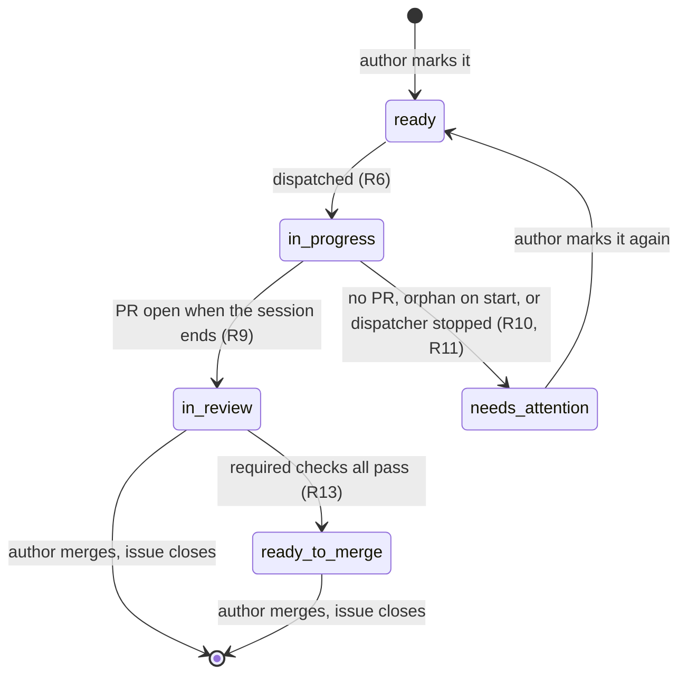
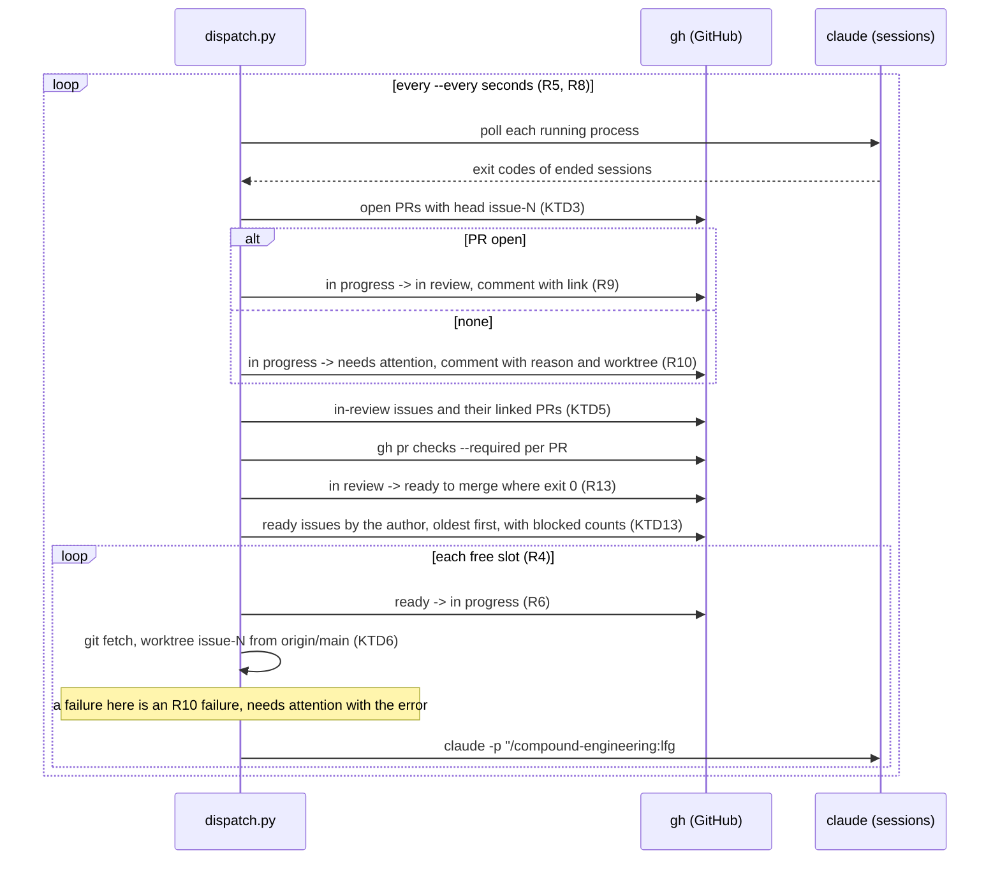
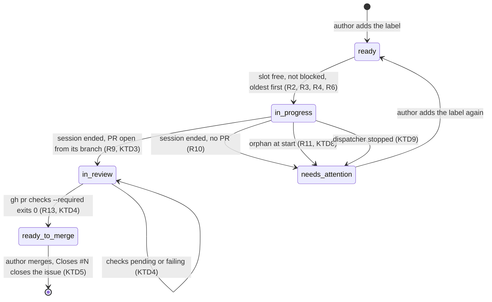

# Issue dispatcher - Plan

## Goal Capsule

- **Objective:** issues the author marks `ready` become open pull requests, labelled by where they stand, without the author starting a session for each one.
- **Means:** `dispatch.py`, a stdlib script at the repository root after `release.py` (KTD1), that polls GitHub through `gh` and starts one headless Claude session running `lfg` per issue in its own worktree (KTD6, KTD7).
- **Product authority:** the Product Contract below, with the R9 split the author directed during planning.
- **Stop conditions:** stop and report when `gh` or `claude` lacks an ability this plan relies on (KTD3, KTD5, KTD13 name them), or when a unit's tests cannot be made pure (KTD2).
- **Who finishes:** ce-work implements the units in order, runs the Verification Contract, and opens the pull request. Nothing here is a release: `manifest.json` keeps its version.

---

## Product Contract

Product Contract preservation: changed: R9 — split into `in review` (a pull request is open) and `ready to merge` (its required checks all pass); added R13. Deferred-to-planning questions resolved in the Planning Contract (KTD3, KTD5, KTD9, KTD10, KTD11) and removed here.

### Summary

A command, run from the pururu repository, that polls the repository's issues at a configurable interval. It takes the oldest issue the logged-in `gh` user opened and marked `ready`, skips any issue still blocked by an open issue, and dispatches up to N headless Claude sessions at once, each running `lfg` in its own new worktree. Labels on the issue show where each one stands: `in progress`, then `in review` when a pull request is open, then `ready to merge` when its required checks pass, or `needs attention` when the session ended without one.

### Problem Frame

Plan-backed issues pile up faster than the author starts sessions for them: #69 to #74 were filed in one afternoon, and each waits until the author opens a session and runs `lfg` by hand. Some open issues are not ready to be worked on (#25 is broad, #67 is an umbrella), and some depend on others through GitHub's native "blocked by" relation (#72 waits on #70). Starting the ready ones in the right order is manual bookkeeping.

### Key Decisions

- **Opt-in queue: only issues labelled `ready`.** Broad or umbrella issues stay out until the author marks them. Governs R1. (session-settled: user-directed — chosen over every open issue of the author, and over an opt-out label: the oldest open issue today is #25, which is not ready to be worked on.)
- **A blocked issue is skipped, never waited on.** Governs R3. (session-settled: user-directed — the queue moves to the next eligible issue.)
- **Up to N sessions at once.** Governs R4. (session-settled: user-directed — chosen over one at a time and over no limit.)
- **A session ends where `lfg` ends: an open pull request, no merge.** Governs R7. (session-settled: user-directed — chosen over babysitting to merge-ready and over auto-merge: "the same behaviour as lfg".)
- **Success has two states: `in review` when the session opened a pull request, `ready to merge` when that pull request's required checks all pass.** Governs R9 and R13. (session-settled: user-directed — chosen over one `in review` state for any open pull request and over the session merging itself: the author merges, and wants to see at a glance which pull requests only wait for them.)
- **Failure moves the issue out of the queue until the author marks it again.** Governs R10. (session-settled: user-directed — chosen over keeping `in progress` and over retrying automatically, which could repeat the same failure forever.)
- **The failure label is `needs attention`, not `blocked`.** Governs R10. (session-settled: user-approved — `blocked` would read as GitHub's native "blocked by", which is the queue's other criterion.)
- **An orphan `in progress` issue on start is a failure.** Governs R11. (session-settled: user-directed — chosen over resuming in the left-over worktree and over ignoring it.)
- **Sessions run headless; the author follows the result.** Governs R12. (session-settled: user-directed — chosen over sessions the author can open and talk to.)
- **A local program, not a Claude session in `/loop` nor a GitHub-triggered workflow.** Polling costs no tokens, and the slot, label and blocker rules are applied exactly. (session-settled: user-directed — chosen over a `/loop` dispatcher session and over a workflow on the `ready` label running in the cloud.)
- **Lives in pururu first.** Extracted for other repositories once it proves its value. (session-settled: user-directed — chosen over a tool for any repository from the start.)

### Requirements

**Queue**

- R1. An issue is eligible when it is open, was opened by the user `gh` is logged in as, and carries the `ready` label.
- R2. Eligible issues are considered oldest first, by creation time.
- R3. An eligible issue blocked by at least one open issue (GitHub's native "blocked by" relation) is skipped, and the next eligible issue is considered; a closed blocker no longer blocks.

**Dispatch**

- R4. At most N sessions run at once; N is set when the dispatcher is started.
- R5. The polling interval is set when the dispatcher is started.
- R6. Dispatching an issue removes `ready` (and `needs attention`, if present), adds `in progress`, creates a new worktree from the latest `main`, and starts a headless Claude session running `lfg` on that issue.
- R7. The session behaves as `lfg` does and ends at an open pull request that references the issue; it never merges.
- R8. The dispatcher runs until the author stops it.

**Outcomes**

- R9. When a session ends and a pull request from its branch is open, the issue moves from `in progress` to `in review`, with a comment linking the pull request, and its slot is freed.
- R10. When a session ends without a pull request, for any reason, the issue moves from `in progress` to `needs attention`, with a comment giving the reason and the worktree's location; it re-enters the queue only when the author adds `ready` again.
- R11. When the dispatcher starts, every `in progress` issue without a live session of this dispatcher is handled as a failure (R10).
- R12. Each dispatched issue has a log the author can read.
- R13. At every poll, an `in review` issue whose open pull request's required checks all pass moves to `ready to merge`.

### Label lifecycle



### Acceptance Examples

- AE1. **Covers R3.** Given #70 and #72 are both `ready` and #72 is blocked by #70, which is open, when the dispatcher polls, it dispatches #70 and skips #72. Once #70's pull request is merged and #70 closes, #72 is dispatched at a later poll.
- AE2. **Covers R2, R3.** Given the oldest `ready` issue is blocked and the second is not, when a slot is free, the second is dispatched.
- AE3. **Covers R4.** Given N is 2 and two sessions are running, when a third issue is `ready`, it waits until a session ends.
- AE4. **Covers R9, R13.** Given a session opens a pull request and ends while its checks are pending, the issue carries `in review` and a comment with the link, and a new issue can take the freed slot. At a later poll, once every required check passes, the issue carries `ready to merge`.
- AE5. **Covers R10.** Given `lfg` stops blocked without a pull request, the issue carries `needs attention` and a comment with the reason and the worktree's path; it is not dispatched again while it lacks `ready`.
- AE6. **Covers R11.** Given the Mac slept and the dispatcher died while #74 was `in progress`, when the author starts the dispatcher again, #74 moves to `needs attention` with a comment, while issues already `in review` are untouched.

### Scope Boundaries

- Merging pull requests, or babysitting them past what `lfg` itself does.
- Running while the Mac is asleep, or in the cloud.
- Talking to a session while it works.
- Retrying a failed issue automatically.
- Removing worktrees after a session ends.
- Moving an issue back from `ready to merge` when its checks turn red again.
- Other repositories.

### Dependencies / Assumptions

- The labels `ready`, `in progress`, `in review`, `ready to merge` and `needs attention` do not exist in the repository today (checked with `gh label list` on 2026-10-01); the dispatcher creates the missing ones on its first run (KTD10).
- GitHub's issue dependencies are readable through the GraphQL API: `issueDependenciesSummary.blockedBy` counts open blockers (on 2026-10-01 it read 1 for #72, blocked by open #70, and 0 for #70, whose blocker #68 is closed).
- `lfg` can run without a person present, with the permissions a headless session needs in its worktree.
- The repository has required checks on `main` (HACS validation, SonarCloud Code Analysis, Tests, SonarQube), so `gh pr checks --required` has something to judge.

---

## Planning Contract

### Key Technical Decisions

- **KTD1. One stdlib script at the repository root, `dispatch.py`, after `release.py`.** PEP 723 header, a module docstring with Usage, subcommands, run as `python3 dispatch.py run`; it shells out to `gh` and `claude` and imports nothing outside the standard library. (session-settled: user-approved — chosen over a package or a GitHub client dependency: the repository's tool scripts are stdlib files run with `python3`, and tests import them as modules through `pythonpath = ["."]`.)
- **KTD2. A pure core behind two gateways.** Every decision (eligibility, order, blocked skip, slot filling, each session's outcome, each poll's label moves) takes plain data and returns plain actions. Only a `gh` gateway and a session runner touch the world, and `tests/test_dispatch.py` replaces both with fakes. Rationale: the HA test plugin blocks sockets, and `release.py` already splits `decide` from `git_tags`.
- **KTD3. Success is an open pull request whose head is the session's branch, not the session's exit status.** At the session's end the dispatcher asks `gh` for open pull requests with that head; one found is R9, none is R10. (session-settled: user-approved — chosen over exit status or `lfg`'s DONE promise: neither says a pull request exists.)
- **KTD4. Two labels for success.** `in review` on an open pull request, `ready to merge` once `gh pr checks <pr> --required` exits 0; a pending (exit 8) or failing run leaves the issue `in review`. (session-settled: user-directed — chosen over a single success label and over merging: the author merges.)
- **KTD5. Promotion is re-checked at every poll, through the pull requests GitHub links to the issue.** The poll reads each `in review` issue's `closedByPullRequestsReferences`, so the check survives a dispatcher restart without a state file, and the `lfg` prompt asks for `Closes #N` in the pull request body so the link exists and merging closes the issue (R3 and AE1 depend on it). While the dispatcher that opened the pull request still runs, the branch it remembers is the fallback. (session-settled: user-approved — chosen over judging once at the session's end.)
- **KTD6. The dispatcher creates the worktree itself with git, not with `claude --worktree`.** It fetches `origin/main` and adds `.claude/worktrees/issue-<N>` on a new branch `issue-<N>` (a numeric suffix when either name is already taken), then runs Claude with that folder as its working directory. Rationale: R6 wants the base to be the latest `main`, R10 wants the path in the comment, and KTD3 wants the branch name; `claude --worktree` gives none of the three.
- **KTD7. A session is `claude -p` with the `lfg` skill, `auto` permissions, and a JSON-lines log.** The prompt is `/compound-engineering:lfg #<N>` plus the `Closes #N` instruction; `--permission-mode auto`, `--output-format stream-json --verbose`, stdout and stderr appended to `.dispatch/logs/issue-<N>.log` (R12). The final `result` event's text, when present, is the reason quoted in a failure comment. (session-settled: user-approved — `auto` chosen over `bypassPermissions`.)
- **KTD8. One dispatcher at a time, through a PID lock file.** `.dispatch/lock` holds the running process's PID; a start that finds a live PID refuses with a message, one that finds a dead PID takes the lock over and runs R11. (session-settled: user-approved — so R11 never marks an issue a live session of another instance holds.)
- **KTD9. Stopping terminates the sessions and marks their issues.** On SIGINT or SIGTERM the dispatcher terminates each running `claude` process, waits a short grace period before killing, moves each of those issues to `needs attention` with a comment saying the dispatcher was stopped, releases the lock and exits. (session-settled: user-approved — chosen over leaving sessions running detached, which R11 would mark failed while alive.)
- **KTD10. Missing labels are created on start.** Before the first poll, the five labels are listed and any missing one created. (session-settled: user-approved.)
- **KTD11. Defaults: 2 sessions, 5 minutes.** Flags `--sessions` (R4) and `--every` in seconds (R5), both optional. Rationale: two sessions keep the Mac responsive and cap spend; five minutes is short enough to feel live and long enough to keep `gh` far below its rate limits.
- **KTD12. The dispatcher's own files live in `.dispatch/`, git-ignored.** The lock and the logs; worktrees go under `.claude/worktrees/`, where Claude Code already keeps this repository's worktrees. `.gitignore` gains `.dispatch/`.
- **KTD13. Eligibility and blockers come from one GraphQL query per poll.** `issues(filterBy: {createdBy, labels: ["ready"]}, states: OPEN, orderBy: CREATED_AT ASC)` with `issueDependenciesSummary.blockedBy` and `labels` per node (R1, R2, R3). An issue the dispatcher runs now, or that still carries `in progress`, is never dispatched a second time, even if `ready` is added back meanwhile.
- **KTD14. Labels move only along the diagram's arrows.** A pull request closed without merging, or one whose checks fail after `ready to merge`, changes nothing: the author decides. Rationale: the decisions name no demotion, and a label that flaps would hide what the author already saw.

### High-Level Technical Design

`dispatch.py` has four parts, in one file (KTD1): the pure core (KTD2), a `gh` gateway, a session runner, and the command that wires them with the lock, the signals and the loop.

The pure core sees a `Snapshot` of what `gh` returned (eligible issues in creation order with their blocked count, `in progress` issues, `in review` issues with their open pull requests and whether their required checks pass) and the dispatcher's own `Running` sessions, and returns the actions of one tick: issues to mark failed, issues to promote, issues to dispatch. Directional shape:

```text
tick(snapshot, running, slots) ->
  ended      = sessions whose process exited: each judged by its branch's open PR (KTD3)
  promoted   = in-review issues whose linked PR's required checks pass (KTD5)
  free       = slots - sessions still running
  dispatched = first `free` eligible issues not blocked, not running, not in progress (KTD13)
```

The poll tick, as a sequence:



The label state machine the dispatcher enforces, with the events that move it:



Start-up order: parse flags, take the lock (KTD8), create missing labels (KTD10), mark every `in progress` issue of the author failed with the worktrees found for `issue-<N>*` in the comment (R11), install the signal handlers (KTD9), then loop. Every `gh` failure inside a tick is logged to the dispatcher's own output and the tick continues; an issue whose label move failed is tried again at the next tick, since the decisions are recomputed from the snapshot each time.

### Assumptions

- `gh` is authenticated as the author, and `claude` is on `PATH` with the compound-engineering plugin installed, so `/compound-engineering:lfg` resolves.
- `lfg` may not write `Closes #N`: `ce-commit-push-pr` uses a non-closing reference or none when it is unsure in a run without a person, and never invents a close. U1 and U2 make the dispatcher add the link itself when it is missing.
- `gh pr checks --required` keeps its documented exit codes: 0 all pass, 8 pending, other non-zero on failure.
- The session's push goes to the branch the dispatcher created, as `ce-commit-push-pr` pushes the current branch.

### Risks

- A session that stops at a permission `auto` cannot grant ends without a pull request: the designed R10 path, but it may recur per issue until the author adjusts the prompt or the permissions.
- No spend cap: the decisions set none, so a runaway session costs what `lfg` costs. The log (R12) shows `total_cost_usd` in the final event.
- `git fetch` in the main checkout while sessions work in their worktrees touches shared refs only; a session that checks out `main` in the main folder is outside the dispatcher's control.
- GitHub's dependency API is recent; a schema change breaks the blocked check, which the gateway's test with recorded JSON would catch only on update.

---

## Implementation Units

### U1. The pure core: queue, slots and outcomes

- **Goal:** the decisions of one tick, and of a start, as pure functions over plain data.
- **Requirements:** R1, R2, R3, R4, R9, R10, R11, R13, KTD2, KTD3, KTD4, KTD5, KTD13, KTD14.
- **Dependencies:** none.
- **Files:** `dispatch.py` (new), `tests/test_dispatch.py` (new).
- **Approach:**
  1. Define the plain records the core reads: an issue (number, labels, blocked count, created at), a pull request (number, URL, checks verdict), a running session (issue, branch, worktree path, exit code or none).
  2. Write the eligibility and order rule over a snapshot (R1, R2) and the skip of blocked, running and `in progress` issues (R3, KTD13).
  3. Write the slot filling: the first free-slot-many eligible issues (R4).
  4. Write the outcome judgment of an ended session from its branch's open pull requests (KTD3): `in review` with the link, or `needs attention` with the reason and the worktree path (R9, R10). An `in review` outcome also asks for `Closes #N` to be added to the pull request body when the issue's linked pull requests do not include it (KTD5; R3 and AE1 depend on the link).
  5. Write the promotion rule over `in review` issues and their linked pull requests' verdicts (R13, KTD4, KTD5), with no move out of `ready to merge` (KTD14).
  6. Write the start rule: every `in progress` issue is a failure with the worktrees found for it (R11).
  7. Have `tick` return the actions as data the command applies, in the order of the HTD.
- **Patterns to follow:** `release.py`'s `decide` over `parse` and `released`: pure functions with one-line docstrings saying what and why, a `type` alias for the record shapes; `tests/test_release.py`'s direct calls with literal data.
- **Test scenarios:**
  - Covers AE1. Two `ready` issues, the newer blocked by the older, which is open: one slot filled with the older, the newer skipped; the same snapshot with the blocker closed and gone from `ready`: the newer dispatched.
  - Covers AE2. Oldest `ready` issue blocked, second not, one free slot: the second is dispatched.
  - Covers AE3. Two sessions running with N 2 and a third `ready` issue: nothing dispatched; one session ended: one dispatched.
  - Covers AE4. An ended session whose branch has an open pull request: `in review` plus a comment holding the URL, slot freed; the same issue later `in review` with its linked pull request's checks passing: `ready to merge`.
  - Covers AE5. An ended session with no open pull request and a result text: `needs attention` plus a comment holding the text and the worktree path.
  - Covers AE6. At start, one `in progress` issue and one `in review` issue: the first fails with its worktree in the comment, the second is untouched.
  - An `in review` issue whose checks are pending, then failing: stays `in review` both times.
  - A `ready to merge` issue whose checks fail again: no action.
  - A `ready` issue that is also `in progress`, or already running: not dispatched.
  - An issue created by someone else is absent from the eligible list the core computes from the snapshot the gateway filters by author.
- **Verification:** every scenario passes in a single process, and the core imports nothing from `subprocess`.

### U2. The gh gateway

- **Goal:** every GitHub read and write the core needs, as thin calls to `gh`, with the labels created when missing.
- **Requirements:** R1, R3, R6, R9, R10, R13, KTD5, KTD10, KTD13.
- **Dependencies:** U1 (the record shapes it fills).
- **Files:** `dispatch.py`, `tests/test_dispatch.py`.
- **Approach:**
  1. Write one function per need: the author's login, the eligible issues with blocked counts in one GraphQL query (KTD13), the author's `in progress` and `in review` issues with their linked open pull requests (KTD5), the open pull requests of a head branch (KTD3), the required-checks verdict of a pull request from `gh pr checks --required`'s exit code (KTD4), a label swap, a comment, the label list, a label creation (KTD10), and adding `Closes #N` to a pull request body, kept when the body already has it.
  2. Give the gateway one `run` seam that takes the `gh` argument list and returns stdout and the exit code, so tests swap it for a fake that serves recorded JSON and records the calls made.
  3. Parse the GraphQL JSON into the U1 records; a verdict is `passing`, `pending` or `failing` from exit codes 0, 8 and anything else.
  4. Make `ensure_labels` list the labels once and create only the missing ones, with a colour and a description each.
- **Patterns to follow:** `release.py`'s `git_tags` (one subprocess call per function, `capture_output`, `text`) and `fetch_hassfest.py`'s module constants for fixed values.
- **Test scenarios:**
  - A recorded GraphQL reply with two issues, one with `blockedBy` 1: parsed into records in creation order with the right blocked counts.
  - A recorded `closedByPullRequestsReferences` reply with a merged and an open pull request: only the open one is kept.
  - Fake exit codes 0, 8 and 1 from `gh pr checks`: verdicts `passing`, `pending`, `failing`.
  - A label list missing `ready to merge` and `needs attention`: exactly those two creations are issued, the others untouched.
  - A label swap on dispatch removes `ready` and `needs attention` and adds `in progress` in one `gh issue edit` call (R6).
  - Covers AE1. A pull request whose body lacks `Closes #74` and is absent from #74's linked pull requests gets its body edited once with the line appended; one already linked is not edited.
  - A failing `gh` call raises an error the command logs, with the command's stderr in the message.
- **Verification:** the gateway is the only place `gh` is spelled, and the fake records every call a tick makes.

### U3. The session runner

- **Goal:** a worktree from the latest `main`, a headless `lfg` session in it with a log, and a clean way to end it.
- **Requirements:** R6, R7, R12, KTD6, KTD7, KTD9.
- **Dependencies:** U1 (the running-session record).
- **Files:** `dispatch.py`, `tests/test_dispatch.py`, `.gitignore`.
- **Approach:**
  1. Write the worktree creation: fetch `origin/main`, pick `issue-<N>` for both folder and branch, suffixed `-2`, `-3` when either exists, add the worktree at `.claude/worktrees/<name>` (KTD6).
  2. Write the prompt: the `lfg` skill call with the issue reference and the instruction that the pull request body contains `Closes #N` (KTD5).
  3. Start `claude -p` with `--permission-mode auto`, `--output-format stream-json --verbose`, the worktree as working directory, stdout and stderr appended to `.dispatch/logs/issue-<N>.log` (KTD7, R12).
  4. Give the runner a `spawn` seam and a `git` seam the tests replace, and return a running-session record with the process handle, branch, worktree path and log path.
  5. Write the reason reader: the last `result` event's text from the log, or the exit code when there is none.
  6. Write termination: terminate, wait the grace period, kill (KTD9).
  7. Add `.dispatch/` to `.gitignore` (KTD12).
- **Patterns to follow:** `fetch_hassfest.py`'s staged work in a temporary place before the final move, and its explicit constants (`CACHE`, `KEEP`) for folders.
- **Test scenarios:**
  - A fake git with no `issue-74` worktree: the fetch, then one `worktree add` of `.claude/worktrees/issue-74` on branch `issue-74` from `origin/main`.
  - A fake git where `issue-74` exists: `issue-74-2` is chosen for both.
  - The spawned command line carries the skill call with `#74`, `Closes #74`, `auto`, stream JSON, and the worktree as working directory.
  - A log whose last event is a `result` with text: that text is the reason; a log without one: the exit code is.
  - Terminating a fake process that ignores terminate: kill follows after the grace period.
- **Verification:** the runner never reads GitHub, and the log path is the one the failure comment names.

### U4. The command: lock, start, loop and stop

- **Goal:** `python3 dispatch.py run` ties the parts together and runs until stopped.
- **Requirements:** R4, R5, R8, R11, KTD1, KTD8, KTD9, KTD10, KTD11.
- **Dependencies:** U1, U2, U3.
- **Files:** `dispatch.py`, `tests/test_dispatch.py`.
- **Approach:**
  1. Write the PEP 723 header and the module docstring with Usage, as `release.py` has them, and `main(argv)` with `run`, `--sessions` default 2 and `--every` default 300 (KTD1, KTD11).
  2. Take the lock: refuse when `.dispatch/lock` names a live PID, take over a dead one (KTD8).
  3. Create missing labels (U2), then apply the start rule to every `in progress` issue of the author (R11), with the worktrees `git worktree list` shows for `issue-<N>*` in the comment.
  4. Install SIGINT and SIGTERM handlers that end the loop, terminate the sessions, mark their issues and release the lock (KTD9).
  5. Loop: build the snapshot through the gateway, run `tick`, apply its actions through the gateway and the runner, print a one-line summary per action, sleep the interval (R5, R8).
  6. Catch a gateway error per action so one failed `gh` call skips that action and the tick goes on.
  7. Treat a failure creating the worktree or starting the session, after the swap to `in progress`, as an R10 failure: the issue moves to `needs attention` with a comment holding the error, and the slot stays free.
- **Patterns to follow:** `release.py`'s `main(argv) -> int` with the docstring printed on misuse and a short `dispatch:` prefixed line per outcome; `tests/test_release.py`'s `monkeypatch` of the world functions and `capsys` reads.
- **Test scenarios:**
  - Misuse (no subcommand): the docstring is printed and the exit code is 2.
  - A lock naming a live PID: the start refuses with a message and exit code 1, and no `gh` call is made.
  - A lock naming a dead PID: the start proceeds and rewrites the lock.
  - Covers AE6. One `in progress` issue at start with a worktree `issue-74`: the gateway receives the swap to `needs attention` and a comment naming the worktree, before the first tick.
  - A stop signal during a tick with one running session: the fake process is terminated, its issue moved to `needs attention` with the stop reason, and the lock removed.
  - A gateway error on one label swap: the summary line reports it and the other actions of the tick still run.
  - Covers AE5. A fake git whose `worktree add` fails after the swap: the issue moves to `needs attention` with the error in the comment, and the slot is free for the next issue.
- **Verification:** `python3 dispatch.py` prints the usage, and `uv run pytest tests/test_dispatch.py -n 0 -q` passes.

### U5. Docs and project files

- **Goal:** the contributor pages and CLAUDE.md tell how to run the dispatcher and what its labels mean.
- **Requirements:** R12, KTD1, KTD11, KTD12.
- **Dependencies:** U4 (the final flags and paths).
- **Files:** `docs/develop/index.mdx`, `docs/develop/dispatcher.mdx` (new), `docs/develop/testing.mdx`, `docs.json`, `CLAUDE.md`.
- **Approach:**
  1. Add `python3 dispatch.py run` with its flags to the Commands block of `docs/develop/index.mdx` and of `CLAUDE.md`, and `dispatch.py` to the repository layout in `docs/develop/index.mdx`.
  2. Write `docs/develop/dispatcher.mdx`: the five labels and the lifecycle diagram, the flags and their defaults, where worktrees and logs land, what the dispatcher does on start and on stop, and the `Closes #N` requirement.
  3. Add the page to the Develop sidebar in `docs.json`, and `test_dispatch.py` to the test table in `docs/develop/testing.mdx`.
  4. Keep `{`, `<` and `#` references inside backticks or code blocks.
- **Patterns to follow:** `docs/develop/releases.mdx` for a page about a root script; the Commands block's comment alignment.
- **Test scenarios:**
  - The docs link check passes with the new page and sidebar entry.
- **Verification:** `pnpm docs:check` passes, and the Commands blocks of `docs/develop/index.mdx` and `CLAUDE.md` list the same command.

---

## Verification Contract

- `uv run pytest tests/test_dispatch.py -n 0 -q` passes: every scenario of U1 to U4.
- `uv run pytest` passes: the whole suite, with ruff, mypy, hassfest and the layer table unchanged, since `dispatch.py` sits outside `custom_components/pururu`.
- `pnpm docs:check` passes with the new page and its sidebar entry.
- Manual smoke run, as an outcome: with a throwaway issue the author opened, labelled `ready`, holding a small plan, `python3 dispatch.py run --sessions 1 --every 60` moves it to `in progress` within a minute, a worktree appears at `.claude/worktrees/issue-<N>` and a log at `.dispatch/logs/issue-<N>.log`; when the session ends, the issue carries `in review` with a comment linking an open pull request whose body contains `Closes #<N>`, and once its required checks pass a later poll moves it to `ready to merge`. A second `python3 dispatch.py run` meanwhile refuses to start. Stopping the first with Ctrl-C while another issue runs leaves that issue `needs attention` with a comment saying the dispatcher was stopped.

---

## Definition of Done

**Global**

- All five units merged in one pull request, with the Verification Contract green and the smoke run's outcomes observed.
- `manifest.json`'s version unchanged: this is not a release.
- No abandoned-attempt code: no unused seam, record field or flag left from an approach the units replaced.
- `.gitignore` lists `.dispatch/`.

**Per unit**

- U1: the pure core covers every AE and the KTD14 no-demotion case, with no subprocess import.
- U2: every `gh` command lives in the gateway, recorded JSON fixtures parse into the core's records, and missing labels are created exactly once.
- U3: the worktree comes from `origin/main` under `.claude/worktrees/issue-<N>`, the session command line matches KTD7, and the log holds the reason the failure comment quotes.
- U4: lock, start-up failure handling, loop and stop behave as the scenarios say, and `python3 dispatch.py` prints its usage.
- U5: Commands blocks match, the dispatcher page is in the sidebar, and the test table names `test_dispatch.py`.

