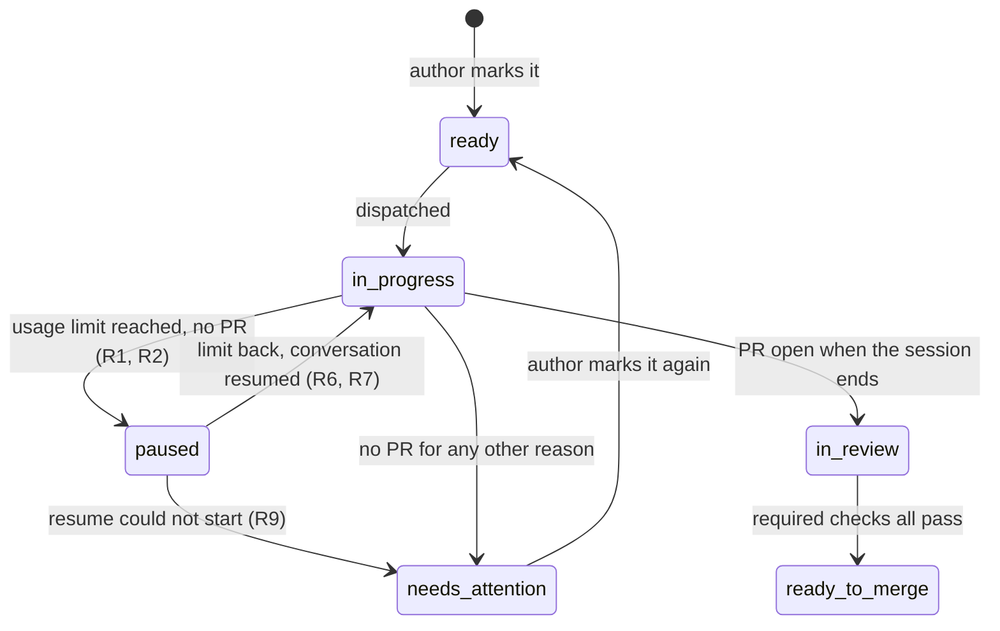
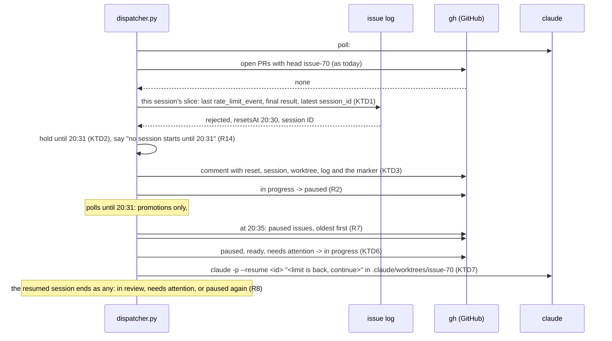

# Dispatcher waits out the usage limit - Plan

## Goal Capsule

- **Objective:** when the Claude usage limit runs out, the dispatcher's work waits for it to come back instead of failing. No issue lands in `needs attention` because of the limit, and work stopped by the limit continues where it stopped once the limit is back.
- **Means:** the limit and its reset are read from the session's own log (KTD1, KTD2), recorded in a marker on the issue's pause comment (KTD3), and the conversation is resumed with `claude -p --resume` in the kept worktree once the hold is over (KTD7).
- **Product authority:** the Product Contract below. It extends `docs/plans/2026-10-01-1616-feat-issue-dispatcher-plan.md`; where the two differ on a limit ending, this one wins.
- **Stop conditions:** stop and report when `claude -p --resume` or `gh issue view --json comments` lacks what KTD3 or KTD7 relies on, or when a unit's tests cannot stay pure (no `gh`, no `claude`, no sockets).
- **Execution profile:** Standard depth, five units, each one commit, in dependency order; `tools/dispatcher/dispatcher.py` stays one stdlib-only script.
- **Who finishes:** ce-work implements the units in order and runs the Verification Contract; lfg ships the pull request. Nothing here is a release: `custom_components/pururu/manifest.json` keeps its version.

---

## Product Contract

Product Contract preservation: restructured, no scope change. R3's "identifies the session" is the hidden marker of KTD3, and R9 also covers a `paused` issue whose marker cannot be read (KTD3). Key Decisions, R1–R14 and AE1–AE7 are kept verbatim. The Deferred-to-Planning questions are resolved in KTD1–KTD7 and removed here.

### Summary

The dispatcher recognizes a session that stopped because the usage limit was reached. That issue moves to a new `paused` label, and no session starts until the limit is back. Then the paused sessions resume first, each in its own conversation and worktree, and the dispatcher goes back to taking `ready` issues.

### Problem Frame

Today a session that hits the usage limit ends without a pull request, and the dispatcher judges it like any other failure: the issue moves to `needs attention` (`judge` in `tools/dispatcher/dispatcher.py`). The author has to add `ready` again, and the new dispatch starts from a new worktree off `main`, so the work done before the limit is not reused.

The dispatcher also keeps taking `ready` issues while the limit is spent. Each new session hits the same limit and fails the same way, so one exhausted limit can move the whole queue to `needs attention`.

Claude Code says why a session stopped. The error is `rate_limit`, and the message gives the reset time, for example `You've hit your session limit · resets 8:30pm (America/Sao_Paulo)`. A headless session can be resumed by its ID with `claude -p --resume <session-id>`.

### Key Decisions

- **A paused session resumes its own conversation.** It keeps the context of what it already did and spends fewer tokens than starting over. Governs R6. (session-settled: user-directed — chosen over a new `lfg` run in the same worktree and over a new worktree from `main`: the conversation already holds the plan and the work done.)
- **A new `paused` label, with a comment.** `in progress` keeps meaning "a session runs now". Governs R2, R3. (session-settled: user-directed — chosen over keeping `in progress` with a comment only, and over no sign on GitHub at all.)
- **A paused issue survives a stop and a restart.** A paused issue has no process running, so stopping the dispatcher loses nothing. Governs R10, R11. (session-settled: user-directed — chosen over moving paused issues to `needs attention` on stop, which would throw away paused work at every Ctrl-C.)
- **The reset time comes from the limit message.** When the message gives none, the dispatcher tries again at each poll. Governs R4, R5. (session-settled: user-approved — chosen over probing the limit with test calls, which spend tokens.)
- **Paused issues come before `ready` ones, within the session limit.** Governs R7. (session-settled: user-approved — work already started finishes before new work begins.)
- **No cap on pauses.** A resumed session that hits the limit again just pauses again. Governs R8. (session-settled: user-approved — each resume makes progress, and every other ending still goes to `in review` or `needs attention`.)

### Requirements

**Recognizing a limit ending**

- R1. When a session ends without an open pull request because the Claude usage limit was reached, the dispatcher treats it as a limit ending; every other ending is judged as today.
- R2. A limit ending moves the issue from `in progress` to `paused` and leaves its worktree and branch in place.
- R3. The pause comment says the limit was reached and when it resets, when the message says so. It also identifies the session well enough to resume it later.

**Pausing dispatch**

- R4. From a limit ending until the reset time, the dispatcher starts no session, neither a new dispatch nor a resume; sessions already running keep running.
- R5. When no reset time is known, the dispatcher tries again at the next poll.

**Waking paused work**

- R6. Once the limit is back, a paused issue resumes the same Claude conversation in its own worktree, told that the limit is back and to continue, and moves from `paused` to `in progress`.
- R7. Paused issues take free slots before `ready` issues, oldest first, within the session limit; the others stay `paused` until a slot frees.
- R8. A resumed session's ending is judged like any session's: by R1 and R2 again, or as `in review` or `needs attention` as today.
- R9. A resume that cannot start moves the issue to `needs attention`, with the reason in the comment.

**Stop and restart**

- R10. Stopping the dispatcher leaves `paused` issues as they are; running sessions are handled as today.
- R11. On start, a `paused` issue is not an orphan. The dispatcher finds its session and reset time from GitHub alone, with no state file, and resumes it under R6 and R7.
- R12. An issue whose `paused` label the author removed is never resumed.

**Visibility**

- R13. The dispatcher creates the `paused` label on start when it is missing, as it does the other labels.
- R14. The dispatcher's output says when dispatch pauses and until when, and the dispatcher's docs page describes the `paused` label, the pause and the resume.

### Label lifecycle

New states and arrows are `paused` and the ones touching it; the rest is unchanged.



### Acceptance Examples

- AE1. **Covers R1, R2, R3, R4.** Given the session limit is 2, #70 and #72 run, and #74 is `ready`. #70's session stops at 15:10 with `resets 8:30pm`. Then #70 carries `paused` and a comment naming 20:30, and #74 is not dispatched although a slot is free. #72 keeps running until it ends on its own.
- AE2. **Covers R6, R7.** Given #70 and #72 are `paused`, #74 is `ready`, and the session limit is 2. At the first poll after 20:30, #70 and #72 resume in their worktrees and carry `in progress`. #74 waits for a free slot.
- AE3. **Covers R8.** Given #70 resumed, when its session opens a pull request and ends, #70 moves to `in review` as today. Had it hit the limit again, it would carry `paused` again.
- AE4. **Covers R10, R11.** Given #70 is `paused` with a reset at 20:30, the author stops the dispatcher at 18:00 and starts it again at 21:00. Then #70 does not move to `needs attention`, and it resumes at the first poll.
- AE5. **Covers R1.** Given a session stops at a permission `auto` does not grant, with no pull request, the issue moves to `needs attention` as today.
- AE6. **Covers R5.** Given a limit message with no reset time, at the next poll the dispatcher tries again. If the limit is still spent, the issue is `paused` again.
- AE7. **Covers R12.** Given #70 is `paused` and the author removes the label, #70 is never resumed, after the reset or after a restart.

### Scope Boundaries

- Stopping dispatch before the limit is reached, from Claude Code's near-limit warnings.
- Getting around the limit: extra usage, another account, another model.
- Stopping sessions that still run when another one hits the limit: they end on their own.
- A cap on how many times one issue pauses.
- GitHub's own API rate limit for `gh`.

### Dependencies / Assumptions

- A headless `claude -p` session that hits the usage limit exits instead of waiting, and its output says so with the reset time. The wording above comes from local Claude Code transcripts of 2026-10-01, not from a dispatcher log: no dispatcher session has hit the limit yet.
- `claude -p --resume <session-id>` exists in Claude Code 2.1.287 (checked with `claude --help`). The session ID is assumed to be in the session's `stream-json` output, which the dispatcher already writes to the issue's log.
- The weekly limit ends a session the same way as the session limit, with its own wording and a reset that can be days away.

### Sources / Research

- `tools/dispatcher/dispatcher.py`: `judge` (an ending without a pull request needs attention), `Sessions.reason` (the last `result` event of the session's log), `orphans` (start), `Dispatcher.stop`, `LABELS`.
- `docs/develop/dispatcher.mdx`: the labels table, and the line saying a session has no time or cost limit.
- `docs/plans/2026-10-01-1616-feat-issue-dispatcher-plan.md`: R10 and R11, the failure and orphan rules this plan narrows for limit endings.

---

## Planning Contract

### Key Technical Decisions

- KTD1. **A limit ending is read from the session's own slice of its log, from structured events only, before any GitHub write.** The reader walks the top-level `stream-json` events from `Running.since`, never the text inside `assistant` or `user` events, so tool output quoting the limit wording cannot pause an issue (this repository's own plans quote it). A session is a limit ending when it has no open pull request, its final `result` event is absent or an error, and either the last `rate_limit_event` of the slice says `rejected` or that `result` event's own text names a usage limit (`hit your … limit`, `usage limit reached`). A session whose final `result` is a success is never a limit ending, even after a `rejected` event: extra usage may have covered it. Rationale: Claude Code 2.1.287 emits `rate_limit_event` with `rate_limit_info.status` in `allowed`, `allowed_warning`, `rejected` (read from the installed binary); the text match is the fallback for a limit the CLI reports only in the result. Governs R1.
- KTD2. **The reset is `resetsAt` of the last `rejected` event, in epoch seconds, plus a 60-second margin; the hold is the latest known reset and is never shortened.** No wall-clock text is parsed: a `resetsAt` is absolute, so the zone, the day roll-over and laptop sleep are no concern. Without `resetsAt` the reset is unknown (R5, KTD4). Two limit endings, or a weekly limit arriving during a session-limit hold, keep the later reset. The clock is the wall clock (`time.time`), injected into the dispatcher for tests. (session-settled: user-approved — instantiates "The reset time comes from the limit message", chosen over probing the limit with test calls; governs R4, R5.)
- KTD3. **The pause comment carries a hidden marker, written before the label swap, and only the `gh` user's markers count.** The marker is an HTML comment on the comment's last line holding JSON: the session ID (a UUID), the branch (`issue-N` or `issue-N-k`, N the issue's number) and the reset (epoch seconds or null). The worktree is `.claude/worktrees/<branch>` by construction, so the marker carries no path. A pause posts the comment first and swaps the labels second, so `paused` never exists without its marker; a retry after a failed swap may repeat the comment, and the newest valid marker wins. The dispatcher reads a paused issue's markers with `gh issue view --json comments`, keeps only comments by the `gh` login (the repository is public, and the session ID becomes a `claude --resume` argument), and takes the newest whose session is a UUID and whose branch names the issue. A `paused` issue with no valid marker moves to `needs attention` (R9). (session-settled: user-directed — instantiates "A paused issue survives a stop and a restart", chosen over moving paused issues to `needs attention`; governs R3, R9, R11.)
- KTD4. **An unknown reset holds starts for the poll that read it; the next tick starts one session, a paused one first.** That one session is the retry R5 asks for: it re-pauses when the limit is still spent (with its reset, when the CLI now gives one), or keeps running, and the tick after that starts normally. One probe, not a slot's worth, keeps a spent limit from creating worktrees for `ready` issues and from re-pausing every paused issue at every poll. Governs R5.
- KTD5. **A re-pause whose marker equals the one the session resumed from swaps labels without a comment.** A new session ID or a new reset is news and gets a comment; the same session with the same unknown reset is not, so a day-long limit at `--every 300` does not post hundreds of comments. The resumed `Running` carries the marker it resumed from, so no GitHub read is needed.
- KTD6. **`pick` skips an issue carrying `paused`, and the resume swap removes `paused`, `ready` and `needs attention` and adds `in progress`.** An author adding `ready` to a paused issue gets the resume, never a fresh worktree beside the paused conversation. Paused issues are resumed in creation order, as the ready queue is, and a blocker does not hold a resume: the work has started. Governs R7, R12.
- KTD7. **A resume is `claude -p --resume <session-id> "<prompt>"` with the dispatch flags, in the worktree of the marker's branch, its output appended to the issue's log with a new `since`.** The prompt says the Claude usage limit that stopped the session has reset, to continue `/compound-engineering:lfg #N` where it stopped, and repeats that the pull request body must contain `Closes #N`. The resumed `Running` keeps the marker's branch, so `read`'s `gh.head(branch)` finds the pull request, and the latest `session_id` seen in the slice is the one a later pause records (a resume may fork the ID). A resume whose worktree folder is missing raises before spawning and moves the issue to `needs attention` with the reason (R9). A resume that starts and fails, for example because the transcript expired, ends without a pull request and is judged as today (R8). (session-settled: user-directed — instantiates "A paused session resumes its own conversation", chosen over a new `lfg` run and over a new worktree; governs R6, R8, R9.)
- KTD8. **On start the hold is rebuilt from the paused issues' markers only.** The latest future reset among them holds; an unknown reset makes the first tick a probe (KTD4); no paused issue means no hold. When the author removed every `paused` label, one dispatch may start into a spent limit, end at once as a limit ending and pause with its reset, which restores the hold: one worktree and one failed start, nothing lost. Rationale: a durable record elsewhere would be the state file the settled decision rules out. Governs R11.
- KTD9. **Stop never touches a paused issue, and judges an ended limit session as a poll would.** Paused issues are not in `running`, so `stop` has nothing to end or mark for them. A session that ended at the limit before Ctrl-C is paused through `judge`, and a live one is still ended and marked `needs attention` as today. Governs R10.

### High-Level Technical Design

The four parts of `tools/dispatcher/dispatcher.py` each grow a little. The pure core gets the `paused` label, a `Marker` (session, branch, reset), a `Hold` (until, probe), a `Resume` action, a limit-aware `judge`, and a `tick` that takes the clock and the hold. `Sessions` gets a log reader for the limit and a `resume` beside `start`. `GitHub` gets the label, the markers of an issue and a comment-first move. `Dispatcher` gets the clock, the hold and the resume path. Directional shape of the tick:

```text
tick(snapshot, running, sessions, now, hold) ->
  promoted   = in-review issues whose required checks pass (as today)
  held       = hold has an `until` and now is not past it          -> promoted only (R4)
  cap        = 1 when hold is a probe (KTD4), else free slots
  resumed    = first `cap` paused issues not running, creation order, blockers ignored (R7, KTD6)
  dispatched = next `cap - len(resumed)` ready issues by pick, which skips paused (KTD6)
```

The hold folds every limit ending into itself and is read from the logs before any GitHub write, so a pause whose move failed still holds dispatch (the move is retried from `pending` as today):

```text
hold.extend(reset, now) ->
  known reset   -> until = max(until, reset + 60 s); no probe
  unknown reset -> until = max(until, now); probe = True when `now` is the max
a tick that runs past `until` clears the hold; a probe caps that one tick at one start
```

The limit path, from the ending to the resume:



Start-up order becomes: labels (the `paused` one included, R13), orphans of `in progress` as today, then the hold from the paused issues' markers (KTD8), then the loop. A `paused` issue is read through the same GraphQL query as the other labels, so a removed label drops it from the snapshot at the next poll (R12).

Considered and not built:

- Checking for a hand-opened pull request before resuming: the resumed `lfg` finds it, and the ending is judged `in review`.
- Cleaning up the worktree of a paused issue the author closed: closed issues leave the query, and worktrees are never removed today either.
- Stopping dispatch on `allowed_warning`: out of scope per the Product Contract.

A limit hit after the pull request is open is judged `in review` as today; the docs say so.

### Assumptions

- A headless `claude -p` run that hits the limit exits with a `rate_limit_event` whose `status` is `rejected`, a `result` event naming the limit, or both; the first real limit ending confirms which (Verification Contract). A run that waits instead keeps its slot and costs nothing.
- Every `stream-json` message carries `session_id`, the first being `system`/`init`, so a limit ending with an event has an ID. A run that exits before any event is not detected and is judged as today, which the hold and the probe make rare.
- `claude -p --resume <uuid>` finds the conversation by ID from the same working directory, with `--permission-mode auto` and `stream-json` as a dispatch, and the transcript still exists within Claude Code's cleanup period, which a weekly reset stays within.
- `gh issue view <N> --json comments` returns each comment's `author` login, `body` and `createdAt`, oldest first (fields checked on 2026-10-01); the newest marker is the last valid one among the comments it returns.
- `subprocess.Popen` raises an `OSError` for a missing working directory; `Sessions.resume` checks the folder itself so the fake spawn sees the same rule.
- `gh issue edit --remove-label` succeeds for a label the issue does not carry, as the dispatch swap already relies on.

### Risks

- The limit's shape in a `-p` log is unobserved. A wording or schema the rule misses sends the issue to `needs attention` as today, with its log; the manual check after merge catches it, and the rule gains a signal.
- A resume into a conversation whose transcript is gone, or whose session ID forked, fails: the issue needs attention with the reason, and the worktree keeps the work.
- A flaky label swap after a posted pause comment repeats the comment at the retry; the newest marker wins, so nothing breaks.
- A weekly limit holds every start for days; the dispatcher idles and says so once, which the docs explain.
- A resumed process whose first request is refused may log no `rejected` `rate_limit_event` (the CLI emits one when a window's reset or percentage moves), leaving only the result text and an unknown reset. A spent multi-hour limit then falls back to one probe resume every other poll, each adding a "limit is back" turn to the paused conversation; KTD5 keeps those re-pauses from commenting, and the manual check after merge looks at a probe's log too.

---

## Implementation Units

### U1. The pure core: limit endings, the hold and resumes

**Goal:** the pause verdict, the hold and the resume order as pure functions over plain data.

**Requirements:** R1, R2, R3, R4, R5, R7, R8, R11, R12; KTD1 (the verdict's inputs), KTD2, KTD4, KTD5, KTD6, KTD8.

**Dependencies:** none.

**Files:** `tools/dispatcher/dispatcher.py`, `tools/dispatcher/test_dispatcher.py`.

**Approach:**

1. Add the `paused` label constant and the records: `Marker` (session, branch, reset or none), `Hold` (until or none, probe), the `Resume` action. Give `Ended` the limit read from the log (a `Marker` or none) and the marker it resumed from (or none). Give `Snapshot` the paused issues, oldest first.
2. Make `judge` return the pause for a limit ending: `in progress` to `paused`, comment first. The comment says the limit was reached, gives the reset in the machine's local zone with its zone name (or says it is unknown and tried again at the next poll), and names the session ID, the worktree and the log, with the marker on its last line. No comment when the marker equals the resumed one (KTD5). An ending with a pull request stays `in review`; one without a limit stays `needs attention`.
3. Write the hold's fold (`extend`) and the restart rule over markers (KTD2, KTD8), with the 60-second margin as a named constant, and a small helper formatting an epoch for comments and output lines.
4. Make `pick` skip `paused`, and give `tick` the clock and the hold: promotions always, then no start while held, then resumes before dispatches under the probe's cap (KTD4, KTD6).
5. Let `needs_attention` take the label it removes, so R9's move leaves `paused`.

**Patterns to follow:** the module's frozen dataclasses with a one-line docstring each, `tick`'s docstring telling what the caller already took out of `running`, and the test file's `ready`/`ended` helpers with literal data.

**Test scenarios:**

- Covers AE1. `judge` of an ended #70 with no pull request and a limit marker (a UUID, `issue-70`, a reset at 20:30 local): one `Move` removing `in progress`, adding `paused`, commenting first, the comment naming `20:30`, the session ID, the worktree, the log and the marker line; no `Link`.
- Covers AE5. `judge` of an ended #74 with no limit: `needs attention` as today, the existing test unchanged.
- An ended session with a pull request open and a limit marker: `in review` as today, no pause.
- Covers AE1. `tick` at 15:10 with a hold until 20:31, one `ready` issue, a free slot and a passing review: the promotion only, no `Dispatch`.
- Covers AE2. `tick` at 20:35 with no hold, paused #70 and #72 (#72 blocked by one open issue), ready #74, two slots, none running: `Resume(70)`, `Resume(72)`, no `Dispatch`.
- The same with three slots: `Resume(70)`, `Resume(72)`, `Dispatch(74)`; with #70 running and two slots: `Resume(72)`, `Dispatch(74)`.
- Covers AE6. `tick` with a probe hold, paused #70 and #72 and two slots: `Resume(70)` only.
- A probe hold with no paused issue and ready #74 and #75: `Dispatch(74)` only.
- Covers AE7. `tick` past the reset with no paused issue in the snapshot: no `Resume`.
- An issue carrying both `ready` and `paused`: never a `Dispatch`, a `Resume` when a slot is free.
- Covers AE3. `judge` of a resumed #70 (a resumed marker) ending with a pull request: `in review`.
- A resumed #70 ending with a limit whose reset differs from the resumed marker: `paused` with a comment; ending with a limit whose marker equals the resumed one: `paused` with no comment.
- The hold: extending none with a reset gives until reset plus 60 s; extending with an earlier reset keeps the later one.
- The hold: extending a known future hold with an unknown reset keeps it, with no probe; extending none with an unknown reset at `now` gives until `now` with a probe.
- `tick` at exactly `until` is still held; one second later it is not.
- Covers AE4. The restart rule at 18:00 over markers with resets 20:30 and 21:00 gives a hold until 21:01; at 21:00 over resets all in the past, no hold; over one marker with an unknown reset, a probe.

**Verification:** every scenario passes, and the core still uses nothing from `subprocess`.

### U2. The session runner: the limit reader and the resume

**Goal:** the limit and session ID read from a session's slice of its log, and a headless resume beside the dispatch.

**Requirements:** R1, R5, R6, R9; KTD1, KTD2, KTD7.

**Dependencies:** U1 (`Marker`).

**Files:** `tools/dispatcher/dispatcher.py`, `tools/dispatcher/test_dispatcher.py`.

**Approach:**

1. Write the slice reader `Sessions.limit`: parse each JSON line from `since` as `reason` does, keep the latest `session_id`, the last `rate_limit_event`'s status and `resetsAt`, and the final `result` event's `is_error` and text. Apply KTD1's rule and return a `Marker` with the running session's branch, or none. Share the line walk with `reason` rather than reading the file twice.
2. Write `Sessions.resume`: the worktree is `.claude/worktrees/<branch>`, and a missing folder raises `FileNotFoundError` before any spawn. The log is opened in append mode with `since` at its end. The command is `claude -p --resume <session> <prompt>` plus `FLAGS`, with the same `cwd`, `stdin`, `stdout`, `stderr` and `start_new_session` as `start`. The result is a `Running` carrying the marker it resumed from.
3. Write the resume prompt as a module constant beside `PROMPT` (KTD7).

**Patterns to follow:** `Sessions.start` and `Sessions.reason` as they are; the test file's `sessions(tmp_path, git)` helper and its JSON-lines logs written by hand.

**Test scenarios:**

- Covers AE1. A slice with `system`/`init` carrying session A, a `rate_limit_event` with status `rejected` and `resetsAt` T, and a `result` with `is_error` true: the marker is (A, the branch, T).
- A slice whose `rejected` event is followed by a `result` with `is_error` false: no marker.
- A slice whose `user` event holds a tool result quoting `You've hit your session limit · resets 8:30pm` and whose `result` is an error saying `Stopped: blocked`: no marker (the quoting trap).
- The same slice whose `result` text names the limit instead: a marker with an unknown reset (R5).
- A `rejected` event before `since`, from an earlier attempt, and a plain error after it: no marker.
- Covers AE3. A slice with `init` carrying session A, then a later event carrying session B: B is the marker's session.
- An empty slice (the process exited before any output): no marker, and `reason` still reports the exit code.
- `resume(70, marker)` with the worktree folder present: the spawned command is `claude -p --resume <uuid> <prompt> --permission-mode auto --output-format stream-json --verbose`; the prompt names `#70`, says the limit is back and to continue, and holds `Closes #70`.
- The same resume: `cwd` is `.claude/worktrees/issue-70`, `start_new_session` is true, `since` is the log's size before the spawn, and the `Running` carries the marker and the branch.
- Covers R9. `resume` with no folder at the marker's branch: `FileNotFoundError`, no spawn.

**Verification:** the runner reads only the session's own slice and never GitHub, and a resumed session appends to the issue's existing log.

### U3. The GitHub record: the label, the markers and the comment-first move

**Goal:** the `paused` label, the marker's encoding and reading, and a move that comments before it swaps.

**Requirements:** R3, R11, R13; KTD3.

**Dependencies:** U1 (`Marker`, `Move`).

**Files:** `tools/dispatcher/dispatcher.py`, `tools/dispatcher/test_dispatcher.py`.

**Approach:**

1. Add `paused` to `LABELS` with a colour and the description "The session hit the usage limit; it resumes when the limit is back".
2. Write the marker's encoding (an HTML comment holding JSON on one line) and its decoding from a comment body, validating the session as a UUID and the branch as `issue-N` or `issue-N-k` for the issue.
3. Write `GitHub.markers(issue)` over `gh issue view <N> --json comments`: comments by the `gh` login only, decoded, the newest valid one returned or none.
4. Give `Move` a comment-first flag the gateway honours: the comment, then the swap.

**Patterns to follow:** `GitHub.head` and `GitHub.link` (one `gh` call, JSON parsed into the core's records, forks and strangers filtered at the gateway) and the `FakeGh` scripts with recorded replies.

**Test scenarios:**

- Covers R13. `ensure_labels` with a label list lacking `paused`: exactly `paused` is created, with its colour and description; the existing missing-labels test adds it to its expectation.
- A recorded `issue view 70 --json comments` reply with a stranger's marker, the user's marker whose session is not a UUID, the user's marker whose branch is `issue-71`, and the user's valid marker, in that order: the valid one is returned.
- The same reply without the valid marker: none.
- Two valid markers by the user: the newest (last) is returned.
- The marker round trip: a `Marker` with an unknown reset encodes to one line that decodes back; a body without a marker decodes to none.
- A comment-first `Move`: the recorded calls are `issue comment` then `issue edit`; a plain `Move` keeps today's order.

**Verification:** `gh` is still spelled only in the gateway, and a marker from anyone but the `gh` login never reaches the core.

### U4. The dispatcher: the clock, the hold and the resume path

**Goal:** polls hold starts while the limit is spent, pause limit endings, and resume paused issues, from GitHub alone across a restart.

**Requirements:** R2, R4, R5, R6, R7, R9, R10, R11, R12, R14; KTD2, KTD4, KTD5, KTD7, KTD8, KTD9.

**Dependencies:** U1, U2, U3.

**Files:** `tools/dispatcher/dispatcher.py`, `tools/dispatcher/test_dispatcher.py`.

**Approach:**

1. Give `Dispatcher` an injected clock and a `hold`. `read` adds the limit (U2) to `Ended` when the branch has no pull request, with the `Running`'s resumed marker.
2. `poll` reads the injected clock once, at its start, and passes that one `now` to every `hold.extend` and to `tick`, so an unknown reset (`until = now`) still holds the tick of the poll that read it (KTD4).
3. In `poll`, after the snapshot and before `settle`, fold every ended session's limit into the hold, and say once when it changed: until when, or that the reset is unknown and one session is tried at the next poll (R14). The snapshot reads the paused issues through `issues(paused)`.
4. Pass `now` and the hold to `tick`, and clear the hold after a tick that ran past it.
5. Apply `Resume` through a `resume` method that mirrors `dispatch`: read the markers (U3), and with none valid move `paused` to `needs attention` with the reason (R9); swap `paused`, `ready`, `needs attention` to `in progress`; call `Sessions.resume`, an `OSError` giving `needs attention` with the reason; say a line naming the worktree and the log.
6. In `start`, after the orphans, read the paused issues' markers and rebuild the hold (KTD8), saying it as in step 3.
7. Leave `stop` as it is: paused issues are not in `running`, and `settle` already pauses an ended limit session (KTD9).
8. Update the module docstring: the `paused` label, the hold, the resume, and that Ctrl-C leaves paused issues alone.

**Patterns to follow:** `Dispatcher.dispatch` (swap, start, failure to `needs attention`, say lines) and `Dispatcher.poll`'s read-then-write order; the test file's `FakeGitHub` (extended with the markers it answers, as a write-free read), `FakeSpawn`, `FakeProcess`, and the `ended_session`/`two_sessions` helpers; a fake clock as a mutable list or closure.

**Test scenarios:**

- Covers AE1. Two slots, #70 and #72 running, #74 `ready`; #70's process exits 0 and its slice shows `rejected` with `resetsAt` 20:30 at clock 15:10. `poll`: #70 moves to `paused` with a comment naming `20:30` and the marker, #74 is not dispatched, #72 is still in `running`, and a say line names the hold's end.
- The same dispatcher at 15:15: still nothing starts.
- Covers AE2. `FakeGitHub` answers `paused` with #70 and #72 and their valid markers, `ready` with #74; two slots, clock 20:35, no hold. `poll`: two spawns with `--resume` and each marker's session, cwds `.claude/worktrees/issue-70` and `.claude/worktrees/issue-72`, #70 and #72 moved to `in progress`, #74 not dispatched, both in `running` with their branches.
- Covers AE3. A resumed #70 whose process exits with a pull request on `issue-70`: `in review` with the link, as today.
- A resumed #70 exiting with a limit whose reset differs from the marker's: `paused` with a new comment; with the same session and an unknown reset again: `paused` with no comment.
- Covers AE4. `start()` at 21:00 with #70 `paused` (marker reset 20:30) and nothing `in progress`: no `needs attention`, and the first `poll` resumes #70.
- `start()` at 18:00 with the same #70: the first `poll` resumes nothing and says the hold's end.
- Covers AE6. A limit ending with an unknown reset at poll k: no start at poll k. At poll k+1 with #70 and #72 paused: one resume, #70. At poll k+2 with #70 still running: #72 resumes.
- The same unknown-reset ending with a fake clock that advances one second on every call: still no start at poll k.
- Covers AE7. Past the reset, and after a restart, `FakeGitHub` answers no `paused` issue: nothing resumes, no `--resume` spawn.
- Covers R9. A `paused` #70 whose comments hold no valid marker: one move `paused` to `needs attention` whose comment says no pause record was found.
- Covers R9. A valid marker whose worktree folder is missing: moves to `in progress`, then to `needs attention` with the reason, and `running` stays empty.
- Covers R10. `stop()` with #70 `paused` on GitHub and #75 live: #70 gets no write, and #75 is terminated and marked `needs attention` as today.
- `stop()` with #74 exited at the limit: #74 is `paused`, not `needs attention`.
- A pause move that fails once (`flaky`): the hold still holds dispatch in the same poll, and the move is retried once at the next poll (the existing `pending` path).

**Verification:** `uv run pytest tools -n 0 -q` passes, and `python3 tools/dispatcher/dispatcher.py` prints a usage that names `paused`.

### U5. Docs

**Goal:** the contributor page describes the `paused` label, the hold and the resume, and the testing page names the new coverage.

**Requirements:** R14.

**Dependencies:** U4 (the final wording of the output lines and the comment).

**Files:** `docs/develop/dispatcher.mdx`, `docs/develop/testing.mdx`.

**Approach:**

1. In `docs/develop/dispatcher.mdx`, add the `paused` row to the labels table and the three arrows to the diagram.
2. Add a "Usage limit" section: how a limit ending is recognized (the session's own log, structured events); what the pause comment holds (reset, session ID, worktree, log, a hidden marker the dispatcher reads back); that no session starts until the reset plus a minute; what happens with no reset known (one session tried at the next poll); how a resume works (`claude -p --resume` in the same worktree, oldest first, before `ready` issues).
3. In the same section, say that removing `paused` stops the resume, a closed paused issue keeps its worktree, a weekly limit can hold for days, a limit hit after the pull request is open ends `in review` as today, and a resume that cannot start needs attention.
4. Replace "A session has no time or cost limit" with the limit's behaviour, and in "Stopping and restarting" say paused issues survive both.
5. In `docs/develop/testing.mdx`, extend the `tools/dispatcher/test_dispatcher.py` row with the usage limit, the pause and the resume.
6. Keep `{`, `<` and `#` references inside backticks or code blocks; the marker example goes in a code block.

**Patterns to follow:** the page's existing sections ("Where things are", "Stopping and restarting", "Sessions") and its table.

**Test scenarios:**

- Test expectation: none -- documentation only; the docs gates in the Verification Contract cover it.

**Verification:** the labels table and the diagram name `paused`, and the page no longer says a session has no limit.

---

## Verification Contract

| Gate | Command | Proves |
|---|---|---|
| Dispatcher tests | `uv run pytest tools -n 0 -q` | every scenario of U1 to U4 |
| Whole suite | `uv run pytest` | `tests/test_code.py`, ruff, mypy and hassfest unchanged, since nothing under `custom_components/pururu` changes |
| Docs tests | `uv run pytest -m docs` | the docs tests still pass with the changed pages |
| Docs links | `pnpm docs:check` (after `pnpm install` once) | no broken links in the changed pages |
| Usage | `python3 tools/dispatcher/dispatcher.py` | the usage names `paused` |

Manual check after merge, not blocking: at the first real limit ending, `tools/dispatcher/.state/logs/issue-N.log` shows which signal the session emitted (`rate_limit_event` with `rejected`, a `result` naming the limit, or both). The issue carries `paused` with the comment and the marker, the dispatcher's output names the hold's end, and the first poll past it resumes the session in its worktree. When a probe resume runs into a still-spent limit, its log shows whether the resumed process emitted a `rejected` event with `resetsAt`. A log showing neither signal is filed as an issue with the final events quoted.

---

## Definition of Done

**Global**

- All five units merged in one pull request, with the Verification Contract green.
- `custom_components/pururu/manifest.json`'s version unchanged: this is not a release.
- No abandoned-attempt code: no wall-clock text parsing, no worktree path in the marker, no unused record field, flag or seam from an approach the units replaced.
- `tools/dispatcher/dispatcher.py` is still one stdlib-only script, and its tests still run without `gh`, `claude` or sockets.

**Per unit**

- U1: `judge`, `pick`, `tick`, the hold's fold and the restart rule cover the pure parts of AE1 to AE7, with nothing from `subprocess`.
- U2: the limit reader reads only the session's slice and only structured events, the quoting-trap test passes, and the resume command line matches KTD7.
- U3: `paused` is created when missing, markers by anyone but the `gh` login are dropped, and a pause's comment precedes its swap.
- U4: the hold is set from the log before any GitHub write, resumes come before dispatches and under the probe's cap, R9 and R10 behave as the scenarios say, and the output names the hold's end.
- U5: `docs/develop/dispatcher.mdx` describes the label, the pause and the resume, and the "no time or cost limit" sentence is gone.
