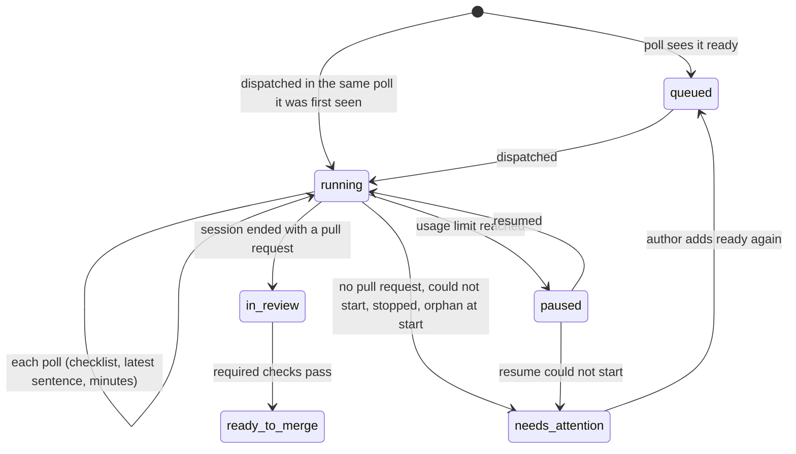

# Dispatcher status report - Plan

## Goal Capsule

- **Objective:** the author opens any issue the dispatcher handles and sees, in one comment, where it stands: queued and why it waits, which lfg stage its session is in and what the session last did, or how it ended. No need to open the session log on the Mac.
- **Means:** the dispatcher keeps one status comment per issue, finds it again by a hidden marker (KTD1) that also stores the checklist (KTD2), and fills the checklist from the session's log (KTD3).
- **Product authority:** the Product Contract below. It builds on `docs/plans/2026-10-01-1758-feat-dispatcher-usage-limit-plan.md` (the `paused` label, its hold and its pause marker), whose behavior it does not change.
- **Open blockers:** none. The usage-limit work (pull request #88) is on `main`; this plan's units build on its `paused` label, `Hold`, `Sessions._events`, `local_time` and its test file at `tools/dispatcher/tests/test_dispatcher.py`.
- **Stop conditions:** stop and report when the usage-limit work is not on `main`, or when `gh api` cannot list, create or edit an issue comment as KTD1 relies on.
- **Execution profile:** Standard depth, five units in dependency order, each one commit; `tools/dispatcher/dispatcher.py` stays one stdlib-only script.
- **Who finishes:** ce-work implements the units and runs the Verification Contract; lfg ships the pull request. Nothing here is a release: `custom_components/pururu/manifest.json` keeps its version.

---

## Product Contract

Product Contract preservation: changed: R3 (adds the usage-limit hold as a reason to wait), R11 and R12 added (the `paused` comment, and which states create the comment), AE7 and AE8 added. Both follow the usage-limit dependency and were confirmed by the author during planning. The Deferred-to-Planning questions are resolved in KTD1–KTD5 and removed here.

### Summary

Each issue the dispatcher touches gets a single status comment, always the same one, edited in place.
In the queue it says why the issue waits; while a session runs it shows a checklist of lfg's stages, the session's last sentence, how long it has run and when it was updated; after the session it shows how it ended.

### Problem Frame

Today the dispatcher comments only when a session ends: once with the pull request's link (`in review`), or once with the reason, worktree and log (`needs attention`).
While a session runs, which is most of an issue's time in the dispatcher, the issue shows only `in progress`.
Knowing whether the session is still planning, implementing or waiting on CI means reading `tools/dispatcher/.state/logs/issue-<N>.log` on the machine running the dispatcher.
Seeing only that a pull request opened is not enough.

### Key Decisions

- **One comment, edited in place, not a new comment per change.** Governs R1. (session-settled: user-directed — chosen over a new comment at each status change: the issue keeps one place to look instead of a growing history.)
- **The existing comments stay as they are.** Editing a comment sends no GitHub notification, so the comments that notify (pull request open, needs attention, pause) keep being posted. Governs R2. (session-settled: user-directed — chosen over folding them into the status comment, which would have stopped those notifications.)
- **The comment starts in the queue, not at dispatch.** Governs R3. (session-settled: user-directed — chosen over commenting only from `in progress` on, and over editing at every poll in every state.)
- **While running, a checklist of stages plus the session's last sentence.** Governs R5, R6. (session-settled: user-approved — chosen over the current stage alone, with or without the last sentence.)
- **The dispatcher reads the session's log; the session does not report itself.** It keeps working when the session hangs or dies, which is when the status matters most. Governs R7. (session-settled: user-approved — chosen over an instruction in the lfg prompt telling the session to edit the comment.)
- **A comment left behind when `ready` is removed stays as it was.** See Scope Boundaries. (session-settled: user-approved — chosen over an extra search each poll to mark such issues "not queued".)
- **A paused issue keeps its checklist, frozen, with the reset time.** Governs R11. (session-settled: user-approved — chosen over a status line alone, which loses where the session stopped.)
- **English text, matching the dispatcher's other comments and labels.** Governs R10.

### Requirements

**One comment per issue**

- R1. The dispatcher keeps exactly one status comment per issue: created the first time it reports on the issue, then edited in place, across dispatcher restarts, pauses and re-queues after `needs attention`.
- R2. The pull-request-open, needs-attention and pause comments are still posted as new comments, unchanged.
- R12. Only queuing or dispatching an issue creates its status comment; every later state edits an existing one, so an issue the dispatcher handled before this feature gets none.

**In the queue**

- R3. A `ready` issue the dispatcher sees in the queue gets the comment saying it is queued and why it waits: waiting for a free session, blocked by N open issues, or waiting for the usage limit to reset at a given time.
- R4. Outside a running session, the comment is edited only when its text changes.

**While the session runs**

- R5. At every poll while the session runs, the comment shows the stage checklist (R6), the last sentence the session narrated, how long the session has run, and when the comment was updated.
- R6. The checklist lists lfg's stages in order (plan, plan review, implementation, code review, pull request, CI), each marked done, current, pending, or skipped when lfg's route does not run it.
- R7. The stage and the last sentence come from the session's own log; the session is not asked to report anything.

**After the session**

- R8. When the issue moves to `in review`, the checklist shows the pull request done and CI current; when it moves to `ready to merge`, CI shows done.
- R9. When the issue moves to `needs attention`, for any of the dispatcher's reasons (session ended without a pull request, session could not start, resume could not start, dispatcher stopped, issue found `in progress` at start), the checklist freezes with the stage it stopped at marked failed.
- R11. When the issue moves to `paused`, the checklist freezes with the stage it stopped at marked paused, plus when the limit resets; when it resumes, the checklist continues from there.

**Text**

- R10. The comment is written in English.

### Acceptance Examples

- AE1. **Covers R1, R3, R4.** Given #74 is `ready` and blocked by 2 open issues, the first poll that sees it creates the comment "queued, blocked by 2 open issues". The next poll, with nothing changed, does not edit it. When one blocker closes, the comment says blocked by 1.
- AE2. **Covers R5, R6, R7.** Given #74's session has called `ce-plan`, then `ce-doc-review`, then `ce-work`, and last wrote "U1 committed (9073eb3): 1684 tests pass. Dispatching U2, the grammar change.", the comment shows plan and plan review done, implementation current, the rest pending, that sentence as the latest, and the running time in minutes.
- AE3. **Covers R6.** Given a session that takes lfg's bug route (no plan), the checklist shows plan and plan review as skipped, not pending.
- AE4. **Covers R2, R9.** Given the author stops the dispatcher with Ctrl-C while #74 is in implementation, #74 moves to `needs attention`; its status comment shows implementation failed and later stages pending, and a separate needs-attention comment is posted as today.
- AE5. **Covers R1.** Given the dispatcher restarts while #74 is `in review`, the next poll edits #74's existing status comment if anything changed; no second status comment appears.
- AE6. **Covers R8.** Given #74's session ended with an open pull request whose required checks are pending, the comment shows pull request done and CI current; a later poll that finds the checks passing moves #74 to `ready to merge` and shows CI done.
- AE7. **Covers R11.** Given #74's session hits the usage limit during implementation with a reset at 20:30, the comment shows plan and plan review done, implementation paused, and the reset time. When it resumes and its session calls `ce-code-review`, the comment shows implementation done and code review current.
- AE8. **Covers R12.** Given #60 was already `in review` before this feature, with no status comment, polls never create one for it.

### Scope Boundaries

- An issue whose `ready` label is removed while queued keeps its last status comment; the dispatcher does not look for it again.
- Edits notify no one; notifications stay with the existing comments (R2).
- No progress inside a stage, such as "unit 2 of 5"; the session's last sentence carries whatever it says.
- Nothing moves to the issue's body or to the pull request.
- Considered and not built: deleting or collapsing duplicate status comments. A duplicate exists only when a create succeeded but its reply was lost; the newest one wins (KTD1) and the older one is left. Evidence that would change this: duplicates seen in practice.

### Dependencies / Assumptions

- The session log is `claude -p`'s stream-json output: each skill lfg invokes appears as a `Skill` tool call inside an `assistant` event, and each narration line as a `text` block. Events from sub-agents carry a non-null `parent_tool_use_id`; the main thread's carry `null`. Checked on `tools/dispatcher/.state/logs/issue-77.log` and `issue-75.log` (Claude Code 2.1.287).
- The stage checklist depends on lfg's skill names and order (compound-engineering 3.30.1, `skills/lfg/SKILL.md` steps 1–10); a rename in lfg breaks the stage mapping (KTD3) until the dispatcher follows it.
- The repository is public. The session's last sentence is posted as written and may contain local paths, as the needs-attention comment's worktree and log paths already do.
- The usage-limit work is on `main` (pull request #88).

### Sources / Research

- `tools/dispatcher/dispatcher.py` on `main`: `judge`, `needs_attention`, `orphans`, `queue_lines` and `Dispatcher.poll`.
- `docs/plans/2026-10-01-1616-feat-issue-dispatcher-plan.md`: R9, R10 and KTD7 (the comments and the session's log).
- `docs/plans/2026-10-01-1758-feat-dispatcher-usage-limit-plan.md` (branch `worktree-improve-dispatcher`): KTD1 (reading the log's structured events only), KTD3 (the hidden pause marker, the `gh` login filter), KTD7 (resume).
- lfg's run, steps 1 to 10, in the compound-engineering plugin's `skills/lfg/SKILL.md`.

---

## Planning Contract

### Key Technical Decisions

- KTD1. **The status comment is the `gh` user's newest comment ending with a hidden `dispatcher-status` marker, listed, created and edited through `gh api`'s REST issue-comment endpoints.** The marker is an HTML comment on the body's last line, as the pause marker is (`<!-- dispatcher-status {json} -->`). Listing `repos/{owner}/{repo}/issues/<N>/comments` gives each comment's numeric `id`, author login and body; `POST` on the same path creates one; `PATCH repos/{owner}/{repo}/issues/comments/<id>` edits it. Only the `gh` login's comments count: the repository is public, and anyone could post a marker. When two exist, the newest wins. The dispatcher caches each issue's comment `id` and last body for the run, so the list call happens once per issue per run. Rationale: `gh issue comment --edit-last` edits the user's last comment, which may be a pause or needs-attention comment; the REST `id` round-trips without parsing URLs. Governs R1, R12.
- KTD2. **The marker's JSON holds the checklist's marks, and nothing else holds them.** The marks are one of `done`, `current`, `pending`, `skipped`, `failed`, `paused` per stage. A resume, a restart's orphans and a later `in review` or `ready to merge` read the marks from the comment rather than from a state file. A marker that is missing or unreadable reads as all pending. Rationale: the usage-limit plan already rules out a state file and keeps its durable record on GitHub (its KTD3, KTD8). Governs R1, R9, R11.
- KTD3. **Stages come from the main thread's `Skill` calls, mapped by skill name, and never move back.** Only `assistant` events whose `parent_tool_use_id` is null count, so a sub-agent's skills do not move the checklist. The name is matched after its plugin prefix (`compound-engineering:ce-plan` → `ce-plan`). The mapping, for lfg 3.30.1: plan ← `ce-plan`, `ce-brainstorm`; plan review ← `ce-doc-review`; implementation ← `ce-work`, `ce-debug`; code review ← `ce-simplify-code`, `ce-code-review`; pull request ← `ce-commit-push-pr`; CI ← `ce-babysit-pr`. Other skills (`ce-compound`, `ce-test-browser`, `ce-noslop`…) move nothing. The furthest stage entered is current, stages before it that were entered are done and the others skipped, and stages after it are pending. Before any mapped skill, plan is current. A resumed session's slice starts from the marks the comment holds (KTD2), its `paused` stage back to current. Governs R6, R7, R11.
- KTD4. **The last sentence is the main thread's last `text` block, on one line, at most 200 characters, inside a fenced `text` block.** Whitespace collapses to single spaces and a longer text is cut with an ellipsis. The fence is one backtick longer than the longest backtick run in the text, so nothing in it renders as Markdown: an `@mention`, an issue reference or a link in the session's words notifies no one. No sentence yet shows no block. Governs R5.
- KTD5. **A status write is an action, `Report`, applied after the label move it follows; it is retried only where nothing would recompute it.** A `Report` carries the issue, the target state and its details, and either explicit marks (running reports and `judge`'s final reports, whose marks come from the log) or a transition to apply to the comment's stored marks (ready to merge: CI done; in review, edit only: unchanged; orphan at start: stopped). The board resolves stored marks from its cached or listed comment inside `Dispatcher.apply`, so `tick`, `orphans` and `judge` stay pure and a comment read never happens in `snapshot()` or outside `apply` in `start()`. Running and queued reports are recomputed every poll, so a failed one is only logged (`dispatcher: #N status: <error>`). The final report of an ended session (in review, needs attention, paused) joins the move in `judge`'s actions, so a failed one rides the existing `pending` retry; needs-attention and paused issues are not re-read by later polls, so nothing else would correct a stale "running" comment. For the same reason a failed ready-to-merge report (from `tick`; `snapshot()` never reads `ready to merge` issues) and a failed needs-attention report from `dispatch` or `resume` (could not start) also join `pending`. A status write never blocks a label move: it comes after it, and its failure is caught like any `GhError`; the board raises unparseable `gh api` output (`ValueError`, `KeyError`) as `GhError`, since `apply` catches only `GhError` and anything else escapes `poll`, where `serve` stops every session. Governs R4, R8, R9, R11.
- KTD6. **"The text changes" means the body without its `Updated` line.** The dispatcher renders the body, strips that line, and compares it with the cached body (or the listed one after a restart) stripped the same way; equal bodies are not written. A running session's minutes change every poll, so a running comment is written every poll as R5 asks. Governs R4, R5.
- KTD7. **Times use the usage-limit work's `local_time`; the running time is whole minutes since `Running.started` (since the resume, for a resumed session).** Governs R3, R5, R11.

### High-Level Technical Design

The comment's states follow the issue's labels; each arrow is one `Report`.
Only the two arrows out of `[*]` create the comment (R12).



The comment body, as a direction for the renderer rather than its exact wording:

````text
**Dispatcher status: implementation** (running 42 min)

✅ Plan
✅ Plan review
⏳ Implementation
⬜ Code review
⬜ Pull request
⬜ CI

Latest:
```text
U1 committed (9073eb3): 1684 tests pass. Dispatching U2, the grammar change.
```

Updated 2026-10-01 10:47 -03
<!-- dispatcher-status {"stages": ["done", "done", "current", "pending", "pending", "pending"]} -->
````

Marks render as ✅ done, ⏳ current, ⬜ pending, ➖ skipped, ❌ failed, ⏸️ paused.
A queued comment has no checklist, only the reason (R3); a paused one adds the reset time; ended ones drop the running time and the latest sentence.

### Assumptions

- `gh api --paginate --slurp` on the comments list returns every page as one array of pages (gh 2.99 has `--slurp`; without it, pages print as concatenated arrays that `json.loads` rejects).
- An issue's status comment is written by the same `gh` login across runs, as the pause marker already assumes.

---

## Implementation Units

### U1. Stage marks from the session's log

**Goal:** a pure reading of a session's events into the checklist's marks and its last sentence.

**Requirements:** R6, R7, R11; KTD3, KTD4.

**Dependencies:** none (needs the usage-limit work's `Sessions._events` and `Sessions.ending` on `main`).

**Files:** `tools/dispatcher/dispatcher.py`, `tools/dispatcher/tests/test_dispatcher.py`.

**Approach:**
1. Add the stage list and the skill-to-stage mapping (KTD3) as module constants next to the labels.
2. Add a pure `progress_of(events, start_marks)` beside `reason_of` and `limit_of`, returning the new marks and the last sentence; it reads only main-thread `assistant` events.
3. Have `Sessions.ending` return the progress with the reason and the limit, so an ended session's log is read once, and carry it on `Ended`. `Dispatcher.read` calls `ending` today only when the branch has no open pull request; it now calls it for every ended session, since the in-review report needs the log's marks too (`judge` already ignores the limit when a pull request is open).
4. Add `Sessions.progress(running, start_marks)` over `_events(running)` for the per-poll running reports only; `Running` carries the starting marks a resume seeded (U4).

**Patterns to follow:** the usage-limit work's pure `reason_of` and `limit_of`, read together by `Sessions.ending` (structured events only, slice from `since`); the pure `judge`/`tick` style with tests that build events by hand.

**Test scenarios:**
- Covers AE2. Main-thread `Skill` calls to `ce-plan`, `ce-doc-review`, `ce-work` give done, done, current, pending, pending, pending, and the last main-thread text is the latest sentence.
- Covers AE3. A first mapped call to `ce-debug` gives plan and plan review skipped, implementation current.
- A `Skill` call inside an event whose `parent_tool_use_id` is set moves nothing, and that event's text is never the latest sentence.
- Unmapped skills (`ce-compound`, `ce-noslop`) move nothing; `ce-plan` called after `ce-work` does not move the checklist back.
- No mapped call yet gives plan current, the rest pending, and no sentence.
- Covers AE7. Starting marks with implementation paused, plus a slice calling `ce-code-review`, give implementation done and code review current.
- A text with newlines and 300 characters becomes one line of 200 characters ending with an ellipsis; a missing log gives the starting marks unchanged.

**Verification:** the marks for the recorded `issue-77.log` shape (plan, doc review, work) match AE2 when built from hand-made events of that shape.

### U2. The status and its comment body

**Goal:** a pure status value, rendered into the comment body with its marker, and the marker read back.

**Requirements:** R3, R5, R6, R8, R9, R10, R11; KTD2, KTD4, KTD6, KTD7.

**Dependencies:** U1 (the marks).

**Files:** `tools/dispatcher/dispatcher.py`, `tools/dispatcher/tests/test_dispatcher.py`.

**Approach:**
1. A frozen `Status` dataclass: the state (queued, running, in review, ready to merge, needs attention, paused), the marks, and per state the reason, the latest sentence, the start time or the reset.
2. A pure render to the body (High-Level Technical Design), ending with the marker line, in English.
3. A marker reader that returns the marks from a body, or None when absent or invalid, accepting only the six mark values and six stages.
4. Pure transitions from marks: ended with a pull request (KTD3's rule up to pull request done, CI current), checks passing (CI done), stopped (the current stage → failed; with no current stage, the paused stage → failed; with neither, plan → failed), paused (current → paused), resumed (paused → current).
5. A pure comparison that strips the `Updated` line (KTD6).

**Patterns to follow:** `Marker.line` and `marker_of` from the usage-limit work (hidden JSON on the last line, strict validation).

**Test scenarios:**
- Covers AE2. A running status renders the six stages with their marks, "running 42 min", the latest sentence in a fenced `text` block, the updated time and the marker.
- A latest sentence containing a run of three backticks and `@someone` sits inside a longer fence, so nothing of it is Markdown.
- Covers AE1. A queued status renders "blocked by 2 open issues" with no checklist; the same status rendered at two times compares equal (KTD6).
- Covers AE6. Ending with a pull request turns marks done, done, current, pending, pending, pending into done, done, done, skipped, done, current; checks passing turns CI done.
- Covers AE4. Stopping turns the current stage failed; with no stage entered, plan becomes failed.
- Stopping marks with implementation paused and no current stage turns implementation failed, not plan.
- Covers AE7. Pausing turns the current stage paused and renders the reset time; an unknown reset says the limit's reset is unknown.
- The marker round-trips; a body whose marker holds an unknown mark, a wrong stage count or invalid JSON reads as None.

**Verification:** every status state renders, and every rendered body's marker reads back to the same marks.

### U3. Finding, creating and editing the status comment

**Goal:** the `gh` calls of KTD1, and a per-run cache that writes only when the text changed.

**Requirements:** R1, R4, R12; KTD1, KTD6.

**Dependencies:** U2.

**Files:** `tools/dispatcher/dispatcher.py`, `tools/dispatcher/tests/test_dispatcher.py`.

**Approach:**
1. `GitHub.status_comment(issue)`: list the comments (`gh api --paginate --slurp`), keep the `gh` login's with a `dispatcher-status` marker, return the newest one's `id` and body, or None.
2. `GitHub.post_status(issue, body)` returning the new `id`, and `GitHub.edit_status(id, body)`.
3. A small `Board` owning the cache (issue → `id`, last body) with one `report(issue, status, now, create)`: look up once, skip when the stripped bodies match, edit when a comment exists, create only when `create` is true, otherwise skip (R12).
4. After a failed edit, drop the issue's cache entry, so the next report lists the comments again; a comment the author deleted then no longer fails every retry of a final report in `pending` (KTD5).
5. Raise unparseable `gh api` output (`ValueError`, `KeyError`) as `GhError` (KTD5).

**Patterns to follow:** `GitHub.marker` from the usage-limit work (login filter, newest wins), `FakeGh` scripted replies in the tests.

**Test scenarios:**
- Covers AE1. The first report of a queued issue with no comment posts one; a second report with the same text makes no `gh` call; a changed reason edits by the cached `id`.
- Covers AE5. After a restart (empty cache), a report finds the existing comment by its marker and edits it; nothing is posted.
- Covers AE8. A report that may not create, for an issue without a status comment, makes no write.
- Another user's comment carrying the marker is ignored; of two of the user's own, the newest is edited.
- A failing `gh` list or create raises `GhError` with its stderr, and leaves the cache unchanged so the next report tries again; a list whose output is not valid JSON raises `GhError` too.
- An edit that fails by the cached `id` (the comment was deleted) drops the entry; the next report lists the comments again and, with none left and creation not allowed, writes nothing and succeeds.

**Verification:** with a fake `gh`, every write the board makes is the one the scenario expects, and none otherwise.

### U4. The dispatcher reports at each step

**Goal:** every place the dispatcher moves a label, starts, resumes, polls or stops also reports the issue's status.

**Requirements:** R1–R12; KTD5.

**Dependencies:** U1, U2, U3.

**Files:** `tools/dispatcher/dispatcher.py`, `tools/dispatcher/tests/test_dispatcher.py`.

**Approach:**
1. Add the `Report` action (KTD5) and apply it through the board in `Dispatcher.apply`, which resolves a transition against the comment's stored marks; failures are logged as `dispatcher: #N status: <error>`.
2. `judge` returns, after each move, the final report (in review, needs attention, paused) with explicit marks from the ended session's progress on `Ended` (U1), so failed ones join `pending` (KTD5).
3. `tick` adds a ready-to-merge report (transition: CI done) after each promotion; a failed one joins `pending` (KTD5). Each poll also reports the in-review issues not promoted this poll (edit only, transition: unchanged), so a promoted issue's comment is not set back to CI current.
4. Each poll reports each running session (marks and sentence from `Sessions.progress`), then each ready issue `pick` could take that was not picked: no `in progress` or `paused` label and not running, so a paused issue the author also marked `ready` keeps its paused comment (R11). Its reason comes from the same logic as `queue_lines` plus the hold (R3). Queued reports may create. A running report may create only for a session this run dispatched (R12's dispatching: it retries a dispatch-time create that failed); a resumed session's report edits only.
5. `dispatch` reports running right after the session starts (create allowed), or needs attention with plan failed when it cannot start. `resume` reads the comment's stored marks through the board inside `apply`, seeds the session's starting marks with them (paused → current) and reports running; a resume that cannot start reports needs attention with the stopped transition. A failed needs-attention report from either joins `pending` (KTD5).
6. `orphans` at start reports needs attention with the stopped transition on the comment's stored marks; `stop` reports it with the live session's marks (KTD2, R9).

**Patterns to follow:** `needs_attention`, `judge`, `tick` and the `FakeGitHub` dispatcher tests, which assert the sequence of moves.

**Test scenarios:**
- Covers AE1. A poll with a blocked ready issue reports it queued with its blocker count; when a slot is free and it is picked, it is reported running instead.
- Covers AE2. A poll with a running session whose log holds the AE2 events reports running with those marks and that sentence.
- Covers AE4. Stopping with a live session in implementation reports implementation failed after the needs-attention move, whose comment is still posted.
- Covers AE6. An ended session with an open pull request, whose log called `ce-plan`, `ce-doc-review` and `ce-work`, reports plan, plan review and implementation done, pull request done and CI current; a later poll with its checks passing reports CI done after the move to `ready to merge`, and no in-review report follows it in that poll.
- A ready-to-merge report that fails is written at the next poll.
- A paused issue that also carries `ready`, polled while the hold lasts, gets no queued report: its paused comment stays.
- Covers AE7. A limit ending reports paused with the reset after the pause move; the resume reports running from the stored marks.
- A failing final report is retried at the next poll; a failing running report is only logged and the poll goes on.
- A failing status write never stops the label move before it, nor the other issues' reports.
- An orphan at start reports its stored current stage failed; a failure listing its comments is logged and does not stop `start` or the other orphans' moves.
- A session that cannot start reports needs attention with plan failed.
- A resume that cannot start reports needs attention with its paused stage failed.
- A running session this run resumed, whose issue has no status comment, gets no comment created; one it dispatched, whose create failed at dispatch, gets it created at the next poll.

**Verification:** the dispatcher tests drive each acceptance example end to end through the fakes, with labels and status writes in the expected order.

### U5. Docs

**Goal:** the dispatcher's docs page and its script docstring describe the status comment.

**Requirements:** R1–R12 (as documentation).

**Dependencies:** U4.

**Files:** `docs/develop/dispatcher.mdx`, `tools/dispatcher/dispatcher.py` (module docstring).

**Approach:**
1. Add a "Status comment" section to `docs/develop/dispatcher.mdx`: one comment per issue, when it is created and edited, the checklist and its marks, the stage mapping (KTD3) and that it follows lfg's skill names.
2. Mention in the labels section that each label's state also shows in the status comment.
3. Add one sentence on the status comment to the module docstring.

**Patterns to follow:** the page's existing sections (Labels, Sessions); MDX rules from `CLAUDE.md` (braces and `<` in backticks).

**Test expectation:** none -- documentation; `pnpm docs:check` and the docs tests cover the page.

**Verification:** the page renders in `pnpm docs:preview` and `pnpm docs:check` passes.

---

## Verification Contract

| Check | Command | Applies to |
|---|---|---|
| Dispatcher tests | `uv run pytest tools -n 0 -q` | U1–U4 |
| Full suite (also runs `tools`) | `uv run pytest` | all units |
| Docs tests | `uv run pytest -m docs` | U5 |
| Docs links | `pnpm docs:check` | U5 |
| Manual smoke, as an outcome | a throwaway issue the author opened, labelled `ready`, with `python3 tools/dispatcher/dispatcher.py run --sessions 1 --every 60`: the issue gets one status comment, queued then running, whose checklist moves as lfg's stages pass and whose latest sentence follows the log; it ends showing in review with CI current; a restart edits the same comment | all units |

ruff and mypy cover only `custom_components/pururu`, so they do not apply here.

---

## Definition of Done

- Every unit's test scenarios exist and pass; `uv run pytest` and `uv run pytest -m docs` pass.
- Each acceptance example (AE1–AE8) is covered by at least one dispatcher test.
- `docs/develop/dispatcher.mdx` describes the status comment, and `pnpm docs:check` passes.
- The dispatcher stays one stdlib-only script; no state file is added.
- No dead or experimental code from abandoned approaches is left in the diff.
