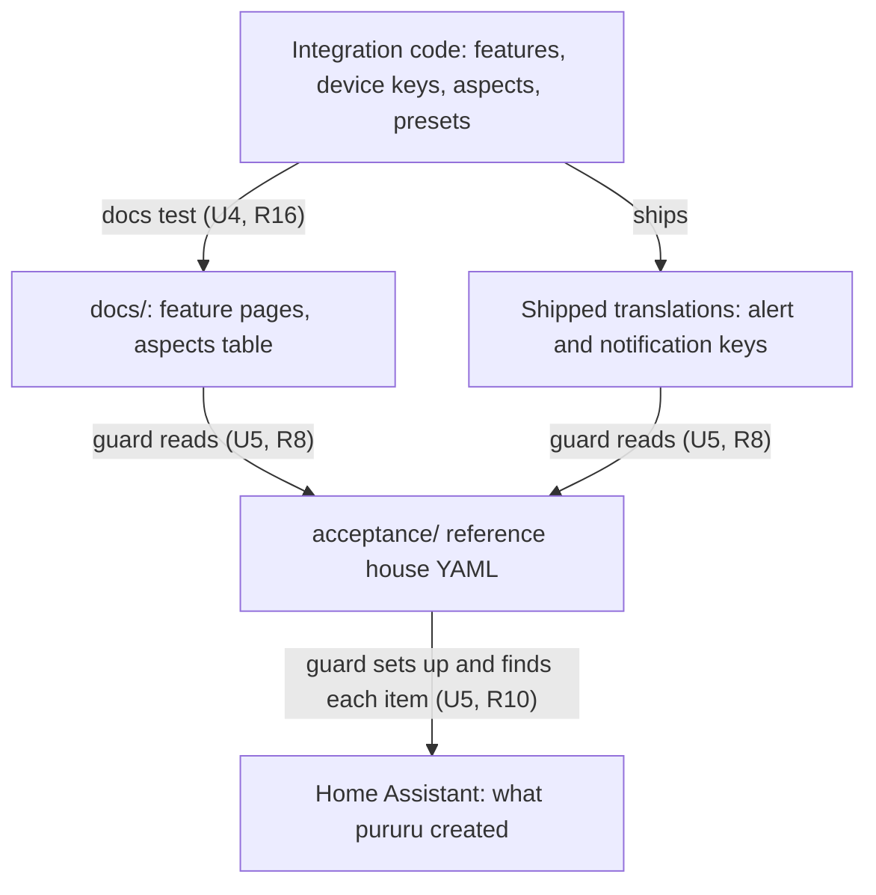
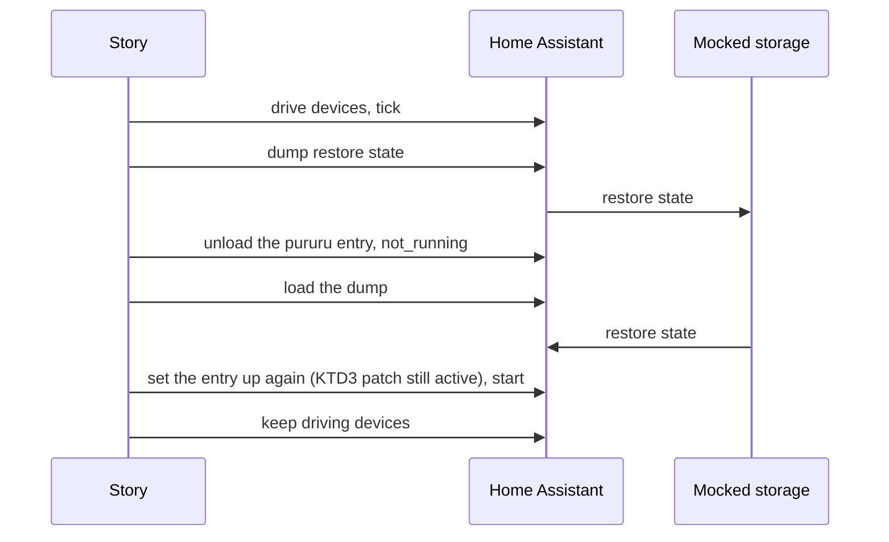

# Acceptance Reference House - Plan

## Goal Capsule

- **Objective:** A regression at the seam between pururu features (a reaction that stops following another device's program, a light left held by an alert, a program started twice) fails a test before it merges, also across a restart, a reload, a rename or a disable. The house those tests run on keeps covering every feature pururu publishes.
- **Means:** an acceptance suite in a top-level `acceptance/` project of its own that sets up one generic reference house in an in-process Home Assistant and runs stories across its devices (KTD1, KTD4).
- **Product authority:** the author's decisions of 2026-10-01 in this brainstorm and its planning, recorded as Key Decisions. The source is idea 2 of `docs/ideation/2026-10-01-acceptance-tests-ideation.html`. The ideation's other ideas (1, 3, 4, 5, 6, 7) are not active scope.
- **Open blockers:** none.
- **Stop conditions:** U2's spike shows the restart of KTD4 cannot run in the pinned Home Assistant (2026.9.3) without writing pururu's internal restore format; or the HA test plugin cannot run outside the root project. Either invalidates a settled decision: stop and bring it back to the author.
- **Execution profile:** one PR on a branch from `main`, no manifest version change, every command of the Verification Contract green before review.

---

## Product Contract

Product Contract preservation: changed: R8 now names the docs table of aspects as the aspects' source, and R16 is new, both chosen by the author during planning (the docs listed no aspects, and nothing checked that the docs match the code).

### Summary

A new acceptance suite treats pururu as a black box. It writes a reference house in YAML, sets it up in an in-process Home Assistant, and checks only what Home Assistant shows. A guard fails when the house lacks any feature, device key, aspect, ready-made alert or ready-made notification that pururu publishes. Four stories at first cross devices through restarts, reloads, renames and disables.

### Problem Frame

Each test file in `tests/` builds its own small house around one feature; 11 of them through a local `devices()`. The only whole house, `tests/fixtures/house.yaml`, is read by `tests/test_ids.py` alone, and only to pin entity IDs. No test drives a whole house through time, so the seams between features (a reaction on another device's program, an alert borrowing a light group, a button starting a program) are tested only where one feature's file happens to set up a second one.

No seam regression has reached the author so far. This work is preventive. Most code arrives through agent PRs, and each new feature adds seams that no per-feature test owns.

### Key Decisions

- **A new reference house, apart from `tests/fixtures/house.yaml`.** Changing the stories' house must not rewrite the pinned IDs in `tests/fixtures/house_ids.json`. Governs R5. (session-settled: user-directed — chosen over making `house.yaml` the reference house: one house to keep, but each story change would rewrite the pinned IDs)
- **The acceptance suite is a black box with its own environment.** It lives as if it were its own repository, so it cannot lean on the code's internals or on `tests/helpers.py`. Governs R1, R2, R3. (session-settled: user-directed — chosen over a separate folder sharing the root environment, and over a folder free to reuse `tests/helpers.py` and the catalogue)
- **No part of the acceptance suite lives in `tests/`, the guard included.** Governs R8. (session-settled: user-directed — chosen over a guard in `tests/test_features.py` reading the catalogue in code)
- **The guard reads what pururu publishes: its shipped translations and its docs.** Those are the only catalogue a black box can see. Governs R8, R9. (session-settled: user-directed — chosen over a hand-kept list checked against the entities HA creates, and over no automatic guard)
- **The docs list each feature's aspects, and a docs test checks the docs against the code.** The chain is code to docs (the docs test) to house (the guard), with no link left unchecked. Governs R8, R16. (session-settled: user-directed — chosen over a docs table no test ties to the code, and over a hand list of aspects inside the acceptance suite)
- **The guard covers ready-made alerts and ready-made notifications too, not only features, device keys and aspects.** The house grows with each new preset, and it catches more. Governs R9. (session-settled: user-directed — chosen over features, device keys and aspects only)
- **Home Assistant runs in process, with a controlled clock.** A 40-minute cycle takes milliseconds, and a restart mid-cycle is cheap. Governs R3, R4. (session-settled: user-directed — chosen over a real Home Assistant in a container, whose clock is real)
- **The house starts calm, and a story fails on any alert or notification that is not its own.** With every ready-made alert enabled, noise would otherwise pass unseen or steal the light a story watches. Governs R7, R12. (session-settled: user-directed — chosen over stories that check only their own subject, and over stories that strip interfering alerts from the house)
- **Start small: the house, the guard and four stories, and no existing test moves.** Tests are added whenever a chance comes up. Governs R11. (session-settled: user-directed — chosen over moving `tests/test_ids.py` with its house, and over moving the per-feature tests too)
- **Every new feature brings a story.** The rule is written for agents, not enforced by a test. Governs R14. (session-settled: user-directed — chosen over a story only for a new seam or an escaped bug, and over stories only on request)
- **A check fails when the two Home Assistant pins differ.** Without it, an HA upgrade could test one version in `tests/` and another in acceptance. Governs R3. (session-settled: user-approved — proposed in the scoping synthesis with the two-pin cost shown)
- **Acceptance is its own CI check, part of "CI ok", and Release runs it too.** Governs R15. (session-settled: user-approved — proposed in the scoping syntheses of the brainstorm and of planning)

### Requirements

**Folder and boundary**

- R1. The acceptance suite lives in its own top-level folder with its own Python project and locked dependencies, and runs with its own command. The root `uv run pytest` does not collect it.
- R2. The suite imports nothing from `custom_components/pururu` or from `tests/`. It installs pururu into Home Assistant as a custom component, gives it YAML, and observes only Home Assistant's surface: states, registries, services called, bus events and the files pururu writes.
- R3. The suite runs the Home Assistant version the root project pins, and a check fails when the two pins differ.
- R4. The suite has its own steps for a frozen start time, advancing time, playing a real device's state, reloading pururu, and restarting with restored state.

**Reference house**

- R5. The reference house is a new hand-written YAML file in the acceptance folder. Its devices are generic, not the author's own house.
- R6. The house's devices link to each other: a reaction follows another device's appliance; ready-made and hand-written alerts borrow a light group, the same light for alerts of different priorities; a button starts an executable program that drives a switch; the appliance has the ready-made notification `finished`.
- R7. The house starts calm: before setup, every real entity it names has a calm state, and right after setup no alert is on and no notification has been sent.

**Coverage guard**

- R8. The guard builds the list of what must be covered only from what pururu publishes: the features documented under `docs/features/`, the device keys and each feature's aspects listed in the docs, and the ready-made alerts and ready-made notifications named in the shipped translations.
- R9. The guard fails, naming each missing item, when the house has no place for a feature, a device key, an aspect (at least one builder that offers it), a ready-made alert or a ready-made notification.
- R10. The guard checks coverage by setting the house up in Home Assistant and finding each item among what pururu created (entities, automations, scripts), not only by reading the YAML.
- R16. A docs test fails when the features documented under `docs/features/`, or the device keys and aspects the docs list, differ from the integration's own.

**Stories**

- R11. The suite starts with four stories, described in F1–F4.
- R12. Each story checks what a pururu user sees (states, notifications sent, scripts run, light states) and fails when an alert turns on or a notification goes out that the story did not cause.
- R13. Each story starts from the calm house (R7) and is independent of the other stories' order.

**Growth and CI**

- R14. Every new feature brings at least one story linking it to another feature. The project instructions state this rule for agents.
- R15. The suite runs as its own CI check, part of "CI ok", on PRs that change the integration's code, the acceptance folder, `docs/` (the guard reads it), the root Python project (the pin check reads it) or workflows; Release runs it on `main` too.

### Key Flows

- F1. The washer ends; a reaction and a notification follow
  - **Trigger:** the washer's power rises and a cycle starts.
  - **Steps:** time advances into the cycle; Home Assistant restarts with the cycle's state restored; power drops and the cycle ends.
  - **Outcome:** the other device's reaction runs once, the ready-made `finished` notification goes out once, and the washer's cycle counters add one cycle.
  - **Covered by:** R6, R12
- F2. An alert borrows the light and gives it back
  - **Trigger:** two alerts of different priorities that share a light group turn on.
  - **Steps:** the light shows the higher priority; Home Assistant restarts while both are on; the higher one ends, then the last one ends.
  - **Outcome:** the light shows the remaining alert after the first ends, goes through `resolved` after the last, and is released; the restart leaves it neither stuck nor unlit.
  - **Covered by:** R6, R12
- F3. A button runs a program
  - **Trigger:** the remote's sensor changes into the button's state.
  - **Steps:** the button is pressed; the program's script turns the switch on; a second press comes while the script runs; the script ends.
  - **Outcome:** the script ran once and turned the switch on and then off; the button's press counter counts both presses, and the program's cycle counter adds one.
  - **Covered by:** R6, R12
- F4. A rename and a disable midway
  - **Trigger:** the user renames, in Home Assistant, the entity a reaction follows.
  - **Steps:** the followed device runs a cycle; the user disables the switch the executable program drives; later re-enables it.
  - **Outcome:** the reaction still follows the renamed entity; while the switch is disabled the program is held, not dropped; once re-enabled it comes back as it was.
  - **Covered by:** R12

### Acceptance Examples

- AE1. **Covers R9.** **Given** a new feature `pump` documented under `docs/features/` and absent from the house, **when** the guard runs, **then** it fails and names `pump`.
- AE2. **Covers R9.** **Given** a new ready-made alert `door: alerts: stuck` in the shipped translations and not enabled in the house, **when** the guard runs, **then** it fails and names `door` alert `stuck`.
- AE3. **Covers R12.** **Given** the calm house, **when** a story advances time past the door's `no_opening` period without opening the door and that ready-made alert turns on, **then** the story fails and names that alert.
- AE4. **Covers R3.** **Given** the root project bumps its Home Assistant pin and the acceptance project does not, **when** the checks run, **then** the pin check fails and names both versions.
- AE5. **Covers R1.** **Given** the acceptance folder, **when** `uv run pytest` runs from the repo root, **then** no acceptance test is collected.
- AE6. **Covers R16.** **Given** a new feature in the integration with no page under `docs/features/`, **when** the docs tests run, **then** they fail and name the feature.

### Scope Boundaries

- Moving existing tests into the acceptance folder: neither `tests/test_ids.py` with `tests/fixtures/house.yaml`, nor the per-feature tests. They move later, one at a time, when a chance comes.
- A real Home Assistant in a container, and reading `configuration.yaml` from disk (idea 3 of the ideation).
- The reconciliation of `entry.data`, generated files and registries after every test (idea 1), the behavior contract generated from roles (idea 5), and the calendar-crossing scenarios (idea 7).
- Replacing `settle()`'s fixed loop turns in `tests/helpers.py` (idea 6); the acceptance suite waits with fixed loop turns of its own (KTD9).
- The dashboard and the real Alert2 integration.
- A test that enforces R14; the rule stays written.
- SonarQube analysis of the acceptance folder; it is test code, and coverage stays measured by `tests/`.
- The third copy of the Home Assistant version, `VERSION` in `fetch_hassfest.py`; the pin check of R3 compares the root project and the acceptance project only.

### Dependencies / Assumptions

- The shipped translations name every ready-made alert as `<namespace>_alert_<name>` (`custom_components/pururu/translations/en.json`) and every ready-made notification as `<namespace>_notification_<name>_name` under `common`; both match the code's presets today (`features/appliance/alerts.py`, `features/opening/alerts.py`, `features/appliance/notifications.py`).
- `docs/features/` holds one page per feature (appliance, door, window, lights, switches, buttons), and `docs/concepts/devices-and-features.mdx` documents the device keys `programs`, `reactions` and `alerts`.
- `lights` and `switches` have no translation keys (their names come from the block), so the docs are the only published source listing them.
- The root `pytest` collects only `testpaths = ["tests", "tools"]` (`pyproject.toml`), and `tests/test_code.py`'s guards scan only `tests/` and `custom_components/pururu`, so a new top-level folder trips neither.
- Today a changed file in no group of `.github/scripts/changes.py` runs every check, so the acceptance folder needs its own group for R15.
- The documented generated-file paths (`pururu/automations/automations.yaml`, `pururu/scripts/programs.yaml` under the config folder, `docs/concepts/programs.mdx` "The include") are part of pururu's public surface, so the suite may read them (R2).

### Sources / Research

- `docs/ideation/2026-10-01-acceptance-tests-ideation.html`, idea 2, and its rejection list.
- `tests/fixtures/house.yaml` and `tests/test_ids.py:20`: the one whole house today, used only for pinned IDs.
- `docs/solutions/workflow-issues/skipping-ci-checks-per-pr-without-blocking-merges.md`: the recipe U7 follows.
- `docs/solutions/design-patterns/count-button-presses-from-async-press-not-state.md`: two presses at one frozen instant are one state change, so F3's presses need a different value and time between them, and counts are read from `<key>_triggered_total`.
- `custom_components/pururu/features/buttons.py:205-215`: a press while the program's script runs does not start it again (F3).
- `docs/features/appliance.mdx:157`: `no_power` is on for a washer between cycles (KTD5).

---

## Planning Contract

### Key Technical Decisions

- KTD1. **`acceptance/` is a uv project of its own, pinned like the root.** It has its own `pyproject.toml` and `uv.lock`, the same `pytest-homeassistant-custom-component` pin and Python floor as the root `pyproject.toml`, and the same `override-dependencies` (cryptography, PyJWT, pyOpenSSL), or the Dependabot alerts the root closed come back. The root `testpaths` stays `["tests", "tools"]`, which keeps it out of `uv run pytest` (AE5). It is the repo's first separate project: `tools/` shares the root environment. Implements R1, R3.
- KTD2. **pururu is loaded by putting the repo root on the acceptance project's pytest `pythonpath`, and prepending the repo's `custom_components` to `custom_components.__path__`**, as the root project does (`pythonpath = [".", ...]` in `pyproject.toml`, and `tests/conftest.py:76-89`). The repo's `custom_components/` has no `__init__.py`, so with the repo root on the path `import custom_components` resolves to it as a namespace package. Without it nothing provides the package: each test's own config folder holds no `custom_components`, and the plugin never imports a top-level one. Home Assistant's loader then imports `custom_components.pururu` itself on setup, and the suite imports no pururu module. With the repo root on the path, `tests` and `custom_components.pururu` become importable, so R2 rests on U1's static import guard. A symlink into each test's config folder works only for the first test (the package is cached in `sys.modules`). Implements R2.
- KTD3. **Generated automations and scripts run through one test-long patch of Home Assistant's `load_yaml_config_file`.** The patch returns the house's `pururu:` block plus the generated files read from their documented paths, and the `automation` and `script` domains are set up before pururu, as the `both` fixture does (`tests/test_reactions.py:652-661`). Home Assistant's own reloads then read pururu's files back. It patches Home Assistant, not pururu, so R2 holds; reading `configuration.yaml` from disk stays out of scope. Implements R2, R4.
- KTD4. **A restart is Home Assistant saving and loading its own state, on the same instance.**
  1. Dump the restore state into the test's mocked storage with the plugin's restore-state helper.
  2. Unload the pururu entry and set `CoreState.not_running`.
  3. Load the dump, set the entry up again, and start.

  The black box never writes pururu's internal restore format (`snapshot()`, `{"alert": ...}`), which `tests/helpers.py:restart` writes by hand. A second instance is not an option. The plugin's test instance builds its registries on `StoreWithoutWriteLoad`, which never saves or loads, and never loads config entries, so a second instance would start without renames or pururu's entry and its `entry.data`. Only restore state passes through the mocked storage. The registries and the entry stay in memory across the restart, as they would persist on disk in a real one. pururu's unload only unloads platforms, so this matches what a real restart does to pururu. U2 proves it before any story depends on it. Implements R4.
- KTD5. **The calm house places presets where calm is reachable.** `no_power` and `offline` go on a second appliance that always draws power (a fridge), since a washer reads 0 W between cycles and would keep `no_power` on (`docs/features/appliance.mdx:157`). The fridge's `no_cycle` and the door's and window's `no_opening` take a `for` longer than any story's simulated time and than U3's idle day (2 days or more), since `no_opening` counts from the entity's creation. Every real entity the house names is set to a calm state before setup: contacts closed, the fridge plug drawing power, the washer plug at 0 W, lights and switches off, the remote's sensor on a value no button listens for. Implements R5, R7.
- KTD6. **The calm check is an autouse fixture that records every pururu alert turning on and every notification sent.** A story declares the alerts and notifications it expects. At teardown the fixture fails, naming each one, when anything else was recorded. Alerts are found by the documented IDs `binary_sensor.pururu_*_alert_*`; notifications through a mocked notify service named in `pururu: config: notify:`. Implements R7, R12, AE3.
- KTD7. **The guard reads four published sources and finds each item by its documented `reference` attribute or ID.**
  1. Features: the stems of `docs/features/*.mdx`.
  2. Device keys and each feature's aspects: a new table in `docs/concepts/devices-and-features.mdx` (U4).
  3. Ready-made alerts: `entity.binary_sensor` keys `<namespace>_alert_<name>` in `en.json`.
  4. Ready-made notifications: `common` keys `<namespace>_notification_<name>_name` in `en.json`.

  An entity covers an item when the `inside` path of its documented `reference` attribute (`docs/concepts/entity-ids.mdx`, "The `reference` attribute") names it: the feature or device key as the first word, `<feature>.programs.detected.<key>` for detected programs, `<feature>.alerts.<name>` for ready-made alerts, a `statistics` segment for statistics. Entity IDs alone can't tell a detected program from the appliance's own entities, and device keys hold underscores. Ready-made notifications and executable programs have no entity: they are matched by their documented IDs (`automation.pururu_<device>_<namespace>_notification_<name>`, `script.pururu_<device>_program_executable_<key>`). The YAML alone never proves coverage. Implements R8, R9, R10.
- KTD8. **The pin check reads the root `uv.lock` and compares its `homeassistant` version with the acceptance environment's `homeassistant.const.__version__`.** The root lock is the version the root tests really run; the failure names both versions. This reads a file and asks Home Assistant its version, so R2 holds. Implements R3, AE4.
- KTD9. **The suite waits with a fixed number of loop turns after each step, never `async_block_till_done` while a script runs.** A running script is a Home Assistant task, so `async_block_till_done` waits out its whole `delay` (`tests/test_programs.py:59-71`). This copies the shape of `settle()` (`tests/helpers.py:117-120`); replacing it with an idle wait is idea 6, out of scope. Implements R4.
- KTD10. **The docs test that ties docs to code lives in `tests/docs/`, beside the existing page checks.** It reads `FEATURES`, `DEVICE_KEYS` and the aspects through the integration, as `tests/docs/test_pages.py` already does for ready-made alerts. It is a docs test, not acceptance. Implements R16. (session-settled: user-directed — chosen over a docs table no test ties to the code, and over a hand list of aspects inside the acceptance suite: governs R8, R16)
- KTD11. **The CI check follows the recipe in `docs/solutions/workflow-issues/skipping-ci-checks-per-pr-without-blocking-merges.md`, with the Tools commit (315bb3b) as the template.** A reusable `acceptance.yml` with no `pull_request` trigger of its own and no workflow-level `concurrency`. A `changes.py` group and `NEEDS` entry: code, docs, env, workflows and acceptance. `ci.yml` gets the output, the all-true line, the job and the "CI ok" need. `release.yml` calls it beside Build and Validate. Implements R15. (session-settled: user-approved — Release running it was proposed in the planning synthesis and accepted)

### High-Level Technical Design

How the coverage chain closes: each arrow is a check that fails when its two ends disagree.



The restart of KTD4.



### Output Structure

```text
acceptance/
  pyproject.toml        # own project (KTD1)
  uv.lock
  conftest.py           # Home Assistant, clock, pururu on the loader path, calm check
  steps.py              # setup, reload, restart, tick, play, rename, disable, wait
  house.yaml            # the reference house
  test_boundary.py      # R2 import guard, R3 pin check, AE5
  test_restart.py       # U2 spike, kept as the restart step's own test
  test_house.py         # the calm house and its links
  test_coverage.py      # the guard
  test_stories.py       # F1-F4
```

The tree is the expected shape; each unit's Files list is authoritative.

### Sequencing

U1 → U2 → U3 → U5 → U6, with U4 before U5 (the guard reads U4's table), and U7 and U8 last. U2 is the riskiest unit and runs right after U1, so a dead end shows before the house and stories are written.

---

## Implementation Units

### U1. The acceptance project boots Home Assistant with pururu

**Goal:** `acceptance/` is a project of its own that starts an in-process Home Assistant with a frozen clock, puts pururu on its loader path, and offers the steps every story uses.

**Requirements:** R1, R2, R3, R4, AE4, AE5; KTD1, KTD2, KTD3, KTD8, KTD9.

**Dependencies:** none.

**Files:**
- `acceptance/pyproject.toml`
- `acceptance/uv.lock`
- `acceptance/conftest.py`
- `acceptance/steps.py`
- `acceptance/test_boundary.py`

**Approach:**
1. The project: the root's plugin pin, Python floor, `override-dependencies`, `asyncio_mode = "auto"` and `--import-mode=importlib` (KTD1).
2. The Home Assistant fixture: freeze time at a fixed Wednesday 10:00 in Home Assistant's time zone, give each test its own config folder, put the repo root on the project's pytest `pythonpath`, and prepend the repo's `custom_components` to the package path (KTD2).
3. A fixture that fails a test when pururu logs `Step <name> failed` or `Listener failed`. These are log lines, part of Home Assistant's visible surface.
4. The steps: set up a house (with the test-long patch of KTD3 and the domains first), reload pururu through `pururu.reload`, advance time, play a real entity's state, rename and disable or enable an entity through Home Assistant's entity registry, wait (KTD9), and capture bus events.
5. The boundary checks in `test_boundary.py`.

**Patterns to follow:** `tests/conftest.py` (`ha` fixture, `no_step_failed`, `expected_lingering_timers`); `tests/helpers.py` (`_config`, `setup`, `reload`, `tick`, `fake`, `settle`, `capture`), rewritten, not imported; the `both` fixture in `tests/test_reactions.py`.

**Test scenarios:**
- A house with one switch device sets up, and `switch.pururu_<key>_switch_<name>` follows its real switch.
- Advancing time by 60 s moves Home Assistant's clock by 60 s from the frozen start.
- `pururu.reload` with a changed house adds the new device's entities.
- An automation pururu generates for a reaction runs when its trigger fires (proves KTD3).
- Covers AE4. The pin check passes with matching versions, and given a root `uv.lock` whose `homeassistant` version differs, it fails naming both versions.
- Covers AE5. The root `pyproject.toml`'s `testpaths` does not name `acceptance`.
- The import guard fails when a module under `acceptance/` imports `custom_components.pururu`, anything under it, or `tests`; importing the bare `custom_components` package is allowed (R2).

**Verification:** the acceptance command runs these tests green from a clean checkout; `uv run pytest` from the root collects nothing under `acceptance/`.

### U2. A restart that Home Assistant saves and loads itself

**Goal:** a restart step that carries state across only through Home Assistant's own saved data (KTD4).

**Requirements:** R4; KTD4.

**Dependencies:** U1.

**Files:**
- `acceptance/steps.py`
- `acceptance/test_restart.py`

**Approach:**
1. Build the same-instance restart of KTD4 as one step, with the KTD3 patch active throughout.
2. In the step's docstring, say why the restart stays on one instance (the plugin's registries never save or load).

**Execution note:** start with `test_restart.py` as a spike before writing any story; the stop conditions in the Goal Capsule apply if it cannot run.

**Patterns to follow:** the restart cases in `tests/test_alert_lights.py` (~704-751) and `tests/test_reactions.py` `restarted` (~947-962), for the expected outcomes only; their hand-written restore data is what this unit avoids.

**Test scenarios:**
- An appliance mid-cycle (power 900 W, 40 min in) is still running after the restart, and its cycle ends once power drops, adding one cycle.
- A pururu light restarted while an alert has borrowed it has that alert's priority in its `alert` attribute again.
- A user's rename made before the restart is kept after it.
- Generated automations and scripts exist and run after the restart.

**Verification:** the four scenarios pass without the suite writing any pururu-specific restore data.

### U3. The calm reference house

**Goal:** a generic hand-written house that links devices to each other and starts calm, with the calm check every story relies on.

**Requirements:** R5, R6, R7, R12, R13, AE3; KTD5, KTD6.

**Dependencies:** U1.

**Files:**
- `acceptance/house.yaml`
- `acceptance/conftest.py`
- `acceptance/steps.py`
- `acceptance/test_house.py`

**Approach:**
1. Devices, generic names: a washer (`appliance` with phases, a detected program, statistics, the ready-made `long_cycle` and `finished`); a fridge (`appliance`, ready-made `offline`, `no_power`, `no_cycle`); a front door (`door`, ready-made `long_opening`, `no_opening`); a bedroom window (`window`, ready-made `long_opening`, `no_opening`); a living room with `lights` and a `reactions` entry following the washer's `appliance_running`; a garden with `switches`, `buttons` (one with `program:`) and `programs: executable:` driving the switch; a hand-written alert on the washer borrowing a light group.
2. `config:` with `notify:` and `alerts: lights: groups` putting alerts of two priorities on one living-room light (R6).
3. A calm-state table the setup step plays before pururu starts (KTD5). Real bulbs and switches are plain states with no integration behind them, so a command pururu forwards to them changes nothing: stories read those commands as `call_service` events on the real entity, and the borrowing from the pururu light's `alert` and `alerts` attributes.
4. The calm check fixture (KTD6), with a way for a story to declare what it expects.

**Patterns to follow:** `tests/fixtures/house.yaml` for shape, not content; `tests/test_alert_lights.py` (~15-63) for faking real bulbs with their attributes.

**Test scenarios:**
- Right after setup, no `binary_sensor.pururu_*_alert_*` is on and the notify mock has no call (R7).
- Each link of R6 exists in Home Assistant: the reaction's automation names the washer's running entity, the light group holds the living-room light, the button's program has its script.
- Covers AE3. Advancing time past the door's `no_opening` period without opening it fails the calm check, naming that alert.
- Two tests that both use the house, run in either order, each see the calm house (R13).

**Verification:** the house sets up with no `Step failed` log, and the calm check passes on an idle run of a full simulated day.

### U4. The docs list each feature's aspects, checked against the code

**Goal:** the Guide lists the device keys and each feature's aspects in one table, and a docs test fails when that table or the feature pages differ from the integration.

**Requirements:** R8, R16, AE6; KTD7, KTD10.

**Dependencies:** none.

**Files:**
- `docs/concepts/devices-and-features.mdx`
- `tests/docs/test_pages.py`

**Approach:**
1. A table in `devices-and-features.mdx`, one row per feature, one column per aspect (ready-made alerts, ready-made notifications, statistics, detected programs), with a clear mark per cell; the device keys stay listed on that page in a shape the guard can read.
2. The docs test: compare `docs/features/*.mdx` stems with `FEATURES`, the device keys listed with `DEVICE_KEYS`, and each row of the table with the aspects each builder offers (`setup/catalogue.aspects_of`).

**Patterns to follow:** `tests/docs/test_pages.py` `section()` and `test_the_appliance_page_lists_every_ready_made_alert`; the MDX rule in CLAUDE.md (`{` and `<` inside backticks).

**Test scenarios:**
- The table and the pages match the code today.
- Covers AE6. Given a feature in `FEATURES` with no page, the test fails and names it.
- Given a table row whose aspects differ from the builder's, the test fails and names the feature and the aspect.
- Given a device key missing from the page, the test fails and names it.

**Verification:** `uv run pytest -m docs` and `pnpm docs:check` pass.

### U5. The coverage guard

**Goal:** a guard inside `acceptance/` that builds the catalogue from published files and fails, naming each gap, when the house does not cover it in Home Assistant.

**Requirements:** R8, R9, R10, AE1, AE2; KTD7.

**Dependencies:** U3, U4.

**Files:**
- `acceptance/test_coverage.py`

**Approach:**
1. Read the four sources of KTD7, relative to the repo root.
2. Set the house up and collect what pururu created from Home Assistant's entity registry, automations and scripts.
3. Match each item by its entities' `reference` attribute, or by the documented ID of a generated automation or script (KTD7); report every miss in one failure.

**Test scenarios:**
- The house covers everything published today.
- Covers AE1. Given the published sources plus a feature `pump` (a page stem), the guard's report names `pump`.
- Covers AE2. Given the published sources plus an alert key `door_alert_stuck`, the report names `door` alert `stuck`.
- Given an aspect in the table that no device of the house uses, the report names the aspect (R9: one builder offering it is enough).
- A feature present only in the YAML but whose entities were not created (an ID taken by another integration) is reported missing (R10).

**Execution note:** test the guard's matching on in-memory copies of the sources, so AE1 and AE2 run without editing real files.

**Verification:** the guard passes on the real sources and its gap scenarios fail as described.

### U6. The four stories

**Goal:** the stories F1–F4 run on the reference house, each through a lifecycle event, checking only what a user sees.

**Requirements:** R11, R12, R13, F1, F2, F3, F4; KTD4, KTD6, KTD9.

**Dependencies:** U2, U3.

**Files:**
- `acceptance/test_stories.py`

**Approach:**
1. Each story starts from the calm house and declares the alerts and notifications it expects (KTD6).
2. Cycles are driven by the washer's power; scripts with `delay` steps run to completion by advancing time past the delay with loop turns between (KTD9).
3. Button presses come from the remote's sensor changing into the button's value, with another value and time between two presses, and counts are read from `<key>_triggered_total`.
4. F4 renames the washer's `appliance_running` entity (the one the living room's reaction follows) and disables then re-enables the garden switch the program drives, advancing time past Home Assistant's re-enable reload delay.

**Patterns to follow:** `tests/test_notifications.py` (a cycle as power 100 → tick 60 → power 0 → tick 120; notify mock); `tests/test_alert_lights.py` (`alert` and `alerts` attributes, `pururu_alert_lights_released`); `tests/test_buttons.py` and `tests/test_programs.py` (a press while running, `assert_held_out`); `tests/test_reactions.py` (~513-518, ~725-749: rename, disable).

**Test scenarios:**
- Covers F1. A washer cycle with a restart midway: after it ends, the living room's reaction ran once (`automation_triggered`), `finished` went out once with the washer's name as title, and the washer's `appliance_cycles_total` grew by one.
- Covers F1. The restart itself triggers neither the reaction nor `finished` (a restart passes entities through `unavailable`).
- Covers F2. A high and a medium alert on the shared light: the pururu light's `alert` attribute is high and the real bulb receives high's `turn_on`; after a restart the attribute is still high; when high ends it is medium and the bulb receives medium's `turn_on`; when medium ends it is `resolved`, then after its `lasts` the bulb receives `turn_off` and `pururu_alert_lights_released` fires.
- Covers F3. A press starts the program's script, and the real garden switch receives `turn_on` then `turn_off`; a second press while it runs starts nothing; the button's `triggered_total` grows by two and the program's `cycles_total` by one.
- Covers F4. After the rename, the next washer cycle still triggers the reaction once.
- Covers F4. With the garden switch disabled, the program's script is held (unavailable, restored, registry entry kept), and a press starts nothing; once re-enabled, the script is back with the same registry entry and a press runs it.
- Each story passes when run alone and in any order with the others (R13).

**Verification:** the four stories pass, and the calm check fails any of them when an unexpected alert or notification is forced in.

### U7. Acceptance in CI

**Goal:** a CI check that runs the acceptance suite on the PRs that can change its result, part of "CI ok", and on Release.

**Requirements:** R15; KTD11.

**Dependencies:** U1.

**Files:**
- `.github/scripts/changes.py`
- `.github/workflows/acceptance.yml`
- `.github/workflows/ci.yml`
- `.github/workflows/release.yml`
- `tests/test_changes.py`

**Approach:**
1. `changes.py`: an `acceptance` group (`acceptance/`) and an `acceptance` entry in `NEEDS` wanting code, docs, env, workflows and acceptance.
2. `acceptance.yml`: modeled on `tools.yml`, a header comment saying when CI and Release call it, actions pinned by SHA, the cache keyed on `acceptance/uv.lock`, a `--locked` run of the acceptance project.
3. `ci.yml`: the `acceptance` output, `acceptance=true` in the all-true line, the job with its `if:`, and the need in `ok`.
4. `release.yml`: call it beside Build and Validate.

**Patterns to follow:** commit 315bb3b (Tools); `docs/solutions/workflow-issues/skipping-ci-checks-per-pr-without-blocking-merges.md`.

**Test scenarios:**
- A change under `acceptance/` needs `acceptance` and not `docs` or `hacs`.
- A change to a `docs/**/*.mdx` page, to `custom_components/pururu/translations/en.json`, or to the root `uv.lock` needs `acceptance`.
- A change to an agent or planning file needs nothing new.
- A change to `changes.py` itself makes `ci.yml` list every check, `acceptance` included (`test_ci_lists_every_check_when_the_classifier_changes`).
- The `main` output line lists `acceptance`.

**Verification:** `uv run pytest tests/test_changes.py -n 0` passes; on the PR, the Acceptance job runs and "CI ok" waits for it.

### U8. Docs and agent instructions

**Goal:** contributors and agents know the acceptance suite exists, how to run it, and that every new feature brings a story.

**Requirements:** R14, R15.

**Dependencies:** U1, U7.

**Files:**
- `docs/develop/acceptance.mdx`
- `docs.json`
- `docs/develop/testing.mdx`
- `docs/develop/releases.mdx`
- `docs/develop/index.mdx`
- `CLAUDE.md`

**Approach:**
1. `docs/develop/acceptance.mdx`: what the suite is (a black box with its own project), how to run it, the reference house and its calm states, the guard and what it reads, how to add a story, and the rule of R14; a sidebar entry in `docs.json` beside Testing.
2. `testing.mdx` points to it; `releases.mdx` and `index.mdx` list the new check.
3. `CLAUDE.md`: the command under Commands, the check in the CI bullet and in the `changes.py` command line, the docs table of aspects under Docs, and the R14 rule where features are described.

**Test expectation:** none -- documentation; `pnpm docs:check` and the docs tests cover links and examples.

**Verification:** `pnpm docs:check` passes and the new page appears in the Develop sidebar.

---

## Verification Contract

| Gate | Command | Proves |
|---|---|---|
| Acceptance suite | `uv run --locked --project acceptance pytest acceptance` (final form set in U1) | U1–U3, U5, U6 |
| Root suite, lint, types | `uv run pytest` | nothing under `acceptance/` is collected (AE5), `tests/test_changes.py` (U7), the existing suite still passes |
| Docs tests | `uv run pytest -m docs` | U4 (R16, AE6) |
| Docs links | `pnpm docs:check` | U4, U8 |
| Release check | `python3 release.py check` | no manifest change slipped in |
| CI wiring | the PR's checks | Acceptance runs and "CI ok" needs it (U7) |

## Definition of Done

- Every Verification Contract gate is green locally and on the PR.
- Every R1–R16 and AE1–AE6 is met by a unit's test or check, and the stories F1–F4 pass alone and in any order.
- No module under `acceptance/` imports `custom_components.pururu` or `tests`, and no test writes pururu's internal restore format.
- The flaky-test rule holds: the acceptance suite passes five consecutive runs with no failure.
- Code from abandoned attempts (such as U2's spike scaffolding) is removed, not left in the diff.
- `CLAUDE.md` and the Develop docs describe the suite, its command and the R14 rule.
