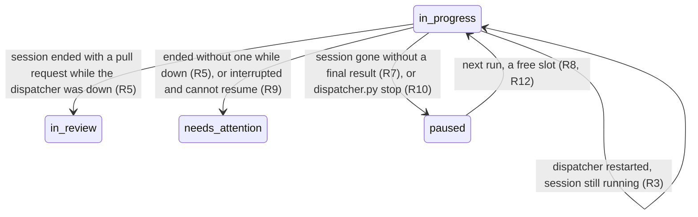
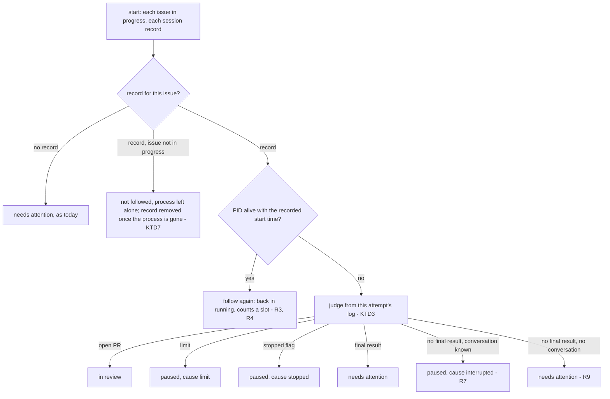
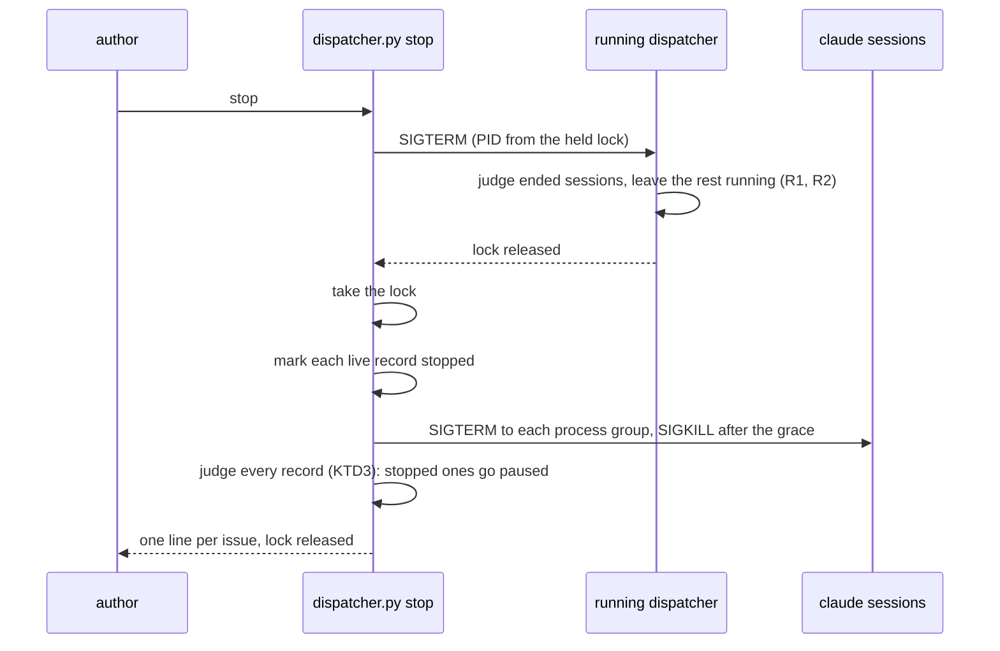

# Dispatcher survives a restart - Plan

## Goal Capsule

- **Objective:** the author can stop the dispatcher, update it and start it again while sessions are working on issues, and no session loses its work: each one either keeps running and is followed again, or resumes its own conversation in its own worktree.
- **Means:** a local record per session lets a new dispatcher recognise and follow the sessions an earlier one started (KTD1, KTD2); pauses carry their cause so interruptions and `stop` reuse the usage-limit resume path without its hold (KTD4).
- **Product authority:** the Product Contract below. It builds on the `paused` label, the pause record and the resume path from `docs/plans/2026-10-01-1758-feat-dispatcher-usage-limit-plan.md` (merged in #88), and extends them beyond the usage limit.
- **Open blockers:** none. The status-comment work (`docs/plans/2026-10-01-1853-feat-dispatcher-status-report-plan.md`) landed first (#97), so this plan carries the interplay (KTD9); see How This Work Fits Together.
- **Stop conditions:** stop and report if `claude -p --resume` cannot continue a conversation cut by SIGTERM (Risks), or if `fcntl.flock` is unavailable on the machine that runs the dispatcher.
- **Execution profile:** Standard depth, six units in dependency order, each one commit; `tools/dispatcher/dispatcher.py` stays one stdlib-only script.
- **Who finishes:** ce-work implements the units and runs the Verification Contract; lfg ships the pull request. Nothing here is a release: `custom_components/pururu/manifest.json` keeps its version.

---

## Product Contract

Product Contract preservation: changed: R15 added (the author asked during planning that GitHub comments carry no absolute machine paths); the Scope Boundaries line on `kill <PID>` clarified to match R7, which already limits interruption resumes to start. Every other R, F and AE is unchanged.

### Summary

Stopping the dispatcher no longer ends its sessions: they keep running, and the next `run` finds them and follows them to their end.
A session that died while no dispatcher watched (the machine restarted) resumes its own conversation instead of needing attention.
A new `dispatcher.py stop` command ends every session and pauses its issue, for when the author wants everything stopped; the next `run` resumes them.

### Problem Frame

Updating the dispatcher means Ctrl-C, `git pull`, then `run` again.
Today Ctrl-C ends every running session and moves its issue to `needs attention` (`Dispatcher.stop` in `tools/dispatcher/dispatcher.py`), and a dispatcher that dies without Ctrl-C leaves issues `in progress` that the next start also moves to `needs attention` (`orphans`).
The worktree stays on disk, but the conversation is dropped: adding `ready` again starts a fresh session in a new worktree (`issue-N-2`), and the first session's work sits unused in `issue-N`.
So every update to the dispatcher costs the work of every session in flight, which makes updating it something to postpone.

The pieces to avoid that already exist.
Sessions start in their own process session (`start_new_session=True`), so they can outlive the dispatcher when it doesn't end them.
The usage-limit work added a way to park an issue as `paused` with the conversation's session ID and resume it later with `claude -p --resume` in its kept worktree.

### Key Decisions

- **Stopping the dispatcher leaves sessions running.** Nothing is interrupted while the author updates it. Governs R1, R2, R3. (session-settled: user-directed — chosen over pausing every session on Ctrl-C and resuming it at the next start, and over a split where Ctrl-C leaves them running and a second Ctrl-C pauses them: an update should not cost the step a session was in.)
- **The update stays manual.** The author restarts the dispatcher; it neither updates itself nor announces a newer version. (session-settled: user-directed — chosen over a dispatcher that pulls `origin/main` and restarts itself, and over one that only prints a notice: the smallest scope that removes the loss.)
- **A `stop` command ends everything and pauses it.** Governs R10, R11, R12. (session-settled: user-directed — chosen over no command at all, relying on a restart or `kill`, and over ending a session by removing its `in progress` label.)
- **`stop` also stops a running dispatcher.** Otherwise that dispatcher would see the ended sessions and move their issues to `needs attention`. Governs R11. (session-settled: user-approved — proposed in the scope summary with that reason; the author confirmed.)
- **A session that died without finishing resumes its conversation.** A restarted machine should not cost the work either. Governs R6, R7, R8, R9. (session-settled: user-approved — proposed with the choice to leave sessions running, as its fallback when the session is gone; the author chose it.)
- **Labels lag while no dispatcher runs.** A session that ends then is judged at the next `run`. Governs R5. (session-settled: user-approved — stated in the scope summary; the author confirmed.)
- **Sessions left running take slots first.** Governs R4. (session-settled: user-approved — stated in the scope summary; the author confirmed.)
- **An interrupted or stopped issue reuses the `paused` label.** One label already means "no session runs, its conversation resumes later"; a second label would split one state in two. Governs R7, R10.
- **GitHub comments name paths inside the checkout only.** The author asked for it: an issue comment is public and the machine's home folder means nothing to a reader. Governs R15.

### Requirements

**Stopping keeps sessions running**

- R1. Stopping the dispatcher, by Ctrl-C, SIGTERM or an unexpected error, leaves every running session running; its issue stays `in progress` and gets no comment.
- R2. Before it exits, the dispatcher prints each session it leaves running, with its issue and PID, and still judges the sessions that had already ended, as a poll would.

**Starting follows what it finds**

- R3. At start, an issue `in progress` whose session still runs is followed again: it is listed as running at every poll and judged when it ends like any session (`in review`, `needs attention` or `paused`).
- R4. Sessions followed again count against `--sessions`; no new session or resume starts while they fill the slots, and none of them is ended to make room.
- R5. At start, an issue `in progress` whose session ended with a final result while no dispatcher ran is judged from that session's log, as a poll would have judged it.
- R6. Only the issue's own session counts as still running; a process that merely reuses its PID does not, and the issue is treated as its session being gone.

**A session that died resumes**

- R7. At start, an issue `in progress` whose session is gone without a final result moves to `paused`, with a pause record naming the conversation and the worktree and saying the session was interrupted.
- R8. An interrupted issue resumes by the rules of any paused issue (free slots, before `ready` issues, oldest first), with no usage-limit hold, and its session is told it was interrupted, not that a limit reset.
- R9. An interrupted issue that cannot resume, because its log names no conversation or its worktree is gone, moves to `needs attention` naming its worktree and log, as today.

**The `stop` command**

- R10. `dispatcher.py stop` ends every live session started by any dispatcher run and moves each issue to `paused`, with a pause record saying the author stopped it.
- R11. When a dispatcher is running, `stop` stops it before ending the sessions, so no issue it ends goes to `needs attention`.
- R12. The next `run` resumes stopped issues as R8 resumes interrupted ones.

**Telling the author**

- R13. At start, the dispatcher prints one line per issue it found `in progress`: followed again (with PID), judged, paused as interrupted, or needing attention, replacing today's "left in progress with no session running" line.
- R14. The dispatcher's docs (`docs/develop/dispatcher.mdx`) describe the new stop and restart behavior, the `stop` command, and the broader meaning of `paused`; the `paused` label's description no longer names only the usage limit.
- R15. Every comment the dispatcher posts on GitHub names a worktree or a log by its path inside the checkout (`.claude/worktrees/issue-70`, `tools/dispatcher/.state/logs/issue-70.log`), never by the machine's absolute path; the terminal keeps full paths.

### Key Flows

- F1. Updating the dispatcher
  - **Trigger:** the author presses Ctrl-C while sessions run.
  - **Steps:** the dispatcher judges ended sessions, prints the ones it leaves running and exits (R1, R2); the author runs `git pull` and `run`; the new dispatcher finds each `in progress` issue and follows, judges or pauses it (R3, R5, R7, R13).
  - **Outcome:** sessions that were running never noticed; labels are where they would have been.
  - **Covered by:** R1–R7, R13
- F2. Stopping everything
  - **Trigger:** the author runs `dispatcher.py stop`, with or without a dispatcher running.
  - **Steps:** a running dispatcher stops (R11); every live session ends and its issue goes `paused` (R10).
  - **Outcome:** nothing runs; the next `run` resumes each stopped issue (R12).
  - **Covered by:** R10–R12

### Acceptance Examples

- AE1. **Covers R1, R3.** Given #70 `in progress` with its session running, when the author presses Ctrl-C and runs the dispatcher again, then the session's PID is unchanged, #70 stays `in progress` with no new comment, and the next poll lists it as running.
- AE2. **Covers R5.** Given the dispatcher is stopped while #70's session runs, when the session opens its pull request and exits before the next `run`, then that `run` moves #70 to `in review` at start.
- AE3. **Covers R7, R8.** Given the machine restarts while #70's session runs, when the author runs the dispatcher, then #70 goes `paused` as interrupted and, at the first free slot, resumes its conversation in `.claude/worktrees/issue-70`; no `issue-70-2` is created.
- AE4. **Covers R9.** Given #70 was interrupted and its worktree was removed, when the dispatcher starts, then #70 goes `needs attention` naming the missing worktree and the log.
- AE5. **Covers R4.** Given two sessions left running and a restart with `--sessions 1`, when a `ready` issue waits, then no session starts until both left-running sessions have ended.
- AE6. **Covers R10, R11, R12.** Given a dispatcher running #70 and #73, when the author runs `dispatcher.py stop`, then the dispatcher exits, both sessions end, both issues go `paused` with no `needs attention`, and the next `run` resumes both.
- AE7. **Covers R8.** Given #70 paused as interrupted and the usage limit not spent, when the dispatcher starts, then #70 resumes at the first free slot and no usage-limit wait is printed.
- AE8. **Covers R15.** Given #70's session ends without a pull request, when the dispatcher comments on #70, then the comment names the worktree as `.claude/worktrees/issue-70` and the log as `tools/dispatcher/.state/logs/issue-70.log`, with no `/Users/` in it.

### Scope Boundaries

- The dispatcher updating itself, or announcing a newer version on `origin/main`: deferred; the update stays manual (see Key Decisions).
- Ending one chosen session from the dispatcher (by command or by removing a label): not built; `stop` ends all. `kill <PID>` ends one: a running dispatcher judges it at its next poll as today (`needs attention`), and with no dispatcher running the next start resumes it (R7).
- Any change to how the usage limit pauses and holds sessions: unchanged, except that interruption and `stop` pauses never create a hold (R8).
- The per-issue status comment: separate work, see below.

<!-- ce-section: work-relationships -->
### How This Work Fits Together

This plan covers keeping sessions alive across a dispatcher restart and the `stop` command. The list below is the current understanding of neighbouring dispatcher work, not a committed roadmap.

- Status comment per issue (`docs/plans/2026-10-01-1853-feat-dispatcher-status-report-plan.md`): built and merged in #97, before this plan. This plan therefore decides what the status comment shows for an issue followed again after a restart and for a pause caused by an interruption or by `stop` (KTD9). The status comment names no paths, so R15 already holds for it.

### Dependencies / Assumptions

- The usage-limit work (#88) is on `main`: the `paused` label, the hidden pause record read back from the author's comments, and resume with `claude -p --resume` in the kept worktree.
- Assumption: a session's log names its conversation from its first event, so an interrupted session can be resumed even when it never wrote a final result.
- Assumption: `claude --resume` of a conversation cut mid-step continues usefully in the same worktree; uncommitted changes in the worktree survive because nothing removes them.

### Sources / Research

- `tools/dispatcher/dispatcher.py`: `Dispatcher.stop` (ends live sessions, marks `needs attention`), `serve` (calls it on Ctrl-C, SIGTERM and errors), `orphans` (start-time `needs attention`), `Sessions._run` (`start_new_session=True`), `Sessions.resume` and `RESUME_PROMPT` (resume after the usage limit), `limit_of` (reads the session ID from the log), `take` and `alive` (the PID-file lock).
- `docs/develop/dispatcher.mdx`: Labels, Stopping and restarting, Usage limit.
- `docs/plans/2026-10-01-1758-feat-dispatcher-usage-limit-plan.md`: the pause record and resume rules this plan reuses.

---

## Planning Contract

### Key Technical Decisions

- KTD1. **A record per session under `tools/dispatcher/.state/sessions/`, not the process table alone.** Written when a session starts or resumes, it holds the issue, PID, the process's start time, branch, worktree, log, `since` (the log offset where this attempt begins), `started`, the marker it resumed from, `start_marks` (the checklist a resume continues from), and a `stopped` flag. The process table can't give `since`, `started`, the resumed marker or `start_marks`, which the poll lines, `_events`, `pause` and the status comment need; a record is also the only way to know a PID was this issue's session after the dispatcher that started it is gone. A record is written to a temporary file and renamed into place, so a crash mid-write never leaves half a record. It is removed once its session's verdict is fully applied, so a verdict that fails survives a restart and is judged again. Governs R3, R5, R6.
- KTD2. **A followed-again session is a non-child process object.** It satisfies the existing `Process` protocol: `poll()` says it runs while the PID is alive and `ps` reports the same start time as the record (R6), the start time always read with `ps -o lstart=` under `TZ=UTC` and `LC_ALL=C` (its text follows the reader's time zone and locale, and a laptop's zone can change while a session runs); `returncode` stays `None`, so the poll line says the exit code is unknown and `reason_of` falls back to "no final result" wording; `terminate()` and `kill()` signal the session's process group (`os.killpg`; `start_new_session=True` makes the PID the group), so tools the session spawned end with it. Sessions the running dispatcher started keep their `Popen`.
- KTD3. **One verdict order for every ended session, at a poll, at start and in `stop`:** an open pull request (`in review`), then a usage limit (`paused`, cause limit), then the record's `stopped` flag (`paused`, cause stopped), then a final result (`needs attention`), then no final result. No final result means interrupted (`paused`, cause interrupted) only when judged at start or by `stop`, both of which judge sessions no dispatcher was watching; at a poll it stays `needs attention`, as R7 and the Scope Boundaries say, so a session that keeps dying cannot loop through resumes.
- KTD4. **The pause marker gains a `cause` (`limit`, `interrupted`, `stopped`); a marker without one reads as `limit`.** Markers already posted keep working. Only `limit` markers feed `Hold` (in `poll` and `restore`), so interruption and `stop` pauses never hold or probe (R8). `cause` is part of `Marker` equality, so `pause()`'s "resumed marker, no new comment" shortcut still fires only for the same cause. `Sessions.resume` picks its prompt by cause: the limit reset, or the session was interrupted or stopped; both keep the `Closes #N` line.
- KTD5. **The conversation to resume comes from this attempt's slice of the log, else the marker it resumed from.** Never from earlier attempts in the same log file, which may be another worktree's conversation (`issue-N-2`). A fresh session killed before its first event has no conversation, and its issue needs attention (R9).
- KTD6. **The lock becomes an `fcntl.flock` on `tools/dispatcher/.state/lock`, with the holder's PID written inside.** The kernel drops the lock when its holder dies or the machine restarts, so a reused PID can no longer block `run` or receive `stop`'s signal. `stop` reads the PID only while the lock is held by someone, signals it with SIGTERM, waits for the lock with a bounded timeout, then holds the lock itself for its whole run so no `run` starts in the middle. The lock file is never unlinked: a flock belongs to the file, not the path, so a dispatcher that removed the file on exit would hand `stop` a lock on an orphaned file while a new `run` locked a fresh one.
- KTD7. **A record whose issue is no longer `in progress` is not followed at start, its process left alone.** The author took the issue out of the dispatcher's hands, as removing `paused` already does; `run` neither follows nor signals that session. Its record stays until its process is gone (checked at each start), so `stop` can still end it, because `stop` means nothing runs, but moves no label (R10).
- KTD8. **Comments render paths relative to the checkout root.** One helper turns a worktree or log path into its path under `ROOT` (falling back to the bare name when a path lies outside it) and every comment builder uses it: `pause`, `judge`, `orphans`' successor, `stop`, and the resume error. Error text a comment embeds (`dispatch`'s could-not-start detail, such as git's stderr or a failed record write, and the resume error) has the checkout root's absolute prefix rewritten to the relative path the same way. Progress lines in the terminal keep absolute paths. Governs R15.
- KTD9. **The status comment follows the same verdicts; leaving writes nothing.** `Status` gains `cause`, and its `paused` text depends on it: the usage limit with its reset, as today; "the session was interrupted (found gone when the dispatcher started)"; or "the session was stopped with `dispatcher.py stop`". Only `limit` shows a reset. Every `paused` verdict reports `Status(PAUSED, marks_paused(marks), cause=…)` beside its move, through `pending` like `judge`'s final reports. The marks come from the log slice continuing from the record's `start_marks`. Leaving a session on Ctrl-C writes no status: R1's "no comment" covers edits too, and the first poll of the next start edits the comment back to running. A followed-again session is reported running at every poll from its record's `started` and `start_marks`, as `running_report` does today. An `in progress` issue with no record keeps `orphans`' needs-attention report (`marks_stopped` on the stored marks). The status-comment plan's KTD5 note that an error escaping `poll` makes `serve` stop every session no longer holds: `serve` leaves them (U3). Governs R1, R3, R7, R10.

### High-Level Technical Design

Start-time reconciliation, the heart of R3–R9 and R13 (directional, not a specification):

`stop`, sequenced across processes:

### Assumptions

- Whatever `claude -p` writes to its log on SIGTERM, the `stopped` flag decides `stop`'s verdict (KTD3), so a SIGTERM that produces a clean `result` event cannot turn a stopped issue into `needs attention`.
- `ps -o lstart= -p PID` is available on the machines that run the dispatcher (macOS and Linux both ship it); read under a pinned `TZ=UTC` and `LC_ALL=C` (KTD2), its text is stable for a process's life.

### Sequencing

U1 and U2 are independent foundations. U3 (leaving sessions running) depends on U1, since leaving them is only safe once a record lets the next start find them. U4 needs U1–U3. U5 needs U4's reconciliation. U6 documents the result.

---

## Implementation Units

### U1. Session records and followed-again processes

**Goal:** every session the dispatcher starts or resumes leaves a record a later dispatcher can read, and a record can be turned back into a running session.

**Requirements:** R3, R4, R6; KTD1, KTD2.

**Dependencies:** none.

**Files:**
- `tools/dispatcher/dispatcher.py`
- `tools/dispatcher/tests/test_dispatcher.py`

**Approach:**
1. `Sessions._run` writes the record after the spawn, reading the process's start time from `ps` as KTD2 says. A failed write ends the just-spawned session and raises, so `dispatch` and `resume` move the issue to `needs attention` as for a session that could not start: a session with no record would outlive the next Ctrl-C with nothing able to follow or stop it.
2. `Sessions` gains reading every record, building a `Running` from one with the non-child process object of KTD2, marking a record stopped, and removing one.
3. `Dispatcher.resume` sets `start_marks` before the record is written (today it replaces them after `Sessions.resume` returns), so the record holds the marks the poll reports from.
4. `Dispatcher` removes a session's record once its verdict is applied with nothing left pending for that issue (`settle` and the pending retries in `poll`).
5. The non-child process object's `wait(timeout)` polls until the process is gone or the timeout passes, so `Sessions.end` works on it unchanged.

**Patterns to follow:** the injected `git`/`spawn` callables on `Sessions` and the fakes in the tests (`FakeProcess`, `FakeSpawn`); inject the `ps` reader and the signal sender the same way so no test touches real processes.

**Test scenarios:**
- A started session writes a record with its PID, start time, branch, worktree, log, `since`, `started` and `start_marks`; a resumed one also carries its marker and the resumed marks.
- A record round-trips into a `Running` whose process reports running while the fake `ps` returns the recorded start time.
- The same PID with another start time reports not running (R6).
- A dead PID reports not running and `returncode` stays `None`.
- `terminate()` and `kill()` on a followed-again process signal its process group.
- A verdict applied in full removes the record; a verdict whose move fails keeps it until the retry succeeds.
- A record that can't be written ends the just-spawned session, and the issue needs attention with the reason.
- The start time is read with `TZ=UTC` and `LC_ALL=C` in the `ps` call's environment, both when writing and when checking.

**Verification:** records appear and disappear with sessions in the tests, and nothing outside the injected callables touches real processes.

### U2. Pause causes and repo-relative comment paths

**Goal:** a pause says why it happened and resumes with the right words, only usage-limit pauses hold starts, and comments name paths inside the checkout.

**Requirements:** R8, R15; KTD4, KTD8, KTD9.

**Dependencies:** none.

**Files:**
- `tools/dispatcher/dispatcher.py`
- `tools/dispatcher/tests/test_dispatcher.py`

**Approach:**
1. `Marker` gains `cause`; `Marker.line` writes it; `marker_of` accepts a missing `cause` as `limit` and refuses an unknown one.
2. `pause` builds the comment by cause: the limit text as today, "the session was interrupted (found gone when the dispatcher started)", or "the session was stopped with `dispatcher.py stop`"; only the limit text speaks of a reset.
3. `restore` and the hold update in `poll` consider `limit` markers only.
4. `RESUME_PROMPT` splits by cause; `Sessions.resume` picks it from the marker.
5. `Status` gains `cause` (default `limit`); its `paused` body says the cause, and only `limit` shows the reset (KTD9). `judge`'s limit pause reports `cause=limit`.
6. A path helper renders worktree and log paths relative to `ROOT`; `pause`, `judge`, `orphans`, `Dispatcher.stop` and `Dispatcher.resume`'s error use it (the error text from `Sessions.resume` names the relative worktree). `dispatch`'s could-not-start comment rewrites the root's absolute prefix in its error detail (KTD8).

**Patterns to follow:** `Marker`/`marker_of` and their tests (`test_a_marker_round_trips_through_its_line`, `test_the_paused_issues_marker_is_the_users_valid_one`).

**Test scenarios:**
- A marker with each cause round-trips through its line.
- A marker line written before this change (no `cause`) reads as `limit`.
- A marker with an unknown cause is refused.
- Covers AE7. Markers with cause `interrupted` or `stopped` and `reset` null make no hold at start, and the paused issue resumes at the first poll.
- A `limit` marker with a null reset still probes, as today.
- An interrupted resume's prompt says it was interrupted; a limit resume's prompt says the limit reset; both carry `Closes #N`.
- A resumed session paused again with the same cause and nothing new swaps labels without a comment; one paused with a different cause comments.
- A paused status body with cause `interrupted` or `stopped` says so and shows no reset; one with cause `limit` reads as today.
- Covers AE8. A `needs attention` comment and a pause comment for a session in `<ROOT>/.claude/worktrees/issue-70` name `.claude/worktrees/issue-70` and `tools/dispatcher/.state/logs/issue-70.log`, and contain no absolute path.
- A `git worktree add` failure naming `<ROOT>/.claude/worktrees/issue-70`, and a record write that fails, each post a could-not-start comment free of absolute paths.

**Verification:** existing usage-limit tests still pass unchanged apart from the comment paths.

### U3. Stopping the dispatcher leaves sessions running

**Goal:** Ctrl-C, SIGTERM and an unexpected error end the dispatcher only.

**Requirements:** R1, R2; KTD1, KTD9.

**Dependencies:** U1.

**Files:**
- `tools/dispatcher/dispatcher.py`
- `tools/dispatcher/tests/test_dispatcher.py`

**Approach:**
1. `Dispatcher.stop` becomes leaving: retry the pending verdicts, judge the sessions that already ended (as today), and for each live one print `#N left running (PID P), the next start follows it` instead of ending it; its record stays, and its status comment is not touched (KTD9). `stopped_report` stays only for an ended session whose GitHub read fails.
2. `serve` keeps calling it from `finally`, so an error leaves sessions running too; its docstring and the module docstring stop saying sessions are ended.

**Patterns to follow:** `test_stopping_ends_the_sessions_and_marks_their_issues`, `test_stopping_judges_a_session_that_already_ended` and the `two_sessions` fixture, which this unit rewrites to the new behavior.

**Test scenarios:**
- Covers AE1. Stopping with a live session neither terminates it nor moves its label nor writes its status comment, prints it as left running with its PID, and keeps its record.
- Stopping still judges a session that already ended (in review, needs attention or paused) and removes its record.
- An error raised from a poll leaves live sessions running.
- A pending verdict that fails its last try keeps its record.

**Verification:** no test of the stop path sees `terminate` called.

### U4. Start reconciles what the last run left

**Goal:** a new dispatcher follows live sessions, judges ended ones and resumes interrupted ones.

**Requirements:** R3, R4, R5, R6, R7, R9, R13; KTD3, KTD5, KTD7, KTD9.

**Dependencies:** U1, U2, U3.

**Files:**
- `tools/dispatcher/dispatcher.py`
- `tools/dispatcher/tests/test_dispatcher.py`

**Approach:**
1. `Dispatcher.start` replaces `orphans` with reconciliation over the `in progress` issues and the records, as the flowchart in High-Level Technical Design shows.
2. Followed-again sessions go into `self.running`, so `tick` counts them against the slots with no change to `tick`.
3. Ended ones go through `read` and the verdict order of KTD3, with "judged at start" passed in so no final result becomes interrupted.
4. `limit_of`'s session lookup is reused for the conversation, with the record's resumed marker as the fallback (KTD5); `Ended` gains what the verdict needs (the stopped flag, the conversation, whether judged at start).
5. An `in progress` issue with no record keeps today's `needs attention` comment, naming its worktrees relatively.
6. One line per issue says what happened (R13).
7. Each verdict carries its status report (KTD9): `judge`'s for the usual ones, `Status(PAUSED, marks_paused(marks), cause=interrupted)` for an interrupted one; a followed-again session gets none at start, as the first poll's running report covers it.

**Patterns to follow:** `test_start_marks_the_orphans_before_the_first_poll`, `test_a_paused_issue_past_its_reset_resumes_after_a_restart`, `boss_at`, `exits` and `FakeGitHub`.

**Test scenarios:**
- Covers AE1. A record whose PID is alive with the same start time is followed: listed as running at the next poll with minutes counted from the record's `started`, judged when it exits.
- Covers AE2. A record whose process is gone and whose branch has an open pull request moves the issue to `in review` at start.
- A record whose process is gone with a final error result and no pull request moves the issue to `needs attention`.
- Covers AE3. A record whose process is gone with no final result and a known conversation pauses the issue with cause `interrupted`, its status comment saying so with the reached stage paused, and the first poll resumes it in the same worktree, with no new worktree created; the resumed running report continues the checklist.
- A followed-again session's first running report edits the existing status comment from the record's `started` and `start_marks`; no second comment is posted.
- A fresh session killed before its first event (no conversation in its slice) needs attention (R9).
- A resumed session interrupted before its first event resumes with the marker it came from.
- Covers AE4. An interrupted issue whose worktree is gone needs attention at its resume, naming the relative worktree and log.
- Covers AE5. Two followed-again sessions with one slot: no `ready` issue starts until both have ended.
- A record whose PID is alive with another start time is treated as gone (R6).
- A record whose issue is no longer `in progress` is not followed and its process is never signalled; its record stays while the process lives and goes once it is gone (KTD7).
- After a `run` skipped such a record, `stop` still ends its process and moves no label (R10).
- An `in progress` issue with no record needs attention, as today.
- Each case prints its own line at start (R13).
- At a poll, a session that exits with no final result still needs attention (KTD3).

**Verification:** the full restart story of F1 passes in one test: start, dispatch, leave, a new `Dispatcher` on the same state folder, follow, exit, verdict.

### U5. The `stop` command and the flock lock

**Goal:** `dispatcher.py stop` ends a running dispatcher and every session, pausing each issue, and neither `run` nor `stop` can be confused by a reused PID.

**Requirements:** R10, R11, R12; KTD6, KTD7, KTD9.

**Dependencies:** U4.

**Files:**
- `tools/dispatcher/dispatcher.py`
- `tools/dispatcher/tests/test_dispatcher.py`

**Approach:**
1. `take` opens the lock file without truncating it, holds an `fcntl.flock` on it for the process's life, and only once the flock is held truncates the file and writes its PID; a second `run` refuses with the holder's PID, as today. `main`'s `finally` no longer unlinks the file (KTD6); the kernel releases the flock when the process ends. The "remove the lock if it is gone" hint goes, since a dead holder no longer holds it.
2. `main` accepts `stop`; the usage text lists it.
3. `stop`, step by step:
   1. If the lock is held, SIGTERM the PID inside it and wait for the lock (bounded, then report that the dispatcher did not stop and change nothing).
   2. Take the lock.
   3. Mark every live record stopped, then end the sessions through `Sessions.end`.
   4. Reconcile every record with KTD3, judged as at start: stopped ones go `paused` with cause `stopped` and a matching status report, ones already gone with no final result and a known conversation go `paused` with cause `interrupted`, and the rest get their usual verdict.
   5. For a record whose issue isn't `in progress`, end the process and move no label (KTD7).
   6. Print one line per issue, then release the lock.

**Patterns to follow:** `test_a_second_dispatcher_refuses_to_start`, `test_a_dead_dispatchers_lock_is_taken_over`, `Sessions.end` and `test_a_session_that_ignores_terminate_is_killed`.

**Test scenarios:**
- Covers AE6. With records for #70 and #73 alive and no dispatcher running, `stop` ends both process groups and pauses both with cause `stopped`, each status comment saying it was stopped; the next start resumes both with the stopped prompt.
- With a dispatcher holding the lock, `stop` signals that PID, waits for the lock, then ends the sessions.
- A dispatcher that never releases the lock makes `stop` report and end nothing.
- A `run` started while `stop` holds the lock refuses to start.
- A lock file left by a dead process does not block `run` (the flock is free), replacing the dead-lock takeover test.
- A dispatcher that exits leaves the lock file in place, and a second process blocked on it gets the lock on that same file.
- A `run` refused by a held lock prints the holder's PID, which its refusal did not overwrite.
- After a machine restart, `stop` run before any `run` pauses a dead record with no final result and a known conversation as `interrupted`, not `needs attention`.
- A stopped session that wrote a clean final result still pauses as stopped.
- A stopped session with an open pull request goes `in review`.
- A stopped session with no conversation needs attention.
- `stop` with no records and no dispatcher says nothing runs and exits 0.

**Verification:** `dispatcher.py` with no argument prints a usage that lists `run` and `stop`.

### U6. Docs

**Goal:** the docs describe what the dispatcher now does on stop, restart and `stop`.

**Requirements:** R14.

**Dependencies:** U5.

**Files:**
- `docs/develop/dispatcher.mdx`
- `tools/dispatcher/README.md`
- `tools/dispatcher/dispatcher.py` (module docstring, the `paused` entry in `LABELS`)
- `CLAUDE.md` (the Commands block gains the `stop` line)

**Approach:**
1. In `dispatcher.mdx`, rewrite "Stopping and restarting", add a "Stopping everything" section for `stop`, and broaden `paused` in the Labels table, the state diagram and the Status comment section (interrupted, stopped; a session left running keeps its comment until the next start).
2. Update the Usage limit section's marker example with `cause`.
3. Change Where things are: `.state/sessions/`, and comments naming paths inside the checkout.
4. Add a short note that the update shipping this change still ends running sessions, because the old code does the stopping.

**Test expectation:** none -- documentation; `pnpm docs:check` and the docs tests cover links and MDX.

**Verification:** a reader of `dispatcher.mdx` alone can say what Ctrl-C, a reboot and `stop` each do to a running session.

---

## Risks

- **`--resume` after SIGTERM is unverified.** The plan assumes a conversation cut mid-tool resumes usefully. ce-work checks it once by hand before U5 lands (start a throwaway session, SIGTERM it, resume it); if it fails, stop per the Goal Capsule.
- **The first update loses in-flight sessions.** The dispatcher that is stopped to install this change runs today's code, which ends its sessions, and they have no records. Do that one update with no session running, and only once the old dispatcher has exited: its lock holds no flock, so the new `run` or `stop` would not see it (U6 documents it).
- **An unreadable record.** Records are renamed into place (KTD1), so only outside damage can leave one unreadable; reconciliation reports it and treats its issue as having no record (today's `needs attention`), never crashes the start.

## Scope Boundaries (planning)

- Considered and not built: checking before each resume that no other `claude` runs in the worktree. Records already prove the session is gone (R6), and only the author starting `claude` by hand in that folder would trip it.
- Considered and not built: a resume budget for interrupted issues. Interruption resumes happen only at start (KTD3), once per restart, so no loop can form.

---

## Verification Contract

| Check | Command | Proves |
|---|---|---|
| Dispatcher tests | `uv run pytest tools -n 0 -q` | U1–U5 scenarios, and the existing usage-limit tests still pass |
| The rest of the suite | `uv run pytest` | nothing outside `tools/` regressed (`tests/test_code.py` guards included) |
| Docs | `pnpm docs:check` and `uv run pytest -m docs` | U6: links and MDX build |
| Manual resume check | a throwaway `claude -p` session, SIGTERM, `--resume` | the Risks assumption before U5 ships |

## Definition of Done

- Every R1–R15 is covered by a unit and its tests pass under `uv run pytest tools -n 0 -q`.
- `uv run pytest`, `uv run pytest -m docs` and `pnpm docs:check` pass.
- No comment builder in `dispatcher.py` can emit an absolute path (R15 test passes).
- The manual resume check was done and its result noted in the pull request.
- No dead code from abandoned approaches is left in the diff; `orphans` is gone or reused, not both.
